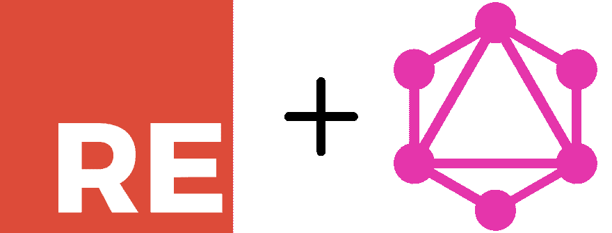
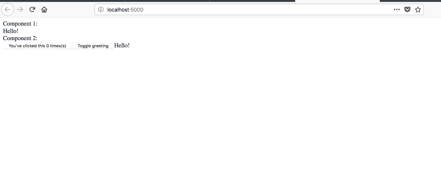
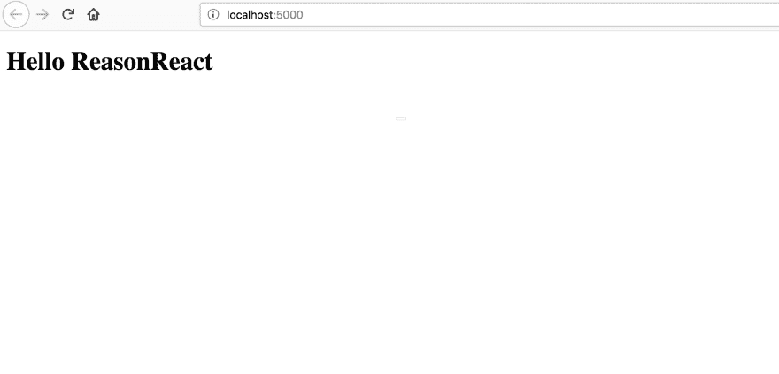
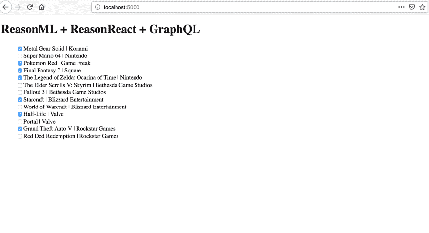

# 类型安全 Web 应用程序的未来

> 原文：<https://dev.to/iwilsonq/reasonml-with-graphql-the-future-of-type-safe-web-applications-18o6>

[](https://res.cloudinary.com/practicaldev/image/fetch/s--QP6bFvvG--/c_limit%2Cf_auto%2Cfl_progressive%2Cq_auto%2Cw_880/https://thepracticaldev.s3.amazonaws.com/i/aejew3ps1khqnw7gy0yk.png) 
ReasonML，也称为 JavaScript 风格的 OCaml，为开发用户界面提供了几乎无法穿透的类型安全。通过采用静态类型系统，您可以在应用程序被提供之前消除一整类错误。

我们将研究如何使用 ReasonML 构建一个使用 GraphQL 端点的小型 web 应用程序。我们将涵盖:

*   ReasonReact 项目入门
*   用理性建立客户——阿波罗
*   发送查询
*   变异数据

如果你对 GraphQL 和 ReasonML 都不熟悉，我建议你一次学一个。对我来说，一次学习多件大事通常很困难。如果你对 JavaScript 和 GraphQL 有经验，但想学习 ReasonML，请继续阅读，但要将[文档](https://reasonml.github.io)放在手边。

## 入门-建立一个合理的反应项目

为了使用 ReasonML，我们必须首先安装 cli，它处理项目的引导。你还应该得到一个编辑器插件，帮助开发 ReasonML 应用程序。如果你用的是 VSCode，那么 Jared Forsyth 的 reason-vscode 是我的首选插件。

```
npm install -g bsb-platform 
```

这将安装 BuckleScript 编译器，它将我们的 ReasonML 转换成已经过类型检查并可以在浏览器中运行的精彩 JavaScript。

现在我们可以初始化我们的项目并直接进入。

```
bsb -init reason-graphql-example -theme react
cd reason-graphql-example
npm install 
```

*   `init`参数指定了我们正在初始化的项目的名称。
*   `theme`参数指定了我们希望使用的模板。我通常只选择反应主题。
*   我们运行`npm install`来安装依赖项，就像在任何其他 JavaScript 项目中一样。

有了项目的脚手架，我们就可以试着建造它了。在两个独立的终端窗格中，运行:

```
npm start
# and
npm run webpack 
```

*   `npm start`告诉 BuckleScript (bsb)构建项目，监视对。关于文件。
*   启动 webpack 来构建您的主 JavaScript 包

*快速提示:你会注意到 webpack 输出在 **build** 文件夹中，但是 index.html 文件在 **src** 文件夹中。我们可以通过将 index.html 文件移动到 build 文件夹并重写脚本标签以指向相邻的 Index.js 文件来使服务项目变得简单一些。*

完成所有这些工作后，您就可以使用`http-server build`或`serve build`服务您的构建文件夹，并签出项目。

[](https://res.cloudinary.com/practicaldev/image/fetch/s--H4kHw8b8--/c_limit%2Cf_auto%2Cfl_progressive%2Cq_auto%2Cw_880/https://thepracticaldev.s3.amazonaws.com/i/sfcjd5lxm76wsycbrcny.png)

当我开发一个 ReasonML 项目时，我运行 3 个终端选项卡:

1.  `npm start`将文件推理转换成 JavaScript
2.  `npm run webpack`捆绑 JavaScript
3.  实际服务于港口的建设

在我们开始有趣的东西之前，我们仍然必须清除样板文件并设置 react-apollo。

继续删除 Component1 和 Component2 文件，然后将 Index.re 更新为以下内容:

```
ReactDOMRe.renderToElementWithId(<App />, "root"); 
```

将 index.html 更新为:

```
<!DOCTYPE html>
<html lang="en">
  <head>
    <meta charset="UTF-8" />
    ReasonML GraphQL Example
  </head>
  <body>
    <div id="root"></div>

    <script src="./Index.js"></script>
  </body>
</html> 
```

最后，创建一个 App.re 文件并添加以下内容:

```
/* App.re */
let str = ReasonReact.string;
let component = ReasonReact.statelessComponent("App");

let make = _children => {
  ...component,
  render: _self => 
    <div> 
      <h1> {"Hello ReasonReact" |> str} </h1>
    </div>
}; 
```

您可能需要重新运行您的终端命令，但是尽管如此，您的屏幕上应该会出现这样的内容:

[](https://res.cloudinary.com/practicaldev/image/fetch/s--e2v9BhG3--/c_limit%2Cf_auto%2Cfl_progressive%2Cq_auto%2Cw_880/https://thepracticaldev.s3.amazonaws.com/i/7732nf5s6g7o93r406rp.png)

开始时感觉要付出很多努力，但是为了以后更顺利的体验，接受早期的摩擦是一种折衷。

## 初始化原因阿波罗

为了设置好阿波罗，我们将运行:

```
npm install -S reason-apollo react-apollo apollo-client apollo-cache-inmemory apollo-link apollo-link-context apollo-link-error apollo-link-http graphql graphql-tag apollo-link-ws apollo-upload-client subscriptions-transport-ws 
```

这看起来像一个很大的安装命令。是的，但是只有第一个包，reason-apollo，在我们的 ReasonML 代码中被消耗。然而，reason-apollo 是一个绑定标签库，依赖于这些其他的 JavaScript 包。

为了让编写 GraphQL 查询更加友好，我们还需要一个 dev 依赖项。

```
npm install -D graphql_ppx 
```

安装时，我们可以打开我们的 bsconfig.json 文件，更新“bs-dependencies”和“ppx-flags”键，如下所示:

```
//  bsconfig.json  {  "bs-dependencies":  [  "reason-react",  "reason-apollo"  ],  "ppx-flags":  [  "graphql_ppx/ppx"  ],  //  other  fields...  } 
```

“bs-dependencies”数组告诉 BuckleScript 在构建过程中包含那些 npm 模块。ppx 标志数组让我们的 IDE 知道如何处理某些预处理指令，在我们的例子中是 GraphQL。

在 src 文件夹中创建一个名为 Client.re 的文件，我们将在这里声明 Apollo 客户机的实例。

```
/* Client.re */
let inMemoryCache = ApolloInMemoryCache.createInMemoryCache();

let httpLink =
  ApolloLinks.createHttpLink(~uri="https://video-game-api-pvibqsoxza.now.sh/graphql", ());

let instance =
  ReasonApollo.createApolloClient(~link=httpLink, ~cache=inMemoryCache, ()); 
```

> 注意:如果这个 uri，[https://video-game-api-pvibqsoxza.now.sh/graphql](https://video-game-api-pvibqsoxza.now.sh/graphql)不起作用，请在 twitter 上或评论里给我发消息，我会尽快更新

当我们使用 ReasonML 时，我们使用`let`绑定创建的任何变量都会自动从模块中导出。

创建了实例后，我们可以在任何其他。关于文件。将 Index.re 更新为以下内容:

```
/* Index.re */
ReactDOMRe.renderToElementWithId(
  <ReasonApollo.Provider client=Client.instance>
    <App />
  </ReasonApollo.Provider>,
  "root",
); 
```

它看起来有点像一个标准的 React JS 应用程序，但有一些注意事项。请注意，这里没有导入语句。在 ReasonML 中，我们可以访问应用程序中构建的所有名称空间。从 Index.re 的角度，我们可以看到`Client`和`App`模块。

当我们在 src 文件夹中创建一个. re 文件时，它就变成了一个模块。我们也可以在文件中显式声明我们的模块。

现在是时候使用我们的 API 了。

## 发送查询并呈现列表

在写这篇文章的时候，我创建了一个小节点 GraphQL 服务器，它的代码可以在 [this repo](https://github.com/iwilsonq/video-game-api) 获得。为了保持低成本，我声明了一个模拟数据数组来返回每个 GraphQL 请求，而不是托管一个数据库。

我决定创建一个很久以前玩过的视频游戏列表，而不是创建一个 todo 应用程序。然后，我可以检查我是否完成了它，从而记住我还没有赢的游戏。

由于我们使用的是 GraphQL 服务器，我们应该能够通过观察模式来准确地找出如何调用它。

```
 type  VideoGame  {  id:  ID!  title:  String!  developer:  String!  completed:  Boolean!  }  type  Query  {  videoGames:  [VideoGame!]!  }  type  Mutation  {  completeGame(id:  ID!):  VideoGame!  } 
```

目前，我们有一个查询和一个变异，两者都围绕这个`VideoGame`类型运行。GraphQL adept 会注意到每个返回值都是不可空的，也就是说，这些响应不能返回未设置的字段或空对象。

很快我们就会明白为什么所有的！s 对我们的推理代码特别重要。

让我们从在 App.re 之上定义查询开始，就在`component`声明的下面。

```
/* App.re */ 

module VideoGames = [%graphql
  {|
  query VideoGames {
    videoGames {
      id
      title
      developer
      completed
    }
  }
|}
];

module VideoGamesQuery = ReasonApollo.CreateQuery(VideoGames);

/* let make = ... */ 
```

与 react-apollo 中的 JavaScript 相比，这段代码最类似于:

```
const VideoGames = gql`
  query VideoGames {
    videoGames {
      id
      title
      developer
      completed
    }
  }
`

// later in render
render() {
  return (
    <Query query={VideoGames}> {/* ... */} </Query>
  )
} 
```

现在让我们更新渲染函数:

```
/* App.re */
let make = _children => {
  ...component,
  render: _self => {
    let videoGamesQuery = VideoGames.make();
    <div> 
        <h1> {"ReasonML + ReasonReact + GraphQL" |> str} </h1>
        <VideoGamesQuery variables=videoGamesQuery##variables>
        ...{
             ({result}) =>
               switch (result) {
               | Loading => <div> {"Loading video games!" |> str} </div>
               | Error(error) => <div> {error##message |> str} </div>
               | Data(data) => <VideoGameList items=data##videoGames />
               }
           }
      </VideoGamesQuery>
    </div>;
  }
}; 
```

这里，我们利用了 ReasonML 最酷的特性——[模式匹配](https://reasonml.github.io/docs/en/pattern-matching)。模式匹配与[变体](https://reasonml.github.io/docs/en/variant)的结合使得原本放在 if-else 语句分支中的逻辑更加线性，更容易理解。它还将分支检查减少到常数[而不是线性时间](https://reasonml.github.io/docs/en/variant)，使其更有效。

如果 ReasonML 代码看起来更加冗长，请记住，在编译时，我们仍然可以获得完美的类型安全。我们仍然需要构建`VideoGamesList`组件以及定义`videoGame`记录类型。

从记录类型开始，创建一个名为 VideoGame.re 的新文件，并添加以下内容:

```
/* VideoGame.re */

[@bs.deriving jsConverter]
type videoGame = {
  id: string,
  title: string,
  developer: string,
  completed: bool,
}; 
```

这里的`videoGame`类型有 4 个字段，没有一个是可选的。上面的 BuckleScript 指令添加了一对导出的实用程序方法，允许我们在 ReasonML 记录和 JavaScript 对象之间进行[转换。](https://bucklescript.github.io/docs/en/generate-converters-accessors)

> 提示:当 Apollo 返回响应时，它会返回无类型的 JavaScript 对象。`jsConverter`指令给了我们一个名为`videoGameFromJs`的导出方法，我们可以用它将 Apollo 查询数据映射到完全类型化的 ReasonML。

要查看这个机制的运行，创建一个名为 VideoGameList.re 的新文件，并添加:

```
/* VideoGameList.re */
open VideoGame;

let str = ReasonReact.string;
let component = ReasonReact.statelessComponent("VideoGameList");

let make = (~items, _children) => {
  ...component,
  render: _self =>
    <ul style={ReactDOMRe.Style.make(~listStyleType="none", ())}>
      {
        items
        |> Array.map(videoGameFromJs)
        |> Array.map(item =>
             <li key={item.id}>
                <input
                  id={item.id}
                  type_="checkbox"
                  checked={item.completed}
                />
                <label htmlFor={item.id}>
                  {item.title ++ " | " ++ item.developer |> str}
                </label>
             </li>
           )
        |> ReasonReact.array
      }
    </ul>,
}; 
```

1.  打开顶部的`VideoGame`模块(VideoGame.re ),这样我们就可以在`VideoGameList`模块中使用它的所有导出。
2.  声明组件类型和字符串呈现简写。
3.  定义一个期望一个属性的 make 函数，`items`。
4.  在 render 函数内部，通过管道将 JS 对象转换为 ReasonML 记录，将记录映射到 JSX，最后将它们作为数组输出。

> 注意:管道基本上颠倒了函数调用的顺序，潜在地提高了可读性。使用`|>`操作符，`items`对象作为*的最后一个*参数应用于每个函数。

虽然我喜欢更喜欢管道风格，以下是等效的。

```
items 
    |> Array.map(videoGameFromJs)
    |> Array.map(renderItem)
    |> ReasonReact.array;

ReasonReact.array(
    Array.map(
        renderItem,
        Array.map(
            videoGameFromJs,
            items
        )
    )
); 
```

我认为我们已经准备好再次编译和服务我们的项目。如果您还没有，请在您的项目根目录下运行这个命令:

```
yarn send-introspection-query https://video-game-api-pvibqsoxza.now.sh/graphql 
```

这会生成一个`graphql_schema.json`文件，Reason Apollo 用它来检查您的查询。如果你的 ReasonML 应用程序要求一个不在模式上的字段，或者如果它没有正确处理可选的数据类型，它将不会编译。

严格的类型化对于编写查询和变异来说是一个很好的检查。

当该说的都说了，该做的都做了，您应该看到以下内容。

[](https://res.cloudinary.com/practicaldev/image/fetch/s--Myr15LAR--/c_limit%2Cf_auto%2Cfl_progressive%2Cq_auto%2Cw_880/https://thepracticaldev.s3.amazonaws.com/i/96prj40pfw9frc23j68r.png)

不要因为我没有完成 Skyrim 中的主要故事而对我大喊大叫。

## 变异数据

到目前为止，您可能注意到的一件事是，单击复选框没有任何作用。这是意料之中的，因为我们还没有建立突变。

让我们首先回忆一下上面的模式，并创建一个突变模块来标记游戏完成。

在 VideoGameList.re 中，将这些模块添加到文件的顶部，就在创建组件的调用下面。

```
/* VideoGameList.re */
module CompleteGame = [%graphql
  {|
  mutation CompleteGame($id: ID!) {
    completeGame(id: $id) {
      id
      completed
    }
  }
|}
];

module CompleteGameMutation = ReasonApollo.CreateMutation(CompleteGame); 
```

对于变体的渲染道具，它看起来非常类似于 JavaScript 版本。我将把这段代码放在这里，然后从`<li>`标签内部开始遍历它。

```
/* VideoGameList.re */

<li key={item.id}>
  <CompleteGameMutation>
    ...{
        (mutate, {result}) => {
          let loading = result == Loading;
          <div>
            <input
              id={item.id}
              type_="checkbox"
              checked={item.completed}
              onChange={
                _event => {
                  let completeGame =
                    CompleteGame.make(~id=item.id, ());
                  mutate(~variables=completeGame##variables, ())
                  |> ignore;
                }
              }
            />
            <label
              htmlFor={item.id}
              style={
                ReactDOMRe.Style.make(
                  ~color=loading ? "orange" : "default",
                  (),
                )
              }>
              {item.title ++ " | " ++ item.developer |> str}
            </label>
          </div>;
        }
      }
  </CompleteGameMutation>
</li> 
```

与我们之前使用的 Apollo `VideoGamesQuery`组件一样，我们在这里看到的`CompleteGameMutation`组件向其子组件传递了一个 mutate 函数和一个 results 对象。

这个特定的组件并不是展示如何使用结果对象的最佳示例，因为我只在更新单个项目时利用它。如果是，我将项目标签的文本涂成绿色，并将其称为加载状态。

我不喜欢 UX，但我想今天就这样吧。

## 包装完毕

ReasonML 是一种非常强大且富有表现力的语言。如果你是 ReasonML 的新手，并渴望构建一些类型安全的用户界面，这里有一些资源可供学习:

1.  我们在 JavaScript 中使用的许多第三方工具都自带 ReasonML。David Kopal 的这篇文章解释了为什么写 ReasonML 这么酷。
2.  Jared Forsyth 的博客有很多关于 ReasonML 和 OCaml 的内容。他是这个社区最积极的贡献者之一。
3.  我的大部分学习是通过[推理文档](//reasonml.github.io)和 [BuckleScript 文档](//bucklescript.github.io)完成的。它们很容易理解，并且包含了在实现语言特性时对设计选择的深刻见解。

如果你想快速建立自己的 GraphQL 服务器，那么看看我的另一篇文章，[学习用最少的努力构建一个 GraphQL 服务器](https://medium.freecodecamp.org/learn-to-build-a-graphql-server-with-minimal-effort-fc7fcabe8ebd)。

希望以后能多写一些关于 ReasonML 和 GraphQL 的文章。如果你对这些感兴趣，那就一定要在[媒体](https://medium.com/@iwilsonq)和[推特](https://twitter.com/iwilsonq)上关注我！

本文最初发表在 [Open GraphQL on Medium](_https://medium.com/open-graphql/reasonml-with-graphql-the-future-of-type-safe-web-applications-65be2e8f34c8_) 上。