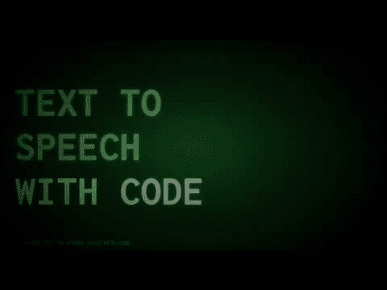

# 使用 Python 的文本到语音(TTS)

> 原文：<https://dev.to/petercour/text-to-speech-tts-with-python-1l3j>

文本到语音是一种将书面文本转换成语音(音频)的技术。这是由计算机完成的，这是一个具有挑战性的问题:如何使它听起来自然、可理解等等。

观看视频:

你可以在 Python 中使用语音引擎。一些受欢迎的是:

*   pyttsx
*   gtts
*   微软语音引擎
*   ibm watson tts

阅读更多:[文本到语音转换](https://pythonprogramminglanguage.com/text-to-speech/)