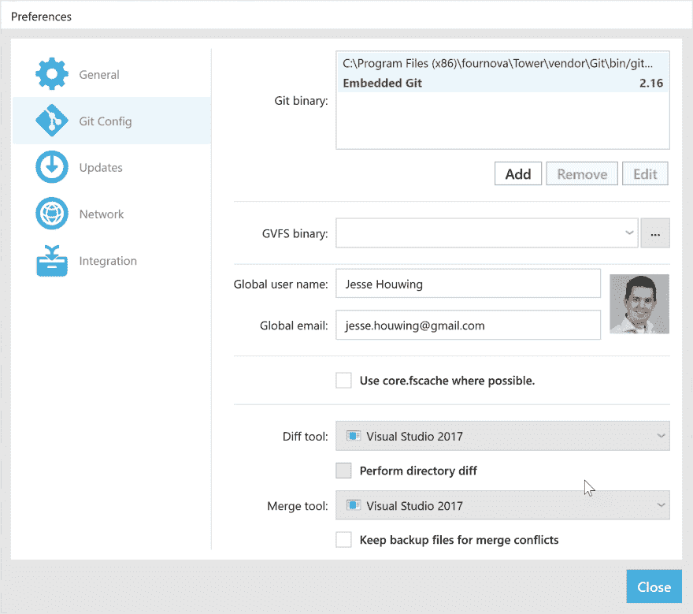

# 使用 Visual Studio 2017 或 2019 作为 Tower 中的合并工具

> 原文：<https://dev.to/xpirit/use-visual-studio-2017-or-2019-as-merge-tool-in-tower-3m5e>

> 更新了 Visual Studio 2019 支持。

[](https://res.cloudinary.com/practicaldev/image/fetch/s--dRNEtA8I--/c_limit%2Cf_auto%2Cfl_progressive%2Cq_auto%2Cw_880/https://jessehouwing.net/conteimg/2018/07/19340354430_4329b4584e_k.jpg)

我最近开始在 Windows 中使用 Tower 作为我的 Git 客户端，它在许多方面都很棒，但它没有任何 Diff/Merge 功能。它依靠第三方工具来提供该功能。它附带了一个很长的支持工具列表，但是我的两个默认编辑器不在这个列表中。Visual Studio 和 Visual Studio 代码。

要在 Tower 中启用 Visual Studio 2017 或 2019，您只需将以下文件放在这里:`%LOCALAPPDATA%\fournova\Tower\Settings\CompareTools\vs2019.json`:

```
{
  "DisplayName": "Visual Studio 2019",
  "MinimumVersion": "",
  "SupportsDiffChangeset": true,
  "SupportsDirectoryDiff": false,
  "DiffToolArguments": "$LOCAL $REMOTE //t",
  "MergeToolArguments": "$REMOTE $LOCAL $BASE $MERGED //m",
  "ApplicationRegistryIdentifiers": [
  ],
  "ApplicationPaths": [
      "%ProgramFiles(x86)%\\Microsoft Visual Studio\\2019\\Preview\\Common7\\IDE\\CommonExtensions\\Microsoft\\TeamFoundation\\Team Explorer\\vsDiffMerge.exe",
      "%ProgramFiles(x86)%\\Microsoft Visual Studio\\2019\\Preview\\Enterprise\\Common7\\IDE\\CommonExtensions\\Microsoft\\TeamFoundation\\Team Explorer\\vsDiffMerge.exe",
      "%ProgramFiles(x86)%\\Microsoft Visual Studio\\2019\\Preview\\Professional\\Common7\\IDE\\CommonExtensions\\Microsoft\\TeamFoundation\\Team Explorer\\vsDiffMerge.exe",
      "%ProgramFiles(x86)%\\Microsoft Visual Studio\\2019\\Preview\\Community\\Common7\\IDE\\CommonExtensions\\Microsoft\\TeamFoundation\\Team Explorer\\vsDiffMerge.exe",  
      "%ProgramFiles(x86)%\\Microsoft Visual Studio\\2019\\Preview\\TeamExplorer\\Common7\\IDE\\CommonExtensions\\Microsoft\\TeamFoundation\\Team Explorer\\vsDiffMerge.exe",  
      "%ProgramFiles(x86)%\\Microsoft Visual Studio\\2019\\Enterprise\\Common7\\IDE\\CommonExtensions\\Microsoft\\TeamFoundation\\Team Explorer\\vsDiffMerge.exe",
      "%ProgramFiles(x86)%\\Microsoft Visual Studio\\2019\\Professional\\Common7\\IDE\\CommonExtensions\\Microsoft\\TeamFoundation\\Team Explorer\\vsDiffMerge.exe",
      "%ProgramFiles(x86)%\\Microsoft Visual Studio\\2019\\Community\\Common7\\IDE\\CommonExtensions\\Microsoft\\TeamFoundation\\Team Explorer\\vsDiffMerge.exe",
      "%ProgramFiles(x86)%\\Microsoft Visual Studio\\2019\\TeamExplorer\\Common7\\IDE\\CommonExtensions\\Microsoft\\TeamFoundation\\Team Explorer\\vsDiffMerge.exe",
      "%ProgramFiles(x86)%\\Microsoft Visual Studio\\Preview\\Enterprise\\Common7\\IDE\\CommonExtensions\\Microsoft\\TeamFoundation\\Team Explorer\\vsDiffMerge.exe",
      "%ProgramFiles(x86)%\\Microsoft Visual Studio\\Preview\\Professional\\Common7\\IDE\\CommonExtensions\\Microsoft\\TeamFoundation\\Team Explorer\\vsDiffMerge.exe",
      "%ProgramFiles(x86)%\\Microsoft Visual Studio\\Preview\\Community\\Common7\\IDE\\CommonExtensions\\Microsoft\\TeamFoundation\\Team Explorer\\vsDiffMerge.exe",  
      "%ProgramFiles(x86)%\\Microsoft Visual Studio\\Preview\\TeamExplorer\\Common7\\IDE\\CommonExtensions\\Microsoft\\TeamFoundation\\Team Explorer\\vsDiffMerge.exe",  
      "%ProgramFiles(x86)%\\Microsoft Visual Studio\\2017\\Enterprise\\Common7\\IDE\\CommonExtensions\\Microsoft\\TeamFoundation\\Team Explorer\\vsDiffMerge.exe",
      "%ProgramFiles(x86)%\\Microsoft Visual Studio\\2017\\Professional\\Common7\\IDE\\CommonExtensions\\Microsoft\\TeamFoundation\\Team Explorer\\vsDiffMerge.exe",
      "%ProgramFiles(x86)%\\Microsoft Visual Studio\\2017\\Community\\Common7\\IDE\\CommonExtensions\\Microsoft\\TeamFoundation\\Team Explorer\\vsDiffMerge.exe",
      "%ProgramFiles(x86)%\\Microsoft Visual Studio\\2017\\TeamExplorer\\Common7\\IDE\\CommonExtensions\\Microsoft\\TeamFoundation\\Team Explorer\\vsDiffMerge.exe"
  ]
} 
```

它应该会自动检测 Visual Studio 2017 企业版、专业版或社区版、2019 和 2017 预览版和 2019 预览版，或者是 Team Explorer 的单机安装。

确保在 Tower 中更新您的首选项以选择它(您需要重新启动 Tower 以检测您的自定义合并工具更改):

[](https://res.cloudinary.com/practicaldev/image/fetch/s--ZV91T3s6--/c_limit%2Cf_auto%2Cfl_progressive%2Cq_auto%2Cw_880/https://jessehouwing.net/conteimg/2018/07/image-13.png) 

<figcaption>选择 Visual Studio 2017 作为你的 Diff 和 Merge 工具。</figcaption>

由于 Microsoft 存储安装路径的方式发生了变化，因此不容易从注册表中获取安装路径，所以如果您没有使用默认的安装路径，您可能需要更新上面的搜索路径。

Visual Studio 不是您的首选工具吗？添加你自己的就很简单了！

照片致谢:[菲尔·杜比](https://www.flickr.com/photos/126654539@N08/19340354430)。