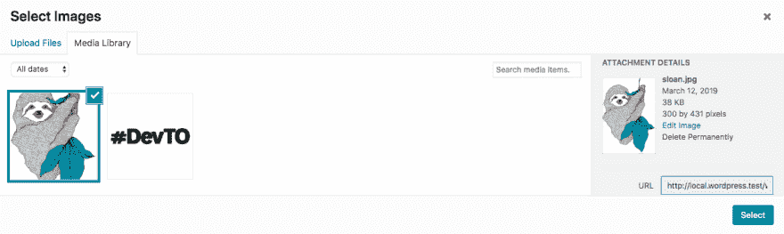
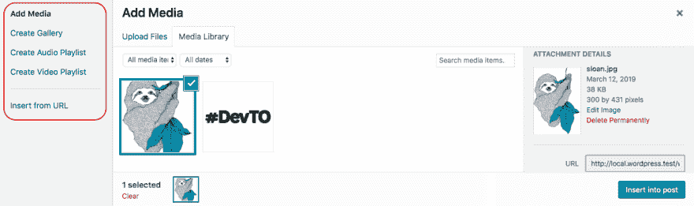

# 利用 wordpress 媒体库上传文件

> 原文：<https://dev.to/kelin1003/utilising-wordpress-media-library-for-uploading-files-2b01>

## 诸如此类😬

在 WordPress 插件或主题中开发定制功能时，大部分时间主要组件是由 WordPress-Core 自己提供的。WordPress 的媒体库就是这样一个组件。这是一个功能丰富的媒体处理器，WordPress 使用它让用户上传图片、视频、pdf 等。

如果你发现自己需要上传文件，试着使用 WordPress 的媒体库，而不是重新发明轮子。

不幸的是，在 WordPress Docs 中没有太多容易获得的帮助(至少我不能轻易地找到**)。我找到的唯一最有用的资源是[WordPress Media Javascript Guide](https://github.com/ericandrewlewis/wp-media-javascript-guide)。这是一个 WordPress 插件，包括一些示例实现和参考。然而，我再次发现它不是那么容易访问，因为你必须在 WordPress 安装中安装插件，然后浏览链接。**

 **所以我在这里写这篇文章，试图提供一个一站式参考来实现 WordPress 媒体库的自定义使用。大部分的例子和参考来自于 [WordPress 媒体 Javascript 指南](https://github.com/ericandrewlewis/wp-media-javascript-guide)

* * *

## ✏️邮报

### **设置媒体库**

你可以通过调用一个助手函数来使用 WordPress 媒体库。

```
var customMediaLibrary = window.wp.media({

    // Accepts [ 'select', 'post', 'image', 'audio', 'video' ]
    // Determines what kind of library should be rendered.
    frame: 'select',

    // Modal title.
    title: "'Select Images',"

    // Enable/disable multiple select
    multiple: true,

    // Library wordpress query arguments.
    library: {
        order: 'DESC',

        // [ 'name', 'author', 'date', 'title', 'modified', 'uploadedTo', 'id', 'post__in', 'menuOrder' ]
        orderby: 'date',

        // mime type. e.g. 'image', 'image/jpeg'
        type: 'image',

        // Searches the attachment title.
        search: null,

        // Includes media only uploaded to the specified post (ID)
        uploadedTo: null // wp.media.view.settings.post.id (for current post ID)
    },

    button: {
        text: 'Done'
    }

}); 
```

如果您在配置中使用`frame: 'select'`，那么产生的媒体库将被限制为选择已经上传的媒体或上传新媒体。

[](https://res.cloudinary.com/practicaldev/image/fetch/s--8tlPg9W7--/c_limit%2Cf_auto%2Cfl_progressive%2Cq_auto%2Cw_880/https://thepracticaldev.s3.amazonaws.com/i/q6anix6ajmnna53h99qf.png)

<figcaption>frame: select</figcaption>

或者，如果您希望包括更多选项，如创建多媒体资料、创建音频播放列表、创建视频播放列表等，请使用`frame: 'post'`。

[](https://res.cloudinary.com/practicaldev/image/fetch/s--ni5YbD3R--/c_limit%2Cf_auto%2Cfl_progressive%2Cq_auto%2Cw_880/https://thepracticaldev.s3.amazonaws.com/i/aoy9wkc6ovmdf2yedxxp.png)

<figcaption>frame: post</figcaption>

### **用于打开媒体库**

只需调用媒体库对象的`open()`方法。

```
 // Open the media uploader.
$( '#yourButtonID' ).on( 'click', function( e ) {
    e.preventDefault();
    customMediaLibrary.open();
}); 
```

### **用于处理选中的图像**

您必须在上传者的`select`事件上附加一个处理程序，并使用一个助手方法`customMediaLibrary.state().get( 'selection' )`来获取所选的图像。
*当用户选择图片并点击选择按钮时，该事件被触发。*

```
 customMediaLibrary.on( 'select', function() {

    // write your handling code here.
    var selectedImages = customMediaLibrary.state().get( 'selection' );

    // Probably send the image IDs to the backend using ajax?
}); 
```

### **用于打开媒体库时预选图像**

您需要在上传者的`open`事件上附加一个处理程序。

```
 customMediaLibrary.on( 'open', function() {

    // Assuming the post IDs will be fetched from db.
    var selectedPostIDs = [ 1, 2, 3, 4, 5 ];

    // Used for defining the image selections in the media library.
    var selectionAPI = customMediaLibrary.state().get( 'selection' );

    selectedImageIDs.forEach( function( imageID ) {
        /**
         * This returns an attachment object based on image ID 
         * or creates a new one if it doesn't exist in the wp.media.Attachments.allcollection.
         * Note: This does not fetch the image from db.
         */
        var attachment = wp.media.attachment( imageID );
        selectionAPI.add( attachment ? [ attachment ] : []);
    });

}); 
```

那都是乡亲们！这就是实现上传程序所需的全部内容。

### **其他一些事件/方法**

这些是可能对媒体库的高级用例/实现有用的一些其他事件和方法。更多细节你可以参考: [WordPress 媒体 Javascript 指南](https://github.com/ericandrewlewis/wp-media-javascript-guide)

```
// Fires after the uploader's markup has been built, but not appended to the DOM.
customMediaLibrary.on( 'ready', function() {} );

// Fires when the uploader's $el is appended to its DOM container.
customMediaLibrary.on( 'attach', function() {} );

// Fires when the modal opens (becomes visible).
customMediaLibrary.on( 'open', function() {} );

// Fires when the modal closes via the escape key.
customMediaLibrary.on( 'escape', function() {} );

// Fires when the modal closes.
customMediaLibrary.on( 'close', function() {} );

// Fires when a user has selected attachment(s) and clicked the select button.
customMediaLibrary.on( 'select', function() {
    var selectionCollection = customMediaLibrary.state().get('selection');
} );

// Fires when a state activates.
customMediaLibrary.on( 'activate', function() {} );

// Fires when a mode is deactivated on a region.
customMediaLibrary.on( '{region}:deactivate', function() {} );
// and a more specific event including the mode.
customMediaLibrary.on( '{region}:deactivate:{mode}', function() {} );

// Fires when a region is ready for its view to be created.
customMediaLibrary.on( '{region}:create', function() {} );
// and a more specific event including the mode.
customMediaLibrary.on( '{region}:create:{mode}', function() {} );

// Fires when a region is ready for its view to be rendered.
customMediaLibrary.on( '{region}:render', function() {} );
// and a more specific event including the mode.
customMediaLibrary.on( '{region}:render:{mode}', function() {} );

// Fires when a new mode is activated (after it has been rendered) on a region.
customMediaLibrary.on( '{region}:activate', function() {} );
// and a more specific event including the mode.
customMediaLibrary.on( '{region}:activate:{mode}', function() {} );

// Get an object representing the current state.
customMediaLibrary.state();

// Get an object representing the previous state.
customMediaLibrary.lastState();

// Open the uploader.
customMediaLibrary.open(); 
```

* * ***