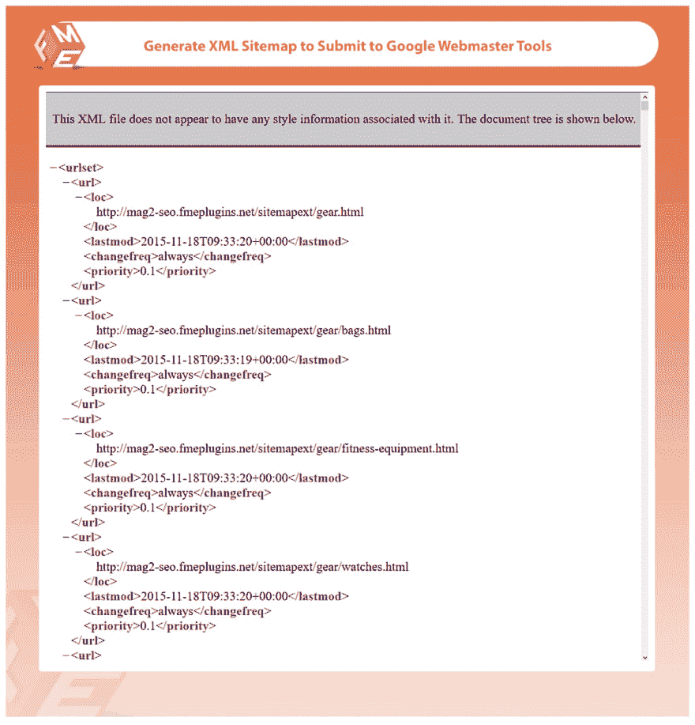
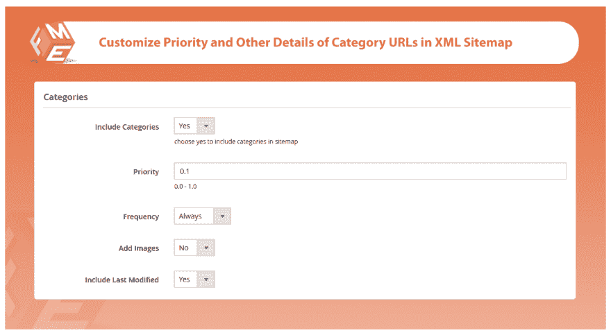
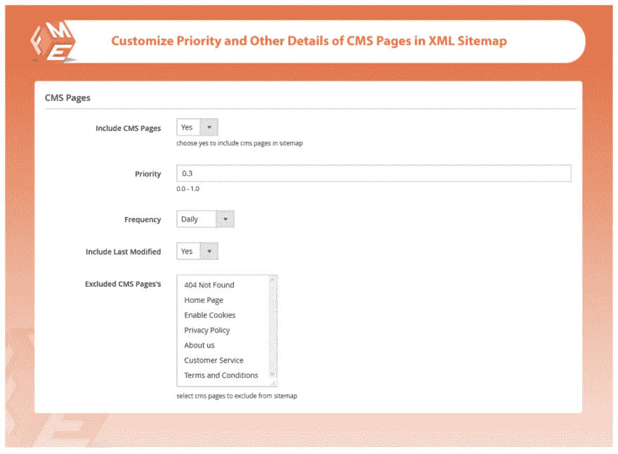

# Magento 2 的 HTML & XML SITEMAP PRO

> 原文：<https://dev.to/simonwalkerfme/html--xml-sitemap-pro-for-magento-2-5f9e>

所有在谷歌和其他主要搜索引擎上索引你的网站的解决方案。通过生成 XML 站点地图，你可以在谷歌中更快地索引和排名你的网站。

通过使用这个扩展，你还可以生成 HTML 网站地图，使你的网站更加用户友好和易于导航

## **该扩展的主要特性**

1.  生成多个 XML 站点地图
2.  包括/排除 XML 站点地图中的产品、类别、CMS 和其他 URL
3.  为每种类型的页面配置优先级和更改频率以及其他详细信息
4.  设置 Cronjob 以自动向站点地图添加新的 URL
5.  生成 HTML 站点地图
6.  按字母顺序和类型(产品、类别、CMS)对 URL 进行分类
7.  包含/排除 HTML 网站地图中的产品、类别、内容管理和其他 URL

### **生成多个 XML 站点地图**

您可以为您网站生成多个 XML 站点地图。你可以轻松地处理成千上万的网址，而不会浪费你宝贵的时间。

### **包括/排除产品、类别、CMS &来自 XML 站点地图的其他 URLs】**

您可以从 XML Sitemap 中包含/排除您不想在 Google 和其他搜索引擎上索引的产品、类别和 CMS 页面。

### **为每种类型的页面配置优先级&改变频率和其他细节**

您可以配置和更改每种类型页面的频率和其他详细信息。

### **设置 Cronjob 自动向站点地图添加新的 URL**

您可以通过设置 Cronjob 来自动更新新添加的 URL。您可以设置每天、每周和每月的 Cronjob。

### **生成 HTML 网站地图**

类似地，XML 站点地图你可以使用这个扩展来生成 HTML 站点地图。HTML 网站地图使你的网站导航变得容易。

### **按字母顺序和类型(产品、类别、内容管理系统)对网址进行分类**

您可以按字母顺序设置商店中的产品、类别和 CMS 页面。顾客可以很容易地找到产品。

### **包含/排除 HTML 网站地图中的产品、类别、内容管理系统&和其他网址**

你也可以在 HTML 网站地图中添加/删除产品、类别和 CMS 页面。

**探索更多功能访问-** **[magento 2 网站地图](https://marketplace.magento.com/fme-advanced-sitemap-generator.html)**

