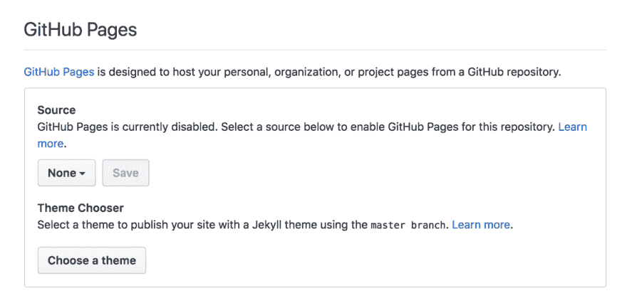
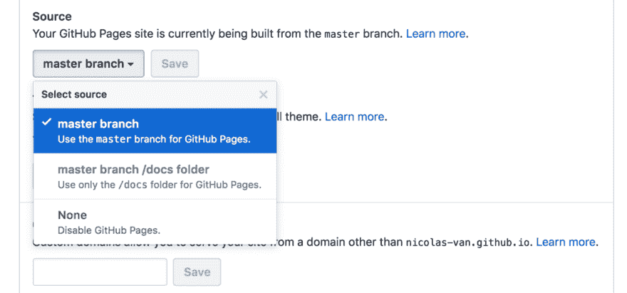

# 如何将 GitHub Markdown 文件转换成简单的网站

> 原文：<https://dev.to/bolajiayodeji/how-to-convert-github-markdown-files-to-a-simple-website-4e14>

### 简介

这个小指南演示了如何使用 [Github 页面](https://pages.github.com/)和
[Jekyll](https://jekyllrb.com/) 将任何带有一堆 [Markdown](https://en.wikipedia.org/wiki/Markdown)
文件的 [Github](https://github.com/)
库变成一个简单的网站。

*   你不需要使用命令行或者除了你的浏览器之外的任何东西。
*   不需要任何哲基尔方面的知识。
*   它完全兼容任何现有存储库中的任何降价文件，无需对这些文件进行任何修改。这包括几乎所有存储库都包含的基本`README.md`。
*   降价文件在 Github 中的可读性和可用性将和在你的网站中一样。

### 分步指令

### 确定你想要激活 GitHub 页面的存储库

如果您愿意，当然可以创建一个新的存储库。

### 创建`_.config.yml`文件

该文件应该创建在您的存储库的根目录下。这里有一些内容
要复制粘贴在里面:

```
plugins:
  - jekyll-relative-links
relative_links:
  enabled: true
  collections: true
include:
  - CONTRIBUTING.md
  - README.md
  - LICENSE.md
  - COPYING.md
  - CODE_OF_CONDUCT.md
  - CONTRIBUTING.md
  - ISSUE_TEMPLATE.md
  - PULL_REQUEST_TEMPLATE.md 
```

Enter fullscreen mode Exit fullscreen mode

这基本上只是对 GitHub 页面默认配置的一些调整，以更好地处理 Markdown 文件。

### 在您的存储库配置中激活 GitHub 页面

在项目的 GitHub 页面上，进入`Settings > Options > Github Pages`:

[](https://res.cloudinary.com/practicaldev/image/fetch/s--KL_orP2S--/c_limit%2Cf_auto%2Cfl_progressive%2Cq_auto%2Cw_880/https://cdn-images-1.medium.com/max/880/0%2AeZBV54NOulDlzKy8.png)

在`Source`选项中，选择`master branch`，然后选择`Save`:

[](https://res.cloudinary.com/practicaldev/image/fetch/s--gE4XqTVM--/c_limit%2Cf_auto%2Cfl_progressive%2Cq_auto%2Cw_880/https://cdn-images-1.medium.com/max/880/0%2AH972YMaFG9Gfiolm.png)

您还必须选择一个主题:

[](https://res.cloudinary.com/practicaldev/image/fetch/s--jFO5-QtS--/c_limit%2Cf_auto%2Cfl_progressive%2Cq_auto%2Cw_880/https://cdn-images-1.medium.com/max/880/0%2AzdXm2jwli-YMIBAh.png)

就是这样！现在，您可以使用 GitHub 提供的链接访问您的
网站:

```
Your site is published at [https://bolajiayodeji.github.io/xxxxxx/](https://bolajiayodeji.github.io/xxxxxx/) 
```

Enter fullscreen mode Exit fullscreen mode

### 
  
用法指南

*   存储库中的任何降价文件都将显示在您的 GitHub Pages 网站中。您只需使用相同的路径来访问它，并用`.html`替换`.md`扩展名。

所以如果你想显示你的`README.md`文件，你必须输入网址为
`README.html`

*   要在你的减价文件之间建立链接，只需使用另一个减价文件的相对路径。您复制粘贴到`_config.yml`中的配置提供了一个插件来转换这些 URL。

所以你的 Markdown 文件在 GitHub 和 GitHub 页面上都有正确的链接。

*   你网站的索引页可以是一个`index.md`文件，也可以是一个`README.md`文件。如果两者都存在，则`index.md`文件具有优先权。
*   你应该可以使用任何 GitHub 口味的减价商品。

### GitHub 和 GitHub 页面之间的已知差异

*   没有与 GitHub 页面的自动链接。GitHub Markdown 渲染器可以自动检测简单的复制粘贴链接，并使其成为可点击的链接。GitHub Pages 并没有提出重现这种行为的特性，所以你必须用``语法来支撑你的链接。