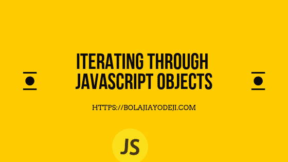
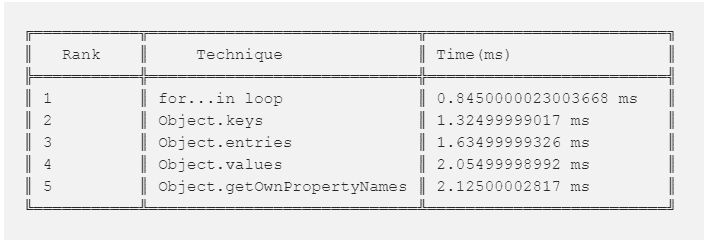

# 遍历 JavaScript 对象- 5 技术和性能测试。

> 原文：<https://dev.to/bolajiayodeji/iterating-through-javascript-objects---5-techniques-and-performance-tests-3jim>

[](https://res.cloudinary.com/practicaldev/image/fetch/s--H8eiQsPh--/c_limit%2Cf_auto%2Cfl_progressive%2Cq_auto%2Cw_880/https://cdn-images-1.medium.com/max/800/1%2AKWR1E4S6N5uZiWPd0x9KRg.png)

开发人员倾向于知道如何轻松地遍历 JavaScript 数组，但是大多数情况下，他们在处理 JavaScript 对象时会感到困惑，尤其是初学者和中级用户。在本文中，我将向您展示五(5)种不同的遍历 JavaScript 对象的
方法和一些性能比较
测试，向您展示哪种方法更快更有效。

* * *

### *有用提示:)

#### 属性标志

除了`value`之外，对象属性还有三个特殊属性(也称为
“标志”):

*   `writable`–如果`true`，可以编辑，否则只读。
*   `enumerable`–如果`true`，则循环列出。
*   `configurable`–如果`true`，可以删除属性，修改这些属性。

当我们以“通常的方式”创建一个属性时，它们都是`true`。但是我们可以随时改变它们。

方法
[object . getownpropertydescriptor](https://developer.mozilla.org/en-US/docs/Web/JavaScript/Reference/Global_Objects/Object/getOwnPropertyDescriptor)
允许我们查询关于一个属性的*完整的*信息。

```
let user = {
  name: "Bolaji"
};
let descriptor = Object.getOwnPropertyDescriptor(user, 'name');
console.log(descriptor);
// {value: "Bolaji", writable: true, enumerable: true, configurable: true} 
```

Enter fullscreen mode Exit fullscreen mode

#### **可枚举属性是什么意思？**

**可枚举属性**是那些内部**可枚举**
标志设置为真的**属性**，这是通过简单
赋值创建的**属性**的缺省值。

基本上，如果你通过`obj = {foo: 'bar'}`或其附近的
创建一个对象，所有的属性都是可枚举的。

* * *

### 1。对于…在循环中

**为...in 循环语句**可以用来迭代一个对象的所有
非[符号](https://developer.mozilla.org/en-US/docs/Web/JavaScript/Reference/Global_Objects/Symbol)、
[可枚举
属性](https://developer.mozilla.org/en-US/docs/Web/JavaScript/Enumerability_and_ownership_of_properties)
。

```
let obj = {
  key1: "value1",
  key2: "value2",
  key3: "value3"
}
for (let key in obj) {
  let value = obj[key];
  console.log(key, value);
}
// key1 value1
// key2 value2
// key3 value3 
```

Enter fullscreen mode Exit fullscreen mode

### 2。对象.键

`Object.keys()`方法返回一个对象键数组。这将创建一个包含对象属性的
数组。然后，您可以遍历
数组来获得您需要的键和值。

```
let obj = {
  key1: "value1",
  key2: "value2",
  key3: "value3"
}
let items = Object.keys(obj);
console.log(items);
// ["key1", "key2", "key3"]
items.map(key => {
 let value = obj[key];
 console.log(key, value)
});
// key1 value1
// key2 value2
// key3 value3 
```

Enter fullscreen mode Exit fullscreen mode

### 3。对象.值

方法返回一个对象值数组。这将创建一个包含对象属性的
数组。然后，您可以遍历
数组来获得您需要的键和值。

```
let obj = {
  key1: "value1",
  key2: "value2",
  key3: "value3"
}
let items = Object.values(obj);
console.log(items);
// ["value1", "value2", "value3"]
items.map(value => {
 console.log(value)
});
// value1
// value2
// value3 
```

Enter fullscreen mode Exit fullscreen mode

### 4\. Object.getOwnPropertyNames

`Object.getOwnPropertyNames()`方法返回一个数组，包含在给定对象中直接找到的
的所有属性
(包括不可枚举的属性，使用 Symbol 的属性除外)。这将创建一个包含对象属性
的数组。然后你可以通过数组循环得到你需要的键和值
。

```
let obj = {
  key1: "value1",
  key2: "value2",
  key3: "value3"
}
let items = Object.getOwnPropertyNames(obj);
console.log(items);
// ["key1", "key2", "key3"]
items.map(key => {
 let value = obj[key];
 console.log(key, value)
});
// key1 value1
// key2 value2
// key3 value3 
```

Enter fullscreen mode Exit fullscreen mode

### 5。对象.条目

`Object.entries()`方法返回给定对象自己的
可枚举属性`[key, value]`对的数组。

```
let obj = {
  key1: "value1",
  key2: "value2",
  key3: "value3"
}
let items = Object.entries(obj);
console.log(items);
// 0: ["key1", "value1"]
// 1: ["key2", "value2"]
// 2: ["key3", "value3"]
items.map(item => {
 let key = item[0];
 let value = item[1];
 console.log(key, value);
});
// key1 value1
// key2 value2
// key3 value3 
```

Enter fullscreen mode Exit fullscreen mode

### 性能对比

现在让我们测试所有这些技术，并根据它们的速度和性能来比较每一种技术，以确定哪一种更快、更有效

Chrome、Firefox 等大多数浏览器在
`performance.now()`实现高分辨率计时。`performance.now()`方法返回一个以毫秒为单位的
`DOMHighResTimeStamp`。

**用法**

```
let start = performance.now();

// code to be timed...

let duration = performance.now() - start; 
```

Enter fullscreen mode Exit fullscreen mode

让我们开始测试…

```
// for... in loop
let start = performance.now();
let obj = {
  key1: "value1",
  key2: "value2",
  key3: "value3"
}
for (let key in obj) {
  let value = obj[key];
  console.log(key, value);
}
let duration = performance.now() - start;
console.log(duration); // 0.8450000023003668 ms

// Object.keys
let start = performance.now();
let obj = {
  key1: "value1",
  key2: "value2",
  key3: "value3"
}
let items = Object.keys(obj);
console.log(items);
items.map(key => {
 let value = obj[key];
 console.log(key, value)
});
let duration = performance.now() - start;
console.log(duration); // 1.3249999901745468 ms

// Object.values
let start = performance.now();
let obj = {
  key1: "value1",
  key2: "value2",
  key3: "value3"
}
let items = Object.values(obj);
console.log(items);
items.map(value => {
 console.log(value)
});
let duration = performance.now() - start;
console.log(duration); // 2.0549999899230897 ms

// Object.getOwnPropertyNames
let start = performance.now();
let obj = {
  key1: "value1",
  key2: "value2",
  key3: "value3"
}
let items = Object.getOwnPropertyNames(obj);
console.log(items);
items.map(key => {
 let value = obj[key];
 console.log(key, value)
});
let duration = performance.now() - start;
console.log(duration); // 2.125000028172508 ms

// Object.entries
let start = performance.now();
let obj = {
  key1: "value1",
  key2: "value2",
  key3: "value3"
}
let items = Object.entries(obj);
console.log(items);
items.map(item => {
 let key = item[0];
 let value = item[1];
 console.log(key, value);
});
let duration = performance.now() - start;
console.log(duration); // 1.6349999932572246 ms 
```

Enter fullscreen mode Exit fullscreen mode

### 测试结果

根据我们的测试，以下是按升序排列的结果；

[](https://res.cloudinary.com/practicaldev/image/fetch/s--aNtfmfxd--/c_limit%2Cf_auto%2Cfl_progressive%2Cq_auto%2Cw_880/https://res.cloudinary.com/iambeejayayo/image/upload/v1552257253/loop.png)

因此，根据这些结果，迭代 JavaScript
对象的最快方法是循环中的**。**现在，这并不意味着其他方法是
无效或无用的，这完全取决于用例。

一个`for...in`循环的问题是它遍历了
原型链中的属性。它迭代对象属性。Javascript 数组只是一种特定类型的对象，具有一些方便的属性，可以帮助您将它们视为 T4 数组，但是它们仍然具有内部对象属性，并且您不打算遍历这些属性。`for...in`还遍历* *所有可枚举的属性
** ，而不仅仅是数组的元素。这也可能导致意想不到的结果。

当你用`for...in`循环遍历一个对象时，你需要检查
属性是否属于这个对象。你可以用`hasOwnProperty`来做到这一点。

在 ES6 中循环遍历对象的一个更好、更有效的方法是首先使用`Object.keys()`、`Object.values()`、
、`Object.getOwnPropertyNames`或`Object.entries()`
将对象转换成一个数组。然后循环遍历
数组来获取键和值。

### 引用

*   [http://javascript.info/](http://javascript.info/)
*   [https://developer.mozilla.org/en-US/docs/Web/JavaScript](https://developer.mozilla.org/en-US/docs/Web/JavaScript)