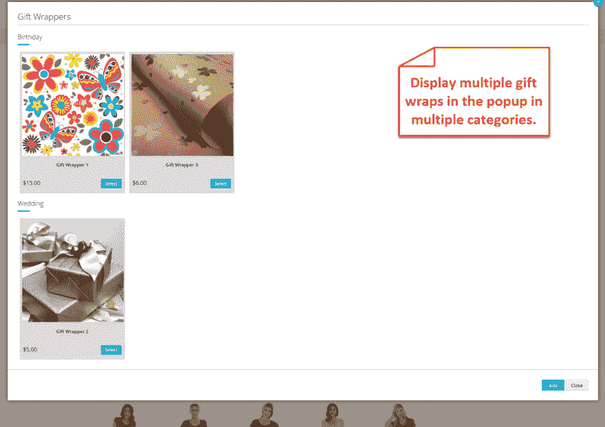
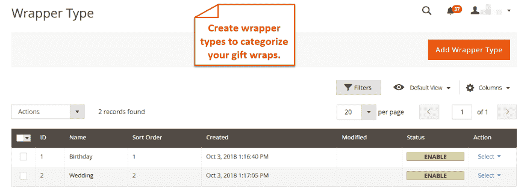
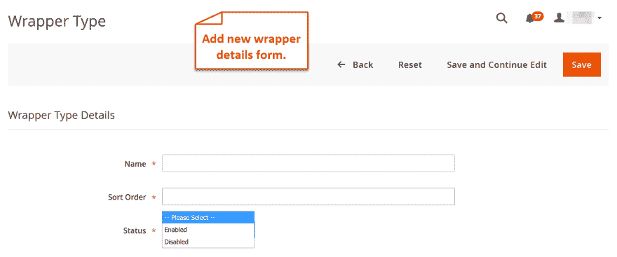
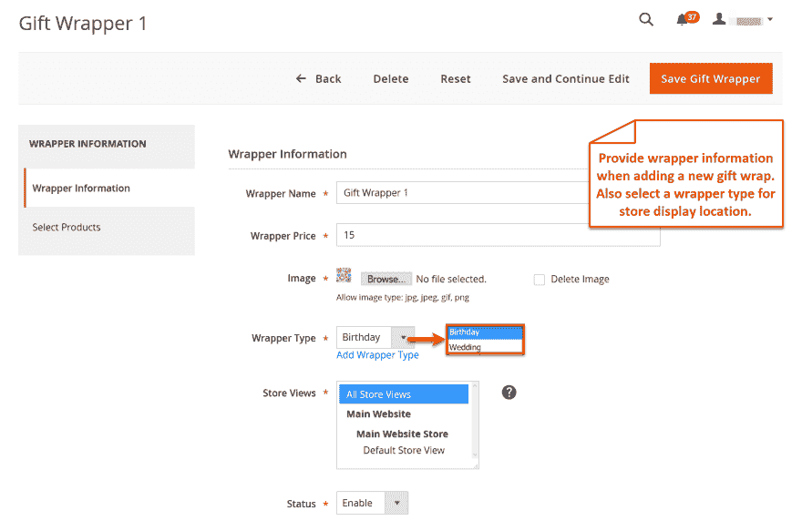
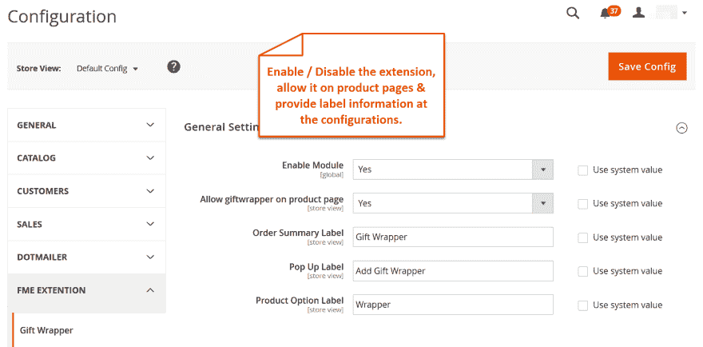

# Magento 2 的礼品包装

> 原文：<https://dev.to/simonwalkerfme/gift-wrap-for-magento-2-1b1p>

允许商家在其电子商务网站上为顾客提供完整礼品体验。选择适合任何场合和类型产品的礼品包装。

您可以添加无限的包装设计，并将其分类为礼品包装类型。此选项也会显示在结帐页面上。

## **扩展的主要特性**

****   给你的商店添加有吸引力的礼品包装*   添加价格并将产品分配给包装*   制作各种类型的礼品包装*   仅限商店查看礼品包装*   个性化礼品包装选项*   在购物车和结账页面上显示礼品包装***

### **为你的店铺添加精美的礼品包装**

这个扩展允许你在你的网上商店中添加各种礼品包装。让你的顾客包装他们有吸引力的设计。

### **添加价格并将产品分配给包装**

让您的客户更轻松地将产品分配到礼品包装设计中，这样您就可以节省他们单独寻找包装设施的宝贵时间。获取您提供的礼品包装服务的费用。

### **制作各种礼品包装**

您可以创建不同的包装类型，方便用户选择适合不同场合的包装，如婚礼、生日、纪念日等。

### **限制商店查看礼品包装**

您可以对某些商店视图启用礼品包装功能。

### **个性化礼品包装选项**

您可以为要显示的礼品包装选项编写自定义标签。这将有助于用户轻松理解该领域。

### **展示购物车上的礼品包装&结账页面**

在购物车和结账页面上显示礼品包装选项，让顾客知道他们也选择了包装。

**详情请访问:** **[magento 2 礼品包装](https://marketplace.magento.com/fme-gift-wrapper.html)**

