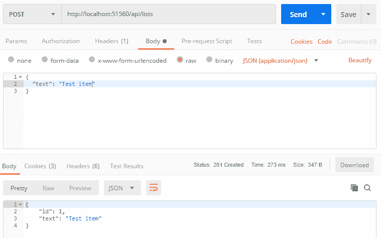
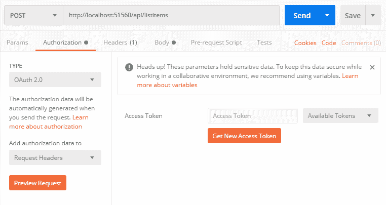

# 用 ASP.NET Web API 构建一个 REST API

> 原文：<https://dev.to/oktadev/build-a-rest-api-with-asp-net-web-api-3421>

需要用 ASP.NET Web API 构建一个 REST API 吗？如果您正在创建一个新的 API，您可能应该使用。网芯。但是并不总是能够使用最新最伟大的技术。如果您正在使用现有的 ASP.NET 4 . x 应用程序，或者您所在的组织尚未批准使用。NET 核心，您可能需要在。NET Framework 4.x。这就是你将在这里学到的东西。您还将学习如何从另一个应用程序访问您的 API(用于机器对机器的通信)并防止对您的 API 的未授权访问。

我将向您展示如何实现标准设计模式，以便其他开发人员能够轻松理解和使用您的 API。

在本教程中，您需要做几件事情:

*   Visual Studio 2017
*   Postman ，curl，或者一个类似的工具来手动测试你的 API

我们开始吧！

## 创建一个 ASP.NET Web API 2 项目

在 Visual Studio 中…

*   进入**文件** > **新建** > **项目……**
*   选择 **Visual C#** 项目类别，然后选择【ASP.NET T2】Web 应用程序(。NET 框架)
*   将你的项目命名为`AspNetWebApiRest`并点击**确定**
*   选择**空的**项目模板并点击**确定**(不要勾选任何框来添加核心引用)

现在你需要得到几个 NuGet 包。在软件包管理器控制台中使用这些命令来安装它们:

```
Install-Package Microsoft.AspNet.WebApi
Install-Package Microsoft.Owin.Host.SystemWeb
Install-Package Microsoft.AspNet.WebApi.OwinSelfHost 
```

如果你一次粘贴了所有的包，确保在最后一行后按回车键，这样最后一个包也会被安装。

现在右击你的项目选择**添加** > **类…** 并将其命名为`Startup.cs`。复制并粘贴到新文件:

```
using System.Web.Http;
using Newtonsoft.Json.Serialization;
using Owin;

namespace AspNetWebApiRest
{
   public class Startup
   {
       public void Configuration(IAppBuilder app)
       {
           var config = new HttpConfiguration();

           config.MapHttpAttributeRoutes();

           config.Routes.MapHttpRoute(
               name: "DefaultApi",
               routeTemplate: "api/{controller}/{id}",
               defaults: new { id = RouteParameter.Optional }
           );

           app.UseWebApi(config);
       }
   }
} 
```

上面的代码创建了一个用于托管 Web API 的 OWIN 管道，并配置了路由。

接下来，向您的项目添加一个`Controllers`文件夹。然后右键点击`Controllers`文件夹，选择**添加** > **新项目…** 。在左边选择**Visual c#**>**Web**>Web API。然后点击 **Web API 控制器类(v2.1)** ，命名为`ListItemsController.cs`，点击**添加**。

现在，您应该有一个控制器，它具有获取、发布、放置和删除列表项的方法。我们来测试一下。

按下 **F5** 来启动你的 API。浏览器打开后，在网址末尾添加`/api/listitems`，点击**进入**。

您应该在 XML 输出中看到一些项目。您实际上希望您的 API 使用 JSON，而不是 XML，所以让我们来解决这个问题。

在`Startup.cs`中，在`Configuration()`方法中添加这些行，就在`app.UseWebApi(config);` :
的正上方

```
config.Formatters.Remove(config.Formatters.XmlFormatter);
config.Formatters.JsonFormatter.SerializerSettings.ContractResolver = new CamelCasePropertyNamesContractResolver();
config.Formatters.JsonFormatter.SerializerSettings.DateTimeZoneHandling = Newtonsoft.Json.DateTimeZoneHandling.Utc; 
```

这段代码删除了`XmlFormatter`(它是默认的输出格式化程序)，并将`JsonFormatter`配置为驼峰式属性名，并对日期使用 UTC 时间。

现在，再次运行您的项目，导航到`/api/listitems`，并验证它现在已经显示了一个 JSON 列表。

## 创建资源和 ASP.NET Web API 动作

现在让我们让这个 API 做一些有用的事情。在本节中，您将创建一个列表项资源，并连接所有控制器操作，以便您可以创建、读取、更新和删除项。

继续在您的项目中创建一个`Models`文件夹，并添加一个`CustomListItem.cs`类。它应该是这样的:

```
namespace AspNetWebApiRest.Models
{
   public class CustomListItem
   {
       public int Id { get; set; }
       public string Text { get; set; }
   }
} 
```

通常情况下，您会希望将项目存储在某种数据库中，但是由于本教程的重点是构建 REST API，所以您将只使用内存中的静态列表来存储项目。

回到您的`ListItemsController`类，添加一个私有静态属性来将您的列表项存储在内存中。在类声明中添加私有属性。

```
private static List<CustomListItem> _listItems { get; set; } = new List<CustomListItem>(); 
```

您还需要在控制器的顶部添加一个 using 语句。

```
using AspNetWebApiRest.Models; 
```

现在更改控制器中的第一个`Get()`方法来返回这个列表(注意返回类型的变化):

```
public IEnumerable<CustomListItem> Get()
{
   return _listItems;
} 
```

如果您再次运行 API，您将看到`/api/listitems`返回一个空列表。

让我们修改`Post()`方法，这样您就可以向列表中添加新的项目。

```
public HttpResponseMessage Post([FromBody]CustomListItem model)
{
   if(string.IsNullOrEmpty(model?.Text))
   {
       return Request.CreateResponse(HttpStatusCode.BadRequest);
   }
   var maxId = 0;
   if (_listItems.Count > 0)
   {
       maxId = _listItems.Max(x => x.Id);
   }
   model.Id = maxId + 1;
   _listItems.Add(model);
   return Request.CreateResponse(HttpStatusCode.Created, model);
} 
```

这就是`Post()`方法的作用:

*   如果列表项`Text`属性缺失或为空，则返回错误的请求响应
*   计算下一个可用 ID
*   分配 ID 并将项目添加到列表中
*   在响应正文中返回整个项目(包括新 id ),以及创建的状态代码

注意，为了理想的安全性，您应该创建一个不包含`Id`属性的单独的 EditModel，并接收它作为方法参数，以防止用户指定他们自己的 ID。上面的代码是安全的，但是如果另一个开发人员来修改它，他们可能会意外地引入一个漏洞。

现在让我们用 Postman 来测试你的`Post()`方法:

[](https://res.cloudinary.com/practicaldev/image/fetch/s--_MgAno_A--/c_limit%2Cf_auto%2Cfl_progressive%2Cq_auto%2Cw_880/https://developer.okta.com/assets-jekyll/blog/rest-aspnet-webapi/postman-create-item-post-json-4c9e1f4a504e37f12c670d1fca5f39ac91b65019ae4bef45343a0fa25ac3d618.png)

在邮递员…

*   创建新请求
*   将方法改为**发布**
*   输入 API 的 URL:`http://localhost:{yourPortNumber}/api/listitems`
*   点击**体的**选项卡，选择**原**
*   请注意该行中出现的下拉菜单。单击它并将其更改为 **JSON(应用程序/json)** (这将为请求添加一个值为`application/json`的`Content-Type`头)
*   将你想要创建的物体放入物体:`{ "text": "Test item" }`
*   点击**发送**

如果出现错误，请确保您的 API 正在运行。您可以看到 API 正在返回 201 Created 状态代码，并在响应体中返回新对象。

添加一些项目后，您可以向同一个 URL 发出 GET 请求来查看您的项目列表。它应该是这样的:

```
[{"id":1,"text":"Test item"},{"id":2,"text":"Test item 2"}] 
```

现在让我们实现从列表中获取特定项的方法:

```
public HttpResponseMessage Get(int id)
{
    var item = _listItems.FirstOrDefault(x => x.Id == id);
    if (item != null)
    {
        return Request.CreateResponse(HttpStatusCode.OK, item);
    }
    return Request.CreateResponse(HttpStatusCode.NotFound);
} 
```

在这里，您找到了该商品，并以状态代码 200 (OK)将其退回。如果没有找到目标项目，API 将返回 404(未找到)状态代码。

`Delete()`方法类似:

```
public HttpResponseMessage Delete(int id)
{
    var item = _listItems.FirstOrDefault(x => x.Id == id);
    if (item != null) {
        _listItems.Remove(item);
        return Request.CreateResponse(HttpStatusCode.OK, item);
    }
    return Request.CreateResponse(HttpStatusCode.NotFound);
} 
```

您可以返回您删除的项目的副本以及状态代码 200 (OK ),以表明一切正常，如上例所示，或者您可以使用状态代码 204(无内容)来表明成功，而不返回项目。

对于更新，可以使用 PUT 或 PATCH 方法。如果需要用新项目替换现有项目，请使用 PUT 方法。如果只需要更新一个属性，那么在更新项目时还需要包括所有其他属性。如果只想更新选择属性，而不修改项目的所有其他属性，请使用 PATCH 方法。

有些 API 只是使用 POST 方法进行更新。对于这个例子，您将使用 PUT 方法。用以下代码替换`Put()`方法:

```
public HttpResponseMessage Put(int id, [FromBody]CustomListItem model)
{
    if (string.IsNullOrEmpty(model?.Text))
    {
        return Request.CreateResponse(HttpStatusCode.BadRequest);
    }
    var item = _listItems.FirstOrDefault(x => x.Id == id);
    if (item != null)
    {
        // Update *all* of the item's properties
        item.Text = model.Text;

        return Request.CreateResponse(HttpStatusCode.OK, item);
    }
    return Request.CreateResponse(HttpStatusCode.NotFound);
} 
```

上面的代码类似于您已经实现的其他方法。请注意，如果您正在更新一个具有唯一性约束的资源，您将需要确保更新不违反该约束。如果检测到冲突，您可以使用状态代码 409(冲突)通知调用者更新失败。

## 保护您的 RESTful ASP.NET Web API

如果您需要从另一个程序或服务访问此 API，保护它的最佳方法是什么？

您可以在 API 中硬编码用户名和密码，然后在授权头中传递这些凭证，但这并不理想。每当您需要更改凭证时，您都需要更新客户端和 API。此外，没有一种好的方法可以只撤销一个客户端的访问权，而保留其他客户端的访问权。

OAuth 2.0 客户端凭证流通过将客户端凭证的管理和验证外包给授权服务器来解决这些问题。

它是这样工作的:

1.  客户端应用程序向授权服务器请求访问令牌。要获得这个访问令牌，客户端需要提供用户名和密码。
2.  当客户端向您的 API 发出请求时，它会在授权头中发送访问令牌。
3.  您的 API 验证令牌。如果令牌是有效的并且包含正确的权限，那么您的 API 允许请求完成。

(如果这对您来说是全新的，您可以[在这里](https://developer.okta.com/blog/2017/06/21/what-the-heck-is-oauth)了解更多关于 OAuth 的信息。)

您可能不想自己构建 OAuth 2.0 授权服务器，因此对于本教程，您将注册一个[永久免费的 Okta 开发者帐户](https://developer.okta.com/signup/)(或者如果您已经有帐户，请登录`{yourOktaDomain}`)。

## 为 REST API 注册客户端应用程序

一旦你登录到 [Okta](https://developer.okta.com/) ，注册你的客户端应用程序。

*   在顶部菜单中，点击**应用**
*   点击**添加应用**
*   选择**服务**，点击**下一步**
*   输入**名称**的`Postman`，点击**完成**

注意**客户端 ID** 和**客户端秘密**。这是我们的客户端应用程序(在我们的例子中是 Postman)需要发送到授权服务器以请求访问令牌的用户名和密码。您可以现在记下这些凭据，或者以后需要时再回来获取它们。

## 创建自定义范围

现在您需要设置授权服务器:

*   转到 **API** > **授权服务器**
*   点击**默认**授权服务器的链接
*   选择**范围**选项卡
*   添加一个名为`manage:lists`的范围，并单击**创建**(除了**名称**字段之外，您可以将所有内容留空)

您的客户端应用程序将请求访问此范围。

您已经完成了授权服务器的配置！

## 向您的 REST API 添加认证

现在您将配置您的 API 来要求一个访问令牌。首先，在包管理器控制台中使用这些命令来添加您将需要的 NuGet 包:

```
Install-Package Microsoft.Owin.Security.Jwt
Install-Package Microsoft.IdentityModel.Protocols.OpenIdConnect 
```

现在我们需要对`Startup.cs`做一些修改。首先，您将添加一些代码来联系您的授权服务器以获取配置信息。具体来说，API 需要一个公共签名密钥，这样 API 就可以验证访问令牌的签名(这使得坏人不可能伪造有效的访问令牌)。

之后，您将把 JWT 载体认证中间件添加到 OWIN 管道中。这个中间件将自动验证发送给 API 的任何访问令牌，并使用它来创建带有声明的身份。

打开`Startup.cs`，在文件顶部添加这些`using`语句:

```
using Microsoft.IdentityModel.Protocols;
using Microsoft.IdentityModel.Protocols.OpenIdConnect;
using Microsoft.IdentityModel.Tokens;
using Microsoft.Owin.Security;
using Microsoft.Owin.Security.Jwt;
using System.Threading.Tasks; 
```

现在将这段代码添加到`Configuration()`方法的顶部:

```
var authority = "https://{yourOktaDomain}/oauth2/default";

var configurationManager = new ConfigurationManager<OpenIdConnectConfiguration>(
   authority + "/.well-known/openid-configuration",
   new OpenIdConnectConfigurationRetriever(),
   new HttpDocumentRetriever());
var discoveryDocument = Task.Run(() => configurationManager.GetConfigurationAsync()).GetAwaiter().GetResult();

app.UseJwtBearerAuthentication(
   new JwtBearerAuthenticationOptions
   {
       AuthenticationMode = AuthenticationMode.Active,
       TokenValidationParameters = new TokenValidationParameters()
       {
           ValidAudience = "api://default",
           ValidIssuer = authority,
           IssuerSigningKeyResolver = (token, securityToken, identifier, parameters) =>
           {
               return discoveryDocument.SigningKeys;
           }
       }
   }); 
```

现在编辑第一行，将您的`authority`设置为您的授权服务器的**发行者 URI** 。要找到这一点，进入 Okta 仪表板，导航到 **API** > **授权服务器**。找到默认授权服务器的行，复制**发行者 URI** 列中的值，并将其粘贴到设置`authority`变量的行中。(如果您正在构建用于生产的东西，请确保将该值存储在配置设置中，而不是硬编码在这里。)

请注意，上面代码中的`ValidAudience`还必须与您的授权服务器的受众(在本例中为`api://default`)相匹配，并且令牌不能过期，验证才能成功。

现在转到您的`ListsController.cs`并在类定义的正上方添加一个`[Authorize]`属性。

```
 [Authorize]
   public class ListsController : ApiController
   { 
```

现在，您的 API 将要求通过每个请求的授权头发送有效的访问令牌。

让我们验证一下，如果我们*不*提供访问令牌，访问就会被拒绝。

运行 API。然后在 Postman 中，向`/api/listitems`发送一个 POST 请求，就像之前做的那样。现在您应该看到返回了一个`401 Unauthorized`状态，并且在主体中有一条消息:

```
{  "message":  "Authorization has been denied for this request."  } 
```

太好了。

现在您需要一个访问令牌。

以下是如何在邮差:

[](https://res.cloudinary.com/practicaldev/image/fetch/s--ImYrW1Xr--/c_limit%2Cf_auto%2Cfl_progressive%2Cq_auto%2Cw_880/https://developer.okta.com/assets-jekyll/blog/rest-aspnet-webapi/postman-authorization-get-oauth-access-token-2f7147165986f3981ee70f564d21b602fc0237945a1621769abcf011812d045d.png)

点击您请求的**授权**标签，从**类型**下拉列表中选择 **OAuth 2.0** ，点击**获取新的访问令牌**。

现在填写表格。**令牌名称**可以是类似`AspNetWebApiRest`的可识别的东西。**授予类型**必须是**客户凭证**。

**访问令牌 URL** 将采用以下格式:`https://{yourOktaDomain}/oauth2/default/v1/token`。要在 Okta 仪表板中找到它，请转到 **API** > **授权服务器**，为您之前创建的授权服务器复制**发行者 URI** ，并在末尾添加`/v1/token`。

要在您的 Okta 仪表盘中找到您的**客户 ID** 和**客户密码**:

*   导航至**应用程序**
*   点击 **Postman** (之前添加的客户端应用)
*   使用每个字段旁边的**复制到剪贴板**图标复制值，然后粘贴到 Postman

现在填写表格中剩下的最后两个字段。对于**范围**，输入`manage:lists`。对于**客户端认证**，确保选择**作为基本认证头**发送。

现在你可以点击**请求令牌**。如果出现错误，请仔细检查**获取新的访问令牌**表单中的每个值。

获得访问令牌后，向下滚动并点击**使用令牌**。如果您错过了这一步，您可以在**可用令牌**下拉列表中找到该令牌的邮递员授权标签。

现在你都准备好了。点击 Postman 中的 **Send** 发送请求(附带访问令牌)。

如果到目前为止您已经做了所有正确的事情，那么您将会从 API 得到一个成功的消息。

如果你在某个地方犯了错误，你会看到授权被拒绝，你会想哭，因为你不知道你在哪里犯了错误。这里有一些你可以检查的东西:

*   `Startup.cs`中的`authority`是否与您的授权服务器的**发行人 URI** 匹配？
*   `Startup.cs`中的`ValidAudience`与你的授权服务器的**受众**是否完全匹配？
*   如果自您请求访问令牌以来已经超过一个小时，请记住请求一个新的*访问令牌(它们被设置为在一个小时后过期)*

请注意，在本教程中，您是通过不安全的 http 连接运行本地 API 的。对于生产，您应该通过 https 提供 API，这样您的访问令牌就不会在传输过程中被窃取。如果您在 IIS 中托管此 API，您还需要配置 IIS 以允许 PUT 和 DELETE 谓词，默认情况下这是不允许的。

这并不太难，是吗？

尽管这种设置比简单地在 API 中硬编码用户名和密码要稍微复杂一些，但是它给了你更多的控制来管理对 API 的访问。我想你会同意这是一个更好的方法。

## 了解更多关于 REST APIs 和 ASP.NET Web API 的信息

有兴趣学习更多关于 API 访问管理或用 Okta 构建安全的应用程序吗？查看我们的[产品文档](https://developer.okta.com/use_cases/api_access_management/)或这些资源:

*   如何保护你的？带有令牌认证的. NET Web API
*   [用 ASP.NET 框架 4.x Web API 和 Vue 构建一个简单的 CRUD 应用](https://developer.okta.com/blog/2018/09/07/build-simple-crud-with-aspnet-webapi-vue)
*   [用 ASP.NET 框架 4.x Web API 和 Angular 构建 CRUD App](https://developer.okta.com/blog/2018/07/27/build-crud-app-in-aspnet-framework-webapi-and-angular)

和往常一样，如果你对这篇文章有任何问题、评论或担忧，欢迎在下面留下你的评论。有关 Okta 开发团队的其他精彩内容，请在 Twitter [@OktaDev](https://twitter.com/oktadev) 、[脸书](https://www.facebook.com/oktadevelopers/)、 [LinkedIn](https://www.linkedin.com/company/oktadev) 和 [YouTube](https://www.youtube.com/channel/UC5AMiWqFVFxF1q9Ya1FuZ_Q) 上关注我们！