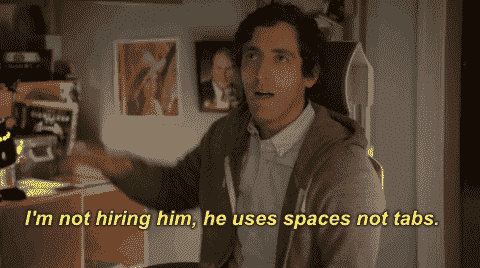

# 关于我的第一份内部软件工作，有两件事我没有预料到

> 原文：<https://dev.to/healeycodes/two-things-about-my-first-in-house-software-job-that-i-didnt-see-coming-omi>

[](https://res.cloudinary.com/practicaldev/image/fetch/s--aXP46TMJ--/c_limit%2Cf_auto%2Cfl_progressive%2Cq_66%2Cw_880/https://cdn-images-1.medium.com/max/1600/1%2Aa-LrxQKt9TJ7U-xD-nMUtw.gif)

#### 代码审查是工作中最棒的部分

我从害怕被评价到拥抱团队精神。今天，我发现自己完成了一张票，并期待着把它放在审查中。我真的很喜欢从同事那里得到的反馈，以及由此引发的对话。这是一个了解项目架构和模式的好机会。在过去的生活中，我是一名创意写作学生，所以我明白编辑东西总是会让它变得更好。

我喜欢给予，也喜欢得到。从第一天起，我就被鼓励参与到评估过程中。我知道如何很好地优化 JavaScript，所以我做的第一个评论是为通过审查的代码库的性能关键部分提供建议——所有这些都受到了好评。

软件工程作为一个领域有如此广泛的范围，以至于即使是刚进入这个行业的人也能为团队提供一些东西。无论他们是阅读技术博客、在堆栈中构建项目，还是深入研究文档。

#### 编码是工作中最不重要的部分

不要误解我的意思，如果我开始将糟糕的代码投入评审，我将会遇到问题。然而，我发现我工作中最重要的技能是沟通。我需要理解我的项目经理在告诉我什么，这样我才能把它翻译成代码。然后，我需要听取经理对我的方法的反馈。如果我不能向我的队友解释我的设计，那么他们会花更长的时间来理解我的代码(希望是自文档化的)。

我是设计一个新模块的三人小组的一员，这时我意识到我的交流是如何增长的。就像一段理想的代码一样，最好的交流方式是用简单的、几乎枯燥的语言——全部由正确的抽象来支持。弄清楚确切的要求，以及为您提供的合适的工具和模块，是完成工作的 85%。

```
/* Boring vs. Fancy.
 *
 * Task: Given a one or two digit Number, zero-pad values below ten
 */

// Fancy - uses String-tricks
('0' + foo).slice(-2);

// Plain old logic - significantly faster!
(foo < 10) ? ('0' + foo) : foo;

// ES7 gives us a native pad operator but it's not optimized for this situation either
foo + ''.padStart(1, 0); 
```

我解决了一个高优先级的 bug——这个 bug 使我们的产品陷入瘫痪——我挖了整整一个工作日，就是为了找到一个字符，一个字节，为了修复整个问题，需要删除它。那是美好的一天。其他几周，我就像他们付给我一个字一便士一样，写一些样板文件。

我工作最糟糕的部分是什么？冬天的天气通勤！

* * *

加入我的关于编程和个人成长的[时事通讯](https://buttondown.email/healeycodes)的 150 多人注册！

我发关于科技的微博。