# 代码片段-初学者指南

> 原文：<https://dev.to/matthewbrophy/code-snippets---a-beginners-guide-p4d>

<figure> 

<figcaption>来源:Reddit/r/dundermifflin</figcaption>

</figure>

当我开始编写 bootcamp 时，导师们最早灌输给我的一个概念是，程序员应该“努力变懒”。我们应该使用我们武器库中的每一种工具，尽可能地使编写应用程序变得不费力。如果有一种方法可以不重复我们自己，或者创建一种捷径来达到一个结果，否则将会涉及到写许多行重复的代码，我们应该抓住它，不要回头看。输入代码片段。一个程序员最好的朋友。

## 那么，什么是代码片段呢？

“代码片段”是一个术语，用于描述一小部分可重用的源代码、机器码或文本。它们允许程序员在日常编程过程中避免输入重复的代码。大多数现代文本编辑程序都拥有某种形式的片段创建和管理(我说大多数是因为我不知道存在的每一个编辑器)。虽然不同的编辑器管理代码段的确切方式略有不同，但基本概念是相同的。例如，我将使用 Visual Studio 代码。

### 代码片段由什么组成？

1.  名字-很简单。代码段的名称。*这不是用来触发编辑器中的代码片段的*
2.  Prefix -将用于在代码编辑器中触发代码段的实际击键。选择一个你容易记住的前缀。
3.  body——当您调用代码片段时，将被复制到空格中的实际代码。
4.  描述——对代码片段所包含内容的简单描述。

### 好吧，我为什么要费心使用代码片段呢？

1.  它们让我们免去了不必要的按键次数(你的手腕会感谢你的)。记住，我们应该尽可能的懒惰。
2.  它们使得记住函数的特定格式更加容易。有些函数可能非常复杂，或者可能包含难以记忆的语法。与其去寻找打字错误和语法错误，不如让代码片段保持代码的一致性。
3.  它们是可以分享的(不要吝啬你的片段)。如果您在一个项目团队中工作，代码片段可以帮助确保您以相同的方式编写特定的代码块——使您的代码更加一致，可读性更好。

## 没问题的...我被说服了。如何创建代码片段

### 基本结构

让我们从一个基本的例子开始:我们需要写大量唯一的地址来为测试环境播种数据库。(使用 Ruby)
我们的地址脚手架可能看起来像:
[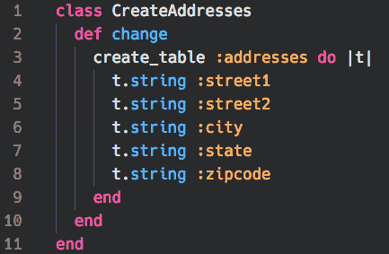](https://res.cloudinary.com/practicaldev/image/fetch/s--1AE0BLOa--/c_limit%2Cf_auto%2Cfl_progressive%2Cq_auto%2Cw_880/https://thepracticaldev.s3.amazonaws.com/i/i1sxwhy2qap4amz4hxpo.png) 
所以...每次我们想创建一个新的地址，我们必须输入(并填写值！):

[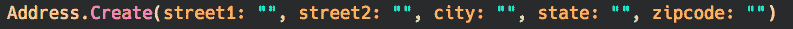](https://res.cloudinary.com/practicaldev/image/fetch/s---CswQqgQ--/c_limit%2Cf_auto%2Cfl_progressive%2Cq_auto%2Cw_880/https://thepracticaldev.s3.amazonaws.com/i/v69h8q5wtkqk72rm6m4o.png)
*puuuuke*——不用谢。光是想想，我就能感觉到手腕酸痛。让我们创建一个简单的代码片段来自动化这个过程。请记住，根据您使用的代码编辑器的不同，说明可能会稍有不同，但基本步骤基本上是相同的:

1.  打开用户代码片段界面。在 VS 代码中:菜单->代码->首选项->用户代码片段。(或 Cmd+Shift+P 并搜索“用户片段”)
2.  选择您想要为其创建代码片段的语言(在本例中为 Ruby)。
3.  为代码片段创建基本的脚手架:
    [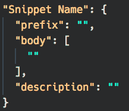](https://res.cloudinary.com/practicaldev/image/fetch/s--VW9ZvqsY--/c_limit%2Cf_auto%2Cfl_progressive%2Cq_auto%2Cw_880/https://thepracticaldev.s3.amazonaws.com/i/m42llbhuewx2wf8ka2zq.png)

4.  太棒了。现在我们要做的就是填写我们地址的相关信息:
    [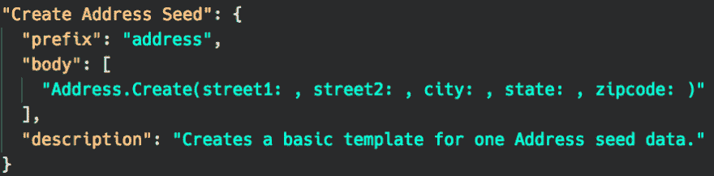](https://res.cloudinary.com/practicaldev/image/fetch/s--ygDHbzza--/c_limit%2Cf_auto%2Cfl_progressive%2Cq_auto%2Cw_880/https://thepracticaldev.s3.amazonaws.com/i/hyr8ioppgwu8vx3vuum0.png)

5.  保存用户代码片段文件，并在 ruby 文件中键入`address`(我们在创建代码片段时声明的“前缀”),以查看我们的劳动成果！
    [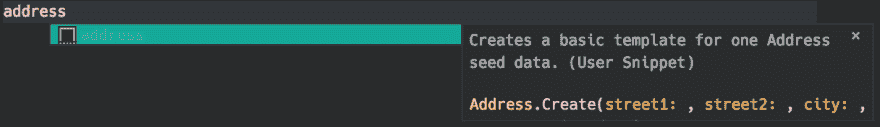](https://res.cloudinary.com/practicaldev/image/fetch/s--P_n0duKP--/c_limit%2Cf_auto%2Cfl_progressive%2Cq_auto%2Cw_880/https://thepracticaldev.s3.amazonaws.com/i/92qx2cr657n4u3xfk1pr.png) 
    (可以看到我们创建的描述！)...现在按下`Tab`和*嘭！*:
    
    *注意:*您可能会注意到我们删除了代码段主体中的引号。不要烦恼！我们现在将改进我们的代码片段，用“光标位置”替换那些引用，我们可以在创建代码片段后通过 tab 键来填充这些引用。

    ### 添加光标定位和占位符

    现在我们已经有了代码片段的基本结构，我们可以添加一些光标定位，这样我们就可以通过代码片段添加自定义文本，如变量、字符串或代码需要的任何内容。通过插入`${1:"placeholder text"}`、`${2:"placeholder text"}`、`{3:"placeholder text"}`等创建 VS 代码中的
    、
    光标位置。每个括号内的数字表示多次按下`Tab`后光标所在的位置。“占位符文本”是第一次被调用时将在代码片段中显示的内容(使用这些内容来提醒您应该在该位置键入什么)。因此，使用我们的示例:
    [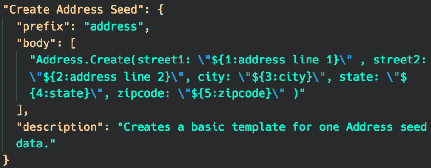 ](https://res.cloudinary.com/practicaldev/image/fetch/s--4mWEj2F3--/c_limit%2Cf_auto%2Cfl_progressive%2Cq_auto%2Cw_880/https://thepracticaldev.s3.amazonaws.com/i/l69pw4j1g1xi2wlb66v8.png) *注意:我们只需要转义符(" \ ")，因为我们希望占位符在引号(" ")内，如果没有它们，我们将告诉代码片段，当引号结束时，代码片段的主体的一行结束。*
    现在当我们用`address` :
    [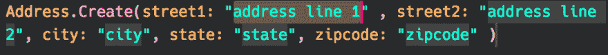](https://res.cloudinary.com/practicaldev/image/fetch/s--tMA2tvUl--/c_limit%2Cf_auto%2Cfl_progressive%2Cq_auto%2Cw_880/https://thepracticaldev.s3.amazonaws.com/i/uj86zwlika4cy0j1uv6r.png) 调用我们的代码片段时 Yesssss！现在，当我们输入信息并按 tab 键浏览代码片段时，我们可以直接跳到我们想要填充的下一部分。

## 临时演员

1.  多行。您可以在代码片段中创建多行，只需关闭引号，在末尾放置一个`,`，并在下一行开始一组新的`" "`: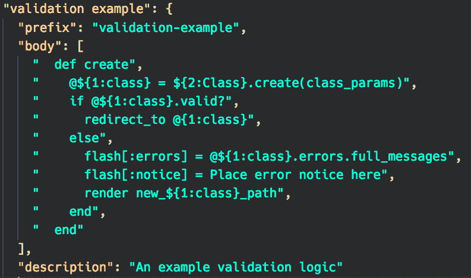将产生: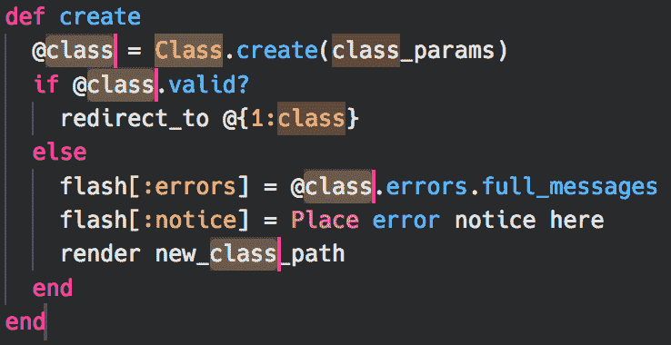*ooooooooooo 看，光标也同时突出显示了多行..:*
2.  同时更改多个光标点。您可以一次更改多个光标点。在上面的例子中，用`${1:...}`声明了多个光标点。当您开始在代码片段中输入信息时，每一个都会同时更新。

因此...简而言之，这就是代码片段。根据您的需求，它们可以简单，也可以复杂。我将给你们留下我一直在使用的一个我最喜欢的代码片段。记住，当你记不住一段代码时，“不要开始出错，开始剪吧！”

[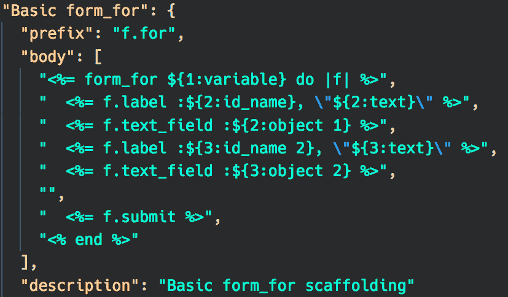](https://res.cloudinary.com/practicaldev/image/fetch/s--bxrMGlYK--/c_limit%2Cf_auto%2Cfl_progressive%2Cq_auto%2Cw_880/https://thepracticaldev.s3.amazonaws.com/i/imgup56hpumxitey35b2.png)
[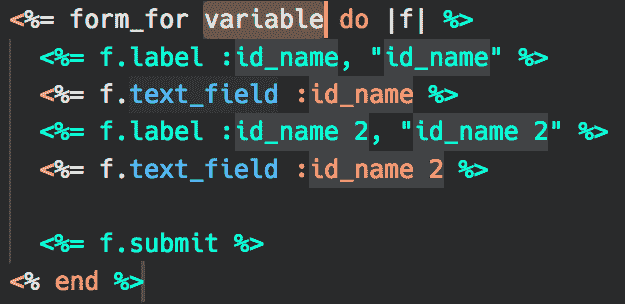T6】](https://res.cloudinary.com/practicaldev/image/fetch/s--_i4o7Zyz--/c_limit%2Cf_auto%2Cfl_progressive%2Cq_auto%2Cw_880/https://thepracticaldev.s3.amazonaws.com/i/1g9e2ggpp5xxyy5fsind.png)

### 不同文本编辑器的资源

*   [VS 代码](https://code.visualstudio.com/docs/editor/userdefinedsnippets)
*   [Atom](https://flight-manual.atom.io/using-atom/sections/snippets/)
*   [崇高的文字](http://sublimetext.info/docs/en/extensibility/snippets.html)

<figure> 

<figcaption>来源:Reddit/r/dundermifflin</figcaption>

</figure>