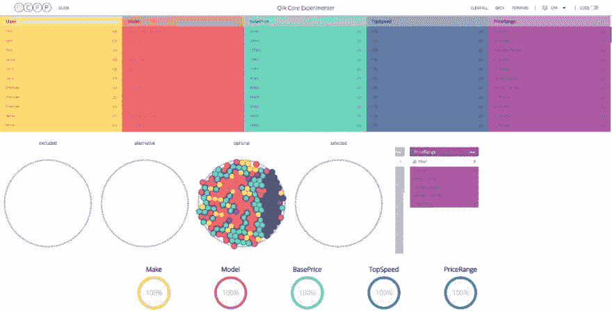
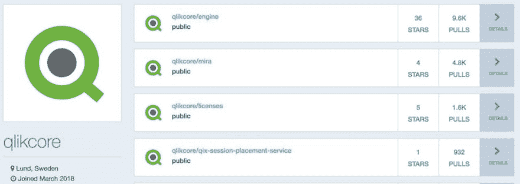
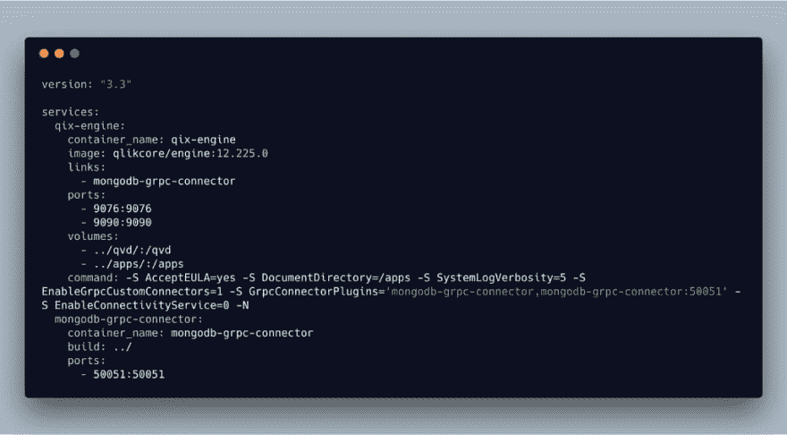

# qlik Core for Developers:Workshop 创建中的经验教训

> 原文：<https://dev.to/qlikbranch/qlik-core-for-developers-lessons-learned-in-workshop-creation-hl0>

另一个 [ForwardJS](https://forwardjs.com/) 在旧金山来来去去，像往常一样，我在那里玩得很开心。这一次，我代表 [Qlik](https://www.qlik.com) 参加一个赞助的研讨会，所以这是我第一次尝试将 [Qlik 核心](https://core.qlik.com)交到新面孔开发人员手中——以下是我学到的一些东西。

<figure> 

<figcaption>一个数据检索的例子，发表于 ForwardJS 旧金山，2019 年 1 月</figcaption>

</figure>

### **不要假设你的开发人员可能知道什么技术**

[Qlik Core](https://core.qlik.com/) 是我们引擎的容器化版本，因此我们在 [Docker Hub](https://hub.docker.com/) 上为它创建了一个 Docker 映像。

我犯了一个愚蠢的错误，以为开发人员会知道 Docker 和容器化的整个概念，而当时车间里一半的开发人员都不知道这项令人敬畏的技术。

当建立一个工作室时，你应该在开始的时候有时间解释你正在使用的技术，并且假设开发者不知道这些技术是什么或者它们是如何工作的。

<figure> 

<figcaption>Qlik 内核—dockered 引擎</figcaption>

</figure>

### **在多个操作系统上测试您的车间设置**

为了向我的研讨会与会者展示在 [Qlik](https://www.qlik.com) 中创建新应用程序时生成的应用程序文件，我为 Docker 映像创建了一个卷，它是主项目文件夹中的一个目录。

虽然这种设置在我的 MacOS 上运行得很好，但同样的 Docker 文件给我的使用 Windows 的与会者带来了问题，尤其是那些第一次使用 Docker 的人。

当我试图帮助这些开发人员让他们的 Docker 设置正常工作时，有一些权限或共享问题让其他与会者无所事事。

如果我在一台 Windows 机器上运行这个研讨会，我可能会提前了解这一点，而不是浪费宝贵的时间。请务必在多种环境中测试您的设置，这样就不会出现任何意外。

### **给你的与会者举例说明他们正在努力实现的目标**

我所做的事情之一，我觉得是顺利运行研讨会的关键，是为我的研讨会中的每个步骤建立代码库。我的 workshop 项目的代码位于一个 [GitHub](https://github.com/rjriel/forward-workshop) 存储库中，我为我的每个学习点都有一个单独的分支。

在你的研讨会中，不可避免地会有一些地方，人们在让项目做他们需要做的事情时会有问题，你必须继续前进。如果没有代码库来引导他们进入下一个要点，你的与会者将会与众不同，不会有好的体验。

创建分支将允许用户简单地将他们的项目更新到下一步，这样他们就可以跟上课程的其他部分。

<figure> 

<figcaption>设置基础设施的例子</figcaption>

</figure>

### 简单是关键，高级话题是后袋

有了像 Qlik Core 这样强大的引擎，可以做的事情就很多了，但是开发人员在使用一项技术的第一天最不愿意钻研的事情就是细节。幸运的是， [Qlik Core](https://core.qlik.com/) 的基础非常简单，易于掌握，内部开发的一系列工具让开发人员的工作变得更加轻松。

当建立一个工作室向开发人员介绍一项技术时，甚至不要费心去提出复杂的东西。相信那些想知道真正先进的东西的开发人员会问你的，这是一件很好的事情，可以留到最后或者在研讨会后讨论。

得到基本的东西，建立基础，开发人员会让你知道他们什么时候想开始添加附加功能。

* * *