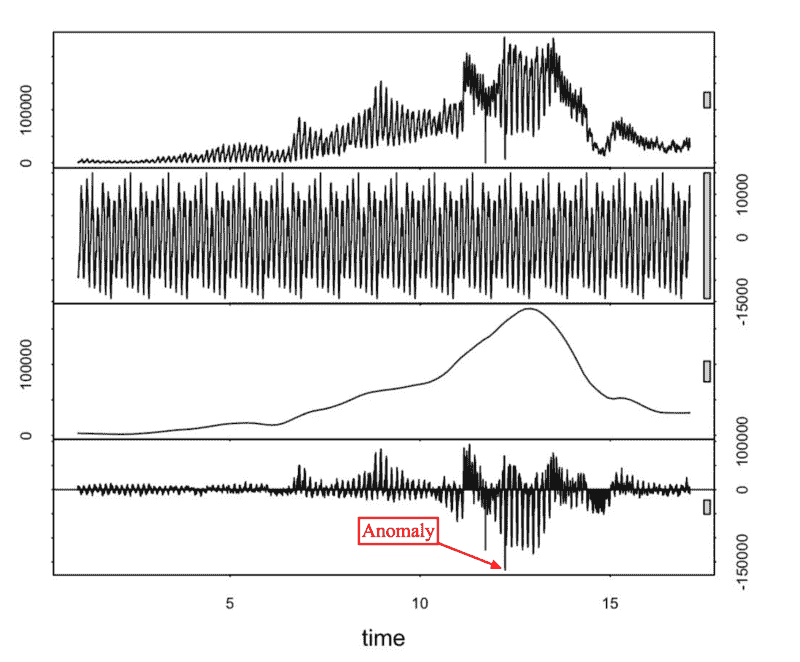
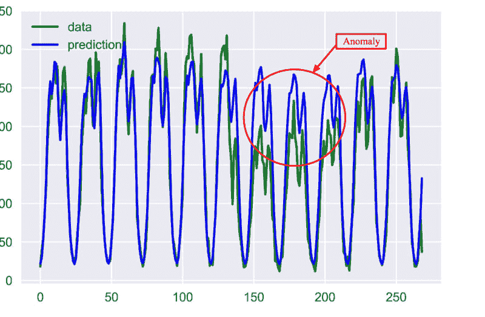
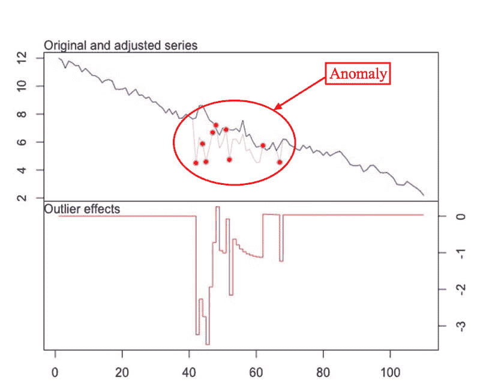

# 时间序列异常检测算法

> 原文：<https://dev.to/paveltiunov/time-series-anomaly-detection-algorithms-4gmj>

*本文概述了最流行的时间序列异常检测算法及其优缺点。*

这篇文章是献给没有经验的读者的，他们只是想了解一下异常检测技术的现状。不想用数学模型吓到你，我们把所有的数学都藏在推荐链接下面。

### **重要异常类型**

时间序列的异常检测问题通常表述为*寻找相对于某个标准或通常信号*的异常数据点。虽然有许多异常类型，但从业务角度来看，我们将只关注最重要的类型，如意外的峰值、下降、趋势变化和水平变化。

想象一下，你跟踪网站的用户，发现用户在短时间内出现了意想不到的增长，看起来像一个峰值。这些类型的异常通常被称为**附加异常值**。

另一个关于网站的例子是，当你的服务器宕机时，你会在很短的一段时间内看到零个或很少的用户。这些类型的异常通常被归类为**时间变化**。

在你处理一些转换漏斗的情况下，转化率可能会下降。如果发生这种情况，目标指标通常不会改变信号的形状，而是改变其在一段时间内的总值。根据变化的特征，这些类型的变化通常被称为**电平移动或季节性电平移动**。

基本上，异常检测算法应该用*异常/非异常*标记每个时间点，或者预测某个点的信号，并测试该点值是否与预测值相差足够大以将其视为异常。

使用第二种方法，您将能够可视化置信区间，这将非常有助于理解异常发生的原因并验证它。
[T3】](https://res.cloudinary.com/practicaldev/image/fetch/s--xEomSwux--/c_limit%2Cf_auto%2Cfl_progressive%2Cq_auto%2Cw_880/https://media.graphcms.com/crqQkAJtTJ6EGrjVGdjw)

*[Statsbot](https://statsbot.co/product/predictions?utm_source=%D1%82=bewblog&utm_medium=article&utm_campaign=anomaly) 的异常报告。实际时间序列、预测时间序列和置信区间有助于理解异常发生的原因。*

让我们从应用的角度回顾一下这两种算法类型，以发现各种类型的异常值。

### STL 分解

[STL](http://www.wessa.net/download/stl.pdf) 代表基于黄土的季节趋势分解程序。这种技术让你能够将你的时间序列信号分成三个部分:**、季节、趋势和残差**。
 
*从上到下:原始时间序列，季节性，趋势和残差部分使用 STL 分解检索。*

顾名思义，它适用于季节性时间序列，这是最受欢迎的情况。

这里不明显的部分是，您应该使用**中值绝对偏差**来获得更健壮的异常检测。这种方法的主要实现是 [Twitter 的异常检测库](https://github.com/twitter/AnomalyDetection)。它使用[广义极端学生偏差测试](http://www.itl.nist.gov/div898/handbook/eda/section3/eda35h3.htm)来检查残差点是否是异常值。

#### **优点**

这种方法的优点在于它的简单性和健壮性。它可以处理许多不同的情况，所有的异常仍然可以直观地解释。

它主要用于检测附加异常值。要检测电平变化，您可以分析一些滚动平均信号，而不是原始信号。

#### **缺点**

这种方法的缺点是在调整选项方面过于死板。你所能做的就是使用显著性水平来调整你的置信区间。

当信号特征发生巨大变化时，这种方法通常会失效。例如，您正在跟踪网站上的用户，该网站对公众关闭，然后突然开放。在这种情况下，您应该分别跟踪启动期前后发生的异常情况。

### 分类和回归树

分类和回归树是最健壮和最有效的机器学习技术之一。它还可以以几种方式应用于异常检测问题。

*   首先，您可以使用监督学习来教会树对异常和非异常数据点进行分类。为了做到这一点，你需要标记异常数据点。
*   第二种方法是使用无监督学习来指导 CART 预测序列中的下一个数据点，并具有一定的置信区间或预测误差，就像 STL 分解方法一样。您可以使用广义 ESD 测试或[Grubbs’test](https://en.wikipedia.org/wiki/Grubbs%27_test_for_outliers)来检查您的数据点是位于置信区间之内还是之外。*  *实际时间序列(绿色)，使用 CART 模型做出的预测时间序列(蓝色)，以及作为与预测时间序列的偏差而检测到的异常。*

执行树学习的最流行的实现是 xgboost 库。

#### 优点

这种方法的优势在于，它在任何意义上都不受信号结构的限制，并且您可以引入许多特征参数来执行学习并获得复杂的模型。

#### 弊

缺点是越来越多的特性会很快影响你的计算性能。在这种情况下，你应该有意识地选择特征。

### ARIMA

ARIMA 是一个设计非常简单的方法，但仍然有足够的能力来预测信号并从中发现异常。

它基于这样一种方法，即过去的几个点通过添加一些随机变量(通常是白噪声)生成下一个点的预测。可以想象，未来预测的积分会产生新的积分等等。它对预测范围的明显影响是:信号变得更加平滑。

应用这种方法的难点在于，你应该[选择](https://en.wikipedia.org/wiki/Box%E2%80%93Jenkins_method)差异数、自回归数和预测误差系数。

另一个障碍是差分后你的信号应该是平稳的。简单地说，这意味着你的信号不应该依赖于时间，这是一个重要的限制。

异常检测是通过使用异常点建立信号的调整模型，并利用 [t 统计](https://en.wikipedia.org/wiki/T-statistic)检查它是否比原始模型更适合来完成的。
 
*两个时间序列建立了利用原始 ARIMA 模型和针对异常值进行调整的 ARIMA 模型。*

这种方法的首选实现是[t outliers](https://cran.r-project.org/web/packages/tsoutliers/tsoutliers.pdf)R 包。在你能为你的信号找到一个合适的 ARIMA 模型的情况下，它适合于检测所有类型的异常。

### 指数平滑

指数平滑技术非常类似于 ARIMA 方法。基本指数模型相当于 ARIMA (0，1，1)模型。

从异常检测的角度来看，最有趣的方法是[霍尔特-温特斯季节性方法](https://www.otexts.org/fpp/7/5)。你应该定义你的季节周期，可以等于一周，一个月，一年等。

如果您需要跟踪几个季节周期，例如同时具有周和年相关性，您应该只选择一个。通常，它会是最短的:在这个例子中是一周。

这显然是这种方法的一个缺点，它极大地影响了预测范围。

异常检测可以使用与 STL 或 CARTs 中异常值相同的统计测试来完成。

### 神经网络

就像在 CART 的情况下，你有两种方法来应用**:监督和非监督学习。**

 **当我们处理时间序列时，最合适的神经网络类型是 **LSTM** 。如果构建得当，这种类型的递归神经网络将允许您对时间序列中最复杂的相关性以及高级季节性相关性进行建模。

如果你有多个相互关联的时间序列，这种方法也会很有帮助。

这个领域仍然是正在进行的研究，为你的时间序列建立模型需要大量的工作。如果你成功了，你可能会在准确性方面取得杰出的成绩。

### 💡谨记在心💡

1.  尝试最适合您的问题的最简单的模型和算法。
2.  如果不奏效，就改用更先进的技术。
3.  从涵盖所有情况的更通用的解决方案开始是一个诱人的选择，但它并不总是最好的。

在 Statsbot，为了检测大规模的异常，我们使用不同的技术组合，从 STL 开始，到 CART 和 LSTM 模型结束。**