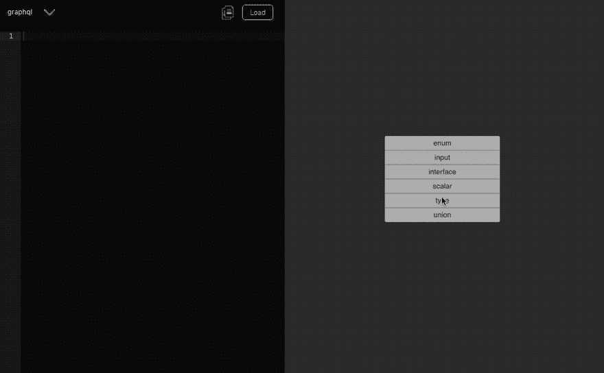

# 应用原型可视化编辑器

> 原文：<https://dev.to/robmatyszewski/visual-editor-for-app-prototyping-2gal>

### [可视化编辑器](https://graphqleditor.com)用于逻辑原型制作

从其核心名称来看，GraphQL 不仅仅是新的 API 标准。一些用户将其描述为新解决方案规范的工具。多亏了 graph sourcing，我们可以可视化现有的数据库模式，并在屏幕上显示现有的解决方案。另一方面，您可以构建新的业务应用程序原型。有了可视化的图形，可能性是无限的。想想在公司会议上让业务经理访问内部系统或加速新开发人员入职的潜在优势。一些公司拥有重要而复杂的系统；因此，它减缓了数字化转型。下面看看 Github 的模式是如何工作的。

试试这里 [GraphQL 编辑器](https://graphqleditor.com)

