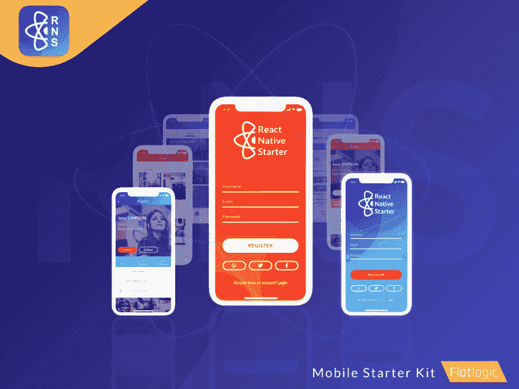

# 构建移动应用的最快方式

> 原文：<https://dev.to/flatlogic/the-fastest-way-to-build-your-mobile-app--2abd>

众所周知，从头开始创建一个移动应用程序绝对是一项耗时且困难的任务。如今，我们对应用程序有很多期望:交互过程中的满足感、快速加载和易用性。毫无疑问，移动时代已经到来。根据[通信市场报告](https://goo.gl/x3817c)，移动用户的数量甚至大于桌面用户的数量。这个统计数据告诉我们，如果没有应用程序，你可能会失去一个真正重要的市场份额。更喜欢以这种方式做生意的那部分人。
T3T5】

## 不要多此一举

说真的。事实上，有成百上千的人有同样的问题。如果你不是创建移动应用的专家，那么由行业专家创建的模板可能会派上用场。 [Mobile template](https://reactnativestarter.com/) 是一个启动项目，用于启动您的移动应用程序的开发。它只需要几行代码就可以启动应用程序开发。尤其是当涉及到根据最新的 UX 和 UI 趋势制作的模板时。毕竟，现在应用程序之间的差异只是用户体验的质量(UX)。

## 成功的关键是尽可能快地建立一个原型

时间就是金钱。开发、设计、业务分析和测试，这只是创建一个应用程序的庞大过程的主要步骤之一。最后，当客户不想要你的应用时，你可能会陷入糟糕的境地。有时候会发生。我认为你应该为这种情况做好准备。这就是为什么你必须带着原型快速进入市场。不要浪费时间和金钱去等待一个拥有所有功能的完整应用程序。只根据应用程序的基本主张进行构建，你很快就会发现用户是否准备好购买。一旦他们这样做了，你将会从你的付费用户那里得到很多重要的反馈。你可能需要开发几个应用程序来保持领先于竞争对手。如果你为几个应用程序购买一个模板，你可以节省相当多的钱。

## 只关注应用程序中的一个关键特性

最后，创建自己的应用程序是很棒的，但是如果你认为这是你唯一需要的应用程序，那么你可能对它期望太高了。当应用程序真正专注于一个问题或一项任务的特定方面，并且只使用一两个关键特性时，它们是最有效的。而准确知道哪一个的唯一方法就是获得真正的客户反馈。

## 如何最快的获得自己的原型？为 iOS 和 Android 构建相同的应用程序

你会问，这可能吗？是的，有一项来自脸书的技术叫做 React Native。它现在非常受欢迎，成千上万的应用程序已经在使用它。像脸书、Airbnb、优步和许多其他公司这样的大公司都在使用 React Native 开发他们的最新应用程序。

正如你可能知道的，它越来越受欢迎只有一个原因:它允许开发者在不同的移动操作系统上编写相同的代码，它可以节省你的时间和金钱。这意味着你不再需要构建两个独立的应用程序:一个用于 iOS，另一个用于 Android。

我们已经创建了一个 [React Native Starter](https://reactnativestarter.com/) 工具包，用于启动您的移动应用程序的开发，并遵循 React Native 中最新的行业最佳实践。

## 总结

一项研究表明，到 2020 年，世界移动应用市场有望增长到 630 亿美元。使用移动应用程序表明你的业务足够强大，可以创新，但不能墨守成规。通常，移动应用程序通过两种主要方式为公司带来一些额外收入:首先，因为大多数人总是携带移动设备，所以应用程序鼓励在旅途中重复客户的订单。与访问网络应用程序或网站相比，这些应用程序的主要便利性和简单性使人们更容易购买。其次，公司可以通过应用程序获得新的广告收入流。智能手机允许消费者阅读基本信息，做出选择和购买，而无需与任何人交谈或打电话。

文字来源:[https://flat logic . com/blog/the-smartest-way-to-build-your-mobile-app/](https://flatlogic.com/blog/the-smartest-way-to-build-your-mobile-app/)