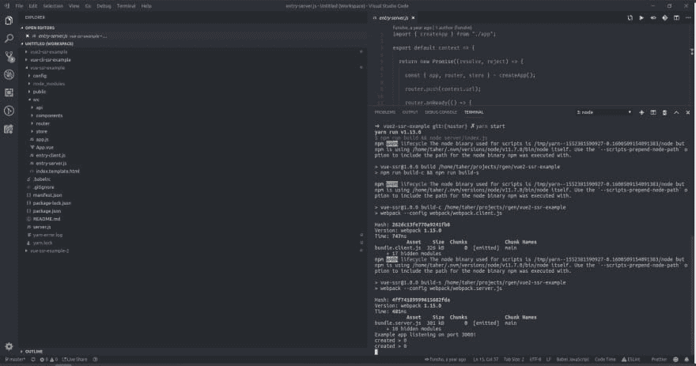
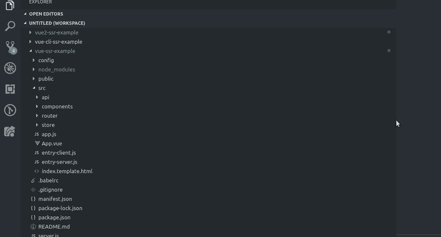
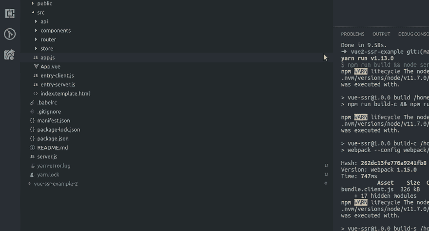

# VSCode 技巧:重置侧边栏和终端窗格的大小

> 原文：<https://dev.to/entrptaher/vscode-trick-reset-the-sidebar-and-terminal-pane-size-5cd1>

你曾经这样调整过侧边栏和终端的大小吗？
[T3】](https://res.cloudinary.com/practicaldev/image/fetch/s--NJvdCFN6--/c_limit%2Cf_auto%2Cfl_progressive%2Cq_auto%2Cw_880/http://i.imgur.com/1LG1xM9.png)

之后，你要么不在乎，要么试图手动调整它的大小，对不对？但是你有没有过忘记实际尺寸或者没有满足感的感觉？
[T3】](https://res.cloudinary.com/practicaldev/image/fetch/s--pjnEkQOn--/c_limit%2Cf_auto%2Cfl_progressive%2Cq_66%2Cw_880/https://i.imgur.com/OTAA2sU.gif)

只需双击您想要调整大小的窗格的边框。
[T5】](https://res.cloudinary.com/practicaldev/image/fetch/s--YTI52xM0--/c_limit%2Cf_auto%2Cfl_progressive%2Cq_66%2Cw_880/https://i.imgur.com/ST3UCaD.gif)

这同样适用于扩展或任何其他活动，你想看到完整的内容。
[T3】](https://res.cloudinary.com/practicaldev/image/fetch/s--JGugwaYo--/c_limit%2Cf_auto%2Cfl_progressive%2Cq_66%2Cw_880/https://i.imgur.com/bp1ECVY.gif)

就是这样！现在，它会根据侧边栏的内容和视窗大小调整回适当的大小。

和平！