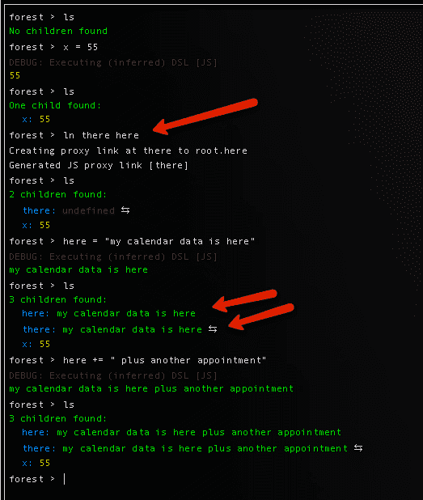

# 使用跨集群共享数据

> 原文：<https://dev.to/nserverless/notionso-data-sharing-with-transclusion-31mc>

没有多少函数式编程或范畴理论背景的开发人员，在编程时第一次遇到“拓扑”或“工作面”的概念时，可能会感到困难。

通常这种生物会在试图调试程序或通过代码和数据进行自省时出现。

将编程介质本身视为某种可行走的“表面”的想法在操作系统(如文件系统)或数据库(如电子表格或图表等)中更为常见。)但这也是诸如 XML 和 HTML 等 web 文档的方式。操作。

事实上，我们使用 XML 和 HTML 这样的中间文档的主要原因正是为了让我们能够在编程和拓扑(实际上是代数几何)之间移动。

跨结论是让相同的数据出现在多个地方的想法，最著名的是 idea . so。idea . so 背后的人是 Ted Nelson。它本质上是一种执行数据规范化的方法。

下面，我们使用无节点无服务器 REPL，通过将变量“这里”也投影到变量“那里”来演示这种“交叉包含”的一部分。我们通过使用类似于 Linux 中的“ln”或“link”命令来实现这一点。请注意，在实践中，这两个变量可能来自同一个位置。

使用 JS 代理的链接机制相当简单(如粉色箭头所示)。

我希望这有助于解释这样一个强大的概念，而不必陷入沉重的数学。Transclusion 是电子表格如何工作以及它们背后的函数依赖计算的关键(这更符合范畴理论)。

NodeServerless 现在是 CodeCraft 的一部分。人工智能