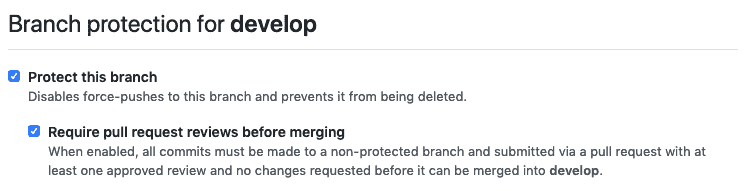

# 我团队的 git 工作流

> 原文：<https://dev.to/hozefaj/my-teams-git-workflow-1528>

大多数团队都有一个他们遵循的 git(或任何源代码控制)工作流。详细说明我们在 PayPal 团队中遵循的工作流程。我们有一个由 8 名工程师组成的团队同时开发多个应用程序。随着时间的推移，我们创建了这一流程，详情如下:

### 发展过程

1.  我们有三个主要分支`develop`、`release`和`master`。所有这些分支都受到保护，因此没有人能够直接将提交推送到这些分支。代码必须只通过公关的添加。

1.  `develop`是我们的工作分支，每个人都从`develop`创建一个新分支，然后创建一个 PR。*顺便提一下，我们按照[提交](https://github.com/commitizen/cz-cli)编写提交消息。这有助于自动化变更日志。*
2.  我们有一个 CI 管道来运行针对`tests`、`eslint`等的代码。每份公关都由几名工程师审核。
3.  一旦 PR 被批准并通过 CI，它就被合并。我们使用`Squash and Merge`选项。*我们接着`delete`这个特性分支。*
4.  一旦 PR 被合并，我们构建并部署代码到一个测试的阶段环境中。这是我们可以进行手工测试和端到端测试的地方。

### 发布流程

我们通常在每个 sprint 结束时发布(两周一次)。

1.  测试完成后，我们将创建一个从`develop`分支到`release`分支的 PR。*我们也给这个公关贴上了`release-candidate`标签。这有助于我们在遇到问题时回头看看到底发布了什么。*
2.  在这个 PR 上，因为我们使用了`commitizen`，所以我们使用[标准版](https://www.npmjs.com/package/standard-version)来生成变更日志。我们将所有随时间的变化保持在`CHANGELOG.md`之内。
3.  然后，我们创建一个构建并部署。健全性测试是最后一次。
4.  然后，我们使用构建部署到生产。

### 补丁修复

1.  开发从`develop`分支开始，如果我们需要解决某个问题，就会从`release`中分出一个新的分支。
2.  进行更改、审查和测试。然后 PR 合并到`release`。
3.  然后进行构建和部署过程。
4.  作为后续，我们还将相同的代码合并到`develop`中，以保持两个分支同步。

这里要补充一点，团队中的每个人都要写访问主回购的权限。如果他们愿意，他们可以自由选择回购。我们更希望所有分支都被推送到主回购，这样任何人都可以很容易地对现有分支做出贡献。一旦任何特征分支被合并，我们就`delete`它。

希望这有助于任何其他寻求 git 工作流的团队。好奇看看其他团队/公司是怎么跟进的。👍