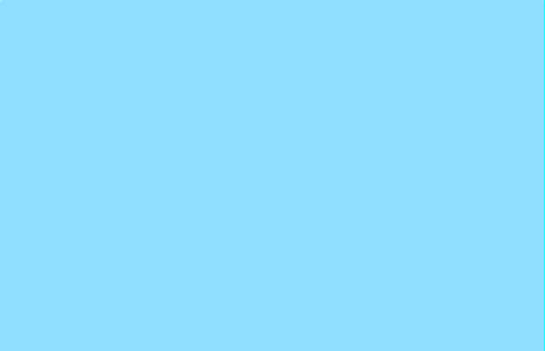
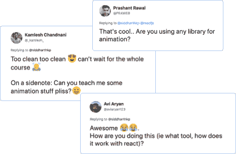
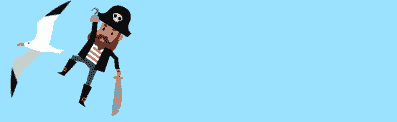
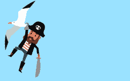
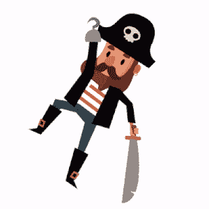
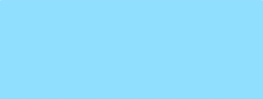
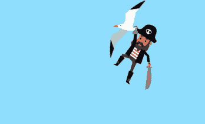
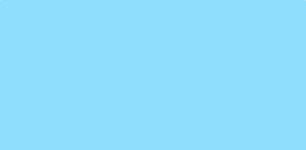

# 盗版和 CSS 动画

> 原文：<https://dev.to/siddharthkp/pirates-and-css-animations-36gj>

> 我为我的[时事通讯](https://sid.studio/newsletter)写了这篇文章，在这里注册每周都会收到这样的邮件。

嗨！

对于我的关于 React Hooks 的[课程，我必须制作一些动画来让它变得有趣。](https://react.games)

[](https://res.cloudinary.com/practicaldev/image/fetch/s--tpPrrM2Y--/c_limit%2Cf_auto%2Cfl_progressive%2Cq_66%2Cw_880/https://sid.studio/blog/32/final.gif)

一些人问这些动画是如何工作的...

[](https://res.cloudinary.com/practicaldev/image/fetch/s--SDpjxlRw--/c_limit%2Cf_auto%2Cfl_progressive%2Cq_auto%2Cw_880/https://sid.studio/blog/32/tweets.png)

你会惊讶于 CSS 有多么简单。

首先，我们来分解一下我们的作文:

1.  我们有一只鸟和一个挂在鸟上的海盗
2.  他们一起从屏幕的右侧进入
3.  到达一半后，小鸟放下海盗，从左边离开屏幕
4.  海盗落到了屏幕的底部

### 第一步:字符

[](https://res.cloudinary.com/practicaldev/image/fetch/s--pKzN3C87--/c_limit%2Cf_auto%2Cfl_progressive%2Cq_auto%2Cw_880/https://sid.studio/blog/32/characters.png)T3】

```
<div class="bird"></div>
<div class="pirate"></div> 
```

```
.bird {
  background-image: url('./bird.png');
}
.pirate {
  background-image: url('./pirate-hanging.png');
} 
```

通过一些尝试，我们可以将海盗准确定位在正确的位置。

[](https://res.cloudinary.com/practicaldev/image/fetch/s--9iN8PAXw--/c_limit%2Cf_auto%2Cfl_progressive%2Cq_auto%2Cw_880/https://sid.studio/blog/32/hanging.png)T3】

```
.pirate {
  top: 27px;
  margin-left: 49px;
} 
```

我们需要另一张海盗坠落时的照片。因为图像是矢量图像(SVG ),我们可以修改它以获得正确的姿态。(我使用的是 sketch，但你可以在任何图像编辑器中这样做)

[](https://res.cloudinary.com/practicaldev/image/fetch/s--yV2BXyfo--/c_limit%2Cf_auto%2Cfl_progressive%2Cq_66%2Cw_880/https://sid.studio/blog/32/redesign.gif)

好了，现在我们已经准备好了图形，让我们考虑一下*的编排*。

### 第二步:编排

在我们写任何代码之前，写下动画的不同步骤是有用的。

```
t = 0     1     2     3     4     5         6     7     8     9
    ←---------  enter  --------⇥  ←  pause ⇥  ←----- exit ----⇥

1: 0s - 5s : bird: fly in + pirate: fly in
2: 5s - 6s : pause
3: 6s - 9s : bird: fly out + pirate: fall 
```

让我们从鸟儿飞进来开始。

我们想让鸟从屏幕外飞到中间。我们可以把同样的动画附加到海盗身上，因为这部分他是挂在鸟身上的。

向我的朋友[安德烈斯](https://twitter.com/andresgalante)大声呼喊，他帮我改进了这篇文章。他指出制作动画`position`会在每个关键帧上产生一个重画，使用`translation`会更有性能。你应该在推特上关注[安德烈斯](https://twitter.com/andresgalante)，他是一个 CSS 奇才。

[](https://res.cloudinary.com/practicaldev/image/fetch/s--NHdJxg6g--/c_limit%2Cf_auto%2Cfl_progressive%2Cq_66%2Cw_880/https://sid.studio/blog/32/enter.gif)T3】

```
.bird {
  animation: bird-enter 5s ease-out;
}
.pirate {
  animation: bird-enter 5s ease-out;
}

@keyframes bird-enter {
  from {
    /* right end of the screen */
    transform: translateX(100vw);
  }
  to {
    /* half way */
    transform: translateX(50vw);
  }
} 
```

看起来不错！

默认情况下，动画结束后，角色会将“捕捉”重新定位到其默认位置。这是因为在播放第一个关键帧之前或播放最后一个关键帧之后，CSS 动画不会影响元素。

我们可以使用属性`animation-fill-mode`来覆盖这个行为:

```
.bird .pirate {
  animation-fill-mode: forwards;
} 
```

`forwards`将使元素停留在与最后一个关键帧相同的位置。

好吧，我们来谈谈出口。

一个元素可以应用多个动画。

```
.bird {
  /*         ↓ enter animation       ↓ exit animation   */
  animation: bird-enter 5s ease-out, bird-exit 3s ease-in;
} 
```

这两个动画将同时开始。这不好，我们希望第二个动画(退出)在第一个动画结束(进入)一段时间后开始。

这就是[动画延迟](https://developer.mozilla.org/en-US/docs/Web/CSS/animation-delay)属性的用武之地。退出动画的延迟应该是第一个动画的持续时间+我们想要在动画之间暂停的时间:`5 + 1 = 6s`。

因为我们有多个动画，我们需要为每个动画指定延迟。

[](https://res.cloudinary.com/practicaldev/image/fetch/s--7ws8ITEb--/c_limit%2Cf_auto%2Cfl_progressive%2Cq_66%2Cw_880/https://sid.studio/blog/32/midway.gif)T3】

```
.bird {
  /*         ↓ enter animation       ↓ exit animation   */
  animation: bird-enter 5s ease-out, bird-exit 3s ease-in;
  animation-delay: 0s, 6s;
  /* 0s delay for the entry animation, 6s for the exit  */
}

@keyframes bird-exit {
  from {
    transform: translateX(50vw);
  }
  to {
    /* exit outside the frame */
    transform: translateX(-10vw);
  }
} 
```

##### 旁注:也可以用动画速记来写上面的代码，其中第 4 个参数是 delay: `bird-exit 3s ease-in 6s`。

好了，现在来说说海盗的退场。计时和鸟一样，只是动画有点不一样。我们希望海盗从原来的位置掉到屏幕的底端。

[](https://res.cloudinary.com/practicaldev/image/fetch/s--QYOEwiKC--/c_limit%2Cf_auto%2Cfl_progressive%2Cq_66%2Cw_880/https://sid.studio/blog/32/fall-1.gif)T3】

```
.pirate {
  /*         ↓ enter animation       ↓ exit animation   */
  animation: bird-enter 5s ease-out, fall 3s ease-in;
  animation-delay: 0s, 6s;
  /* 0s delay for the entry animation, 6s for the exit  */
}

@keyframes fall {
  from {
    /* keep it's X position */
    transform: translateX(50vw);
  }
  to {
    /* keep X position, fall to the bottom end of the screen */
    transform: translateX(50vw) translateY(100vw);
  }
} 
```

好的，这是一个好的开始，但是我们也需要改变形象。

我们可以用 javascript 将不同的`class`附加到 pirate 元素，以获得不同的背景图像。但是，我们也可以通过 css 来实现这一点。

如果我们向动画的`from`和`to`中的元素提供新的`background-image`，它将在整个持续时间内应用它。

为了让效果更好，让我们在海盗倒下的时候旋转他。

```
@keyframes fall {
  from {
    /* keep it's X position */
    transform: translateX(50vw);
    background-image: url('./pirate-falling.png') rotate(0deg);
  }
  to {
    /* keep X position, fall to the bottom end of the screen */
    transform: translateX(50vw) translateY(100vw) rotate(90deg);
    background-image: url('./pirate-falling.png');
  }
} 
```

这是综合的结果:

[](https://res.cloudinary.com/practicaldev/image/fetch/s--TYdLSaGV--/c_limit%2Cf_auto%2Cfl_progressive%2Cq_66%2Cw_880/https://sid.studio/blog/32/fall-2.gif)

如果我们使用 SVG 版本的海盗而不是 PNG，我们可以真正深入并动画海盗的每个部分。大概是:

```
.pirate .hand {
  animation: raise-up 2s ease-in;
} 
```

当然，我们不需要这样做。几行 CSS 关键帧组合在一起也产生了相当好的效果！

如果你想做实验，[这里有一个到这个动画的代码链接](https://codepen.io/siddharthkp/pen/ywoQLL?editors=1100)。

希望这对你的旅途有用

（同 suddenionosphericdisturbance）电离层的突然骚扰

* * *

[](https://sid.studio/newsletter)