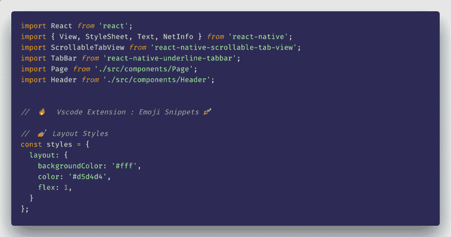

# vscode 上的 emoji🔥

> 原文:# t0]https://dev . to/pjijin/e moji-on-vscode-571 l

表情符号片段帮助开发者在文件上插入表情符号。您可以在注释或代码的其他部分插入表情符号。

有了这个扩展，你可以美化你的评论😉

视觉代码扩展
https://marketplace.visualstudio.com/items?[itemName = devzstudio . e moji-snippets](https://marketplace.visualstudio.com/items?itemName=devzstudio.emoji-snippets)

Visual Studio 代码的扩展——在你的 Vscode 文件中插入表情符号
marketplace.visualstudio.com
T2】🚀用法:

1)在可视代码上安装表情代码片段扩展

2)当你想插入表情符号时，只需输入:关键字，然后它会提示与该关键字相关的表情符号。你可以使用来自[https://emojipedia.org/](https://emojipedia.org/)的表情符号，只需输入:然后输入表情符号的名称。

捐助🎉

[https://github.com/Devzstudio/Vscode-Emoji-Snippets](https://github.com/Devzstudio/Vscode-Emoji-Snippets)