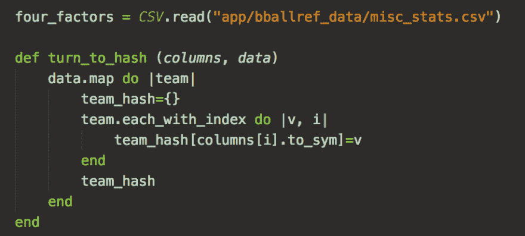
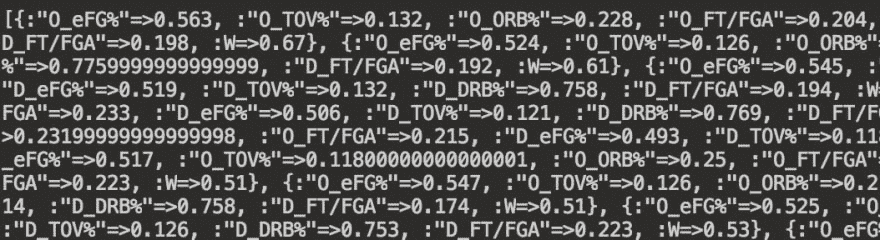
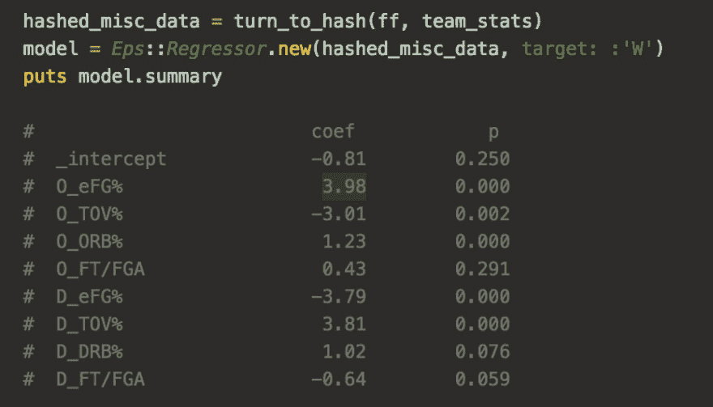

# Ruby 中的 Moneyball 对一个简单的统计驱动模型的首次尝试

> 原文：<https://dev.to/loganwohlers/moneyball-in-ruby--a-first-attempt-at-a-bare-bones-stat-drivenmodel-alp>

<figure>

<figcaption>Credit- ESPN</figcaption>

</figure>

我一直对预测建模和统计学感兴趣。在进入编码领域之前，我学的是金融——所以我接触过许多统计概念，但主要是通过投资组合理论的视角。然而，对大多数人(包括我自己)来说，统计数据和它们的重要性通过体育世界来更好地消化。特别是篮球，仍然处于分析革命的中心——先进的统计数据比以往任何时候都更容易获得。一段时间以来，我一直有在脑海中创建某种模型的想法——但在此之前，我只能使用 excel 构建一些东西——这不会像试图用实际代码构建一些东西那样令人满意。既然我已经可以为第一篇文章写代码了，我决定看看我能在 Ruby 中从头开始做些什么，从找到篮球方面的统计框架开始，然后看看我是否能在一个程序中重新创建一些类似的东西。

那么，哪些统计数据对团队成功的预测特别有用呢？有没有市场没有考虑到的低效率？显然，这个问题有无限的深度，所以首先我想看看我是否能找到某种普遍接受的框架，对于像我这样不完全精通高级统计学的人来说，这个框架不会太难理解。我偶然发现了迪安·奥利弗的篮球成功的四个因素(你可以在这里读到更多:[https://www.basketball-reference.com/about/factors.html](https://www.basketball-reference.com/about/factors.html))。

这四个因素分解了篮球比赛获胜的四个方面。这些因素是:

投篮(40%)实测 w/ eFG%
失误(25%)-实测 w/ TOV%
篮板(20%)-实测 w/ ORB%和 DRB%
罚球(15%)-由 FT/FGA 计算的比率

(注意——“四个”因素实际上由八个不同的统计数据组成——针对进攻/防守进行测量。防守篮板(DRB%)是进攻/防守之间唯一明显不同的属性

有了这个框架，下一步就是实际获取一些数据。我找不到一个免费的 API 来提供我正在寻找的所有数据，所以我转向篮球参考([https://www . Basketball-Reference . com/)-](https://www.basketball-reference.com/)-)的数据，这是一个惊人的资源，包含了你能想到的 50 多年前的所有数据。更好的是——它们实际上提供了一个杂项统计表，专门包括这四个因素。我将表导出为 CSV 格式，并读入 Ruby——同时创建一个方法，从表中提取列标题，并使用它们创建所有统计信息及其标签的散列。

<figure>

<figcaption>Helper method for breaking down CSV table into a relavent hash</figcaption>

</figure>

那么这些数据是如何建模的呢？我们能测试这四个因素实际上是否是看待游戏如何获胜的一种合理方式吗？我要在这里重申，我绝不是一个统计学家——所以我再次在互联网上寻找这四个因素在起作用的例子——并看到了另一个博客，它展示了统计分析中使用的一些数学方法(所有这些都归功于贾斯汀·雅各布斯[https://squared 2020 . com/2017/09/05/introduction-to-olivers-four-factors/](https://squared2020.com/2017/09/05/introduction-to-olivers-four-factors/))。这篇文章提供了一个很好的例子，说明如何通过线性回归来尝试和使用数据，以模拟因素和团队总胜率之间的关系。有了从哪里获取数据的想法之后，我试着在 Ruby 中复制结果。

<figure>

<figcaption>Matrix-like code of the stats w/in the hash</figcaption>

</figure>

首先，我拉了一张新表，使用 2016-17 赛季所有球队的数据，这样我就可以将我的结果与贾斯汀的博客进行比较。我将哈希中的数据剥离出来，只剩下与这四个因素相关的数据——同时添加了赢得总数的数据——然后我找到了一个名为“eps”的宝石([https://github.com/ankane/eps](https://github.com/ankane/eps))，它可以让我在 Ruby 中执行线性回归。我使用 wins 作为因变量对我的散列进行回归，得出的数据与 Justin 的数据几乎相同(由于使用的数据略有不同，所以略有差异)。总结结果——所有的系数都指向正确的方向(即进攻得分对胜场产生积极影响，失误对胜场产生消极影响), r 为 0.896——表明这四个因素与球队的总胜场之间有很高的相关性(认真地说——如果你对此感兴趣，请阅读博客文章，以获得更全面的描述，并显示图表和数学数据——但最重要的部分是，该模型能够准确地反映现实！

<figure>

<figcaption>running the regression on the four-factors hash with resulting coefficients</figcaption>

</figure>

最后总结一下我的一些想法:

像这样深入到统计的世界中，看到即使是最“简单”的统计和框架也能深入到什么程度，真是令人羞愧。这些分析的现实很像股票市场——每个人都在寻找任何低效之处——无论是团队分析部门的人决定团队的选秀权，还是专业人士更好地寻找机会。就像编码/开发一样，这是那些感觉无限深入的主题之一——但试图弥合差距，并用我自己的代码将模型变为现实非常有趣——更好的是还有改进的空间——即使只是我构建的这个小东西。从现在起的几个星期后，我会回顾这一点，并能够做更多的事情。

我不认为我是下一个比利·比恩——我当然不会把任何钱押在这个模型吐出来的东西上(它甚至什么都不做！)——但像这样收集统计数据并加以利用，肯定是我计划在未来更多努力的事情。就在这个练习中，我遇到了这么多我想学习和实现的新概念(即机器学习)。但是那是以后的事了——我肯定会在最近几周内重新审视这个问题，并准备好改进。

感谢阅读，并请分享任何反馈！

洛根