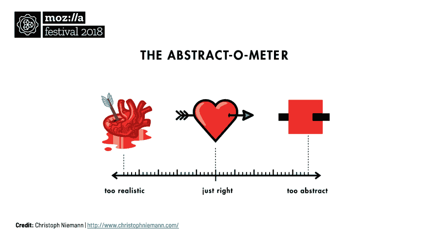
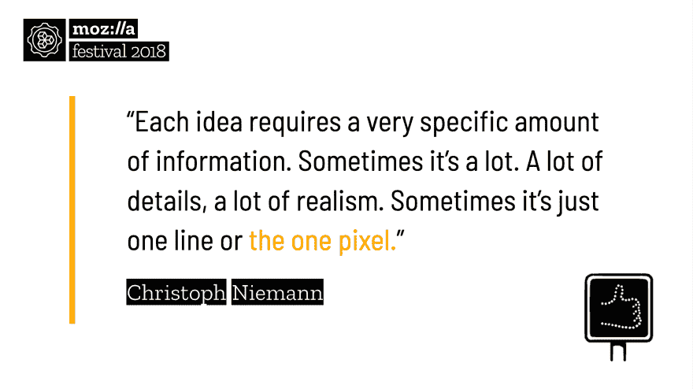
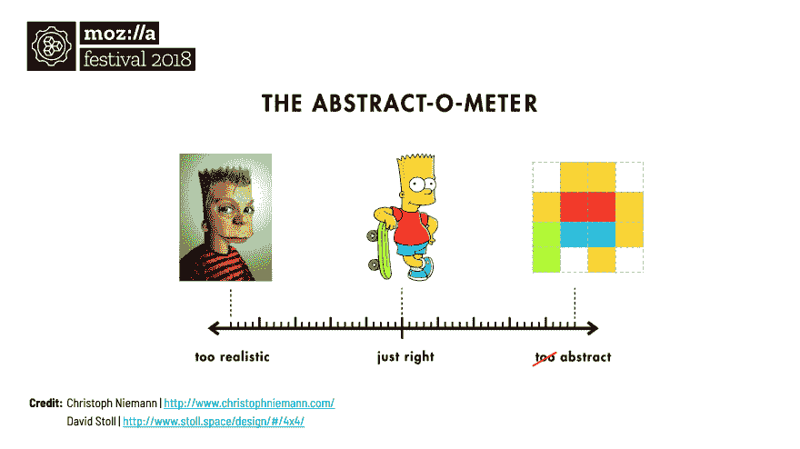
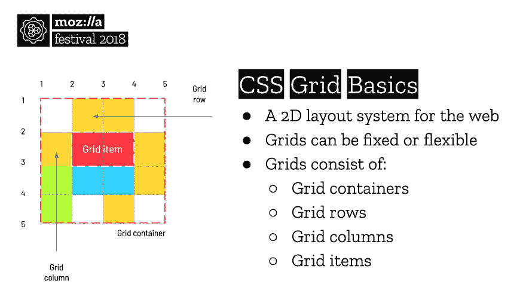

# 摘要:CSS 网格的艺术

> 原文：<https://dev.to/danielharding/abstract-the-art-of-css-grid-5ddd>

*本文基于 MozFest 2018 上的一篇演讲。完整的幻灯片可以在 tinyurl.com/mozfestslides 的[找到。](http://tinyurl.com/mozfestgridslides)*

我看了很多网飞的电影。与大多数流媒体服务一样，一旦你最初签约的系列节目结束，你不可避免地会开始搜索其他看起来有点有趣的节目。多年来，这让我发现了一些我最喜欢的节目，这也是我如何偶然发现 [*摘要:设计的艺术*](https://www.netflix.com/gb/title/80057883) 。

第一集从克里斯托弗·尼曼开始。一位插图画家、艺术家和作家，他的作品你可能已经认识了。它几乎涵盖了所有类型，从增强现实杂志封面到国家地理探险。但是它和学习编码有什么共同之处呢？在这一点上，不多。

当你进入这一集时，Christoph 开始解释他的创作过程和抽象的重要性。尽管他的作品集包括一些错综复杂的细节作品，但他强调艺术很少需要大量信息。事实上，不必要的细节往往会削弱最初的想法。他用“抽象 o-米”证明了这一点。

<figure>

<figcaption>The concept of love illustrated via Christoph Niemann's 'Abstract-o-meter'.</figcaption>

</figure>

Christoph 为了证明他的理论花费了相当大的力气，反复地将复杂的图像分解成简单的色块，同时以某种方式保留它们的特性。他在《我在乐高纽约》和《T2》中对纽约的致敬是两个突出的例子。但正是他的下一个评论激发了一个想法，即抽象可能会为编码提供一条更具创造性的途径。

我的前端开发之旅与大多数类似，由无尽的视频教程、偶尔的测验和小项目组成。过了一段时间，这变得令人难以置信的乏味，所以如果有一个不同的方法呢？鼓励想象力、强调制作和证明学习的东西？在一些不知情的 MozFest 参与者的帮助下，我决定测试这个理论。

我开了一个 1 小时的研讨会，这是我以前从未做过的事情，出乎我意料的是，我被接受了。这个想法是用流行电影、卡通和电视连续剧中的人物来代替克里斯托弗的例子，看看他们是否能在没有看到原著的情况下被认出来。如果有效，我会用抽象图像来教授前端开发的一个方面；一个在现实世界中可以应用的基本概念。该会议将被称为“创造性的 CSS 网格编码”。

<figure> 

<figcaption>根据克里斯托夫·尼曼的《抽象格律》巴特·辛普森的三个阶段。</figcaption>

</figure>

多亏了大卫·斯托尔的一个项目，谷歌快速搜索返回了一些完美的像素化的例子。为了帮助将 David 的创作转化为 CSS 和 HTML，一系列工作表将解释基本语法，并提供如何使用离线或在线工具“构建”每个角色的分步说明。该课程被宣传为对初学者友好，要求很少或没有以前的编码知识。

在改变房间以容纳额外的与会者后，给出了相同的解释，并再次测试了该理论。随着大多数人认识到这些字符，我们很快进入了热身练习，最后是工作表。大多数人选择现场编写示例，有经验的开发人员愉快地与代码新手一起解决每个小难题。

液体错误:内部

激起了他们的兴趣，最后一步是演示一些 CSS Grid 的真实例子，并展示创建一个 8 位巴特·辛普森与构建一个 web 布局没有什么不同。反馈是非常积极的，看到人们带着对创造性编码的新的热情离开会议是值得的。

液体错误:内部

想自己试试工作表吗？教师包可以在 tinyurl.com/mozfestgridworksheets 找到。所有材料均作为开放教育资源制作，并根据 [CC BY-SA 4.0](https://creativecommons.org/licenses/by-sa/4.0/) 获得许可。

玩得开心！🎨