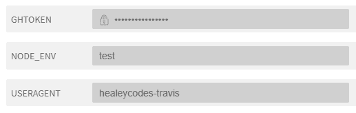

# 根据项目的心情创建可爱的 GitHub 徽章(Node.js)

> 原文：<https://dev.to/healeycodes/creating-cute-github-badges-based-off-a-projects-mood-nodejs-59c>

这个星期天，我开发了一个 API，它基于一个项目的情绪创建了一个 GitHub 徽章。情绪意味着一天中存储库工作的平均时间。我发现我在一天的不同时间做不同的项目。早上，我倾向于后端集中存储库。可能是咖啡的原因？☕

GitHub 徽章可以由库动态生成，也可以通过第三方服务如 [shields.io](https://shields.io) 生成。对于[项目情绪](https://github.com/healeycodes/project-mood)，我们使用[GH-badges](https://www.npmjs.com/package/gh-badges)——一个 npm 包。下面是徽章的制作过程。

```
const bf = new BadgeFactory();

// ... 

// Customize badge
const format = {
    text: ['project mood', timeOfDay],
    colorA: '#555',
    colorB: color,
    template: 'flat',
}

// Create SVG/add title
const title = `average commit: ${parseInt(average)}:${parseInt((average % 1) * 60)}`;
const svg = bf.create(format).replace(/>/, `>${title}`); 
```

这是一个原型，并且这个库不允许自定义属性，所以我们用一个正则表达式替换来插入标题。我们提供的唯一路线是`/:owner/:repo.svg`，例如:`/healeycodes/project-mood.svg`。使用 Express，SVG 可以像字符串一样被发送回来。

```
return res
    .status(200)
    .send(svg)
    .end(); 
```

这些标记的颜色是通过扫描最近的提交并找到一天中的平均时间来决定的。GitHub API 需要一个用户代理和一个[个人访问令牌](https://github.com/settings/tokens)。我们用 map/reduce 处理提交。JavaScript 的`Date`对时区修正反应良好。

```
// Options for the request call
const options = {
    url: `${api}repos/${req.params.owner}/${req.params.repo}/commits?${token}`,
    headers: {
        'User-Agent': process.env.USERAGENT
    }
};

// ...

// As part of the request callback, commits are scanned
const times = json.map(item => item.commit.author.date);
const average = times.reduce((sum, time) => {
    const d = new Date(time);
    const hours = d.getHours() + (d.getMinutes() / 60) + (d.getSeconds() / 60 / 60);
    return hours + sum;
}, 0) / times.length; 
```

在现代电脑上生成一个徽章大约需要 0.75 毫秒，这包括我们的标题插入方法。由于没有被管理的状态，这个项目将很好地响应水平伸缩。然而，路线图描述了一些无需花钱就能管理规模的方法。

```
🚗🚗🚗

- Caching:
    - Repositories should be scanned infrequently rather than per request.
    - We can store the most recently requested SVGs in memory.
    - Basically, don't generate the SVG for every request (which is used for the prototype).
- Blended colors depending on average time rather than fixed colors. 
```

没有测试的项目是不完整的！由云构建执行的简单测试计划是我在开发过程中最喜欢的标记之一。对于[项目情绪](https://github.com/healeycodes/project-mood)，摩卡和 SuperTest 搭配 Travis CI。当`NODE_ENV`设置为“测试”时，快速应用程序被导出。

```
if (process.env.NODE_ENV === 'test') {
    module.exports = app;
} else {
    const PORT = process.env.PORT || 8080;
    app.listen(PORT, () => {
        console.log(`App listening on port ${PORT}`);
        console.log('Press Ctrl+C to quit.');
    });
} 
```

这允许我们将它导入到将由`npm test`调用的`app.test.js`中。正在使用的其他环境值是 GitHub API 所需的`USERAGENT`，以及`GHTOKEN`。后者被 Travis CI 设置为隐藏，这样公共构建就不会泄露秘密。

[](https://res.cloudinary.com/practicaldev/image/fetch/s--gEiUkZUn--/c_limit%2Cf_auto%2Cfl_progressive%2Cq_auto%2Cw_880/https://thepracticaldev.s3.amazonaws.com/i/jk4f14j4bab2g4oucluk.png)

可爱的测试之一。

```
// Entry - "mocha test/app.test.js --exit"

const request = require('supertest');
const app = require('../app');
const assert = require('assert');

/**
 * Test SVG request
 */
describe('GET /healeycodes/project-mood', () => {
    it('responds with an SVG', (done) => {
        request(app)
            .get('/healeycodes/project-mood.svg')
            .expect((res) => {
                // SVG XML Namespace
                assert(res.text.match(/http:\/\/www.w3.org\/2000\/svg/gmi) !== null);
                // Error message not present
                assert(res.text.match(/unknown/gmi) === null);
            })
            .expect(200, done);
    });
}); 
```

##  [ healeycodes ](https://github.com/healeycodes) / [项目-心情](https://github.com/healeycodes/project-mood)

### Node.js API，用于根据存储库的心情生成 GitHub 徽章🌸🔵☀️🌃

<article class="markdown-body entry-content container-lg" itemprop="text">

[](https://travis-ci.org/healeycodes/project-mood)

## 项目情绪

通过将图像标记标签指向`/:owner/:repo.svg`来创建工卡，例如`/healeycodes/project-mood.svg`。该 API 适用于任何公共存储库。

使用 GitHub API 扫描 Git 提交，根据平均提交时间创建动态标记。

SVG 将通过内部 SVG 标签``将平均提交时间作为悬停文本。

| [](https://github.com/healeycodes/project-mood/blob/master/samples/project%20mood-morning.svg) | [](https://github.com/healeycodes/project-mood/blob/master/samples/project%20mood-day-time.svg) | [](https://github.com/healeycodes/project-mood/blob/master/samples/project%20mood-twilight.svg) | [](https://github.com/healeycodes/project-mood/blob/master/samples/project%20mood-night-time.svg) |
| --- | --- | --- | --- |

### 路线图<g-emoji class="g-emoji" alias="car" fallback-src="https://github.githubassets.cimg/icons/emoji/unicode/1f697.png">🚗</g-emoji>

如果我继续从事这项工作，这些是需要解决的问题:

*   贮藏
    *   应该不经常扫描存储库，而不是每次请求都扫描。
    *   我们可以在内存中存储最近请求的 SVG。
    *   基本上，不要为每个请求生成 SVG(用于原型)。
*   取决于平均时间的混合颜色，而不是固定的颜色。

### 安装

`npm i`

### 证明

为了运行和测试，将`GHTOKEN`设置为您的 GitHub [个人访问令牌](https://github.com/settings/tokens)，将`USERAGENT`设置为自定义用户代理(GitHub 需要)。

### 奔跑

(可选)设置端口…

</article>

[View on GitHub](https://github.com/healeycodes/project-mood)

💬用于投诉的 twitter/healeycodes

* * *

加入我的关于编程和个人成长的[时事通讯](https://buttondown.email/healeycodes)的 150 多人注册！

我发关于科技的微博。