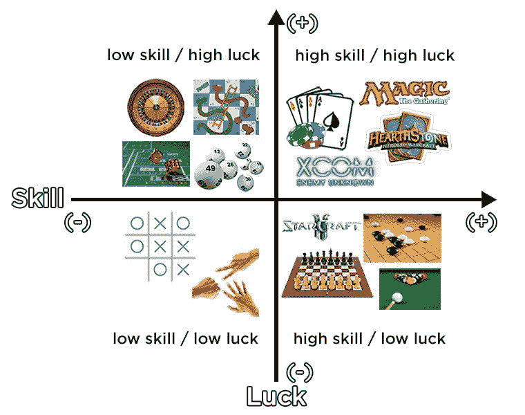
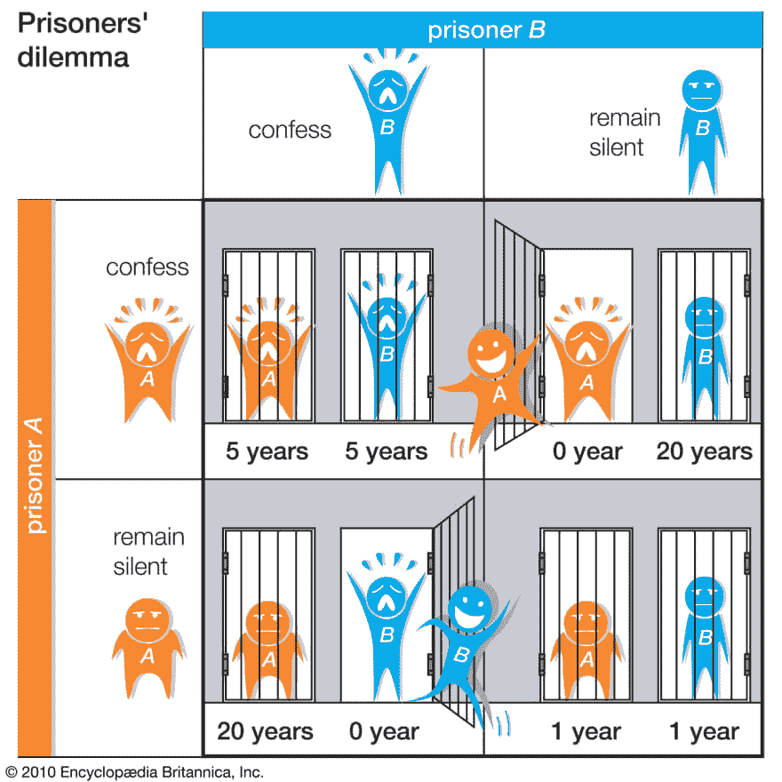

# 将博弈论应用到你的应用中

> 原文：<https://dev.to/scottslatton/applying-game-theory-to-your-app-5337>

博弈论就是为你的用户创造规则、激励和回报。玩家需要知道整个游戏的目标是什么，以及他们可以采取什么行动来进一步实现这个目标。从技术上讲，博弈论是应用数学的一个分支，它融合了数学和行为经济学，以分析和开发考虑玩家选择的竞争情况和系统的策略。博弈论中的参与者可以是系统中的任何积极参与者，无论是单个用户、一群人还是一个国家。作为开发人员，我们可以利用这种思想来丰富我们的应用程序，使其包含更多引人入胜的用户交互性。

博弈论最初是由数学家约翰·冯·诺依曼和普林斯顿大学的经济学家奥斯卡·莫根施特恩开发的，用来解决经济学中的问题。在 1944 年出版的《博弈论与经济行为》一书中，诺伊曼和摩根斯坦断言，为物理科学发展起来的当代数学是经济学的拙劣模型。他们观察到，经济学很像一场游戏，参与者预测彼此的行动，因此需要一种新的数学，他们称之为博弈论。重要的是要注意，没有单一的整体“资本 G”博弈论，因为大量的情况和系统落入其保护伞下。虽然博弈论被用来识别已经存在的系统，但我们可以用它来实现我们自己设计的系统。

我要重点介绍的游戏系统的特点是:

-玩家
-规则
-技能和运气
-激励
-收益

**玩家**

正如我之前所说，玩家是游戏系统中的任何参与者，但是玩家的数量很重要，尤其是当一个玩家的行为影响到另一个玩家的行为时。例如，这可以在社交媒体中看到，标签变得流行或流行，内容创作者看到周围正在分享的内容，并改变他们的内容以反映他们的观众想要看到的内容。

规则
我将谈论与软件应用的总体目标相关的博弈论，对于一个游戏来说，这个目标将是玩家的乐趣。然而，对于一个社交媒体应用程序来说，一个游戏系统可以应用于你的用户内容如何被分享。在软件中，玩家可以做的事情和他们采取的行动的可能性似乎是无穷无尽的…这是因为作为开发者，我们知道我们可以做几乎任何我们想做的事情。所以在设计过程的开始就建立宽松的规则是很重要的，比如玩家的数量，游戏本身的动机和目标。这里的关键词是“宽松”,因为我们不想陷入一种思维定势，认为一切都是固定不变的。原因在于，在实现系统的过程中，几乎不可避免的是，为了服务于总体目标，事情需要被修改或改变。

**技能和运气**

这是我最喜欢的实现系统的部分之一，因为这是在类似视频游戏的东西中调整交互性的地方。这个概念在娱乐游戏之外确实有它的位置。以 Vine 为例:一个从 Twitter 衍生出来的平台，你试图让一个 7 秒钟的剪辑像病毒一样传播。它有一个明确的目标，但为了让你的视频像病毒一样传播，需要天赋(编辑、写作和时机)和运气(在一天中的某个时间发布，以便大多数人都能看到)。增加执行动作的难度或影响另一个玩家会导致玩家感到参与但也感到沮丧。这种挫折感可能是一种非常强大的情绪，让人们不再使用你的服务，所以你可以用运气作为阴来培养阳。通过提供运气，你可以给玩家一个借口，解释为什么他们输掉了一场零和游戏，或者为什么他们的葡萄树没有出现在全国新闻上(不应该在午夜发布)，从而减轻对他们自尊心的打击。

**激励和回报**

激励和回报回答了“为什么我应该？”用户可能会问的问题。激励就是诱使玩家执行一个动作，比如喜欢一个帖子、发表评论或者简单的让玩家继续玩游戏。回报是对这些行为的反馈，可以是积极的，也可以是消极的。收益决定了玩家是否会再次采取行动。

**零和与非零和博弈**

上图展示了囚徒困境，在这种困境中，如果每个囚徒都出卖了另一个囚徒，那么他们都会受益。这个好处只有在对方囚犯保持沉默的情况下才能获得。然而，如果犯人合作，保持沉默并接受较轻的判决，总体来说会更有利。这是非零博弈的一个例子，因为二十年、五年或一年的结果总是大于(或小于)零。

零和游戏有一个固定的、有限的资源集合，因此为了赢得游戏，你必须从你的对手那里拿走资源，这将导致他们的净损失。零和游戏的一个例子是扑克。将净损失和赢款相加将得出结果 0，因此得名。

**完美和不完美信息博弈**

在完全信息博弈中，参与者知道所有的规则，可以做的任何动作，以及所有这些动作的历史(即使他们不记得)。这些是传统的棋盘游戏，像国际象棋和跳棋。这些游戏也可以被计算机破解，通过观察对手行动的概率和他们自己的后果来确定最佳的整体决策。不完全信息博弈则相反，有些信息对参与者保密。你今天玩的大多数游戏都属于这一类。算法可以接受变量值，变一些魔术，然后吐出一个玩家可能并不想要的结果。

不管程序最初设计的意图是什么，游戏几乎可以由任何东西组成。最近，我偶然在 Twitter 上看到一个极速跑者的帖子，他试图尽可能快地让 Windows 95 崩溃。这也是为什么考虑用户可能怀有的动机和你提供给他们的行动很重要的另一个原因。

现在你知道了游戏的各个部分，你可以分析当前的系统，并将这些概念应用到你自己的开发中。增加一个激励，让用户与其他玩家或你的应用程序本身互动。让每天使用你的网站变得有意义，如果你发现当你测试的时候，你的程序感觉枯燥，也许看看你能增加什么交互性。