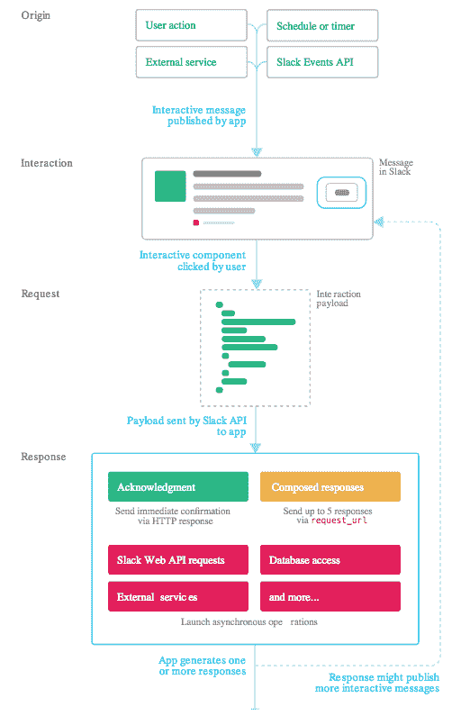
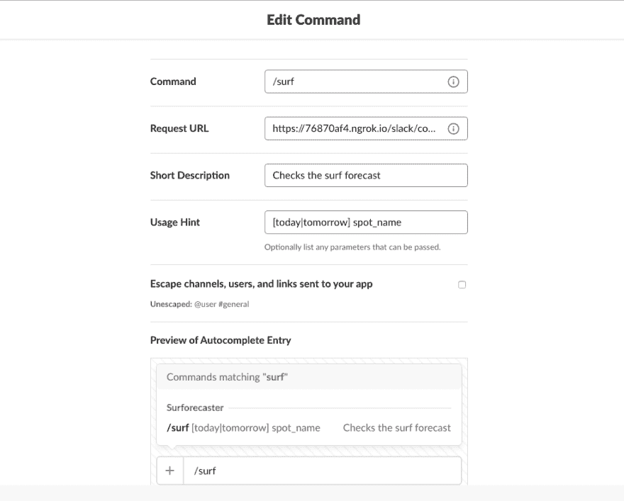
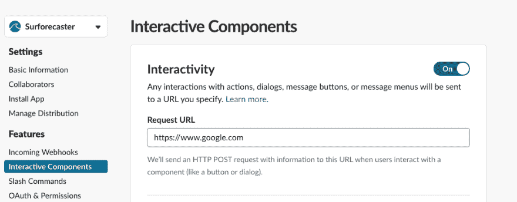
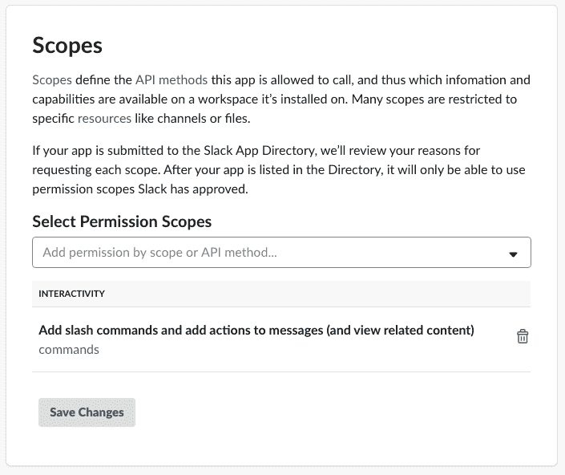
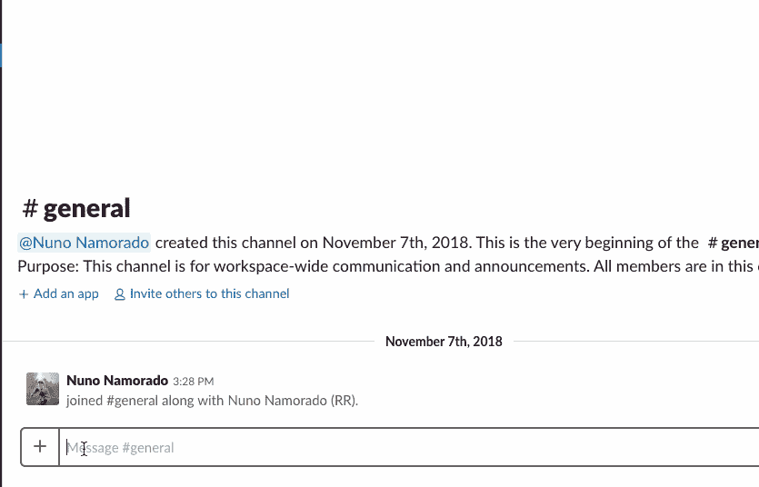
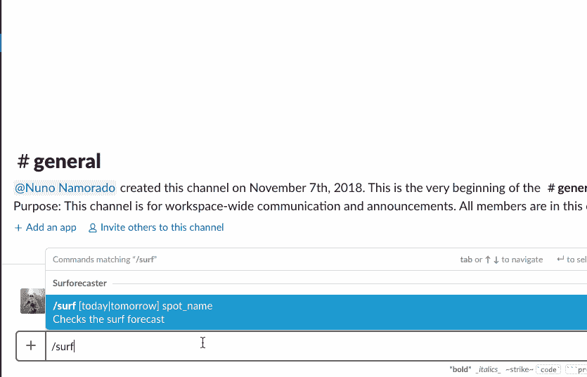

# 使用 Ruby 和 Sinatra 构建 Slack 应用程序

> 原文：<https://dev.to/runtime-revolution/building-a-slack-app-using-ruby-and-sinatra-2ie4>

<figure>[](https://res.cloudinary.com/practicaldev/image/fetch/s--DhJGGgFA--/c_limit%2Cf_auto%2Cfl_progressive%2Cq_auto%2Cw_880/https://cdn-images-1.medium.com/max/1024/0%2A10lZcKeJOYAjJbW9) 

<figcaption>照片由 [Morre Christophe](https://unsplash.com/@morrec?utm_source=medium&utm_medium=referral) 上 [Unsplash](https://unsplash.com?utm_source=medium&utm_medium=referral)</figcaption>

</figure>

我的团队在运行时革命中使用内部应用程序进行团队管理和其他日常工作。最近，我被要求将 Slack 的斜线命令 整合到其中。

作为 Ruby 的新手，我带着更多的动力和驱动力接受了挑战。这是提高我的 Ruby 技能的一个很好的辅助项目。

从一开始，我就想创建一个小的独立应用程序，可以很容易地与我们现有的 Rails 应用程序集成。现在有一些 web 框架。一些提供类似 Rails 的功能，**和* [*Padrino*](http://padrinorb.com/) 等等。然而，没有一个能提供辛纳特拉*所暗示的小尺寸和模块化。所以我选择了辛纳屈。**

 **Sinatra 提供了一个简单而强大的 DSL，可以轻松地创建 web 应用程序。使用社区创建的模块，我们能够快速构建一个具有认证、日志等功能的成熟 API 服务器。或者用于其他 Ruby 应用程序或服务的小型 HTTP 模块。

在本文中，我将:

1.  简要概述*斜线命令*和*动作*，以及交互消息背后的概念；
2.  指导您创建和配置 Slack 应用程序；
3.  构建一个“冲浪预测”Sinatra 应用程序，用于接收和发送空闲消息；
4.  展示如何使用 Heroku 服务部署应用程序或将其嵌入到 Rails 应用程序中。

### 1。斜线命令和动作

Slack 应用可以做的不仅仅是发送简单的短信。使用*斜杠命令*和*交互组件*(按钮、菜单、日期选择器、弹出窗口等。)，应用程序能够有效地创建更具吸引力的体验。

下图提供了使用交互式消息的典型流程的基本轮廓。注意，交互可以由 Slack 提供的 API 中的各种来源触发。

<figure>[](https://res.cloudinary.com/practicaldev/image/fetch/s--K6QxRn0Z--/c_limit%2Cf_auto%2Cfl_progressive%2Cq_auto%2Cw_880/https://cdn-images-1.medium.com/max/512/1%2A7sqqRAtDN49QUDkuMlhQuA.png) 

<figcaption>松弛交互概述。取自[延期单据](https://api.slack.com/messaging/interactivity)。</figcaption>

</figure>

在本文的上下文中，起点是由 command_ 触发的用户操作。_ 该应用程序将发送一个包含按钮的丰富信息，允许用户选择几个呈现的结果之一。

当提到动作时，Slack API 文档可能有些混乱，因为几乎所有的东西都是动作。然而，当涉及到配置 Slack 应用程序时，正如我们将进一步看到的，在*斜杠命令*和*交互组件之间有一个清晰的分离。*

*   **什么是*斜线命令？*T3】**

*斜线命令，*顾名思义，是用户可以通过在命令名称前写/来执行的命令。一个已知的例子是/remind。

Slack 应用可以注册新的 Slash 命令，该命令将指示 Slack 向接收服务器发送 HTTP POST 请求。应用服务器将相应地采取行动。

> **注意:**字符串 */ <名称>* 是命令的标识，其后的所有单词将是命令参数。

*   **什么是*动作？*T3】**

动作是当用户选择[菜单动作](https://api.slack.com/actions)或点击消息上的任何交互元素(按钮、选择、日期选择器等)时触发的事件。).Slack 应用程序可以在*交互组件*页面中注册多达 5 个动作，或者如果它们在消息中使用交互元素，则可以有无限个动作。

每个动作都由其各自的 *callback_id、*来标识，并且每次用户触发一个动作时，不同的 HTTP POST 将被发送到接收服务器。

### 2。创建和配置 Slack 应用程序

在创建用于发送和接收交互式消息的 Slack 应用程序时，有几件事情需要考虑。我们必须设置特定的授权许可，激活*交互组件*特性，并配置*斜线命令。*

#### 2.1。创建应用程序

导航到[https://api.slack.com/apps](https://api.slack.com/apps)并按下“*创建新应用”*按钮。添加一个名称，并将其分配到您选择的工作区。

#### 2.2。配置斜杠命令

创建好 app 后，进入*斜杠命令*页面，按“*创建新命令*”。填写表格。用一个虚拟 URL 设置*请求 URL* ，我们稍后会回到这个页面。

<figure>[](https://res.cloudinary.com/practicaldev/image/fetch/s--yK8D3SR8--/c_limit%2Cf_auto%2Cfl_progressive%2Cq_auto%2Cw_880/https://cdn-images-1.medium.com/max/983/1%2AQioZF-Wdui3SVT8-9xgtvg.png) 

<figcaption>命令形式</figcaption>

</figure>

#### 2.3。激活交互式组件

转到*交互组件*页面，打开该功能。同样，用一个虚拟 URL 设置*请求 URL* 。这将在以后用实际的端点进行更新。点击底部的“保存更改”。

<figure>[](https://res.cloudinary.com/practicaldev/image/fetch/s--1p0Zk53y--/c_limit%2Cf_auto%2Cfl_progressive%2Cq_auto%2Cw_880/https://cdn-images-1.medium.com/max/998/1%2AqSx3UUdWaXGmVDpEq4Kauw.png) 

<figcaption>交互组件配置</figcaption>

</figure>

#### 2.4。设置权限

进入*OAuth&Permissions*page _，_ 在 Scopes 部分，搜索“**Add slash commands and Add actions to messages(并查看相关内容)**”并保存。

<figure>[](https://res.cloudinary.com/practicaldev/image/fetch/s--y7rV4-qN--/c_limit%2Cf_auto%2Cfl_progressive%2Cq_auto%2Cw_880/https://cdn-images-1.medium.com/max/705/1%2AnlQLIqqxS86GXp1KlhL_1A.png) 

<figcaption>App 权限</figcaption>

</figure>

#### 2.5。安装

完成前面的步骤后，我们就可以在所选的工作空间中安装应用程序了。进入*安装 App* 页面，触发安装。

### 3。构建应用程序

我们将构建一个应用程序，它将为我们提供世界上给定地方的当前冲浪预报。我们将使用 [Windguru 的网站](https://www.windguru.cz/1060)来汇编必要的信息。为了增加乐趣，让我们还包括该地点的位置图，这样更容易解释变量给出的信息。为此，我们将使用 [Mapbox 的静态地图 API](https://docs.mapbox.com/api/maps/#static) 。

> **注**:
> 
> 在创建本文和编写示例应用程序的过程中，我发现了一些处理和发送 Slack 消息的常见行为。因此，我决定创建一个简单的 Sinatra 模块，并将其作为一个 gem ( [sinatra-slack](https://github.com/nunonamorado/sinatra-slack) )提供。所有显示的例子都使用这种宝石。

#### 3.1。相互作用

该应用程序将有两种类型的互动:

1.  例如，用户使用命令/surf today carcavelos 来检索预测信息。如果所提供的变量 *spot_name* 足以精确定位所需的冲浪地点，则将预测返回给用户。
2.  如果在第一次互动中，搜索结果是不明确的，应用程序将发送一条带有多个按钮的消息，每个冲浪点结果一个按钮，最多 5 个。这将允许用户继续流动。

<figure>[](https://res.cloudinary.com/practicaldev/image/fetch/s--plhVeTzx--/c_limit%2Cf_auto%2Cfl_progressive%2Cq_66%2Cw_880/https://cdn-images-1.medium.com/max/835/1%2AANzly1NRuP5hOJxYHEvkhg.gif) 

<figcaption>互动 1</figcaption>

</figure>

<figure>[](https://res.cloudinary.com/practicaldev/image/fetch/s--ctMGyyOM--/c_limit%2Cf_auto%2Cfl_progressive%2Cq_66%2Cw_880/https://cdn-images-1.medium.com/max/835/1%2A5azSmb5HsTcXeaMjF3d25A.gif) 

<figcaption>交互 2</figcaption>

</figure>

#### 3.2。要求

*   Ruby 环境配置正确；
*   repo 代码— [斜线命令条](https://github.com/nunonamorado/slash_command_article)；
*   带有已配置/surf 命令和已激活交互组件的工作 Slack 应用程序。
*   [ngrok tool](https://ngrok.com/download) 将所有 Slack 请求传输到您的本地开发环境。
*   [地图盒子账号](https://www.mapbox.com/)。

#### 3.3。地方发展

Slack 需要向有效的 HTTP 端点发送请求，所以我们必须使用 ngrok 设置一些 HTTP 转发。

从他们的网站下载工具，创建一个免费帐户。登录后，通过运行
启动转发请求

```
./ngrok http 3000 
```

这将启动服务器，现在您可以在您的开发机器上接收请求了。

回到 Slack App 的配置页面，在/surf 命令配置中将 ngrok 端点粘贴到*请求 URL* 输入中，并对*交互组件*部分做同样的操作。

最终的 URL 应该如下所示:

*   https://<ngrok-domain>/slack/命令</ngrok-domain>
*   https:// <ngrok-domain>/slack/actions</ngrok-domain>

#### 3.4。启动应用程序

在启动应用程序之前，设置环境变量

*   MAPBOX_API_TOKEN —在 [Mapbox 的账户页面](https://account.mapbox.com/)创建一个；
*   SLACK_SIGNING_SECRET —在*基本信息*页面中，从*凭证*部分复制秘密。

要么使用。env 文件或命令行，并通过运行
来启动应用程序

```
bundle exec rackup 
```

> **注意:**要用。env，安装 [dotenv](https://github.com/bkeepers/dotenv) 宝石。

#### 3.5。项目概述

S_urforecaster_ app 由以下文件组成:

*   app.rb —您的主应用程序文件。这是配置 Sinatra 应用程序的地方；
*   config.ru—这是机架配置文件；
*   lib/surforecaster.rb —从 Windguru 的 API 获取数据的帮助器类。

**app.rb**

下面的代码包含了一些相关部分的注释。但是，有几件事需要注意:

*   该类必须从 Sinatra::Base 继承；
*   要使用 Slack app 专用 DSL，请注册 Sinatra::Slack 模块；
*   所有来自 Slack 的请求都需要被验证。通过设置:slack_secret 选项，模块将验证发送到 commands_endpoint 和 actions_endpoint 的每个请求。有关时差验证过程的更多信息，[参见他们的文档](https://api.slack.com/docs/verifying-requests-from-slack)；
*   命令和操作定义中的 quick_reply 参数允许您设置服务器在收到命令或操作请求时将发送回 Slack 的文本。这不是必须的，但是让用户知道他们的请求已经被正确接收并且正在被处理是一个很好的做法。
*   在幕后，该模块使用 Sinatra::Async 来异步处理请求。Slack 要求所有的命令和动作请求都在 3 秒的时间间隔内得到响应，因此我们需要一种机制在后台处理更长任务的请求。然后，我们必须用 HTTP Post 响应原始请求中发送的 response_url。
*   命令和动作签名定义使用 Mustermann 字符串匹配定义。查看*命令*签名定义/surf *granularity :spot_name， ***** 允许以非贪婪的方式捕捉第一个字，将其余的字留给 *spot_name* 变量。要了解更多信息，请点击。**