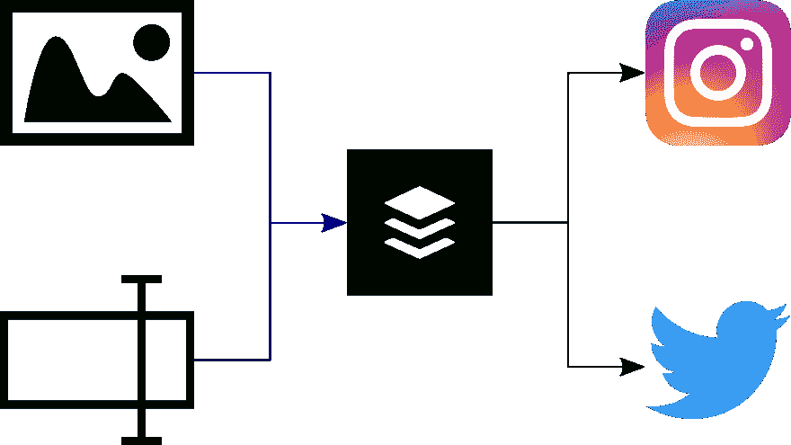
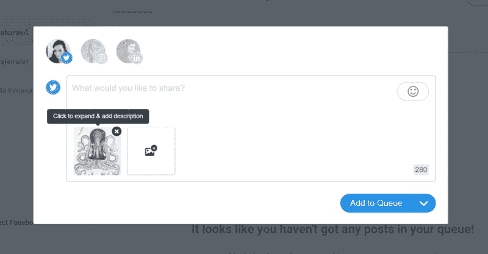
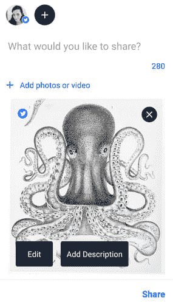

# 使用缓冲区设置图像描述

> 原文：<https://dev.to/juliaferraioli/using-buffer-to-set-image-descriptions-4921>

*这是从[我的博客](https://www.juliaferraioli.com/blog/2019/01/setting-image-descriptions/)交叉发布的。*

图像上的描述，也称为 [alt-text](https://en.wikipedia.org/wiki/Alt_attribute) ，对于使用屏幕阅读器或其他辅助技术阅读内容的人来说非常重要。屏幕阅读器合成屏幕上的文本，这使得盲人或视力低下的人能够与技术进行交互。然而，图像不能像文本一样“大声读出”，所以屏幕阅读器依赖于张贴图像的人通过替代文本设置描述，并合成该属性。

这曾经主要涉及到设计师和软件开发人员，他们会确保每个图像都有适当设置的替代文本，以便每个人都可以使用他们构建的内容。现在，许多网站严重依赖用户内容，这意味着网站把描述留给发布图片的用户。不幸的是，提供这些描述并不总是很容易被发现——如果可能的话。

**My typical flow to share images and setting alt-text**

我越来越依赖于 [buffer](https://buffer.com) 来为不同的站点提供替代文本。这让我可以通过 API ( [Twitter](https://developer.twitter.com/en/docs/media/upload-media/api-reference/post-media-metadata-create) )为允许描述的服务设置描述，同时将描述分享给不允许描述的服务(Instagram、LinkedIn)。如果共享一个链接，它也能让我选择文章中使用的图片，*和*也提供了替代文本。

实际上弄清楚*如何*输入描述在桌面上并不容易被发现。您必须将鼠标悬停在图像上才能获得“添加描述”选项:

**Adding image descriptions in a browser**

我更喜欢移动体验，因为添加描述的选项清晰可见:

**Adding image descriptions in the app**

这就是*如何使用 buffer 设置 alt-text，但是 alt-text 实际上应该是什么呢？网上有很多指导，但是[这个网站解释了一些制作文本本身的最佳实践](https://support.siteimprove.com/hc/en-gb/articles/115000013031-Accessibility-Image-Alt-text-best-practices)。我的经验法则是:*

 **   简洁:替代文本将由屏幕阅读器大声读出
*   以对等为目标:传达你期望用户从图片中收集到的相同信息
*   它不是标题:替代文本应该提供信息，而不是评论

希望这能给你一个策略，让你的社交内容易于访问。我会祈祷更多的平台会增加对设置 alt-text 的支持，不仅仅是在用户界面上，也在 API 中，这样像 [buffer](https://buffer.com) 这样的集成就可以利用它们。向前去描述一下！*