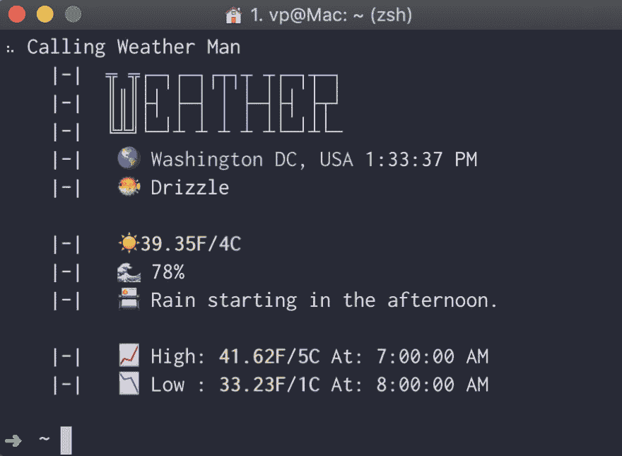

# 构建天气预报 CLI 工具第 1 部分

> 原文：<https://dev.to/vaidotas/building-weather-forecast-cli-tool-part-1-2mdj>

[](https://res.cloudinary.com/practicaldev/image/fetch/s--39KDMIgT--/c_limit%2Cf_auto%2Cfl_progressive%2Cq_auto%2Cw_880/https://thepracticaldev.s3.amazonaws.com/i/w32hvyuoewtfii1eia9h.png)

## 目标和设置

我们的目标是建立一个 CLI 天气预报应用程序，显示当地的天气信息。

免责声明:

*   这将是一个循序渐进的指南，目标是对构建 CLI 工具感兴趣的初学者，并在此过程中不断学习
*   现有的天气 CLI 工具功能齐全且健壮:[https://github.com/chubin/wttr.in](https://github.com/chubin/wttr.in)，[https://github.com/genuinetools/weather](https://github.com/genuinetools/weather)。本指南并没有接近特性的完成，它只是提供了一个介绍
*   如果你注意到任何错误或有建议，请在下面的评论中告诉我。我还在学！

让我们开始吧。

## 对我们 app 的要求

*   用户可以通过一个命令“weather-cli”调用 weather CLI 工具
*   用户可以通过命令行设置 API 键(我们将为天气使用 Darksky API)
*   用户可以看到以下信息:时间，位置，温度，当天的高温，当天的低温，湿度和天气状况总结

## 我们将使用的工具

*   节点-它将运行我们的程序
*   Typescript -除了学习一点 Typescript 之外，没有什么特别的原因:)
*   指挥官([https://www.npmjs.com/package/commander](https://www.npmjs.com/package/commander))-这是一个伟大的解决方案，帮助我们建立基于节点的 CLI 的。

## 步骤 A-程序初始化

让我们开始设置。

```
mkdir cli-weather //let's create a directory to work in
npm init --yes //initialize project and skip the typical questionnaire
---
git init //we want to make sure we can go back when invebitable disaster hits :) 
```

既然我们已经有了空工作目录和数十亿个 NPM 包供我们使用，我们可以从一些重要的依赖项开始

为了在这个项目中使用 typescript，我们需要:

*   我们将会写 TS，所以这是显而易见的。
*   `ts-node` -为 Node.js 键入脚本可执行文件，我们将在其上运行我们的文件
*   `@types/node`-node . js 的类型定义

```
npm install --save typescript ts-node
npm install --save-dev @types/node 
```

下一步——在根文件夹中创建`tsconfig.json`,以进行最小化配置。这就是 TypeScript 将用来通知自己我们程序的意图。

```
//tsconfig.json
{
  "include": ["src/**/*"],
  "exclude": ["node_modules"],
  "compilerOptions": {
    "noImplicitAny": true,
    "target": "es5",
    "module": "commonjs",
    "types": ["node"],
    "outDir": "lib",
    "rootDir": "src"
  }
} 
```

关于 tsconfig 文件值得注意的事情:

*   “include”指向保存我们的。ts 源文件，与 rootDit 相同
*   “outDir”是 TS 编译器输出目标为“es5”的文件的地方。
*   安装意味着我们必须在根目录下有两个文件夹，即“src”和“lib”。

最后，我们创建我们的源和输出文件夹

```
$ mkdir lib src 
```

## 步骤 B - index.ts -第一行代码

我们需要确保我们的设置工作，TS 编译器按照指示工作。让我们在“src”文件夹中创建条目文件。

```
$ touch src/index.ts

//index.ts content
const sayHello = () => {
  console.log("hey there");
};

sayHello(); 
```

修改`package.json`以包含类型脚本运行和编译步骤。“运行”我们将使用 ts-node 运行我们的程序，而“构建”我们将利用 TypeScript 编译器进行转换。ts 文件到。js，以便以后可以执行。

```
//package.json
"scripts": {
    "start": "ts-node src/index.ts",
    "build": "tsc -p ."
    //-p invokes the project command that compiles based on tsconfig setup,
    //do not forget the "." to indicate the whole directory
  } 
```

让我们测试一下这两个命令是否有效:

```
 npm run start // should output "hey there"
    npm run build // should not output anything but create index.js file in /lib 
```

如果您在运行“build”后导航到/lib/index.js，您应该会看到:

```
var sayHello = function() {
  console.log("hey there");
};
sayHello(); 
```

注意，这段代码被转换成 JS 的 ES5 版本，就像我们在 tsconfig.json 中指出的那样。针对 JS 早期版本的 ts 文件(非常方便！)

## 步骤 C——每个人都做这个

我们需要使我们的程序可执行，这意味着我们可以简单地通过调用简写的“weather-cli”来调用它，没有任何废话。为此，我们需要在文件顶部添加 she bang-`#!/usr/bin/env node`，它指示 bash 将文件视为节点环境中的可执行文件。接下来，我们打开 package.json 文件和`bin`配置，如下所示:

```
// package.json
"bin": {
    "weather-cli": "./lib/index.js"
} 
```

npm 将在这里帮助我们，并在我们的 index.js 文件和/usr/local/bin/weather-CLI/lib/index . js 之间创建符号链接，这是我们接下来运行的`npm link`命令所需要的。它在本地包和全局文件夹之间创建一个链接。此外，如果您运行的是 windows，运行这个命令非常重要，因为它将帮助您正确设置路径。

```
npm link 
```

此时，我们已经设置好了，在我们的终端键入`weather-cli`应该执行程序。我们可以继续实际的程序逻辑。

## 步骤 D -设置并获取 API 密钥

我们将需要 npm 包`commander`([https://www.npmjs.com/package/commander](https://www.npmjs.com/package/commander))来帮助我们与命令行交互。

```
npm install commander 
```

用以下代码替换 src/index.ts 的内容:

```
// src/index.ts #!/usr/bin/env node 
const program = require("commander");

program
  .version("1.0.0") //arbitrary version - let's go with 1.0.0
  .description("Weather Forecast CLI"); // name of your program goes here

program
  .command("today") //keyword or command to invoke the program feature that goes after "weather-cli"
  .alias("t") //alias or shortening of the command
  .description("Show weather information for today")
  .action(() => {
    console.log("Today is a nice day"); //actual logic that will be executed
  });

program.parse(process.argv); //parses passed arguments to command line 
```

现在，如果你输入`weather-cli today (or just t)`，你会看到它打印出来`Today is a nice day`。相当酷！从这一点上，您可能会看到我们如何构建功能命令集，但是让我们继续。

为了获取天气信息，我们需要一个来自 [DarkSky](https://darksky.net/dev) 的 API 密匙。随意使用任何其他免费 API 提供者，但我喜欢 Darksky，因为它有准确的信息和更多的免费层。

一旦我们有了这个密钥，我们需要以某种方式将它存储在我们的程序中。它通常保存在环境变量中，这是最好的选择，但是我们将使用一个 npm 模块`configstore`，它在您的计算机根目录(`/Users/username/.config/configstore`)中创建一个 json 文件。我使用它是因为它不仅方便保存 API 键，还方便保存工具的其他配置(比如自定义设置)。

```
npm install configstore 
```

下面是检索 API 密钥并设置密钥的命令的基本实现。正如您将在下面看到的，我们使用 Configstore 模块来访问和存储值。你会注意到我们没有使用简单的 console.log 方法，而是使用了一个叫做`chalk`的工具，它是一个很棒的小工具，可以帮助我们进行终端样式设计。你可以在这里找到文档[https://www.npmjs.com/package/chalk](https://www.npmjs.com/package/chalk)但是 API 很简单:

```
//Print out red text in the terminal
console.log(chalk`{red Warning This Text Is Very Red}`); 
```

描述命令的主文件，看看“getdarkkey”和“setdarkkey”命令。

```
// index.ts file
const apiActions = require("./apiActions");

program
  .command("getdarkkey")
  .description("Show Darksky API key if set")
  .action(() => {
    apiActions.getKey("darksky");
  });

program
  .command("setdarkkey")
  .description("Set Darksky API key")
  .action(() => {
    apiActions.setKey("darksky", program.args[0]); //pass the first argument as key
  }); 
```

下面是这两个命令在单独文件中的实现。我们用粉笔打印反馈/输出。

```
//apiActions.ts
const chalk = require("chalk");
const log = console.log;
const Configstore = require("configstore");

//initialize key with null value
const conf = new Configstore("weather-cli", { DARKSKYAPIKEY: null });

exports.setKey = function(key: string) {
  conf.set("DARKSKYAPIKEY", key);

  log(chalk`
    {green DarkSky API Key: ${key}}
  `);
  return;
};

exports.getKey = function() {
  const key = conf.get("DARKSKYAPIKEY");
  if (key === null) {
    log(chalk`
    {yellow Api key for Darksky is not set, use setdarkkey [key] command to set it up.}
  `);
    return;
  }
  console.log(key);
  return;
}; 
```

实现的第 1 部分到此结束。我们已经完成了:

*   具有核心依赖项的项目设置(TypeScript、Commander、Chalk、Configstore)
*   创建可执行文件并链接文件，这样我们可以在终端中直接调用`weather-cli`
*   为 DarkSky 实现了`get`和`set` API 键的功能

到目前为止，我们已经做了很多准备工作。所有这些工作将有助于在第 2 部分中构建天气预报逻辑。

敬请期待！