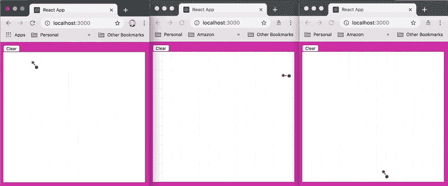

# 使用 GraphQL 和 AWS AppSync 进行实时协作绘图

> 原文：<https://dev.to/dabit3/real-time-collaborative-drawing-with-graphql--aws-appsync-432g>

[](https://res.cloudinary.com/practicaldev/image/fetch/s--IXSYH54w--/c_limit%2Cf_auto%2Cfl_progressive%2Cq_66%2Cw_880/https://i.imgur.com/6yMuOb6.gif)

> 要查看这个项目的代码&要启动这个项目，点击[这里](https://github.com/dabit3/appsync-graphql-real-time-canvas)进入 GitHub repo。

我正在为我即将在挪威[反应日](https://reactnorway.com/) & [反应日](https://www.reactindia.io/)的演讲准备一些演示。

在这些演讲中，我将演示 GraphQL & GraphQL 订阅的有趣用例。我的许多想法都集中在 GraphQL 订阅的实时方面，因为它使我们能够非常容易地构建实时功能。

我偶然发现了一个名为 [react-canvas-draw](https://github.com/embiem/react-canvas-draw) 的库，看起来很酷。我喜欢它的地方是，它不仅是一个允许绘图的库，而且它将笔画保存在一个数组&中，然后允许你按照它们被创建时的顺序重新绘制它们！

这似乎是我的应用程序的完美用例。为在画布上绘画而存储的线条的数据结构如下:

```
{
  lines: [
    { points: [{ x: 132, y: 144 }, { x: 133, y: 145 }], "brushColor":"#FF6D00","brushRadius": 4 },
    { points: [{ x: 132, y: 144 }, { x: 133, y: 145 }], "brushColor":"#000","brushRadius": 4 }
  ],
  width: "400px",
  height: "400px"
} 
```

Enter fullscreen mode Exit fullscreen mode

我的基本想法是找到一些方法来提取这些数据&在 GraphQL api 中更新，然后在更新时触发订阅。React Canvas Draw 有几个方法可以让这变得非常简单。事实上，它们公开了相当多的方法，允许完全控制画布的绘制。让我们来看看我用过的几个例子:

*   getSaveData -这个方法给我们当前的画布状态
*   loadSaveData——这个方法允许我们将整个数据集写入画布
*   simulateDrawingLines——这个方法在画布上写一行

既然我们知道了如何与画布交互，那么我们将如何与 GraphQL API 交互呢？

首先，我创建了一个基本模式:

```
type  Canvas  {  id:  ID!  clientId:  String!  data:  String!  } 
```

Enter fullscreen mode Exit fullscreen mode

我们需要跟上的主要事情是画布的唯一性`id`以及我们存储在名为`data`的字段中的画布数据。

使用 AWS AppSync，当与 Amplify CLI & [GraphQL 转换库](https://aws-amplify.github.io/docs/cli/graphql#graphql-transform) :
一起使用时，我们可以通过添加`@model`指令来搭建模式的其余部分以及数据源和解析器

```
type  Canvas  @model  {  id:  ID!  clientId:  String!  data:  String!  } 
```

Enter fullscreen mode Exit fullscreen mode

## 从零开始构建这一步骤

因此，为了让它运行起来，我创建了一个新的 React 应用程序:

```
npx create-react-app canvas-app 
```

Enter fullscreen mode Exit fullscreen mode

接下来，我初始化了一个新的 amplify 项目&然后添加了 API & schema

```
amplify init

amplify add api

# When prompted, I use the schema I referenced above

amplify push 
```

Enter fullscreen mode Exit fullscreen mode

最后，我创建了 [**Canvas.js**](https://github.com/dabit3/appsync-graphql-real-time-canvas/blob/master/src/Canvas.js) 来保存我的应用程序的所有主要代码&使用这个文件作为我的应用程序的主要文件。

然后我创建了一个名为 [**RCD.js**](https://github.com/dabit3/appsync-graphql-real-time-canvas/blob/master/src/RCD.js) 的新文件来保存`react-canvas-draw`库。我在本地引用它，以防我需要进行更新，但也让它在本地能够容易地试验不同的可用方法。

就是这样！使用 GraphQL 订阅使得启动和运行实时应用程序变得非常容易。如果你对此有任何问题，请随时联系我。

> 我的名字是纳德·达比特。我是亚马逊网络服务的一名开发者倡导者，负责像 [AWS AppSync](https://aws.amazon.com/appsync/) 和 [AWS Amplify](https://aws-amplify.github.io/) 这样的项目。我专门从事跨平台&云应用开发。