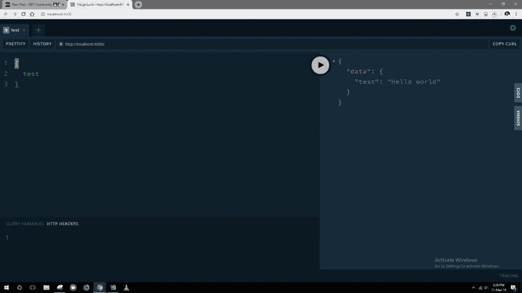

# GraphQL 的第一步👶

> 原文：<https://dev.to/thevenicelive/baby-steps-in-graphql-mn1>

# 让我向您解释如何在理解每一点代码的同时开始学习 GraphQL。

在开始本教程之前，我认为你了解的事情很少，因为你可能需要了解以下主题的基础，但这不是必要的，因为我将解释每个代码，但它仍将帮助你建立一个坚实的基础:

1)[JavaScript](https://developer.mozilla.org/bm/docs/Web/JavaScript)
2)[NodeJS](https://nodejs.org/en/docs/)T5】3)[ExpressJS](https://expressjs.com/en/api.html)

在本教程中，我们将学习创建一个后端 API，它可以从服务器端读取你的数据。简单地说，单词“Read”意味着将数据从数据库位置返回到服务器端或 web 应用程序前端的操作。

让我们从文件夹结构开始

```
gql-basics
         |
         -- src
         |
         -- package.json  

```

### 依赖项安装:

[graphql-yoga](https://github.com/prisma/graphql-yoga) (是基于 ExpressJS 的服务器框架)

```
 yarn add graphql-yoga
```

### 设置

在 src 文件夹中创建 index.js，这是主安装文件。在该文件中，从 graphql-yoga 导入{GraphQLServer}并创建它实例。

```
//import
const { GraphQLServer } = require("graphql-yoga");

//instance
const server= new graphQLServer({
//wait for this!
})

```

### 什么是类型定义？

类型定义就像一个带有类型声明的变量，例如:

```
//open browser console

var client = [{
id:1,
name:"Elon Musk"
}]

//now check the type
if(typeof client.name === "string") { true } else {false}
//output = true

if(typeof client.id === "string") { true } else {false}
//output = false

```

和上面一样，我们必须创建一个文件，并用它们的类型定义我们期望的每个数据。文件名将是 schema.graphql，我们将在 src 中创建该文件

```
gql-basics
         |
         -- src
              |
              -- schema.graphql

```

现在，我们将使用类型创建第一个数据。在 GraphQL 中，只读数据总是在核心查询元素内定义，其余数据(创建、更新、删除)在核心元素内定义。

```
//inside src/schema.graphql

type Query {
  test: String!}

```

以下是对上述代码的解释:

*   **type** :用于定义其中数据类型的元素。
*   **查询**:查询是 graphql 的只读核心元素
*   **test** : test 被称为 field，就像它是一个变量，可以包含任何类似于“functions()”、“String”、“Boolean”的内容，而“test”是我们给我们的字段的自定义名称，我们希望从数据库中获得，例如，它可以是任何类似于“你的 feed 中的 tweets”、“电子邮件”、“你搜索的博客文章”的内容
*   **字符串！**:它定义了我们期望从测试字段得到的数据类型。还有那个“！”末尾的符号定义它不能为空，这意味着如果你在控制台中请求一个名为“test”的字段，你总是会得到一个数据返回。

### 询问

现在在 src 中创建一个名为 Query.js 的文件

```
gql-basics
         |
         -- src
              |
              -- schema.graphql
              |
              -- Query.js

```

现在创建一个值为空对象的变量

```
//inside src/Query.js

const Query = {
  //
};

```

在对象内部，我们将定义当用户请求“测试”字段时会发生什么。在查询对象中创建一个“Key:Value”对，将 Key 指定为 test，将 Value 指定为 string(双引号中的句子),因为前面我们定义了 test 字段将只返回 String 类型的值。

```
//inside src/Query.js

const Query = {
  test:`Hello Dev.to Community :) `
};
//NodeJS style of exporting modules
//same as like: export {Query};
module.exports = {Query}

```

### 运行服务器

现在我们将在 index.js 中的 GraphQLServer 内部传递参数，然后启动服务器。看一看:

```
const { GraphQLServer } = require("graphql-yoga");
const { Query } = require("./Query");
const resolvers = {
  Query

};

const server = new GraphQLServer({
  typeDefs: "./src/schema.graphql",
  resolvers
});

server.start(_ =>
  console.log(`your server is running on http://localhost:4000`)
);

```

在这里，GraphQL 服务器将一个对象作为参数，我们必须传递两个东西:1)“类型定义”在“schema.graphql”文件中，2)“解析器”基本上是从数据库获取数据并返回给我们的文件。例如我们的“Query.js”文件，它返回给我们一个硬编码的字符串(因为在这篇文章中我们没有使用任何数据库)。之后，我们使用“start()”方法(来自 graphql-yoga)启动服务器，我们编写了一个函数，它将记录一个包含成功消息的模板文本。

现在，您可以使用以下命令运行您的第一个服务器:

```
//from inside your gql-basics
//type belowcode to start the server file
node src/index.js

```

并且会打开一个 GraphQL 的游乐场，如下图:
[](https://res.cloudinary.com/practicaldev/image/fetch/s--nCkW_B-Y--/c_limit%2Cf_auto%2Cfl_progressive%2Cq_auto%2Cw_880/https://thepracticaldev.s3.amazonaws.com/i/sqm90dvwf7ppe6nb6i2l.JPG)

匆忙🎉！这就是我们所创造的，也理解了 graphql 的基础，感谢大家花时间来学习 graphql，如果你喜欢这个教程，请[发推特](https://twitter.com/Thevenicelive)告诉我。

下一次我会试着解释突变是如何工作的，直到那时快乐编码！！