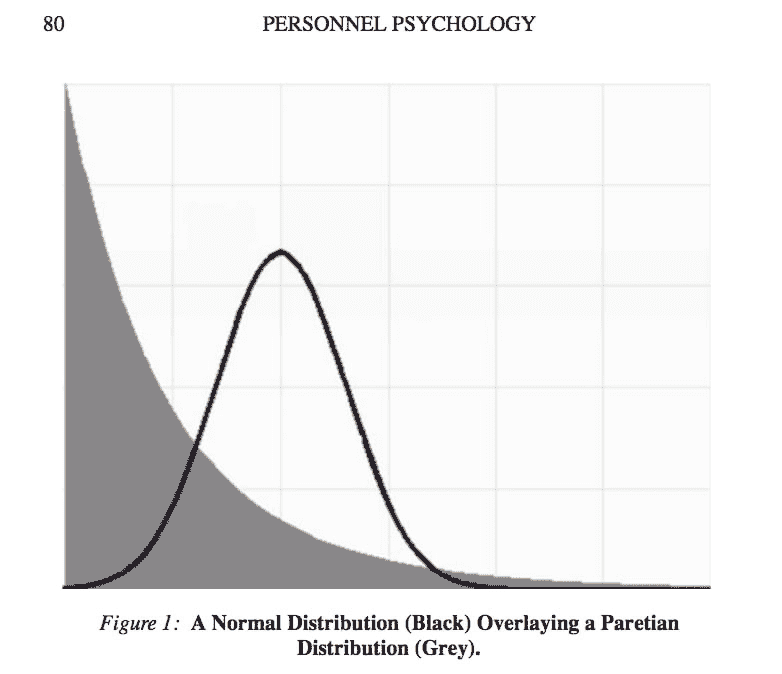

# 是什么造就了 10 倍的开发者？

> 原文：<https://dev.to/dvddpl/what-makes-a-10x-developer--1k0f>

10x 开发者是我们这个时代的神话生物。

它们是什么？他们做了什么变得如此特别？
10x 到底是什么意思？一个 10 倍的开发人员是和其他 10 个人一样多产的人*(被认为是)*。因此，他/她将能够产生 10 倍于其同事的成果。

我们到底在说什么？当然，一名高级工程师的工作效率可能是一名实习生的 10 倍但是，这真的可能发生在拥有相同工作经验、至少在理论上拥有相同技能水平的同事之间吗？

当阅读关于团队绩效和生产力的文章时，你会发现类似于**帕累托定律**和**高斯曲线**的东西。(也称为幂律和钟形曲线)。
帕累托定律是著名的 80-20 法则，几乎适用于一切:从财富分配和全球不平等到时间管理和生产率。
当谈到团队绩效时，结果是:
80%的开发人员只做了 20%的工作。这意味着剩下的 20%，表现最好的人，能够完成所有任务的 80%。
钟形曲线通常用于描述员工表现能力的分布，表示大约 80%的员工位于平均水平附近，而其余的员工要么表现优异，要么表现不佳。

[](https://res.cloudinary.com/practicaldev/image/fetch/s--qAl4tPP3--/c_limit%2Cf_auto%2Cfl_progressive%2Cq_auto%2Cw_880/https://thepracticaldev.s3.amazonaws.com/i/wr8kith6g0jrssx4sg5x.png)

然而，我们可以看看这些图表和数字，团队中表现最好和表现最差的人之间的差别是巨大的。当我们谈论 10 倍的 dev 时，也许我们只是指它？或者我们应该只考虑与其他 dev 平均值的差异。不管这样的事情在统计学上是否可能，我们不能否认一些开发人员实际上比其他人表现得更好。那么这种神奇来自哪里呢？

*是因为多年的经验吗？*不尽然。

> 10 年的经验可能仅仅意味着 1 年的经验重复 10 次。

如果你每天、每年都困在同一份工作中做着同样的任务，如果你没有前进和学习新事物的冲动，你可能会惊讶于一个简历上只有 3 年时间的普通开发人员速度极快，知道的比你多(不仅仅是最新最酷的技术)。

是因为他们工作到很晚，没有自己的生活吗？不尽然。

一台 10 倍的 dev 不会磨很长时间。这并不意味着工作时间更长。这无疑意味着更加努力地工作，但主要是以更聪明的方式工作。

我远不是一个 10 倍开发人员，但在我的职业生涯中，我有幸遇到过至少几个这样令人惊讶的人，并与之共事，我可以告诉他们一些共同的特点/品质:

## 以正确的方式做正确的事情

效力和效率:

> 高效是指做正确的事情，而高效是指做正确的事情。

嗯，10 倍的开发人员通常两者都做。他们不会浪费时间以最完美的方式做不必要的事情。他们以(足够)正确的方式完成正确的事情。
这可以通过以下方式实现:

### 提问

#### 为什么

有时候糟糕的需求、不清晰的规范和错误的假设会让你浪费几个小时的开发时间。你不仅要重新调整你的评估或者压缩返工，而且丢掉你刚刚创建的所有令人惊奇的代码也是非常令人沮丧的。

#### 如何

如果你被卡住了，**如果你需要帮助，请寻求帮助**。不要问一个解决方案，问一个提示，一个指导，一个可以让你自己找到解决方案的提示。不要害怕。*你不应该什么都知道*，你表现出渴望学习是件好事。

## 精神集中，避免分心

我们到底花了多少时间看 youtube、查看手机、回复 WhatsApp 或 Snapchat 上的朋友，或者只是滚动脸书墙？如果我告诉你，你每天花 1 到 2 个小时在他们身上会怎么样？检查手机上这些应用的使用情况。你会害怕的。(可以用[这种](https://play.google.com/store/apps/details?id=com.zerodesktop.appdetox.qualitytime)这样的应用来证明)。
我们不一定要放弃这一切。只要认识到我们在这些事情上浪费了多少时间，当我们应该富有成效时，这是第一步，然后我们可以使用 Pomodoro technique 这样的工具来帮助我们远离社交网络和智能手机，并至少在 Pomodoro 计时器的整个持续时间内保持这种流动。

[](https://i.giphy.com/media/W1P1fHJKkam76/giphy.gif)

我甚至不是说我们不应该休息，而是真正意识到我们宝贵的时间在哪里被耗尽了。(尽管站起来，散散步，和同事聊聊天，去踢 10 分钟球或打 10 分钟乒乓球肯定比去脸书好。让你的眼睛和大脑离开屏幕休息一下！).

> 休息一下，放松一小会儿确实可以提高你的工作效率

## 使用让你加速的工具，学习捷径

我们主要做的是打字和点击，这看起来很疯狂，但如果你开始在 IDE 中使用快捷方式，并且广泛使用终端/命令行，你真的可以变得超快。运行`grep version package.json`比去 Finder 快很多，点击 package.json 打开然后读取版本参数。
打字

```
git stash 
git pull 
git checkout -b my_new_feature 
git stash pop 
```

Enter fullscreen mode Exit fullscreen mode

比用任何视觉工具做同样的事情都要快。

你可能认为这只是缩短了几秒钟，但是成为每秒 10 倍的开发者很重要(无论如何，远离鼠标有助于预防腕管综合症)
[在这里你可以阅读一些工具和提示](https://dev.to/dvddpl/tools-i-wish-i-knew-from-the-start-48kl)，它们可以帮助我更好更快地编写和调试代码。

[](https://i.giphy.com/media/XIqCQx02E1U9W/giphy.gif)

## 好学

外面的信息量是巨大的。有时候要付费，大部分时间是免费的。没有借口不花一些时间在个人发展上。**阅读文章，听播客，看教程，关注在线课程**。它甚至不一定总是与编码有关——否则有人会说，一个 10 倍的开发人员确实整天都在“工作”(例如，我发现[每天都变得越来越聪明](https://www.youtube.com/channel/UC6107grRI4m0o2-emgoDnAA)和[你不是那么聪明](https://youarenotsosmart.com/podcast/)非常心痒)。它更多的是一种态度，一种精神状态。好奇心和求知欲使他们与众不同。

## 让自己置身于顶尖高手之中/寻找良师益友

成为团队中最快、最聪明、最熟练的开发人员可能对你的自我有好处，但对你的成长没有好处。尽管可能会舒服和满足，试着**永远不要成为房间里最聪明的人**，总是寻找那些在他们的工作中非常优秀的人，那些比你更好的人，并坚持下去。

## 送还。分享你的知识

一旦你学到了什么，试着帮助别人，教其他同事，分享你的学习。可以是在你每天站起来后给一些建议，给你的团队做一个简短的演示，写一篇博客，或者成为一个在线编码平台的导师。
**永远不要对比你懂得少的人傲慢或恼怒。**

* * *

如果我们考虑所有这些，当然一个非常好的开发人员有坚实强大的编程技能，但真正能产生影响的是热情、态度和一些软技能。我对其肃然起敬并给予我最大启发来提高自己的同事都非常有动力和技能，当然他们完成任务的速度也非常快:似乎没有什么能阻止或吓住他们，如果他们不知道什么，他们会研究几个小时，然后有足够的信心来负责 bug 修复或功能。除此之外，一旦他们发现或学到了对其他团队成员有益的东西，他们就编写文档，组织研讨会或小型演示。他们喜欢分享。

最后，我相信这可能是真正的倍增因子。分享知识，促进成长，成为激情和努力工作的榜样，这才是真正能够对其他人产生难以置信的积极影响，并提高团队绩效的标准(即使只是由“普通”开发人员组成)。

[](https://res.cloudinary.com/practicaldev/image/fetch/s--Y87qUAK---/c_limit%2Cf_auto%2Cfl_progressive%2Cq_auto%2Cw_880/https://thepracticaldev.s3.amazonaws.com/i/8aetadqsw3r1s1ssd1hl.jpg)