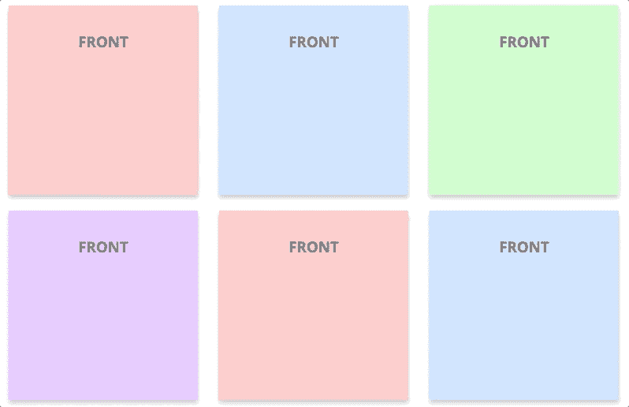

# 我的 React 组件库

> 原文：<https://dev.to/guimg/my-react-components-repository-1k3a>

嘿，我刚刚上传了一个 Github 库，我将在里面上传一些我最常用的 React 组件。其中大部分是我做的，其他的来自互联网代码，但有自己的修改。

> [去回购！](https://github.com/GuimG/my-react-components)

# 组件

这里有所有组件的完整列表。当我上传新的组件时，我会更新列表。

*   [导航条](https://github.com/GuimG/my-react-components/tree/master/app/components/Navbar):向下滚动时隐藏的粘性导航条。

*   [加载指示器](https://github.com/GuimG/my-react-components/tree/master/app/components/LoadingIndicator):只有 CSS 的加载指示器。
    T3T5】

*   [翻牌](https://github.com/GuimG/my-react-components/tree/master/app/components/FlippingCards):点击时翻牌。
    T3T5】

# 用法

您可以在线浏览此回购，或下载并运行它来查看所有组件的现场演示。有一个服务器有一个包含所有组件的根路由。请遵循以下步骤:

1.  通过键入:`git clone https://github.com/GuimG/my-react-components.git`克隆 repo。
2.  进入你终端的文件夹，输入`npm run start`运行应用程序。
3.  在浏览器中搜索:`http://localhost:3000`。

现在，您可以在浏览器中看到所有组件。每个页面上都有一个标题(除了固定在页面中的导航条)。如果您喜欢某个特定的组件，请在`components`文件夹中按其标题进行搜索。

# 最后一句话

希望这对你有帮助。如果你想要具体的组件，但它不在这里，请留下评论，我会尽快尝试。