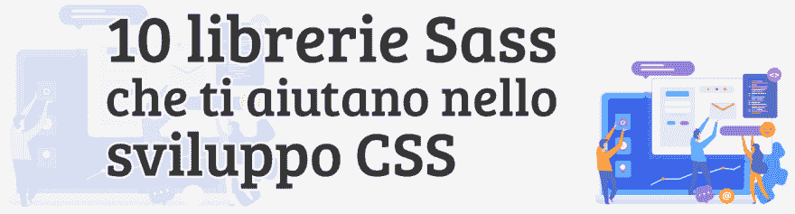
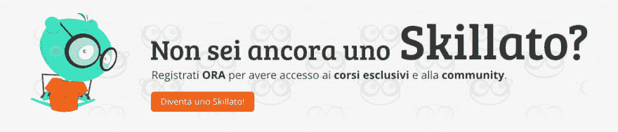
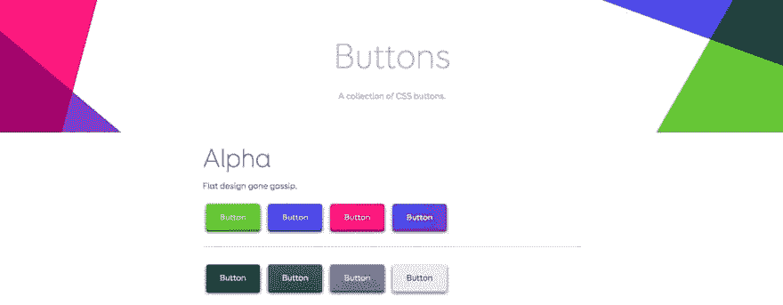
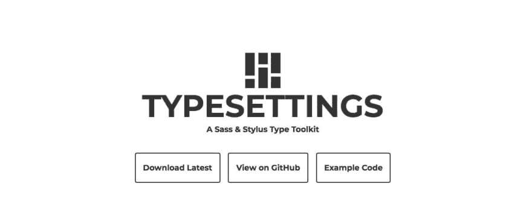
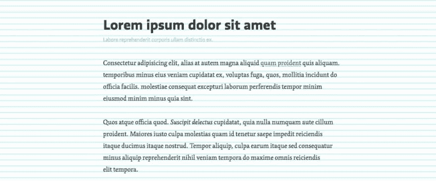

# 帮助您开发 CSS 的 10 个 Sass 库

> [https://dev . to/andreabargaini/10-library-sass-che-ti-helping-in-development-CSS-523 a](https://dev.to/andreabarghigiani/10-librerie-sass-che-ti-aiutano-nello-sviluppo-css-523a)

[](https://res.cloudinary.com/practicaldev/image/fetch/s--XALZLmHG--/c_limit%2Cf_auto%2Cfl_progressive%2Cq_auto%2Cw_880/https://thepracticaldev.s3.amazonaws.com/i/yy6flk0pgh7occyh82lg.png)

今天我们不会谈论技术，而是解决方案。由其他开发人员创建并与我们共享的解决方案，这些解决方案是开发我们的 CSS 的非常有趣的方法。

如果你还不认识 Sass，我马上告诉你**你犯了一个大错**，你给我机会赞助我的[专用课程](https://skillsandmore.org/corso/conosci-sass-e-migliora-i-tuoi-css/)

你犯了一个错误，因为今天写你的 CSS 就像 W3C 标准化的那样是在浪费大量的时间。

尽管从基础上来说是有用的和必不可少的，但必须说，其语法和逻辑再也无法跟上时代的步伐了。

你不相信我？

观看[我们的网络研讨会](https://youtu.be/8mSVgWN96N4)，了解如何使用 Sass 比编写经典 CSS 更有用(更快)。

在撰写本文之前，我在互联网这个庞大的网络中进行了长时间的广泛搜索，寻找包含‘t0’语言 Sass 所开发的智能解决方案的文章和存储库 GitHub。

下面你会发现的是我发现最有趣的 10 个图书馆(或框架)的清单，我认为值得列举。

[](https://skillsandmore.org/diventa-uno-skillato/)

我现在告诉你，如果你在这个列表中找不到你最喜欢使用的解决方案之一**，请在本文底部的评论部分添加链接和理由，让我注意到**。

在开始之前，我想告诉大家，本文与其插入指向文件“`.zip`”的各种链接，不如插入“**”指向各个 github**存储库的链接，以便您能够更轻松地使用这些解决方案。

## 使用 Bi-App 反转站点元素

我决定把[bi-app 库](http://github.com/anasnakawa/bi-app-sass)作为第一个，因为它的运作既简单又有趣。

您是否曾经需要开发一个既可供从左到右阅读的网站(“t0[左到右]【t1])，又可供从左到右阅读的网站(“T2[右到左]【T3]”)？

如果您的市场主要指的是意大利市场，这很可能不是您经常做的事情，但我确信，对于正在开发大型门户网站的所有开发人员来说，此解决方案可能会非常方便。

我之所以这么说，是因为有了 Bi-App，您将有机会创建两个样式表，使您的内容能够根据用户的阅读方向进行调整。

从开发者的角度来看，您只需使用此库的 mixin，您就可以自由地编写单个 Sass 文件，而在编译时，此库将使用您使用的 mixin 来自动执行所有的‘t0’镜像’t1’操作，而不是您自己

## 你想要的所有按钮都带有…【按钮】

按钮是任何 web 项目中非常重要的元素。这一点非常重要，有时它们能够描述转换的成功和失败

正因如此，以及许多其他原因，我经常需要一种工具来帮助我快速创建和修改它们。幸运的是我遇到了巴顿！

[](https://res.cloudinary.com/practicaldev/image/fetch/s--oWmKpSvX--/c_limit%2Cf_auto%2Cfl_progressive%2Cq_auto%2Cw_880/https://skillsandmore.org/wp-content/uploads/2019/03/buttons.jpg)

很多年前，解决方案是依靠图形程序，甚至是专业图形，然后加载各种图像文件，以自定义我们的布局。

现在，我们可以直接使用 CSS，并使用相同的 HTML 语法创建按钮的不同版本。

你在上面看到的只是一个小小的例子，说明你可以利用这个图书馆做些什么，但我建议你参考一下项目，因为我确信你会找到最适合你需要的那种按钮！

## 使用@include-media 轻松管理您的媒体查询

我们马上就开始说，这个图书馆是从分析市场上已经存在的图书馆开始的，激励着它创作一篇关于 CSS 伎俩的综合性文章。

还有别的选择！

∞本文向你介绍图书馆〖t0〗但你将如何从我刚才给你介绍的同一篇文章中发现，有很多选择。

此库中我非常欣赏的一个功能是能够将媒体查询**直接插入到我们使用的选择器**中。

因此，我们在管理特定元素的 CSS 规则时，无需整理所有代码以满足调用“`@media`”的要求，而是可以管理各种响应选项。

让我们举个小例子来了解它的运作方式。

首先，我们有了**创造变量**的可能性，这些变量将比经典的`px`更容易记忆和调用:

```
$breakpoints: (phone: 320px, tablet: 768px, desktop: 1024px); 
```

如您所见，各断点的声明非常直观，并利用了 Sass 数据图，这一话题我们已经在先前的文章中讨论过了。

但是，让我们回到这个简单的库，一旦定义了断点，我们就可以分别调用我们的媒体查询:

```
@include media(">phone", "<=tablet") {
    width: 50%;
} 
```

正如我之前所说，最美好的事情是**直接写出我们的媒体查询**我们正在定制。

这里有一个例子:

```
.box{

  @include media(">phone") {
    background-color: red;
  }

  @include media(">tablet") {
    background-color: green;
  }

  @include media(">desktop") {
    background-color: blue;
  }

} 
```

正如您亲眼所见，为了证实上述内容，使用此库无需单独创建查询媒体并在其中重复元素选择器。

你所要做的就是插入 mixin `media`，并写下必要的修改。

我敢肯定，您现在想知道生成的 CSS 是如何开发的，让我们一起研究一下它:

```
@media (min-width: 321px) {
  .box {
    background-color: red;
  }
}
@media (min-width: 769px) {
  .box {
    background-color: green;
  }
}
@media (min-width: 1025px) {
  .box {
    background-color: blue;
  }
} 
```

而这里，一旦我们的 Sass 代码完成，我们将有“T0”的单个媒体查询，而回答这一措施的选择器将移入其中。

#### 担心媒体查询的数量吗？

如果您担心 CSS 文件中存在的媒体查询数量，则可能会给“[”此 NPM](https://www.npmjs.com/package/gulp-merge-media-queries)包，其唯一功能是对输入到项目中的所有媒体查询进行分组。

在句子中，我使用了复数，因为多亏 Sass，我们不必担心创建了多少媒体查询，您可能会认为生成的 CSS 将会是一个包含大量媒体重复查询文档的混乱局面。

相反，通过刚才介绍的 npm 包，我们可以放心睡觉，因为它能够满足各种适当的媒体查询选择程序，而不会不必要地增加产生的 CSS。

## 使用 Kf 轻松创建关键帧动画

现在，您应该已经习惯了我们的文章，并且不断地提醒您使用代码可以创建哪些动画效果，但在这种情况下，我想向您介绍一个库，它将允许您使用一系列现成的效果

如果你是我们博客的忠实读者，你应该记住，不久前我们谈到了“`Animate.css`”，这是一组简单的 CSS 类，使你能够轻松地为你的元素制作动画。

但是在 Kf 的帮助下，我们采取了一种不同的、更可定制的方法。

与通常使用 Sass 时一样，此解决方案允许在代码和实际效果方面进行高度的自定义。

[本库](https://github.com/mil/kf-sass)允许我们使用句法来实现我们的效果，这种句法被证明比经典 `@keyframes`更易于管理。

```
.single-selector div {
  $animation-map: (
    margin-left: (0ms: 0%, 3000ms: 100%)
  );

  @include kf($animation-map);
} 
```

此库与以前的媒体查询库一样，使用非常有趣的数据映射，您可以看到，它允许我们为各个属性声明动画。

当然，您不必只选取一个项目，您可以选取其中的项目并分别制作动画:

```
.multiple-selectors {
  $animation-map: (
    '.a': (margin-left: (0ms: 0%, 3000ms: 100%)),
    '.b': (margin-left: (0ms: 100%, 2000ms: 0%))
  );

  @include kf($animation-map);
} 
```

我的意思是，这绝对是一个与复制/粘贴库不同的库，如 animate . css。但是，如果你看一下奖牌的侧面，你会发现“**”高度的个性化“**”并且对我们的动画有深刻的管理。

## Migliora il ritmo vertical con 排版

让我们回想一下，很多人提醒我们，在网络上*内容是国王*，但是如果这种内容**不容易被我们的读者查阅**，我们如何给予它如此重要的地位呢？

我们在创建内容方面所做的一切努力都将付诸东流！

[](https://res.cloudinary.com/practicaldev/image/fetch/s--yuFlZ2Ia--/c_limit%2Cf_auto%2Cfl_progressive%2Cq_auto%2Cw_880/https://skillsandmore.org/wp-content/uploads/2019/03/typesettings-1.jpg)

这就是[【type settings】](http://github.com/ianrose/typesettings)这样的库来帮助我们，提供了一系列 mixin，帮助我们更好地管理文本中的垂直空间。

这听起来可能有点奇怪，但我希望您检查一下简单的配置代码，以了解通过此库将简化您的所有工作！

## 带有 sassline 的垂直格线

不得不说，乍一看**这个书架看起来可能和之前的书架很相似，毕竟她也是做垂直格线的，但老实说，在测试阶段，我发现**显示格线**的可能性是不可思议的有用**

[](https://res.cloudinary.com/practicaldev/image/fetch/s--1MwOwg26--/c_limit%2Cf_auto%2Cfl_progressive%2Cq_auto%2Cw_880/https://skillsandmore.org/wp-content/uploads/2019/03/sassline.jpg)

我刚才给你插了句话，想让你看看易用性。每次更改时，您都可以查看网格，并详细观察页面的垂直速度。

## 多亏苏茜的反应网格

我们从垂直格线切换到更有趣的格线，这些格线可让您建立网页的「T1」版面。

我们已经分析了“[sass 专用课程‘t1’的 Susy，我在那里向您展示了它是多么易于设置和使用。](https://skillsandmore.org/courses/conosci-sass-e-migliora-i-tuoi-css/)

其最有趣的特点是能够用语义 mixin 来处理**网格和对布局的响应性更改**！

您几乎不需要再使用毫无意义的名称，也不需要在计算器中输入来计算要使用的宽度。

有了 Susy，您只需要建立您自己的 Sass Map ，它可以为您的专案定义配置基础，并且您可以将所有的复杂性委派给此解决方案的 mixin。

苏茜升级了！

Susy 已经达到版本 3，现在与其使用浮点，还能让我们轻松地宣告我们的 CSS 网格，或者用 [Flexbox](https://skillsandmore.org/corso/crea-i-nuovi-layout-con-flexbox/) 构造布局。

转到[发现 GitHub](http://github.com/ericam/susy/) 上的项目，加深对我们课程的了解

## 飞毛腿，你 CSS 的实用工具集合

让我们从专用于单一解决方案的库切换到其他使您能够做到‘t1’的解决方案。

Scut 是一个非常有趣的解决方案，因为除了 mixin 之外，它还提供了一些功能来帮助我们完成某些任务。

您是否曾经需要在`em`或`rem`中创建一个项目，而您只有一个 Photoshop 文件？

我敢肯定你已经疯了计算各种匹配。

恩，多亏了 Scut，这一切将成为遥远的记忆，因为它提供了‘t0’和‘t1’的功能，正是这样做的！

当然，在里面你也会发现一些有用的共混物，比如让你可以用简单的 Sass 代码创建圆或[三角形](https://davidtheclark.github.io/scut/triangle.html)。

我强烈建议您将[交给此解决方案](http://github.com/davidtheclark/scut)，因为它也为管理您的页面布局提供了有用的工具。

## 分离斜边

肯定有很多解决方案让我们能够在我们创建的网页上创造出‘t0’错误的元素。

[](https://res.cloudinary.com/practicaldev/image/fetch/s--xdZqm1nQ--/c_limit%2Cf_auto%2Cfl_progressive%2Cq_auto%2Cw_880/https://skillsandmore.org/wp-content/uploads/2019/03/angled-edge.jpg)

在某些情况下，SVG 中直接使用适合不同屏幕分辨率的图像，而其它解决方案则使用伪元素`::before`和`::after`。

你不知道伪元素吗？

立即阅读我们的[专论](https://skillsandmore.org/comprendere-pseudo-elementi/)，了解这些在开发过程中能帮到你多少！

要应用如上所示的效果，只需使用专用混合器即可。这里有一个例子:

```
@include angled-edge($location, $hypotenuse, $fill); 
```

使用此语法可以创建 SVG 图像，这些图像使用“`data:image`”插入 CSS，该解决方案允许我们通过读取插入的 SVG 代码来创建图像。

我建议您尝试“[”此库“](https://github.com/josephfusco/angled-edges)”因为它使用简单的 mixin 帮助我们为我们的布局创建引人注目的解决方案。

## 波旁威士忌，充满惊喜的书店！

我承认我很少使用这个图书馆，我是 Compass 的忠实粉丝，但自从我了解到它的发展，我就开始寻找替代方案。

我进入了一个真实的宇宙，因为很多人试图填补 Compass 留下的真空，但在[波旁](https://github.com/thoughtbot/bourbon/)我找到了我想要的一切。

事实上，Bourbon 是一个极其轻便的图书馆，它提供了许多非常有用的混合材料，例如在我们的文本中添加省略号，或者使我们能够方便地修改我们的按钮。

除此之外，本库的特点是它被证明是**易于扩展**。

事实上，Bourbon 的主要重点是**介绍 mixin 和通用功能**，但并不推动网格或复杂元素的创建。

为此，Bourbon 团队创建了以下专用库:

*   **neat–**简单的网格管理(仍然使用 i `float`
*   **苦–**一种非常类似`Normalize.css`的解决方案

我的意思是，如果你没有时间浪费，而你想要一个能帮助你工作的多功能书店，你已经找到了你需要的东西

## 结论

通过这篇文章，我们看到了一些最有趣的解决方案，通过 Sass，您可以将这些解决方案集成到您的日常工作中。

我们大致看了所有能让我们加快项目创建速度的实用程序，但我想告诉大家，**我们并没有看到全部**！

本文没有重点介绍的还有其他图书馆，但可以在不断更新的这个存储库中找到。

我在撰写这篇文章时想做的是帮助你认识到，**了解 Sass 对你的工作确实很重要**，归根结底，这是一个标准，尽管 CSS 正在添加有趣的新解决方案(如 [Custom Properties](https://skillsandmore.org/variabili-css-limiti-utilizzi/)

如果你觉得有必要把自己放在一起，想最好地找出这个解决办法，我不禁提醒你，[我们特地为你举办了一门课程](https://skillsandmore.org/courses/conosci-sass-e-migliora-i-tuoi-css/)，我希望你会发现它有用，真正改善你的工作；就像你对待订阅者一样。

如果你还有其他每天都在使用的图书馆想跟我说话的话，请随时参考下面的评论，我和其他读者将不胜感激！

文章 [10 个 Sass 文库，帮助您开发 CSS](https://skillsandmore.org/librerie-sass-sviluppo-css/) ，来源于[skill andmore](https://skillsandmore.org)。