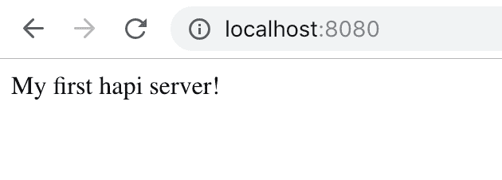
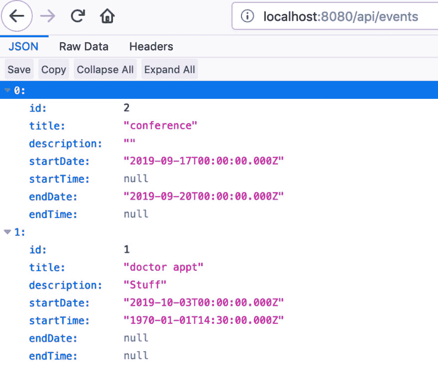
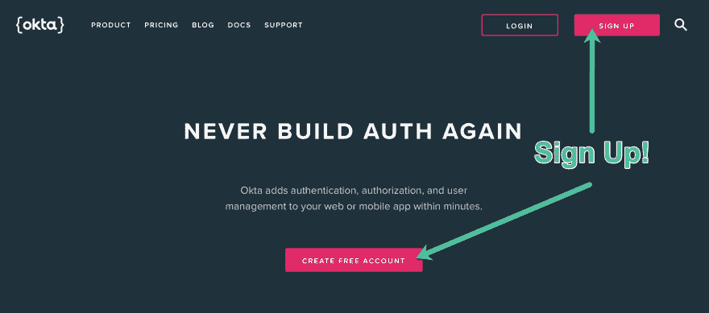
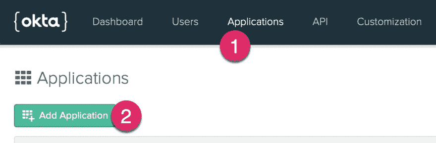
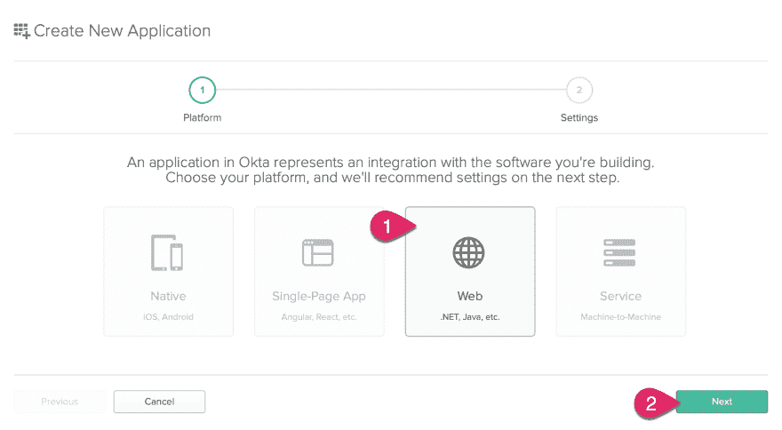
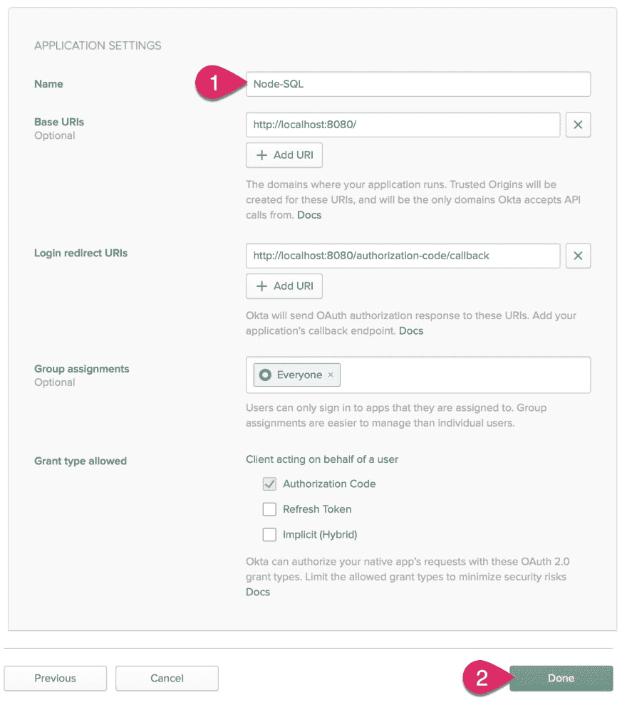
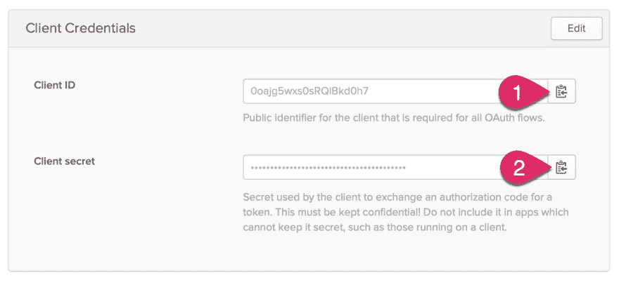
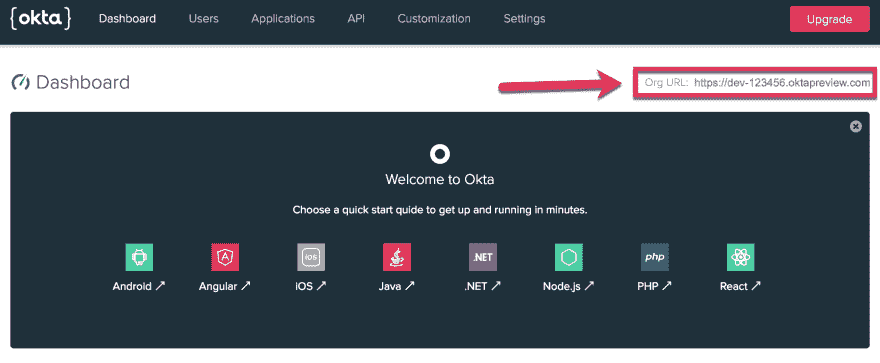
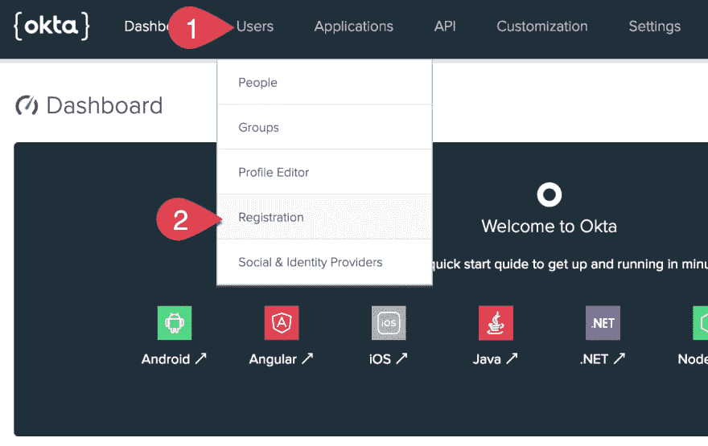
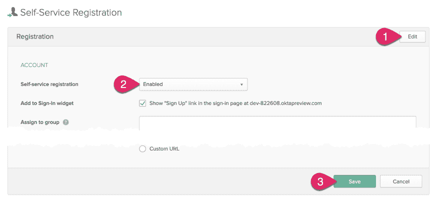

# 使用 SQL Server 构建安全的 Node.js 应用程序

> 原文：<https://dev.to/oktadev/build-a-secure-node-js-app-with-sql-server-22oa>

我是一个长期的关系数据库迷，特别是 SQL Server。在我的职业生涯中，我曾专注于数据库设计、部署、迁移、管理、查询优化，以及精心制作存储过程、触发器和视图。

我曾经在 SQL Server 上使用 Visual Basic、“经典”ASP、ASP.NET 以及最近几年的 Node.js 编写过应用程序。你*可以*用 SQL Server 构建 Node.js 应用！

在本教程中，您将通过创建一个简单的日历应用程序来学习使用 SQL Server 创建 Node.js web 应用程序的基础知识。

## 设置你的 Node.js 开发环境

在开始之前，您需要几样东西:

*   [node . js](https://nodejs.org/en/)8.0 或更高版本
*   访问 2012 版或更高版本的 SQL Server

如果您还没有可以连接到的 SQL Server 实例，可以在本地安装一个用于开发和测试。

### 在 Windows 上安装 SQL Server

下载并安装 [SQL Server 开发者版](https://www.microsoft.com/en-us/sql-server/sql-server-downloads)。

### 在 Mac 或 Linux 上安装 SQL Server

1.  安装[对接器](https://docs.docker.com/docker-for-mac/install/)
2.  在终端中运行以下命令。这将下载 SQL Server 2017 for Linux 的最新版本，并创建一个名为`sqlserver`的新容器。

```
docker pull microsoft/mssql-server-linux:2017-latest
docker run -d --name sqlserver -e 'ACCEPT_EULA=Y' -e 'SA_PASSWORD=P@55w0rd' -e 'MSSQL_PID=Developer' -p 1433:1433 microsoft/mssql-server-linux:2017-latest 
```

> 注意:关于运行 SQL Server for Linux 的更多信息，请参见[在 Mac 上运行 SQL Server？！](https://medium.com/@reverentgeek/sql-server-running-on-a-mac-3efafda48861)

## 设置 SQL 数据库

对于本教程，您将需要一个 SQL 数据库。如果您在本地运行 SQL Server 并且还没有数据库，可以使用以下脚本创建一个。

> 注意:如果你有 Visual Studio 代码，你可以使用优秀的 [mssql 扩展](https://docs.microsoft.com/en-us/sql/linux/sql-server-linux-develop-use-vscode?view=sql-server-2017)来运行 sql 脚本。或者，你可以使用像 [Azure Data Studio](https://docs.microsoft.com/en-us/sql/azure-data-studio/download?view=sql-server-2017) 这样的应用。

```
USE master;
GO

CREATE DATABASE calendar; -- change this to whatever database name you desire
GO 
```

接下来，创建一个名为`events`的新表。这是您将用来存储日历事件的表。

```
-- Dropping events table...
DROP TABLE IF EXISTS events;

-- Create events table...
CREATE TABLE events (
   id int IDENTITY(1, 1) PRIMARY KEY CLUSTERED NOT NULL
   , userId nvarchar(50) NOT NULL
   , title nvarchar(200) NOT NULL
   , description nvarchar(1000) NULL
   , startDate date NOT NULL
   , startTime time(0) NULL
   , endDate date NULL
   , endTime time(0) NULL
   , INDEX idx_events_userId ( userId )
); 
```

## 创建 Node.js Web 应用程序

有了 Node.js，您可以从许多优秀的框架中选择创建 web 应用程序。在本教程中，您将使用我个人最喜欢的 [hapi](https://hapijs.com/) 。最初由沃尔玛的工程师创建，它适用于构建 API、服务和完整的 web 应用程序。

打开命令提示符(Windows)或终端(Mac 或 Linux)，将当前目录更改为要创建项目的位置。为您的项目创建一个文件夹，然后切换到新文件夹。

```
mkdir node-sql-tutorial
cd node-sql-tutorial 
```

Node.js 项目需要一个`package.json`文件，它包括项目信息、脚本和依赖项等内容。使用`npm`命令在项目文件夹中创建一个`package.json`文件。

```
npm init -y 
```

接下来，安装`hapi`作为依赖项。

```
npm install hapi@18 
```

现在在您选择的编辑器中打开项目。

> 如果你还没有喜欢的代码编辑器，我推荐安装 [Visual Studio 代码](https://code.visualstudio.com/)。VS 代码对 JavaScript 和 Node.js 有异常的支持，比如智能代码完成和调试。还有一个由社区贡献的巨大的免费扩展库。

### Node.js 项目结构

大多数 Node.js 应用程序的“hello world”示例都是从一个 JavaScript 文件开始的。然而，建立一个良好的项目结构来支持应用程序的发展是非常重要的。

关于如何组织 Node.js 项目，有无数种观点。在本教程中，最终的项目结构将类似于以下内容。

```
├── package.json
├── client
├── src
│   ├── data
│   ├── plugins
│   ├── routes
│ └── views
└── test 
```

### 创建一个带有路由的基本服务器

创建一个名为`src`的文件夹。在这个文件夹中，添加一个名为`index.js`的新文件。打开文件并添加以下 JavaScript。

```
"use strict";

const server = require( "./server" );

const startServer = async () => {
   try {
       // todo: move configuration to separate config
       const config = {
           host: "localhost",
           port: 8080
       };

       // create an instance of the server application
       const app = await server( config );

       // start the web server
       await app.start();

       console.log( `Server running at http://${ config.host }:${ config.port }...` );
   } catch ( err ) {
       console.log( "startup error:", err );
   }
};

startServer(); 
```

在`src`下创建一个名为`server.js`的新文件。打开文件并添加以下内容。

```
"use strict";

const Hapi = require( "hapi" );
const routes = require( "./routes" );

const app = async config => {
   const { host, port } = config;

   // create an instance of hapi
   const server = Hapi.server( { host, port } );

   // store the config for later use
   server.app.config = config;

   // register routes
   await routes.register( server );

   return server;
};

module.exports = app; 
```

将服务器配置与应用程序启动分开的原因之一是测试应用程序会更容易。

接下来，在`src`下创建一个名为`routes`的文件夹。在这个文件夹中，添加一个名为`index.js`的新文件。打开文件并添加以下内容。

```
"use strict";

module.exports.register = async server => {
   server.route( {
       method: "GET",
       path: "/",
       handler: async ( request, h ) => {
           return "My first hapi server!";
       }
   } );
}; 
```

最后，编辑`package.json`文件，并将`"main"`属性值更改为`"src/index.js"`。该属性指示 Node.js 在应用程序启动时执行哪个文件。

```
 "main": "src/index.js", 
```

现在您可以启动应用程序了。返回到命令/终端窗口，键入以下命令。

```
node . 
```

您应该会看到消息`Server running at http://localhost:8080...`。打开浏览器并导航至`http://localhost:8080`。您的浏览器应该显示如下内容。

[](https://res.cloudinary.com/practicaldev/image/fetch/s--w1ZgMZFW--/c_limit%2Cf_auto%2Cfl_progressive%2Cq_auto%2Cw_880/https://developer.okta.com/assets-jekyll/blog/node-sql-server/hello-hapi-253aeddd6b12bc3cb99c175ee0ff8d998a86148dcc918e663382d0ea4af8e958.png)

成功！

> 注意:要停止 Node.js 应用程序，请转到命令/终端窗口并按`CTRL+C`。

## 管理您的 Node.js 应用配置

在我们开始编写与 SQL Server 交互的代码之前，我们需要一种好的方法来管理应用程序的配置，比如我们的 SQL Server 连接信息。

Node.js 应用程序通常使用环境变量进行配置。然而，管理环境变量可能是一件痛苦的事情。`dotenv`是一个流行的 Node.js 包，它向 Node.js 公开了一个`.env`配置文件，就好像它是使用环境变量设置的一样。

首先，安装`dotenv`作为项目依赖。

```
npm install dotenv@6 
```

在项目的根文件夹中创建一个名为`.env`的文件，并添加以下配置。

```
# Set NODE_ENV=production when deploying to production
NODE_ENV=development

# hapi server configuration
PORT=8080
HOST=localhost
HOST_URL=http://localhost:8080
COOKIE_ENCRYPT_PWD=superAwesomePasswordStringThatIsAtLeast32CharactersLong!

# SQL Server connection
SQL_USER=dbuser
SQL_PASSWORD=P@55w0rd
SQL_DATABASE=calendar
SQL_SERVER=servername
# Set SQL_ENCRYPT=true if using Azure
SQL_ENCRYPT=false

# Okta configuration
OKTA_ORG_URL=https://{yourOktaDomain}
OKTA_CLIENT_ID={yourClientId}
OKTA_CLIENT_SECRET={yourClientSecret} 
```

用您的数据库配置信息更新 SQL Server 配置。我们将在后面介绍一些其他的设置。

> 注意:当使用 git 这样的源代码控制系统时，不要将`.env`文件添加到源代码控制中。每个环境都需要一个定制的`.env`文件，并且可能包含不应该存储在存储库中的秘密。建议您在项目自述文件和单独的`.env.sample`文件中记录预期值。

接下来，在`src`下创建一个名为`config.js`的文件，并添加以下代码。

```
"use strict";

const assert = require( "assert" );
const dotenv = require( "dotenv" );

// read in the .env file
dotenv.config();

// capture the environment variables the application needs
const { PORT,
   HOST,
   HOST_URL,
   COOKIE_ENCRYPT_PWD,
   SQL_SERVER,
   SQL_DATABASE,
   SQL_USER,
   SQL_PASSWORD,
   OKTA_ORG_URL,
   OKTA_CLIENT_ID,
   OKTA_CLIENT_SECRET
} = process.env;

const sqlEncrypt = process.env.SQL_ENCRYPT === "true";

// validate the required configuration information
assert( PORT, "PORT configuration is required." );
assert( HOST, "HOST configuration is required." );
assert( HOST_URL, "HOST_URL configuration is required." );
assert( COOKIE_ENCRYPT_PWD, "COOKIE_ENCRYPT_PWD configuration is required." );
assert( SQL_SERVER, "SQL_SERVER configuration is required." );
assert( SQL_DATABASE, "SQL_DATABASE configuration is required." );
assert( SQL_USER, "SQL_USER configuration is required." );
assert( SQL_PASSWORD, "SQL_PASSWORD configuration is required." );
assert( OKTA_ORG_URL, "OKTA_ORG_URL configuration is required." );
assert( OKTA_CLIENT_ID, "OKTA_CLIENT_ID configuration is required." );
assert( OKTA_CLIENT_SECRET, "OKTA_CLIENT_SECRET configuration is required." );

// export the configuration information
module.exports = {
   port: PORT,
   host: HOST,
   url: HOST_URL,
   cookiePwd: COOKIE_ENCRYPT_PWD,
   sql: {
       server: SQL_SERVER,
       database: SQL_DATABASE,
       user: SQL_USER,
       password: SQL_PASSWORD,
       options: {
           encrypt: sqlEncrypt
       }
   },
   okta: {
       url: OKTA_ORG_URL,
       clientId: OKTA_CLIENT_ID,
       clientSecret: OKTA_CLIENT_SECRET
   }
}; 
```

更新`src/index.js`以使用您刚刚创建的新`config`模块。

```
"use strict";

const config = require( "./config" );
const server = require( "./server" );

const startServer = async () => {
   try {
       // create an instance of the server application
       const app = await server( config );

       // start the web server
       await app.start();

       console.log( `Server running at http://${ config.host }:${ config.port }...` );
   } catch ( err ) {
       console.log( "startup error:", err );
   }
};

startServer(); 
```

## 用 SQL Server 创建 Node.js API

现在我们可以开始有趣的部分了！在这一步中，您将向 hapi 添加一个路由，以查询数据库中的事件列表，并将它们作为 JSON 返回。您将为 hapi 创建一个 SQL Server 客户端插件，并以一种便于将来添加新 api 的方式组织数据访问层。

首先，你需要安装一些依赖项，最重要的是 [`mssql`](https://www.npmjs.com/package/mssql) 包。

```
npm install mssql@4 fs-extra@7 
```

### 创建 SQL 数据访问层

使用带有 Node.js 和`mssql`包的 SQL Server 通常遵循以下步骤:

1.  创建一个`mssql`包的实例。
2.  使用`connect()`创建一个 SQL 连接。
3.  使用连接创建一个新的 SQL `request`。
4.  在请求上设置任何输入参数。
5.  执行请求。
6.  处理请求返回的结果(如记录集)。

创建到 SQL Server 的连接是一项开销相对较大的操作。对可以建立的连接数量也有实际限制。默认情况下，`mssql`包的`.connect()`函数创建并返回一个连接“池”对象。连接池提高了应用程序的性能和可伸缩性。

当查询`request`被创建时，SQL 客户机使用池中的下一个可用连接。执行查询后，连接将返回到池连接。

在`src`下创建一个名为`data`的文件夹。在`src/data`下新建一个文件，命名为`index.js`。将以下代码添加到该文件中。

```
"use strict";

const events = require( "./events" );
const sql = require( "mssql" );

const client = async ( server, config ) => {
   let pool = null;

   const closePool = async () => {
       try {
           // try to close the connection pool
           await pool.close();

           // set the pool to null to ensure
           // a new one will be created by getConnection()
           pool = null;
       } catch ( err ) {
           // error closing the connection (could already be closed)
           // set the pool to null to ensure
           // a new one will be created by getConnection()
           pool = null;
           server.log( ["error", "data"], "closePool error" );
           server.log( ["error", "data"], err );
       }
   };

   const getConnection = async () => {
       try {
           if ( pool ) {
               // has the connection pool already been created?
               // if so, return the existing pool
               return pool;
           }
           // create a new connection pool
           pool = await sql.connect( config );

           // catch any connection errors and close the pool
           pool.on( "error", async err => {
               server.log( ["error", "data"], "connection pool error" );
               server.log( ["error", "data"], err );
               await closePool();
           } );
           return pool;
       } catch ( err ) {
           // error connecting to SQL Server
           server.log( ["error", "data"], "error connecting to sql server" );
           server.log( ["error", "data"], err );
           pool = null;
       }
   };

   // this is the API the client exposes to the rest
   // of the application
   return {
       events: await events.register( { sql, getConnection } )
   };
};

module.exports = client; 
```

将 SQL Server 与 Node.js 一起使用时，最关键的事情之一是在出现连接错误时正确处理它们。在内部，`sql/data`模块有两个重要的功能:`getConnection`和`closePool`。`getConnection`返回活动连接池，或在必要时创建一个。当任何连接错误发生时，`closePool`确保先前活动的池被释放，以防止模块重用它。

在`src/data`下创建一个名为`utils.js`的新文件。将以下代码添加到该文件中。

```
"use strict";

const fse = require( "fs-extra" );
const { join } = require( "path" );

const loadSqlQueries = async folderName => {
   // determine the file path for the folder
   const filePath = join( process.cwd(), "src", "data", folderName );

   // get a list of all the files in the folder
   const files = await fse.readdir( filePath );

   // only files that have the .sql extension
   const sqlFiles = files.filter( f => f.endsWith( ".sql" ) );

   // loop over the files and read in their contents
   const queries = {};
   for ( let i = 0; i < sqlFiles.length; i++ ) {
       const query = fse.readFileSync( join( filePath, sqlFiles[i] ), { encoding: "UTF-8" } );
       queries[sqlFiles[ i].replace( ".sql", "" ) ] = query;
   }
   return queries;
};

module.exports = {
   loadSqlQueries
}; 
```

尽管可以将 SQL 查询作为字符串嵌入到 JavaScript 代码中，但我认为最好将查询保存在单独的`.sql`文件中，并在启动时加载它们。这个`utils`模块加载给定文件夹中的所有`.sql`文件，并将它们作为单个对象返回。

在`src/data`下新建一个文件夹，命名为`events`。在`src/data/events`下添加一个新文件，名为`index.js`。将以下代码添加到该文件中。

```
"use strict";

const utils = require( "../utils" );

const register = async ( { sql, getPool } ) => {
   // read in all the .sql files for this folder
   const sqlQueries = await utils.loadSqlQueries( "events" );

   const getEvents = async userId => {
       // get a connection to SQL Server
       const cnx = await getConnection();

       // create a new request
       const request = await cnx.request();

       // configure sql query parameters
       request.input( "userId", sql.VarChar( 50 ), userId );

       // return the executed query
       return request.query( sqlQueries.getEvents );
   };

   return {
       getEvents
   };
};

module.exports = { register }; 
```

在`src/data/events`下添加一个名为`getEvents.sql`的新文件。将以下 SQL 添加到该文件中。

```
SELECT [id]
       , [title]
       , [description]
       , [startDate]
       , [startTime]
       , [endDate]
       , [endTime]
FROM [dbo].[events]
WHERE [userId] = @userId
ORDER BY
       [startDate], [startTime]; 
```

注意，在最后两个文件中，您使用了参数化查询，将`@userId`作为命名参数传递，这可以防止 SQL 注入攻击。

### 创建数据库客户端插件

接下来，您将添加一个数据库客户端插件，以便于从应用程序的其他部分运行 SQL 查询，比如当用户请求 API 时。在其他框架中，这个概念可能被称为*中间件*，但是 hapi 使用术语*插件*。

在`src`下新建一个文件夹，命名为`plugins`。在`src/plugins`下新建一个文件，命名为`index.js`。添加以下代码。

```
"use strict";

const sql = require( "./sql" );

module.exports.register = async server => {
   // register plugins
   await server.register( sql );
}; 
```

在`src/plugins`下创建一个名为`sql.js`的新文件。添加以下代码。

```
"use strict";

// import the data access layer
const dataClient = require( "../data" );

module.exports = {
   name: "sql",
   version: "1.0.0",
   register: async server => {
       // get the sql connection information
       const config = server.app.config.sql;

       // create an instance of the database client
       const client = await dataClient( server, config );

       // "expose" the client so it is available everywhere "server" is available
       server.expose( "client", client );
   }
}; 
```

接下来，更新`src/server.js`注册插件。

```
"use strict";

const Hapi = require( "hapi" );
const plugins = require( "./plugins" );
const routes = require( "./routes" );

const app = async config => {
   const { host, port } = config;

   // create an instance of hapi
   const server = Hapi.server( { host, port } );

   // store the config for later use
   server.app.config = config;

   // register plugins
   await plugins.register( server );

   // register routes
   await routes.register( server );

   return server;
};

module.exports = app; 
```

### 添加一个 API 路由

现在，您将添加一个 API route 来执行`getEvents`查询，并将结果作为 JSON 返回。您*可以将*添加到现有的`src/routes/index.js`中。然而，随着应用程序的增长，最好将路由分成包含相关资源的模块。

在`src/routes`下新建一个文件夹，命名为`api`。在`src/routes/api`下，新建一个名为`index.js`的文件。将以下代码添加到该文件中。

```
"use strict";

const events = require( "./events" );

module.exports.register = async server => {
   await events.register( server );
}; 
```

在`src/routes/api`下创建一个名为`events.js`的新文件。将以下代码添加到该文件中。

```
"use strict";

module.exports.register = async server => {
   server.route( {
       method: "GET",
       path: "/api/events",
       config: {
           handler: async request => {
               try {
                   // get the sql client registered as a plugin
                   const db = request.server.plugins.sql.client;

                   // TODO: Get the current authenticate user's ID
                   const userId = "user1234";

                   // execute the query
                   const res = await db.events.getEvents( userId );

                   // return the recordset object
                   return res.recordset;
               } catch ( err ) {
                   console.log( err );
               }
           }
       }
   } );
}; 
```

现在更新`src/routes/index.js`来注册新的`api`路线。

```
"use strict";

const api = require( "./api" );

module.exports.register = async server => {
   // register api routes
   await api.register( server );

   server.route( {
       method: "GET",
       path: "/",
       handler: async ( request, h ) => {
           return "My first hapi server!";
       }
   } );
}; 
```

咻！你就快到了！将几个测试记录插入数据库。

```
INSERT INTO [dbo].[events]
( userId, title, description, startDate, startTime, endDate, endTime )
VALUES
( 'user1234', N'doctor appt', N'Stuff', '2019-10-03', '14:30', NULL, NULL )
, ( 'user1234', N'conference', N'', '2019-09-17', NULL, '2019-09-20', NULL ) 
```

从命令/终端窗口启动 web 服务器。

```
node . 
```

现在将您的浏览器导航至`http://localhost:8080/api/events`。如果一切设置正确，您应该会看到一个 JavaScript 数组，其中包含您刚刚插入的记录！

[](https://res.cloudinary.com/practicaldev/image/fetch/s--3lsgTYcN--/c_limit%2Cf_auto%2Cfl_progressive%2Cq_auto%2Cw_880/https://developer.okta.com/assets-jekyll/blog/node-sql-server/first-api-results-d6ff9da647140254fad89f8a1fb23a53e1f0bc913df7baf0d59060ade52e2d08.jpg)

## 向 Node.js 应用程序添加身份验证

让我们在应用中获得一些真正的用户！为任何应用程序手动构建身份验证和用户配置文件管理都不是一项简单的任务。而且，做错了会有灾难性的后果。奥克塔来救援了！

要完成这一步，你需要一个 Okta 开发者账户。去 [Okta 开发者门户](https://developer.okta.com/)注册一个永远免费的 Okta 账户。

[](https://res.cloudinary.com/practicaldev/image/fetch/s--chybCu66--/c_limit%2Cf_auto%2Cfl_progressive%2Cq_auto%2Cw_880/https://developer.okta.com/assets-jekyll/blog/node-sql-server/okta-01-sign-up-4655c54386f14613ab89ae9e55854750d08f43781ff870c9b26f4ad2064b501c.jpg)

创建您的帐户后，点击顶部的**应用**链接，然后点击**添加应用**。

[](https://res.cloudinary.com/practicaldev/image/fetch/s--xRkVEhWY--/c_limit%2Cf_auto%2Cfl_progressive%2Cq_auto%2Cw_880/https://developer.okta.com/assets-jekyll/blog/node-sql-server/okta-02-add-app-75a9718b0fc28a4474babb48c3e8102c81595bf5bc6bf6abc89a8aed9c5020b0.jpg)

接下来，选择一个**网络应用**，点击**下一步**。

[](https://res.cloudinary.com/practicaldev/image/fetch/s--Wzsn6Tn9--/c_limit%2Cf_auto%2Cfl_progressive%2Cq_auto%2Cw_880/https://developer.okta.com/assets-jekyll/blog/node-sql-server/okta-03-create-web-app-b808d8082a0e9269b14fed8108939ddbf634d70272143b50f85d26f5cf9928e5.jpg)

输入应用程序的名称，例如 **Node-SQL** 。然后，点击 **Done** 完成应用程序的创建。

[](https://res.cloudinary.com/practicaldev/image/fetch/s--ahXUelaP--/c_limit%2Cf_auto%2Cfl_progressive%2Cq_auto%2Cw_880/https://developer.okta.com/assets-jekyll/blog/node-sql-server/okta-04-app-settings-3e25bfb1060ba6908e4274417641cc495ddceb4069965614aaadefd098e1c0b1.jpg)

在申请页面的底部附近，您会发现一个标题为**客户证书**的部分。复制客户端 ID 和客户端密码值，并将它们粘贴到您的`.env`文件中，分别替换`{yourClientId}`和`{yourClientSecret}`。

[](https://res.cloudinary.com/practicaldev/image/fetch/s--CYVAJZFv--/c_limit%2Cf_auto%2Cfl_progressive%2Cq_auto%2Cw_880/https://developer.okta.com/assets-jekyll/blog/node-sql-server/okta-05-client-credentials-bb48e09644209ab99ece8bbfffc1d334b8b43bda989e602f952fe7eb6f53d42b.jpg)

点击**仪表盘的**链接。在页面的右侧，您应该可以找到您的 Org URL。将该值复制到您的`.env`文件中，以替换`OKTA_ORG_URL`的值。

[](https://res.cloudinary.com/practicaldev/image/fetch/s--qGVkXw0l--/c_limit%2Cf_auto%2Cfl_progressive%2Cq_auto%2Cw_880/https://developer.okta.com/assets-jekyll/blog/node-sql-server/okta-06-org-url-8cbc8a3908ac6f66148b8265a5e6fa5855368f54c2495a541edc7130f6020091.jpg)

接下来，启用自助注册。这将允许新用户创建自己的帐户。点击**用户**菜单，选择**注册**。

[](https://res.cloudinary.com/practicaldev/image/fetch/s--ypr3aGUM--/c_limit%2Cf_auto%2Cfl_progressive%2Cq_auto%2Cw_880/https://developer.okta.com/assets-jekyll/blog/node-sql-server/okta-07-users-registration-fa26a665043389bd74d2d24cb07910716d7cab173b72a239ea473a01a7841487.jpg)

1.  点击**编辑**按钮。
2.  将自助注册更改为启用。
3.  点击表格底部的**保存**按钮。

[](https://res.cloudinary.com/practicaldev/image/fetch/s--5kO9DXkO--/c_limit%2Cf_auto%2Cfl_progressive%2Cq_auto%2Cw_880/https://developer.okta.com/assets-jekyll/blog/node-sql-server/okta-08-enable-self-service-registration-47f8b0c30f4be7d84219e2760d4bf1645955256e2e3fb04205e48af0a6e33b7b.jpg)

## 用内嵌的 JavaScript 和 Vue.js 构建 UI

在接下来的步骤中，您将使用嵌入式 JavaScript (EJS)模板和 Vue.js 向 Node.js 应用程序添加前端

首先，您将安装一些支持身份验证、呈现模板和提供静态文件所需的依赖项。

```
npm install bell@9 boom@7 ejs@2 hapi-auth-cookie@9 inert@5 vision@5 
```

### 注册 UI 和认证插件

您将使用`bell`向 Okta 认证，使用`hapi-auth-cookie`管理用户会话。在`src/plugins`下创建一个名为`auth.js`的文件，并添加以下代码。

```
"use strict";

const bell = require( "bell" );
const authCookie = require( "hapi-auth-cookie" );

const isSecure = process.env.NODE_ENV === "production";

module.exports.register = async server => {
   // register plugins
   const config = server.app.config;
   await server.register( [authCookie, bell] );

   // configure cookie authorization strategy
   server.auth.strategy( "session", "cookie", {
       password: config.cookiePwd,
       redirectTo: "/authorization-code/callback", // If there is no session, redirect here
       isSecure // Should be set to true (which is the default) in production
   } );

   // configure bell to use your Okta authorization server
   server.auth.strategy( "okta", "bell", {
       provider: "okta",
       config: { uri: config.okta.url },
       password: config.cookiePwd,
       isSecure,
       location: config.url,
       clientId: config.okta.clientId,
       clientSecret: config.okta.clientSecret
   } );
}; 
```

接下来，您将更新`src/plugins/index.js`以注册`auth.js`模块，并添加对与 UI 相关的服务文件的支持。

```
"use strict";

const ejs = require( "ejs" );
const inert = require( "inert" );
const { join } = require( "path" );
const vision = require( "vision" );

const auth = require( "./auth" );
const sql = require( "./sql" );

const isDev = process.env.NODE_ENV !== "production";

module.exports.register = async server => {
   // register plugins
   await server.register( [inert, sql, vision] );

   // configure ejs view templates
   const filePath = join( process.cwd(), "src" );
   server.views( {
       engines: { ejs },
       relativeTo: filePath,
       path: "views",
       layout: true
   } );

   // register authentication plugins
   await auth.register( server );
}; 
```

`inert`插件用于服务静态文件，而`vision`添加了对渲染服务器端模板的支持。这里`ejs`被配置为模板引擎。

### 添加服务器视图

在`src`下创建一个名为`views`的文件夹。在`src/views`下添加一个名为`layout.ejs`的新文件，并添加以下代码。

```
<!DOCTYPE html>
<html>
<head>
   <meta charset="utf-8" />
   <meta http-equiv="X-UA-Compatible" content="IE=edge">
   <%= title %>
   <meta name="viewport" content="width=device-width, initial-scale=1">
   <link href="https://fonts.googleapis.com/icon?family=Material+Icons" rel="stylesheet">
   <link rel="stylesheet" href="/index.css">
</head>
<body>
   <% include partials/navigation %>
   <%- content %>
   <script src="/index.js"></script>
</body>
</html> 
```

向`src/views`添加一个名为`index.ejs`的新文件，并添加以下代码。

```
<div class="container">
   <% if ( isAuthenticated ) { %>
       <div id="app"></div>
   <% } else { %>
       <h1 class="header"><%= title %></h1>
       <p><%= message %></p>
   <% } %>
</div> 
```

在`src/views`下新建一个文件夹，命名为`partials`。在`src/views/partials`下添加一个名为`navigation.ejs`的新文件，并添加以下代码。

```
<nav>
   <div class="nav-wrapper">
       <ul class="left">
           <% if ( isAuthenticated ) { %>
           <li><a class="waves-effect waves-light btn" href="/logout">Logout</a></li>
           <% } else { %>
           <li><a class="waves-effect waves-light btn" href="/login">Login</a></li>
           <% } %>
       </ul>
   </div>
</nav> 
```

### 更新路由以支持查看和认证

在`src/routes`下添加一个名为`auth.js`的新文件。将以下代码添加到该文件中。

```
"use strict";

const boom = require( "boom" );

module.exports.register = async server => {
   // login route
   server.route( {
       method: "GET",
       path: "/login",
       options: {
           auth: "session",
           handler: async request => {
               return `Hello, ${ request.auth.credentials.profile.email }!`;
           }
       }
   } );

   // OIDC callback
   server.route( {
       method: "GET",
       path: "/authorization-code/callback",
       options: {
           auth: "okta",
           handler: ( request, h ) => {
               if ( !request.auth.isAuthenticated ) {
                   throw boom.unauthorized( `Authentication failed: ${ request.auth.error.message }` );
               }
               request.cookieAuth.set( request.auth.credentials );
               return h.redirect( "/" );
           }
       }
   } );

   // Logout
   server.route( {
       method: "GET",
       path: "/logout",
       options: {
           auth: {
               strategy: "session",
               mode: "try"
           },
           handler: ( request, h ) => {
               try {
                   if ( request.auth.isAuthenticated ) {
                       // const idToken = encodeURI( request.auth.credentials.token );

                       // clear the local session
                       request.cookieAuth.clear();
                       // redirect to the Okta logout to completely clear the session
                       // const oktaLogout = `${ process.env.OKTA_ORG_URL }/oauth2/default/v1/logout?id_token_hint=${ idToken }&post_logout_redirect_uri=${ process.env.HOST_URL }`;
                       // return h.redirect( oktaLogout );
                   }

                   return h.redirect( "/" );
               } catch ( err ) {
                   request.log( ["error", "logout"], err );
               }
           }
       }
   } );
}; 
```

现在，编辑`src/routes/index.js`来改变主页，使其呈现新的 EJS 视图。

```
"use strict";

const api = require( "./api" );
const auth = require( "./auth" );

module.exports.register = async server => {
   // register api routes
   await api.register( server );

   // register authentication routes
   await auth.register( server );

   // home page route
   server.route( {
       method: "GET",
       path: "/",
       config: {
           auth: {
               strategy: "session",
               mode: "optional"
           }
       },
       handler: async ( request, h ) => {
           try {
               const message = request.auth.isAuthenticated ? `Hello, ${ request.auth.credentials.profile.firstName }!` : "My first hapi server!";
               return h.view( "index", {
                   title: "Home",
                   message,
                   isAuthenticated: request.auth.isAuthenticated
               } );
           } catch ( err ) {
               server.log( ["error", "home"], err );
           }
       }
   } );

   // Serve static files in the /dist folder
   server.route( {
       method: "GET",
       path: "/{param*}",
       handler: {
           directory: {
               path: "dist"
           }
       }
   } );
}; 
```

### 更新 API 路由并添加 SQL 查询

您需要更新应用程序 API，以便根据当前登录的用户查询数据库。至少，您还需要创建、更新和删除事件的路由，以及它们各自的 SQL 查询。

在`src/data/events`下创建一个名为`addEvent.sql`的新文件。将以下 SQL 添加到该文件中。

```
INSERT INTO [dbo].[events]
(
   [userId]
   , [title]
   , [description]
   , [startDate]
   , [startTime]
   , [endDate]
   , [endTime]
)
VALUES
(
   @userId
   , @title
   , @description
   , @startDate
   , @startTime
   , @endDate
   , @endTime
);

SELECT SCOPE_IDENTITY() AS id; 
```

在`src/data/events`下创建一个名为`updateEvent.sql`的新文件。将以下 SQL 添加到该文件中。

```
UPDATE [dbo].[events]
SET [title] = @title
       , [description] = @description
       , [startDate] = startDate
       , [startTime] = @startTime
       , [endDate] = @endDate
       , [endTime] = @endTime
WHERE [id] = @id
 AND [userId] = @userId;

SELECT [id]
       , [title]
       , [description]
       , [startDate]
       , [startTime]
       , [endDate]
       , [endTime]
FROM [dbo].[events]
WHERE [id] = @id
 AND [userId] = @userId; 
```

在`src/data/events`下创建一个名为`deleteEvent.sql`的新文件。将以下 SQL 添加到该文件中。

```
DELETE [dbo].[events]
WHERE [id] = @id
 AND [userId] = @userId; 
```

更新`src/data/events/index.js`以包含以下代码。

```
"use strict";

const utils = require( "../utils" );

const register = async ( { sql, getPool } ) => {
   // read in all the .sql files for this folder
   const sqlQueries = await utils.loadSqlQueries( "events" );

   const getEvents = async userId => {
       // get a connection to SQL Server
       const cnx = await getConnection();

       // create a new request
       const request = await cnx.request();

       // configure sql query parameters
       request.input( "userId", sql.VarChar( 50 ), userId );

       // return the executed query
       return request.query( sqlQueries.getEvents );
   };

   const addEvent = async ( { userId, title, description, startDate, startTime, endDate, endTime } ) => {
       const pool = await getPool();
       const request = await pool.request();
       request.input( "userId", sql.VarChar( 50 ), userId );
       request.input( "title", sql.NVarChar( 200 ), title );
       request.input( "description", sql.NVarChar( 1000 ), description );
       request.input( "startDate", sql.Date, startDate );
       request.input( "startTime", sql.Time, startTime );
       request.input( "endDate", sql.Date, endDate );
       request.input( "endTime", sql.Time, endTime );
       return request.query( sqlQueries.addEvent );
   };

   const updateEvent = async ( { id, userId, title, description, startDate, startTime, endDate, endTime } ) => {
       const pool = await getPool();
       const request = await pool.request();
       request.input( "id", sql.Int, id );
       request.input( "userId", sql.VarChar( 50 ), userId );
       request.input( "title", sql.NVarChar( 200 ), title );
       request.input( "description", sql.NVarChar( 1000 ), description );
       request.input( "startDate", sql.Date, startDate );
       request.input( "startTime", sql.Time, startTime );
       request.input( "endDate", sql.Date, endDate );
       request.input( "endTime", sql.Time, endTime );
       return request.query( sqlQueries.updateEvent );
   };

   const deleteEvent = async ( { id, userId } ) => {
       const pool = await getPool();
       const request = await pool.request();
       request.input( "id", sql.Int, id );
       request.input( "userId", sql.VarChar( 50 ), userId );
       return request.query( sqlQueries.deleteEvent );
   };

   return {
       addEvent,
       deleteEvent,
       getEvents,
       updateEvent
   };
};

module.exports = { register }; 
```

更新`src/routes/api/events.js`以包含以下代码。

```
"use strict";

const boom = require( "boom" );

module.exports.register = async server => {
   server.route( {
       method: "GET",
       path: "/api/events",
       config: {
           auth: {
               strategy: "session",
               mode: "required"
           },
           handler: async request => {
               try {
                   // get the sql client registered as a plugin
                   const db = request.server.plugins.sql.client;

                   // get the current authenticated user's id
                   const userId = request.auth.credentials.profile.id;

                   // execute the query
                   const res = await db.events.getEvents( userId );

                   // return the recordset object
                   return res.recordset;
               } catch ( err ) {
                   server.log( ["error", "api", "events"], err );
                   return boom.boomify( err );
               }
           }
       }
   } );

   server.route( {
       method: "POST",
       path: "/api/events",
       config: {
           auth: {
               strategy: "session",
               mode: "required"
           },
           handler: async request => {
               try {
                   const db = request.server.plugins.sql.client;
                   const userId = request.auth.credentials.profile.id;
                   const { startDate, startTime, endDate, endTime, title, description } = request.payload;
                   const res = await db.events.addEvent( { userId, startDate, startTime, endDate, endTime, title, description } );
                   return res.recordset[0];
               } catch ( err ) {
                   server.log( ["error", "api", "events"], err );
                   return boom.boomify( err );
               }
           }
       }
   } );

   server.route( {
       method: "DELETE",
       path: "/api/events/{id}",
       config: {
           auth: {
               strategy: "session",
               mode: "required"
           },
           response: {
               emptyStatusCode: 204
           },
           handler: async request => {
               try {
                   const id = request.params.id;
                   const userId = request.auth.credentials.profile.id;
                   const db = request.server.plugins.sql.client;
                   const res = await db.events.deleteEvent( { id, userId } );
                   return res.rowsAffected[0] === 1 ? "" : boom.notFound();
               } catch ( err ) {
                   server.log( ["error", "api", "events"], err );
                   return boom.boomify( err );
               }
           }
       }
   } );
}; 
```

### add view . js

首先，安装 Vue.js 和其他用于 UI 的包的依赖项。

```
npm install axios@0.18 luxon@1 materialize-css@1 moment@2 vue@2 vue-datetime@latest weekstart@1 
```

在名为`client`的项目根目录下创建一个新文件夹。在这个文件夹中，添加一个名为`index.js`的新文件。将以下代码添加到该文件中。

```
import Datetime from "vue-datetime";
import Vue from "vue";
import "materialize-css";
import "materialize-css/dist/css/materialize.min.css";
import "vue-datetime/dist/vue-datetime.css";

import App from "./App";

Vue.use( Datetime );

new Vue( { // eslint-disable-line no-new
 el: "#app",
 render: h => h( App )
} ); 
```

向`client`添加一个名为`App.vue`的新文件。将以下代码添加到该文件中。

```
<template>
 <div id="app">
   <h1></h1>
   <div class="row" id="eventList">
       <h2>Event List</h2>
       <table v-if="hasEvents">
           <thead>
               <tr>
                   <th>Start</th>
                   <th>End</th>
                   <th>Title</th>
                   <th>Description</th>
                   <th></th>
               </tr>
           </thead>
           <tbody>
               <tr v-for="event in events" :key="event.id">
                   <td> </td>
                   <td> </td>
                   <td></td>
                   <td></td>
                   <td>
                       <button id="eventDelete" @click="confirmDeleteEvent(event.id)" class="btn-small"><i class="material-icons right">delete</i>Delete</button>
                   </td>
               </tr>
           </tbody>
       </table>
       <p v-if="noEvents">No events yet!</p>
   </div>
   <div class="row" id="eventEdit">
       <h2>Add an Event</h2>
       <form class="col s12" @submit.prevent="addEvent">
           <div class="row">
               <div class="input-field col s6">
                   <span class="datetime-label">Start Date</span>
                   <datetime v-model="startDate" input-id="startDate" type="date" value-zone="local" input-class="validate"></datetime>
                   <!-- <label for="startDate" class="datetime-label">Start Date</label> -->
               </div>
               <div class="input-field col s6">
                   <span class="datetime-label">Time</span>
                   <datetime v-model="startTime" input-id="startTime" type="time" minute-step="5" use12-hour="true" value-zone="local" input-class="validate"></datetime>
                   <!-- <label for="startTime" class="datetime-label">Time</label> -->
               </div>
           </div>
           <div class="row">
               <div class="input-field col s6">
                   <span class="datetime-label">End Date</span>
                   <datetime v-model="endDate" input-id="endDate" type="date" value-zone="local" input-class="validate"></datetime>
                   <!-- <label for="endDate">End Date</label> -->
               </div>
               <div class="input-field col s6">
                   <span class="datetime-label">Time</span>
                   <datetime v-model="endTime" input-id="endTime" type="time" minute-step="5" use12-hour="true" value-zone="local" input-class="validate"></datetime>
                   <!-- <input v-model="endTime" ref="endTime" placeholder="" id="endTime" type="text" class="validate"> -->
                   <!-- <label for="endTime">Time</label> -->
               </div>
           </div>
           <div class="row">
               <div class="input-field col s12">
                   <input v-model="title" ref="title" placeholder="Appointment" id="title" type="text" class="validate">
                   <label for="title">Title</label>
               </div>
           </div>
           <div class="row">
               <div class="input-field col s12">
                   <input v-model="description" ref="description" placeholder="Description" id="description" type="text" class="validate">
                   <label for="description">Description</label>
               </div>
           </div>
           <button id="eventEditSubmit" class="btn" type="submit"><i class="material-icons right">send</i>Submit</button>
       </form>
   </div>
   <div id="deleteConfirm" ref="deleteConfirm" class="modal">
       <div class="modal-content">
           <h2>Confirm delete</h2>
           <p>Delete ?</p>
       </div>
       <div class="modal-footer">
           <button @click="deleteEvent(selectedEventId)" class="modal-close btn-flat">Ok</button>
           <button class="modal-close btn-flat">Cancel</button>
       </div>
   </div>
 </div>
</template>

<script>
import axios from "axios";
import * as M from "materialize-css";
import moment from "moment";

export default {
 name: "app",
 computed: {
   hasEvents() {
     return this.isLoading === false && this.events.length > 0;
   },
   noEvents() {
     return this.isLoading === false && this.events.length === 0;
   }
 },
 data() {
   return {
     title: "",
     description: "",
     events: [],
     isLoading: true,
     startDate: "",
     startTime: "",
     endDate: "",
     endTime: "",
     selectedEvent: "",
     selectedEventId: 0
   };
 },
 methods: {
   addEvent() {
     const event = {
       startDate: this.startDate ? moment( this.startDate ).format( "YYYY-MM-DD" ) : null,
       startTime: this.startTime ? moment( this.startTime ).format( "YYYY-MM-DD HH:mm:00" ) : null,
       endDate: this.endDate ? moment( this.endDate ).format( "YYYY-MM-DD" ) : null,
       endTime: this.endTime ? moment( this.endTime ).format( "YYYY-MM-DD HH:mm:00" ) : null,
       title: this.title,
       description: this.description
     };
     axios
       .post( "/api/events", event )
       .then( () => {
         this.startDate = "";
         this.startTime = "";
         this.endDate = "";
         this.endTime = "";
         this.title = "";
         this.description = "";
         this.loadEvents();
       } )
       .catch( err => {
         this.msg = err.message;
         console.log( err );
       } );
   },
   confirmDeleteEvent( id ) {
     const event = this.events.find( e => e.id === id );
     this.selectedEvent = `'${ event.title }' on ${ event.startDate }${ event.startTime ? ` at ${ event.startTime }` : "" }`;
     this.selectedEventId = event.id;
     const dc = this.$refs.deleteConfirm;
     const modal = M.Modal.init( dc );
     modal.open();
   },
   deleteEvent( id ) {
     axios
       .delete( `/api/events/${ id }` )
       .then( this.loadEvents )
       .catch( err => {
         this.msg = err.message;
         console.log( err );
         this.loadEvents();
       } );
   },
   formatDate( d ) {
     return d ? moment.utc( d ).format( "MMM D, YYYY" ) : "";
   },
   formatTime( t ) {
     return t ? moment( t ).format( "h:mm a" ) : "";
   },
   formatEvents( events ) {
     return events.map( event => {
       return {
         id: event.id,
         title: event.title,
         description: event.description,
         startDate: this.formatDate( event.startDate ),
         startTime: this.formatTime( event.startTime ),
         endDate: this.formatDate( event.endDate ),
         endTime: this.formatTime( event.endTime )
       };
     } );
   },
   loadEvents() {
     axios
       .get( "/api/events" )
       .then( res => {
         this.isLoading = false;
         this.events = this.formatEvents( res.data );
       } )
       .catch( err => {
         this.msg = err.message;
         console.log( err );
       } );
   }
 },
 mounted() {
   return this.loadEvents();
 }
};
</script>

<style lang="css">
#app h2 {
 font-size: 2rem;
}
.datetime-label {
 color: #9e9e9e;
 font-size: .8rem;
}
</style> 
```

### 添加一个构建流程

有必要创建一个构建过程，将客户机 UI 转换并捆绑成与大多数浏览器兼容的格式。对于 Node.js 应用程序，这些构建步骤通常被添加到`scripts`下的`package.json`文件中。

首先，安装构建客户机文件所需的包。

```
npm install --save-dev nodemon@1 npm-run-all@4 parcel-bundler@1 @vue/component-compiler-utils@2 vue-template-compiler@2 
```

> 注意:`--save-dev`参数指示`npm`将它们安装为*开发者*的依赖项，而不是运行时生产所需的依赖项。

现在，修改`package.json`并更改`scripts`部分以匹配以下内容。

```
 "scripts": {
   "build": "parcel build client/index.js",
   "dev:start": "npm-run-all build start",
   "dev": "nodemon --watch client --watch src -e js,ejs,sql,vue,css --exec npm run dev:start",
   "start": "node .",
   "test": "echo \"Error: no test specified\" && exit 1"
 }, 
```

您可以使用`npm run [label]`运行从命令/终端定义的任何脚本，其中`label`是在`scripts`下定义的任何标签。例如，您可以使用`npm run build`只运行`build`步骤。

顺便说一下，`nodemon`是一个非常棒的实用程序，它可以监视文件的更改，并自动重启 Node.js 应用程序。现在，您可以开始新的构建过程，并使用一个命令启动 web 应用程序。

```
npm run dev 
```

[](https://res.cloudinary.com/practicaldev/image/fetch/s--YW8CaKqs--/c_limit%2Cf_auto%2Cfl_progressive%2Cq_66%2Cw_880/https://developer.okta.com/assets-jekyll/blog/node-sql-server/node-sql-calendar-demo-e14e47aacefca54ed96da7c476f225a06ae0ca40340c845f18f4ad6aa9ffda43.gif)

我希望您喜欢学习如何通过 Node.js 使用 SQL Server！你可以在 GitHub 上获得这个项目的最终源代码，它还包括一些额外的东西，比如测试的例子和一个自动初始化 SQL 数据库的任务。

## 了解 Node.js 和 SQL 的更多信息

想进一步了解 Node.js？查看一些有用的资源！

*   [使用 TypeScript 构建一个带有 Express 的节点 API](https://developer.okta.com/blog/2018/11/15/node-express-typescript)
*   【Express 节点中的现代令牌认证
*   [用 Angular 和 Node](https://developer.okta.com/blog/2018/10/30/basic-crud-angular-and-node) 构建一个基本的 CRUD App
*   [简单节点认证](https://developer.okta.com/blog/2018/04/24/simple-node-authentication)
*   [用 ASP.NET 内核和 Angular 构建 CRUD 应用](https://developer.okta.com/blog/2018/04/26/build-crud-app-aspnetcore-angular)

关注我们，了解我们团队的更多精彩内容和更新！你可以在 [Twitter](https://twitter.com/OktaDev) 、[脸书](https://www.facebook.com/oktadevelopers/)和 [LinkedIn](https://www.linkedin.com/company/oktadev/) 上找到我们。有问题吗？请在下面的评论中给我们留言。