# 关于如何从 Bitbucket 将应用部署到阿里云容器服务的基本指南…

> 原文：<https://dev.to/mega6382/a-basic-guide-on-how-to-deploy-an-application-to-alibaba-cloud-container-service-from-bitbucket-1llb>

### 关于如何从 Bitbucket 将应用部署到阿里云容器服务并使用 Let ' s Encrypt SSL/**TLS**2019 保护应用的基本指南

[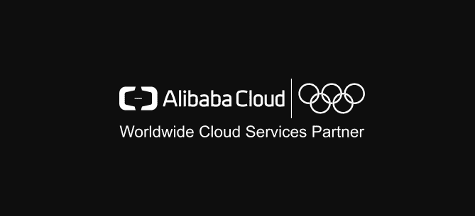](https://res.cloudinary.com/practicaldev/image/fetch/s--gTcGBqF_--/c_limit%2Cf_auto%2Cfl_progressive%2Cq_auto%2Cw_880/https://cdn-images-1.medium.com/max/669/1%2AHEg99iZqEL4rvyA7Wf5zVw.png)

当您使用微服务时，您总是希望确保相同服务的所有实例都是相同的，并且所有微服务可以轻松地相互通信，这就是容器化的用武之地，Docker 是最流行的容器化技术之一。在本文中，我们将了解如何从我们的 Bitbucket Repo 向阿里云容器服务部署一个简单的 Node.js 应用程序，然后我们将使用加密 SSL/TLS 来保护我们将使用的域。

这里是我们将使用的服务列表:

1.  码头工人
2.  Bitbucket
3.  阿里云容器注册中心
4.  阿里云容器服务
5.  节点. js
6.  让我们加密 SSL/TLS

**码头工人**

Docker 是一款开源软件，旨在通过使用容器来创建、部署和运行应用程序。容器允许开发人员将应用程序与它需要的所有部分打包在一起，比如库和其他依赖项，然后作为一个包发送出去。通过这样做，由于有了容器，开发人员可以放心，应用程序将在任何其他 Linux 机器上运行，而不管该机器的任何定制设置可能与用于编写和测试代码的机器不同。

容器有点像虚拟机。但与虚拟机不同的是，Docker 不是创建一个完整的虚拟操作系统，而是允许应用程序使用与运行它们的系统相同的 Linux 内核，并且只要求应用程序附带主机上尚未运行的东西。这极大地提高了性能，并减小了应用程序的大小。[了解更多> >](https://www.docker.com/)

在本教程中，我们将使用 Docker 来容器化我们的应用程序，因此我们可以在阿里云容器服务上部署和运行它。

**Bitbucket**

Bitbucket 是为专业团队设计的 Git 版本控制存储库管理解决方案。它为您提供了一个管理 git 存储库、协作开发源代码和指导开发流程的中心位置。它允许你创建最多 5 个合作者的无限的私有免费库。这使得它成为托管专有代码的最佳场所。[了解更多> >](https://bitbucket.org)

它的一些主要特点是:

1.  **访问控制**限制对你的源代码的访问。
2.  **工作流控制**执行项目或团队工作流。
3.  **拉请求**,带有内嵌注释，用于代码评审的协作。
4.  **吉拉集成**实现全面的开发可追溯性。
5.  如果市场上还没有定制的功能，可以使用完整的 Rest API 为您的工作流程定制功能

在本教程中，我们将使用 Bitbucket 来托管我们应用程序代码的存储库，并且我们将通过它创建一个 CI/CD 管道来将应用程序部署到阿里云容器服务。

**阿里云容器注册表**

阿里云容器注册表(ACR)是一个安全的映像托管平台，提供容器化的映像生命周期管理。使用 ACR，您可以完全控制您存储的图像。ACR 有许多特性，包括与 GitHub、Bitbucket 等的集成。它还可以在从源代码到应用程序的编译和测试之后自动构建新的映像。该服务简化了映像注册表的创建和维护，并支持多个地区的映像管理。结合容器服务等其他云服务，Container Registry 为在云中使用 Docker 提供了优化的解决方案。[了解更多> >](https://www.alibabacloud.com/help/doc-detail/60743.htm?spm=a3c0i.11159930.1160647.1.6a407ff9UHRqwk)

在本教程中，我们将使用 ACR 托管我们的 Docker 映像，稍后我们可以使用它在阿里云容器服务上部署我们的应用程序。

**阿里云容器服务**

阿里云容器服务(ACS)是一种高性能、可扩展的容器应用管理服务，使您能够使用 Docker 和 Kubernetes 来管理容器化应用的生命周期。

容器服务提供多种应用发布方式和持续交付能力，支持微服务架构。

容器服务简化了容器管理集群的建立，整合了阿里云虚拟化、存储、网络、安全能力，在云上创建最优的容器运行环境。[了解更多> >](https://www.alibabacloud.com/help/product/25972.htm?spm=a3c0i.87853.1090990.1.1066784ftqHAe2)

在本教程中，我们将使用阿里云容器服务来托管和部署我们的微服务。

**Node.js**

js 是一个异步事件驱动的 JavaScript 运行时环境。它旨在构建可伸缩的网络应用程序。节点运行时环境包括在您的机器上作为独立应用程序执行用 JavaScript 编写的程序所需的一切。Node.js 运行在 V8 JavaScript 运行时引擎上。这个引擎把你的 JavaScript 代码转换成更快的机器代码。机器码是计算机无需解释就能运行的低级代码。[了解更多> >](https://nodejs.org)

在本教程中，我们将使用 Node.js 创建一个简单的“Hello World”应用程序，并尝试部署 ACS。

**让我们加密 SSL/TLS**

让我们加密的是一个全球认证机构(CA)。它们让世界各地的人和组织获得、更新和管理 SSL/TLS 证书。网站可以使用这些证书来启用安全的 HTTPS 连接。Let's Encrypt 仅提供域验证(DV)证书。他们不收取这些证书的费用。Let's Encrypt 是一个非营利组织，其使命是通过促进 HTTPS 的广泛应用来创建一个更加安全和尊重隐私的网络。他们的服务免费且易于使用，因此任何网站都可以部署 HTTPS。[了解更多> >](https://letsencrypt.org/)

在本教程中，我们将使用加密 SSL/TLS 来保护我们的应用程序。

### 现在让我们开始吧

首先，我们将在 Bitbucket 上为我们的应用程序代码创建一个私有存储库，因此您必须有一个 Bitbucket 帐户，如果您没有，那么您可以注册一个帐户。然后，我们将使用阿里云服务来创建 Docker 映像并部署我们的容器化应用程序。所以，你还必须有一个阿里云账户。如果你没有，你可以注册一个账户。

### 第一部分:创建 Bitbucket Git 存储库，并在其中添加我们的应用程序和 Docker 配置

步骤 1:创建位存储库

首先，登录到您的 Bitbucket 帐户，单击左侧菜单栏中的“+”按钮，然后从选项中选择“存储库”，然后在“创建新存储库”表单中，提供存储库的名称。然后按“创建存储库按钮”。

[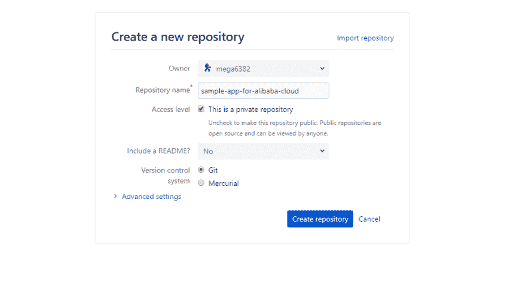](https://res.cloudinary.com/practicaldev/image/fetch/s--A73mUooR--/c_limit%2Cf_auto%2Cfl_progressive%2Cq_auto%2Cw_880/https://cdn-images-1.medium.com/max/1002/1%2AkuxLk2JZa2PwXJ6N2CCXww.png)

步骤 2:将应用程序和 Docker 文件添加到存储库中

现在我们已经成功地创建了存储库，我们开始将应用程序和 Docker 的文件添加到存储库中。

因此，首先，我们将在本地目录中初始化 git。首先，在您的本地机器上创建一个空目录，我们称之为“sample-app-for-alibaba-cloud ”,并在“Git Bash”或您喜欢的 CLI 中打开它。并在其中运行 git init 命令。

现在，我们将在该目录中添加文件。首先我们将添加我们的应用程序文件“app.js”，其内容如下:

```
const http = require('http');

const hostname = '127.0.0.1';
const port = 3000;

const server = http.createServer((req, res) => {
  res.statusCode = 200;
  res.setHeader('Content-Type', 'text/plain');
  res.end('Hello World\n');
});

server.listen(port, hostname, () => {
  console.log(`Server running at [http://${hostname}:${port}/`](http://%24%7Bhostname%7D:%24%7Bport%7D/%60));
}); 
```

Enter fullscreen mode Exit fullscreen mode

这将创建一个简单的“Hello World”应用程序，它将在 Node.js“内置”服务器的端口 3000 上运行。

现在，我们将添加 Docker 配置文件“Dockerfile”，内容如下:

```
# Use Node version 10.15.1
FROM node:10.15.1

# Create a directory where our app will be placed
RUN mkdir -p /usr/src/app

# Change directory so that our commands run inside this new directory
WORKDIR /usr/src/app

# Get all the code needed to run the app
COPY . /usr/src/app

# Expose the port the app runs in
EXPOSE 3000

# Serve the app
CMD node app.js 
```

Enter fullscreen mode Exit fullscreen mode

文件中的注释应该解释每一行的作用。该文件中的配置将用于确定如何为我们的应用程序创建容器映像。

现在，您应该准备好将这些文件推送到我们之前创建的 Bitbucket 存储库，这可以使用以下 git 命令来完成:

```
git add .

git commit -m "app.js and dockerfile added"

git remote add origin https://your-username@bitbucket.org/your-username/the-repo-name.git

git push -u origin master 
```

Enter fullscreen mode Exit fullscreen mode

### 第二部分:集成 Bitbucket 和 ACR

你需要做的第一件事就是激活阿里云容器注册表。它可以在你的阿里云控制台上的“弹性计算”部分找到。

它将带您到容器注册控制台，在那里您可以配置和部署服务。当时它可能会要求你输入 docker 客户端的密码，并记住“登录 docker 时，使用你刚才设置的用户名和密码的阿里云账户”。

现在，我们将创建一个新的 ACR 命名空间。通常容器用于创建微服务。尽管我们在应用程序中只使用单一服务，但在现实世界中通常不是这样。这就是 ACR 名称空间的由来，名称空间是存储库的集合，存储库是图像的集合。建议为每个应用程序创建一个名称空间，为每个服务映像创建一个存储库。

因此，要创建新的名称空间，请转到 ACR 控制台中的“名称空间”选项卡，然后单击右上角的“创建名称空间”按钮。然后输入名称空间的名称，并单击“确认”按钮。

[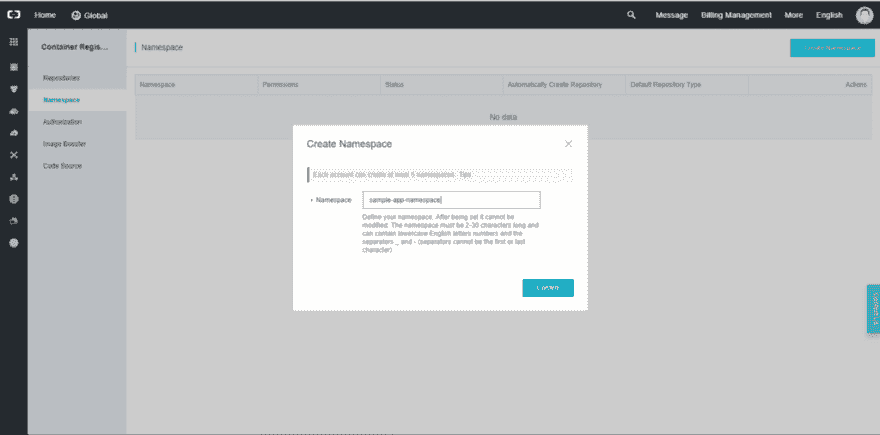](https://res.cloudinary.com/practicaldev/image/fetch/s--Yz4np3jA--/c_limit%2Cf_auto%2Cfl_progressive%2Cq_auto%2Cw_880/https://cdn-images-1.medium.com/max/1024/1%2ALOr--uRjLItQgU54YRSvRA.png)

现在，我们将把我们的 Bitbucket 帐户与 ACR 绑定。为此，请转到主 ACR 控制台上的“代码源”选项卡，在那里您应该单击 Bitbucket 旁边的“绑定帐户”按钮，这将提示一个小对话框，现在您应该单击“转到源代码库以绑定帐户”链接。

[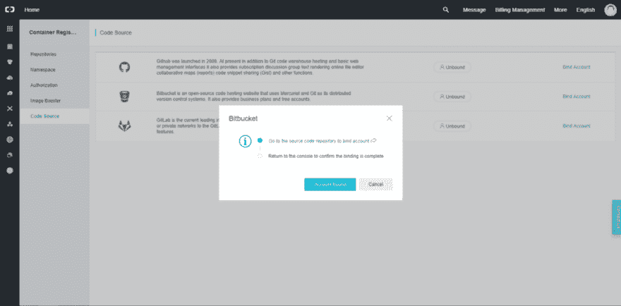](https://res.cloudinary.com/practicaldev/image/fetch/s--vWYJ6JMn--/c_limit%2Cf_auto%2Cfl_progressive%2Cq_auto%2Cw_880/https://cdn-images-1.medium.com/max/1024/1%2Ao6GGlKmaFVLLoSLephjnFw.png)

这将把你带到 Bitbucket，请求你授予访问阿里云的权限。在那里，您应该单击“授权访问”按钮继续。

[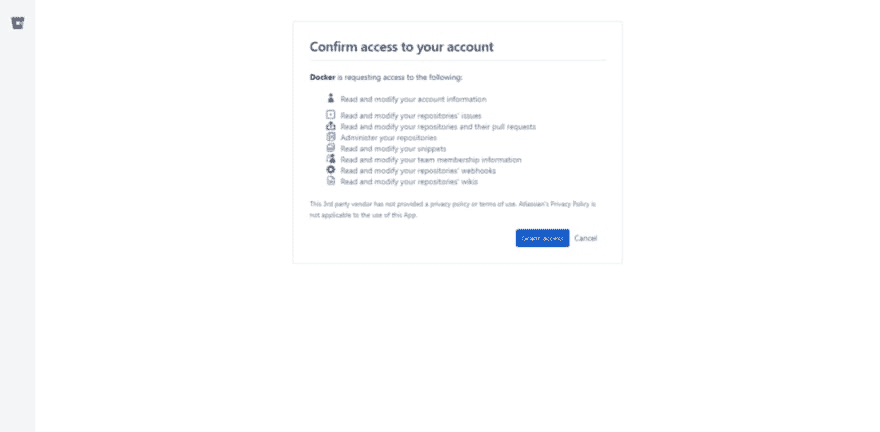](https://res.cloudinary.com/practicaldev/image/fetch/s--LRpRljs0--/c_limit%2Cf_auto%2Cfl_progressive%2Cq_auto%2Cw_880/https://cdn-images-1.medium.com/max/1024/1%2AWlTfDdcxEM2iG3-vgePAfg.png)

现在，您应该已经准备好创建 ACR 存储库了，为此，只需转到 ACR 控制台上的“存储库”选项卡，然后单击右上角的“创建存储库”按钮。它将显示一个表单，您必须在其中输入存储库的详细信息，如区域、名称空间、存储库名称、摘要等。

[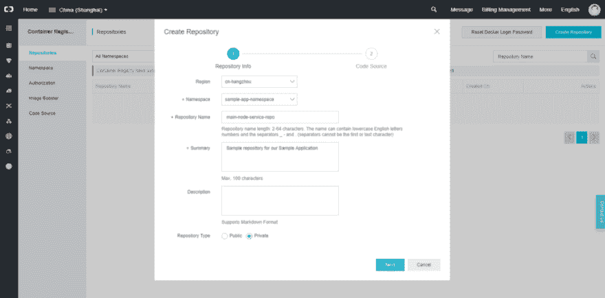](https://res.cloudinary.com/practicaldev/image/fetch/s--fLIl9gD---/c_limit%2Cf_auto%2Cfl_progressive%2Cq_auto%2Cw_880/https://cdn-images-1.medium.com/max/1024/1%2A_bhu1yFgPzKetOXENij7uQ.png)

填写完该部分后，单击“下一步”按钮。在下一页，它将为您提供一个选择“代码源”选项的表单。在这个页面上，我们将把我们的 **Bitbucket** 存储库与我们的 ACR 存储库集成在一起。从“Code Source”选项卡中选择“Bitbucket ”,然后单击我们之前创建的 Bitbucket 存储库。

为了帮助配置持续集成，请确保选中“自动构建映像”。选择此项后，在提交代码后，可以自动构建映像，而不需要您手动触发构建。现在，最后单击“Create Repository”按钮来创建 ACR 存储库，并将其与 Bitbucket 存储库集成在一起。

[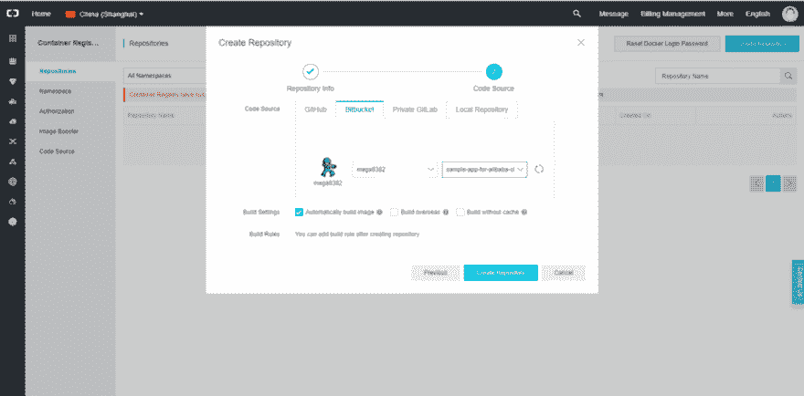](https://res.cloudinary.com/practicaldev/image/fetch/s--lEdmSBAK--/c_limit%2Cf_auto%2Cfl_progressive%2Cq_auto%2Cw_880/https://cdn-images-1.medium.com/max/1024/1%2AEhIPO9kyLdnxM6QJAPJVDA.png)

### 第三部分:部署应用

首先，我们需要创建一个 VPC，只需导航到“网络”下的虚拟私有云即可。这将把你带到 VPC 控制台，在那里你点击“创建 VPC”按钮来创建 VPC 和虚拟交换机。点击按钮后，您将看到一个小表单，为您的新 VPC 选择选项，我们将在很大程度上使用默认设置，只需输入姓名，然后点击“确定”按钮继续。

[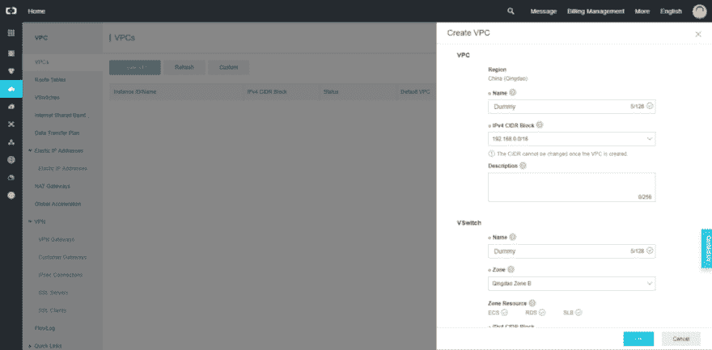](https://res.cloudinary.com/practicaldev/image/fetch/s--nX3Yt10B--/c_limit%2Cf_auto%2Cfl_progressive%2Cq_auto%2Cw_880/https://cdn-images-1.medium.com/max/1024/1%2AG44fLR9VXBZcqx-1Yhtj3g.png)

要开始使用阿里云云服务，我们需要做的第一件事是导航到容器服务仪表板。这个仪表盘可以在你的阿里云控制台上的弹性计算部分下找到。

第一次尝试时，它可能会向您显示一个警告“容器服务需要创建默认角色”。这是因为一旦你请求一个集群，阿里云将着手提供运行它所必需的资源。这包括负载平衡器、虚拟机、路由器等。基本上，运行自己的 Docker 集群所需的一切。负载平衡器要求在资源访问管理(RAM)服务工作之前设置它..要解决这个问题，只需点击“转到 RAM 控制台”按钮，一旦重定向，点击“确认授权策略”按钮。

这将最终把你带到容器服务概述页面，从那里选择左上角的“容器服务-Swarm ”,然后点击“创建集群”按钮。

[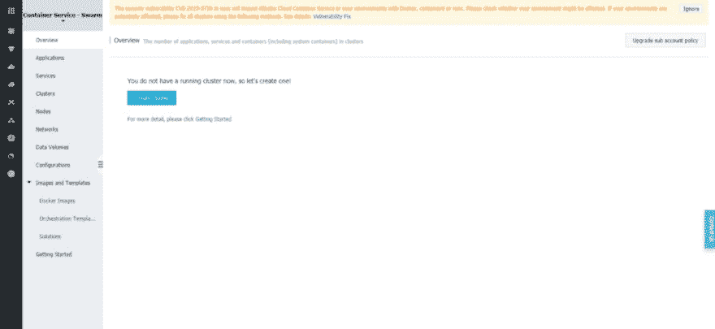](https://res.cloudinary.com/practicaldev/image/fetch/s--5mdr6p3u--/c_limit%2Cf_auto%2Cfl_progressive%2Cq_auto%2Cw_880/https://cdn-images-1.medium.com/max/1024/1%2AZEyNO7pxkwDLAZTTX37Dyg.png)

这将带您进入集群创建向导。它将为您提供配置群集所需的所有选项，例如名称、地区、区域、VPC 等。

[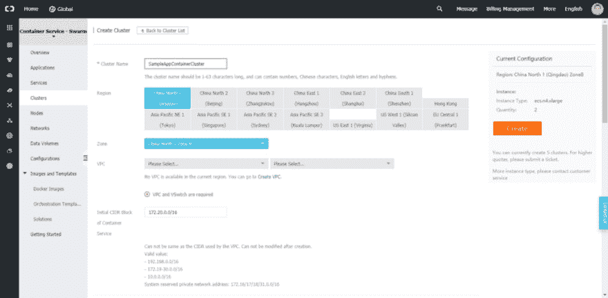](https://res.cloudinary.com/practicaldev/image/fetch/s--Aacy65LR--/c_limit%2Cf_auto%2Cfl_progressive%2Cq_auto%2Cw_880/https://cdn-images-1.medium.com/max/1024/1%2AMCg_lcPqqBmAQi1BHyv5rg.png)

我们将在很大程度上使用默认值，但出于本演示的目的，我们会将“实例配置”下的“实例类型”更改为“1 个核心 1 G ( ecs.n1.tiny)”。我们还需要为将为此群集创建的 ECS 实例设置登录，您将有两个选项“密钥对”或“密码”，请选择您喜欢的选项。配置完成后，单击“创建”按钮继续。然后，会出现一个对话框，提示您刚刚创建的群集的所有详细信息，确保一切正确，然后单击“OK”按钮继续。

[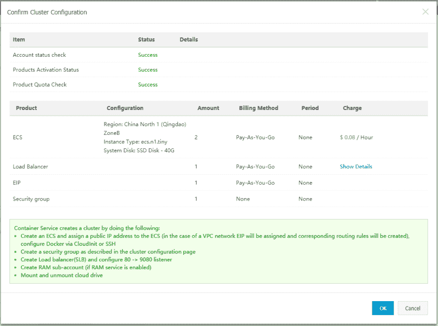](https://res.cloudinary.com/practicaldev/image/fetch/s--jEpN-LO8--/c_limit%2Cf_auto%2Cfl_progressive%2Cq_auto%2Cw_880/https://cdn-images-1.medium.com/max/1003/1%2AziQMwqjZJ-FkcLpkglY3mw.png)

现在我们将在 Bitbucket 上为我们的源代码创建一个标签(release ),这将自动在 ACR 中构建一个映像。为此，首先导航到我们之前创建的 Bitbucket 存储库的提交页面，并选择我们推入其中的最新提交。在该页面上，您会看到页面右侧有一个“标签”选项，旁边有一个“+”按钮，单击它打开对话框以创建一个新标签，对话框中有两个字段“名称”和“描述”，以“release-v*”的格式输入名称，例如“release-v1.0.0”，然后单击“创建标签”按钮。

[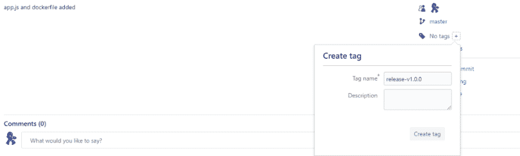](https://res.cloudinary.com/practicaldev/image/fetch/s--6DbZ3fqA--/c_limit%2Cf_auto%2Cfl_progressive%2Cq_auto%2Cw_880/https://cdn-images-1.medium.com/max/1024/1%2AxbVvnU7R2Ed7Xc9PPyReqQ.png)

接下来，导航回 ACR 控制台上的存储库，并单击我们之前创建的 ACR 存储库旁边的“manage”按钮。

[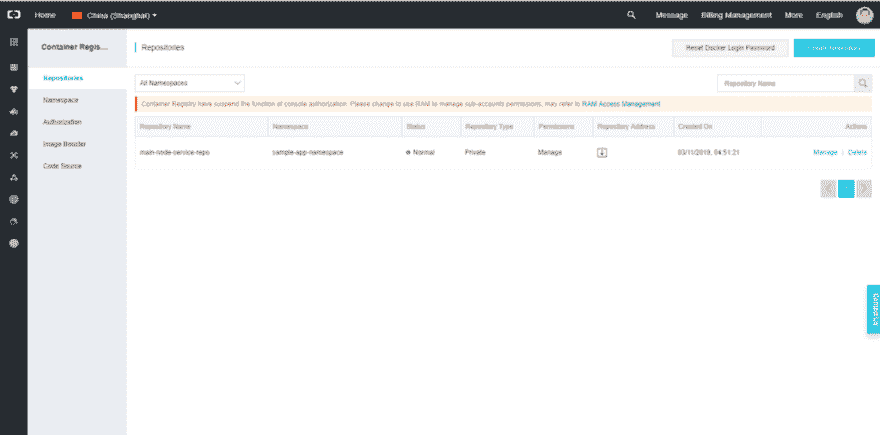](https://res.cloudinary.com/practicaldev/image/fetch/s--VRdHaHLN--/c_limit%2Cf_auto%2Cfl_progressive%2Cq_auto%2Cw_880/https://cdn-images-1.medium.com/max/1024/1%2AAd6o3vmH5QN4X2xtgaZyvw.png)

这将把您带到该库的详细信息页面，在那里您将找到您的库的所有详细信息，例如名称、地区、类型、代码库链接、互联网地址、VPC 地址等。从那里导航到“Build”选项卡，在“Build Log”下，您将找到我们之前创建的标记的版本。构建状态为“成功”后，单击右上角的“部署应用程序”按钮，会出现一个小对话框，您可以在其中配置部署选项，如“存储库地址”和“容器集群”。对于“容器集群”选项，选择“Swarm ”,然后单击“部署”按钮。

[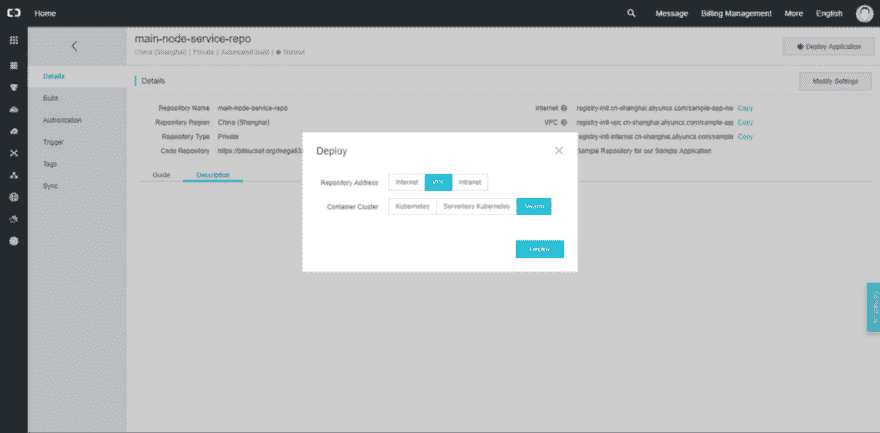](https://res.cloudinary.com/practicaldev/image/fetch/s--QiTudqxi--/c_limit%2Cf_auto%2Cfl_progressive%2Cq_auto%2Cw_880/https://cdn-images-1.medium.com/max/1024/1%2A5XfeFaC3mz9hUreEbW2Krg.png)

这将带您进入 ACS 应用程序创建向导。在“基本信息”选项卡上，将为您提供名称、版本、集群、更新和描述等选项。输入名称并选择我们之前创建的集群，然后选中“Pull Docker Image”并单击“Next”按钮继续。

[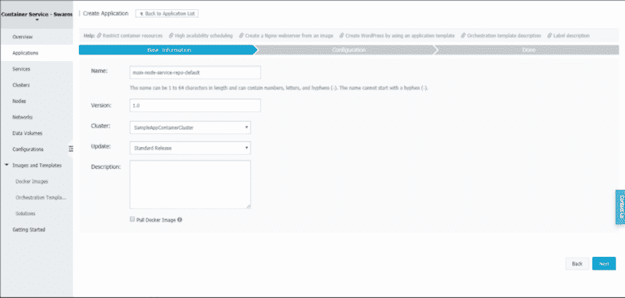](https://res.cloudinary.com/practicaldev/image/fetch/s--GPX3ftGi--/c_limit%2Cf_auto%2Cfl_progressive%2Cq_auto%2Cw_880/https://cdn-images-1.medium.com/max/1024/1%2AszM4Dn1KheZxRZzkiSaFSQ.png)

这将带您进入创建向导的“配置”选项卡。在这里，您应该选择 Docker 容器的“镜像名称”和“镜像版本”,并在“端口映射”下使用“3000”作为“主机端口”。然后继续在“Web routing”下添加端口和域。您还会在该页面上找到许多其他配置选项，但是出于本文的目的，我们将使用它们的默认值。现在，单击“创建”按钮，最终创建应用程序。

[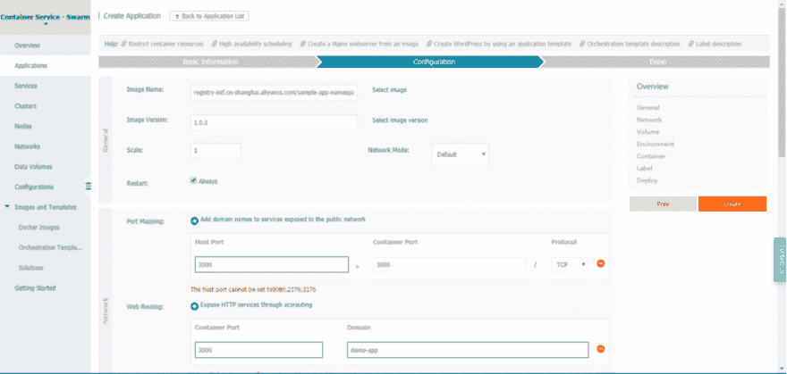](https://res.cloudinary.com/practicaldev/image/fetch/s--GrX-KnjI--/c_limit%2Cf_auto%2Cfl_progressive%2Cq_auto%2Cw_880/https://cdn-images-1.medium.com/max/1024/1%2APrXNCsvPHG-1A-jloUTn4w.png)

然后，在“完成”页面上，单击“查看应用程序列表”链接，继续转到“应用程序列表”页面，在那里您将找到我们刚刚创建的应用程序，单击它即可转到该应用程序的概述页面。然后单击“Routes”选项卡，获取我们的应用程序的访问端点。

[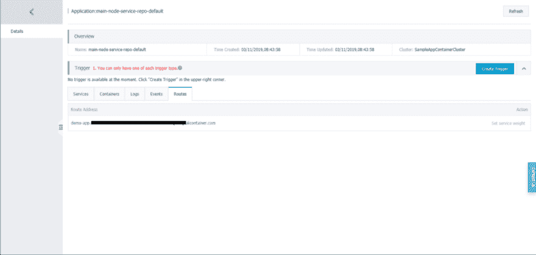](https://res.cloudinary.com/practicaldev/image/fetch/s--Vpu6p6dG--/c_limit%2Cf_auto%2Cfl_progressive%2Cq_auto%2Cw_880/https://cdn-images-1.medium.com/max/1024/1%2ADpF_vumOkMGHP-3BK_S1Gg.png)

好了，我们已经成功部署了我们的容器化应用程序。现在，到了最后一部分。

### 第四部分:用加密 SSL/TLS 来保护我们的应用程序

要开始做这个，你应该先浏览一下 John Hanley 关于配置的指南[让我们在阿里云上加密 ACME](https://www.alibabacloud.com/blog/let%27s-encrypt-acme-on-alibaba-cloud-%E2%80%93-part-1_593777?spm=a2c65.11461447.0.0.63f55dd7z2KNy2)。现在，一旦您完成了所有的配置并创建了证书文件，就可以继续执行前面提到的步骤了。

因为服务器负载平衡器层支持 HTTPS。为了支持 HTTPS，我们需要创建一个服务器负载平衡器证书。为此，请导航到“网络”下的服务器负载平衡器控制台，然后通过单击左侧面板中的“证书”链接进入“证书”页面。然后点击“创建证书”按钮，然后选择“上传第三方证书”选项，并点击“下一步”按钮。

[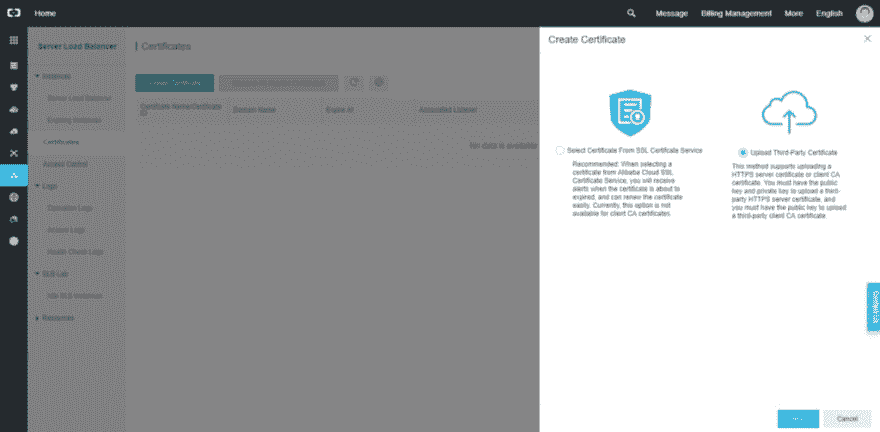](https://res.cloudinary.com/practicaldev/image/fetch/s--1knzXQeb--/c_limit%2Cf_auto%2Cfl_progressive%2Cq_auto%2Cw_880/https://cdn-images-1.medium.com/max/1024/1%2AK4yQ1dnQEHaaRKtovDZelQ.png)

这将带您“上传第三方证书”，填写所需信息，然后单击“下一步”按钮。

[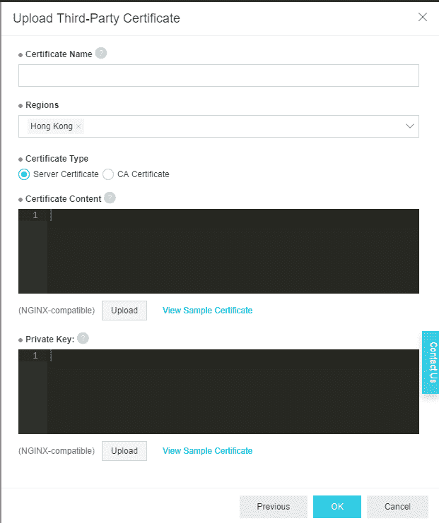](https://res.cloudinary.com/practicaldev/image/fetch/s--pZGnbdbn--/c_limit%2Cf_auto%2Cfl_progressive%2Cq_auto%2Cw_880/https://cdn-images-1.medium.com/max/621/1%2A5Ja48qvMROK1GO_UQ0dkLA.png)

成功创建证书后，导航到服务器负载平衡器页面，找到并单击在群集创建期间分配的服务器负载平衡器实例。进入后，单击“Listeners”选项卡下的“Add Listener”按钮。

[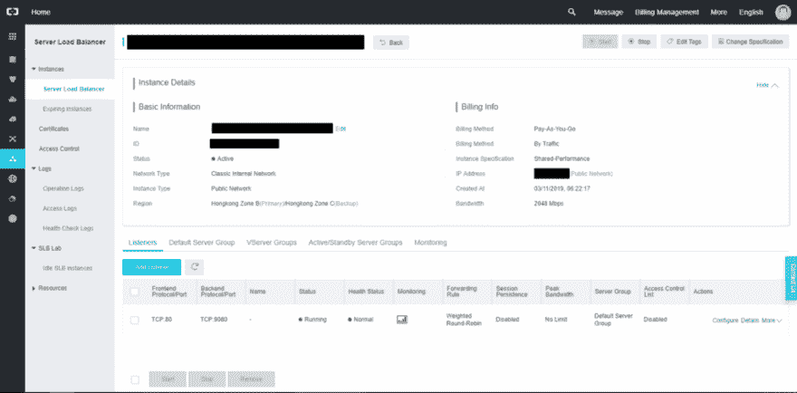](https://res.cloudinary.com/practicaldev/image/fetch/s--llOAHXbR--/c_limit%2Cf_auto%2Cfl_progressive%2Cq_auto%2Cw_880/https://cdn-images-1.medium.com/max/1024/1%2Ac6JKrKf11x4rF_WtCbHlIw.png)

这将打开添加侦听器的向导，从这里开始，您应该按照这个指南将 [HTTP 更改为 HTTPS](https://www.alibabacloud.com/help/doc-detail/25987.htm) 来填写向导。完成后，您就可以使用容器化的应用程序了，这个应用程序是用加密 SSL/TLS 来保护的。