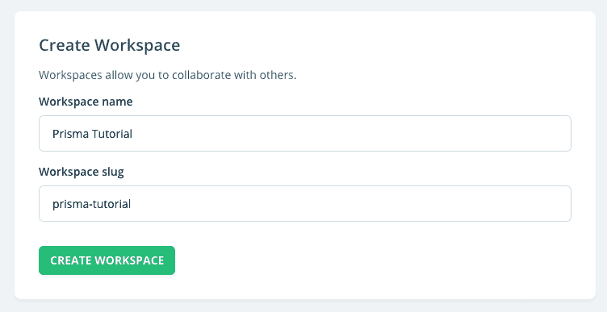
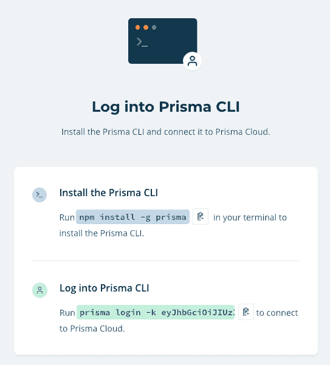
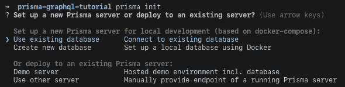
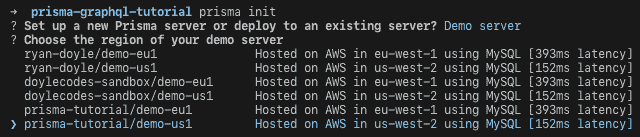
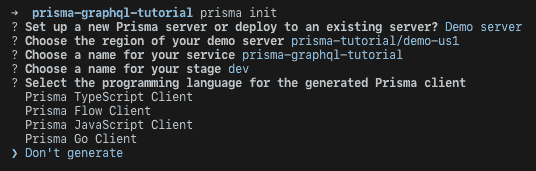
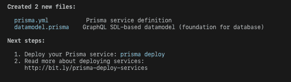
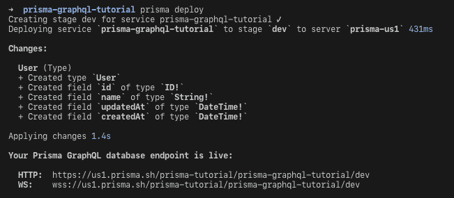
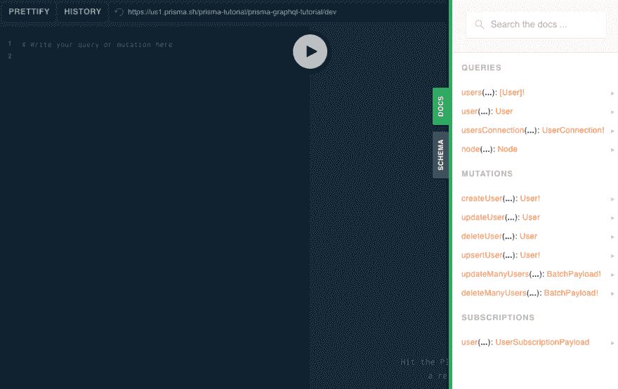
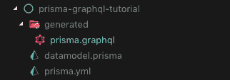

# GraphQL 基础:第 2 部分- Prisma(如何)

> 原文：<https://dev.to/doylecodes/graphql-basics-part-2---prisma-the-how-1356>

## 棱镜(The How)

这是从我的上一篇文章开始的，[第一部分- Prisma(为什么)](https://dev.to/ryanmdoyle/graphql-basics-part-1---prisma-the-why-45h0)我在文章中看到了为什么你会想把 Prisma 用于你的数据库。我不再赘述了，如果你愿意，你可以去看看。这篇文章将讲述如何在设置 GraphQL 服务器之前安装并运行 Prisma。这将非常类似于在 [Prisma](//htttps://www.prisma.io) 的演练，但我想在这个过程中加入一些新人的经验。希望这能对其他入门者有所帮助！

## 初始设置

你需要做的第一件事就是去 [Prisma](//htttps://www.prisma.io) 那里创建一个账户。登录后，假设您还没有任何工作区，您需要创建一个工作区。这里我将为这个例子创建一个新的。
[](https://res.cloudinary.com/practicaldev/image/fetch/s--iGFnuuK4--/c_limit%2Cf_auto%2Cfl_progressive%2Cq_auto%2Cw_880/https://res.cloudinary.com/dwut3uz4n/image/upload/v1552264675/Screen_Shot_2019-03-10_at_9.49.36_AM.png) 
创建工作空间后，您需要部署一个新的 Prisma 服务。点击“添加服务”按钮。

此时，系统会要求您安装 Prisma CLI 并登录。在做这个之前，我其实先在我的电脑上设置了一个名为‘prisma-graph QL-tutorial’的文件夹。
[T3】](https://res.cloudinary.com/practicaldev/image/fetch/s--WG0Gw_-M--/c_limit%2Cf_auto%2Cfl_progressive%2Cq_auto%2Cw_880/https://res.cloudinary.com/dwut3uz4n/image/upload/v1552264675/Screen_Shot_2019-03-10_at_9.53.12_AM.png)

登录后，系统会提示您运行`prisma init hello-world`，这将创建一个目录 *hello-world* ，并询问一些问题。因为我已经为我的项目建立了一个文件夹，我只是输入了`prisma init`，得到了如下提示:
[](https://res.cloudinary.com/practicaldev/image/fetch/s--7wTNEtQS--/c_limit%2Cf_auto%2Cfl_progressive%2Cq_auto%2Cw_880/https://res.cloudinary.com/dwut3uz4n/image/upload/v1552264675/Screen_Shot_2019-03-10_at_4.03.23_PM.png)

我们要做的是选择**演示服务器。这是一个不错的免费数据库，允许每 10 秒钟 10 次读/写(我想，我是在某个地方读到的)。再多一点，他们就会排队，这很好。**

接下来，我们被要求提供我们的演示服务器所在的区域，因此我选择了我使用西海岸服务器为此创建的工作区(您可以检查最佳延迟)。
[T3】](https://res.cloudinary.com/practicaldev/image/fetch/s--3MQS4Ji---/c_limit%2Cf_auto%2Cfl_progressive%2Cq_auto%2Cw_880/https://res.cloudinary.com/dwut3uz4n/image/upload/v1552264675/Screen_Shot_2019-03-10_at_4.07.41_PM.png)

最后，要求您输入服务的名称、阶段的名称以及 Prisma 客户机的编程语言。您只需按 enter/return 键输入默认名称，然后我为 Prisma 客户端选择了**“不生成”**。老实说，这是因为我一直都是这么做的...我想，无论如何，对于那些使用 JS 以外的东西继续这样做的人来说，这可能会更有用。
T3T5】

然后，您应该会看到以下内容:
[](https://res.cloudinary.com/practicaldev/image/fetch/s---DJdSPg4--/c_limit%2Cf_auto%2Cfl_progressive%2Cq_auto%2Cw_880/https://res.cloudinary.com/dwut3uz4n/image/upload/v1552264675/Screen_Shot_2019-03-10_at_4.13.22_PM.png)
*prisma . yml*文件是一个文件，我们可以使用它来帮助定义我们在部署/生成事物时希望 Prisma 发生的事情，等等。除了添加一些设置，自动为我们生成一些文件之外，我在这里没有做太多的事情，我将在后面做。文件 *datamodel.prisma* 是我们定义所有进入数据库的东西的地方。演示通过 AWS 使用 mySQL 数据库，但在使用 Prisma 之前，我一直使用 Mongo Atlas 和 mongoose。如果您也习惯于 mongose 和 Mongo，那么 datamodel 类似于在 mongose 中创建模式和模型。

## 部署

此时，您的目录中应该有两个文件，分别是 *datamodel.prisma* 和 *prisma.yml* 。我这边是这样的:
[](https://res.cloudinary.com/practicaldev/image/fetch/s--TMzADfAg--/c_limit%2Cf_auto%2Cfl_progressive%2Cq_auto%2Cw_880/https://res.cloudinary.com/dwut3uz4n/image/upload/v1552264675/Screen_Shot_2019-03-10_at_4.20.41_PM.png)

最后，因为我们只是盲目地执行命令，所以我们做了终端要求我们做的事情，运行`prisma deploy`并看到这个:
[](https://res.cloudinary.com/practicaldev/image/fetch/s--q3SxNXC5--/c_limit%2Cf_auto%2Cfl_progressive%2Cq_auto%2Cw_880/https://res.cloudinary.com/dwut3uz4n/image/upload/v1552264675/Screen_Shot_2019-03-10_at_4.21.35_PM.png) 
那么，发生了什么呢？为什么我们刚刚创建了包含所有这些字段的“用户”类型？嗯，那是因为当我们执行 prisma init 时，我们实际上有一个**用户**类型预填充了 *datamodel.prisma* 文件，所以部署本质上是告诉 prisma，“嘿，这就是我想要的数据库。施展你的魔法吧！”打开你的 *datamodel.prisma* 就能看到。

```
type User {
  id: ID! @unique
  name: String!
} 
```

Enter fullscreen mode Exit fullscreen mode

在这一点上，你也给了 2 个链接，就在“你的 Prisma GraphQL 数据库端点是活的”下面。如果你跟着链接走，你会看到一个不可思议的游乐场。在右边的选项卡中，您可以看到数据库 API 和模式的所有“文档”，这些文档都是根据您在 *datamodel.prisma* 中设置的数据模型创建的。
T3T5】

## prisma . yml 设置

所以这个游乐场很棒，但也仅此而已。db 的游乐场。我设置的下一个东西是 prisma 客户机，我还添加了一个钩子来将整个模式下载到我的项目中。

如果你转向 *prisma.yml* ，你最初只会看到“端点”和“数据模型”。端点就是操场所在的位置，数据模型是你的数据模型的文件名，所以你可以把它重命名为“schema.prisma ”,然后改变在 *prisma.yml* 中的位置，这样 prisma 就知道你在哪里定义你的 prisma 数据模型。不是火箭科学。

我添加的基础是秘密、生成对象和钩子。你可以在这里看到:

```
endpoint: http://whateverYourEndpointIs
datamodel: datamodel.prisma
secret: putSomethingHere
generate: 
  - generator: graphql-schema
    output: ./generated/
hooks:
  post-deploy:
    - prisma generate 
```

Enter fullscreen mode Exit fullscreen mode

这些设置:

*   **秘密:**使用 JWT 令牌进行身份验证时使用的秘密。
*   **生成:**这是一个对象，表示你想要某种格式的“客户端”(基本上就是你在操场上看到的 Prisma Schema 的文件)。
    *   生成器:您需要的模式类型。我相信它只接受`typescript-client`、`javascript-client`、`go-client`或`graphql-schema`。老实说，我不太确定使用`graphql-schema`和使用`javascript-client`有什么区别。我只用过 graphql，所以除非有聪明人来启发我，否则我会坚持使用`graphql-schema`。
    *   输出:您希望文件出现在项目中的什么位置？
*   **钩子:**你可以在这里设置各种钩子，但是我这里想要的是每次我们部署到 Prisma 的时候运行`prisma generate`。

耶！最后一步...

## 生成客户端&调拨单

**生成 prisma.graphql**
好了，现在你应该继续运行`prisma generate`。接下来，您应该会在终端上看到一个提示，提示我们正在“生成模式”，并最终“在/某个地方保存 Prisma GraphQL 模式(SDL)”。您还应该看到项目中的新结构！
[](https://res.cloudinary.com/practicaldev/image/fetch/s--wAXMIKad--/c_limit%2Cf_auto%2Cfl_progressive%2Cq_auto%2Cw_880/https://res.cloudinary.com/dwut3uz4n/image/upload/v1552264675/Screen_Shot_2019-03-10_at_5.04.07_PM.png) 
(不要忘记在你运行`prisma generate`之前像我第一次一样保存 prisma.yml，因为什么都不会发生，你会觉得你的生活很糟糕)

如果你打开 *prisma.graphql* 文件，你会看到 prisma 为你创建的所有模式！

**添加到 datamodel.prisma 和重新部署**
基本上，在运行上面的`prisma generate`之后，就可以开始了！问题是，您的数据库中可能不止有一个简单的用户。任何时候你想要添加另一个“类型”到你的数据库中，你需要首先在你的 *datamodel.prisma* 中定义它，然后再次部署到 prisma。就这么办吧。

首先，使用 [GraphQL SDL](https://graphql.org/learn/schema/#type-language) 创建新的类型。我将一个“Item”类型添加到我的模式中，该模式具有必需的 itemId(！idspnonenote)。)并且对每个项目都是唯一的(@uniqe)。名称和成本需要使用！，而描述是可选的。

```
type User {
  id: ID! @unique
  name: String!
}

type Item {
  itemId: ID! @unique
  name: String!
  cost: Int!
  shortDescription: String
  longDescription: String
} 
```

Enter fullscreen mode Exit fullscreen mode

一旦我们添加了希望存储在数据库中的新类型数据，我们就可以重新部署到 Prisma。记住，我们必须这样做，因为当你把 T2 部署到 Prisma 时，Prisma 实际上就创建了模式。因此，我们可以在控制台中再次`prisma deploy`。(别忘了先保存 *datamodel.prisma* ！)
[](https://res.cloudinary.com/practicaldev/image/fetch/s--jBrg1eYL--/c_limit%2Cf_auto%2Cfl_progressive%2Cq_auto%2Cw_880/https://res.cloudinary.com/dwut3uz4n/image/upload/v1552264675/Screen_Shot_2019-03-10_at_5.26.14_PM.png) 
如果一切顺利，您应该看到“Item”类型以及所有创建的字段都已创建。

此外，您应该注意到，由于我们在 prisma.yml 文件中设置了`prisma generate` post-deploy 挂钩，prisma . graph QL“client”已经重新生成并更新。如果一切都解决了，你应该可以在 *prisma.graphql* 文件中看到为用户类型和项目类型定义的所有东西。

## 下一步

下一步是创建一个 GraphQL 友好的服务器。目前，我们只直接访问为我们创建的操场，但如果我们要制作一个应用程序，我们需要有一个服务器与我们的数据库通信。这是[下一篇文章](https://dev.to/ryanmdoyle/graphql-basics-part-3---graphql-server-531d)的目标，我们将在那里设置一个 GraphQl Yoga 服务器。

* *顺便说一句，我对这一切都非常陌生，所以如果你有更多的知识想在评论中发表，请发表吧！*

## 文章不再可用