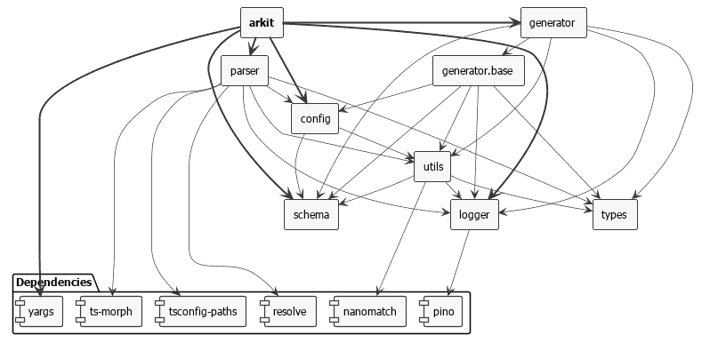

# 将 JavaScript、类型脚本和流代码库可视化为有意义且可提交的架构图

> 原文：<https://dev.to/dyatko/visualise-javascript-typescript-and-flow-codebases-as-meaningful-and-committable-architecture-diagrams-58k5>

*   支持 JavaScript、Node.js、TypeScript 和流代码
*   识别、连接和分组已配置的架构组件
*   可视化架构的所有组件或某些部分
*   将代码库可视化导出为 SVG、PNG 或工厂 UML 图
*   融入开发流程，让您的 CI、VCS、README 和 PRs 满意

