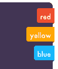
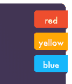
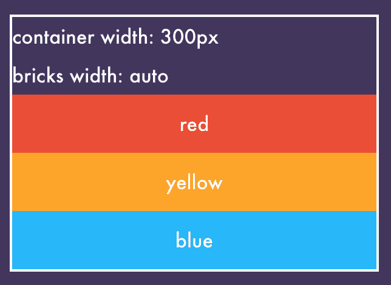
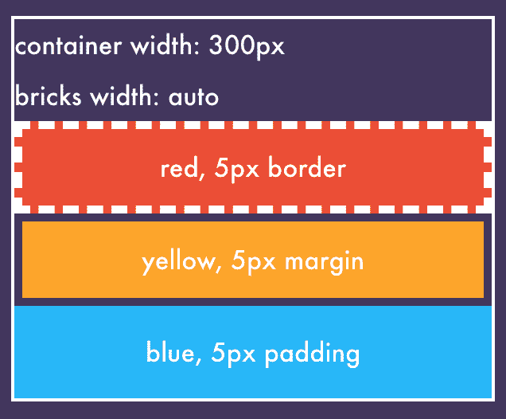

# 用盒子模型确定内容宽度

> 原文：<https://dev.to/wgao19/content-width-determination-with-the-box-model-5mb>

我正在做一个这样的设计，它包含一些像这样排列在一个角上的徽章。这些徽章的内容是不固定的，所以我不知道每个徽章的确切宽度。然而，设计要求它们具有灵活的宽度。

我做了基本的 CSS，结果是这样的:

在我看来，它们看起来很整洁，但是设计师坚持让它们各自设定自己的宽度😝

[https://codepen.io/wgao19/embed/VRzLvm?height=600&default-tab=result&embed-version=2](https://codepen.io/wgao19/embed/VRzLvm?height=600&default-tab=result&embed-version=2)

## 直觉来自规范

我再次决定在规范中寻找答案。幸运的是，由于我已经阅读了规范的许多部分，我大致知道在哪里可以找到——查看[CSS 如何确定内容宽度](https://www.w3.org/TR/CSS2/visudet.html#Computing_widths_and_margins)。

这里有十个非人类语言的例子🙈请杀了我。

1.  内联、非替换元素
2.  内嵌，替换的元素
3.  正常流程中的块级非替换元素
4.  块级，正常流程中被替换的元素
5.  浮动、不可替换的元素
6.  浮动、替换的元素
7.  绝对定位、不可替换的元素
8.  绝对定位，替换元素
9.  '内嵌块'，正常流程中的非替换元素
10.  内嵌块'，替换正常流程中的元素

如果你和我一样，一边看 CSS 规范一边注册“同义词库”，我们来交换字典吧:每当我看到“用户代理”的时候，我就会想到“浏览器”。现在轮到你了..

无论如何，在我看来，这 10 个案例是在“非替代”和“替代”元素之间交替出现的。我对“替换”元素的同义词是“img”。我现在不关心图像，这使我的目标减半。我的元素不是“内联的”，也不是“浮动的”，不是“绝对定位的”，也不是“内联块的”。然后我找到了我的箱子！

> **10.3.3 块级，正常流程中不可替换的元素**
> 
> 在其他属性的已用值中，必须包含以下约束:
> [‘左边空白’](https://www.w3.org/TR/CSS2/box.html#propdef-margin-left)+[+](https://www.w3.org/TR/CSS2/box.html#propdef-border-left-width)[‘左边空白’](https://www.w3.org/TR/CSS2/box.html#propdef-padding-left)+[‘宽度’](https://www.w3.org/TR/CSS2/visudet.html#propdef-width)+[‘右边空白’](https://www.w3.org/TR/CSS2/box.html#propdef-padding-right)+[‘右边空白’](https://www.w3.org/TR/CSS2/box.html#propdef-border-right-width)+[‘右边空白’](https://www.w3.org/TR/CSS2/box.html#propdef-margin-right)=包含块的[的宽度](https://www.w3.org/TR/CSS2/visudet.html#containing-block-details)

乍一看，这个等式似乎是一个同义反复。但是这里真正起作用的是:有时会有冲突的(CSS 的术语:过度约束的)值，有时没有足够的值。本节描述应如何处理这些情况，以满足该等式:

> 如果“width”不是“auto”，并且“border-left-width”+“padding-left”+“width”+“padding-right”+“border-right-width”(加上任何不是“auto”的“margin-left”或“margin-right”)大于包含块的宽度，则对于以下规则，“margin-left”或“margin-right”的任何“auto”值都被视为零。

也就是说，如果`width`不是`auto`，并且所需的总空间大于现有的空间，那么任何`auto`都为 0。

> 如果上述所有值都有一个非“自动”的计算值，则这些值被称为“过度约束”，其中一个使用的值必须与其计算值不同。如果包含块的[‘方向’](https://www.w3.org/TR/CSS2/visuren.html#propdef-direction)属性的值为‘ltr’，则忽略指定的值[‘margin-right’](https://www.w3.org/TR/CSS2/box.html#propdef-margin-right)，并计算该值以使等式成立。如果[‘方向’](https://www.w3.org/TR/CSS2/visuren.html#propdef-direction)的值是‘RTL’，这种情况会发生在[‘左边距’](https://www.w3.org/TR/CSS2/box.html#propdef-margin-left)上。

也就是说，如果指定了所有这些值，那么其中一个指定的值将放弃它的约束，只占用剩余的空间。根据你是从左到右还是从右到左阅读，后面的那一面的`margin`成为这个候选。

> 如果恰好有一个值被指定为“auto ”,则它的已用值遵循等式。

完全说得通，对吧？

> 如果[‘宽度’](https://www.w3.org/TR/CSS2/visudet.html#propdef-width)设置为‘自动’，任何其他‘自动’值变为‘0’，并且[‘宽度’](https://www.w3.org/TR/CSS2/visudet.html#propdef-width)遵循由此产生的等式。

我对这一行的理解是: **`width`有一个`auto`优先于其他`auto`值**，也就是说，如果所有人都是`auto`，那么`width`就占据了整个剩余空间，其他人都变成了 0。同样，这是有意义的，因为我实际上不希望这些填充和空白出现，除非我指定它们。

由此可见，如果周围有指定的值，`width`将会自我调整，同时仍然比其他`auto`值具有更高的优先级，从而占据整个剩余空间。

这是这两幅插图的代码笔链接。

[https://codepen.io/wgao19/embed/WmOYve?height=600&default-tab=result&embed-version=2](https://codepen.io/wgao19/embed/WmOYve?height=600&default-tab=result&embed-version=2)

最后，

> 如果[【左边距】](https://www.w3.org/TR/CSS2/box.html#propdef-margin-left)和[【右边距】](https://www.w3.org/TR/CSS2/box.html#propdef-margin-right)都为“自动”，则它们的使用值相等。这将使元素相对于包含块的边缘水平居中。

这里是每个人都在使用的`margin: 0 auto`技巧🙂

剩下的 9 个部分要么有着相似的精神，要么遵循着一种服务于上下文的逻辑。

## 几个问题的解决方法

`display: inline` on children 自由设置宽度，但也使它们出现在同一行上。

**浮动元素**

也为那些子节点自由设置宽度，但是我需要为父节点设置一个特定的宽度。
父宽度需要强制每个元素换行。
否则子节点仍然会出现在同一行，这不会产生想要的设计。
然而，这并不像是一个整洁的实现，所以我对此并不满意。

[https://codepen.io/wgao19/embed/pYwQVR?height=600&default-tab=result&embed-version=2](https://codepen.io/wgao19/embed/pYwQVR?height=600&default-tab=result&embed-version=2)

另一个解决方案是将它们包装在一个额外的`block` div 中，然后将具有`float: right`或`display: inline`的剪辑放入其中，这给了它们自由的宽度。但我也不喜欢那样。

**Flexbox 创建灵活宽度的行**

我最终选择了`flex-box`，[笔名](https://codepen.io/wgao19/pen/XGNOXe)。
阅读 flexbox 规格比我想象的更新鲜。
所以我会跟进一个专门针对它的帖子:】

[https://codepen.io/wgao19/embed/XGNOXe?height=600&default-tab=result&embed-version=2](https://codepen.io/wgao19/embed/XGNOXe?height=600&default-tab=result&embed-version=2)

那么，回头见

## 链接

*   [CSS 2 - 10 可视化格式模型详情](https://www.w3.org/TR/CSS2/visudet.html)