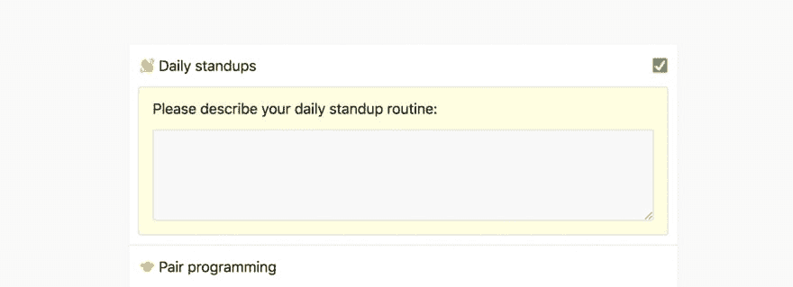
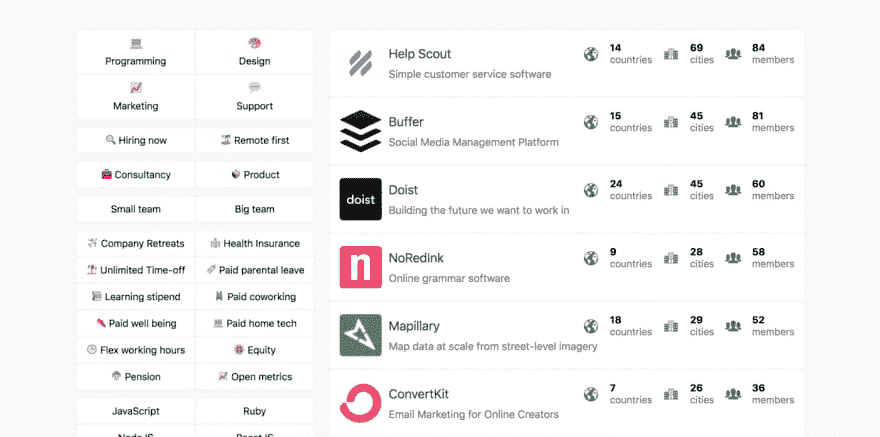

# 远程团队中的工程文化

> 原文：<https://dev.to/raunometsa/engineering-culture-in-a-remote-team-10cj>

在考虑加入远程公司之前，您想了解他们的工程文化吗？

我的网站 [RemoteHub](http://remotehub.io) 上目前列出了 **1，700 多家远程公司**——你可以根据他们的规模、技术组合、福利等来搜索远程团队。团队还列出了**1200 多个他们工作的偏远城市。**

我现在开始更多地了解他们的开发文化——我的计划是列出一些工程主题，并要求他们选择符合快速描述的内容:

到目前为止，我列出了以下清单:

👋每日站立
🤝结对编程
⚡️敏捷软件开发
🚚连续交货
🔓开源贡献者
👶适合初级开发人员

然后，我可以将这些添加到我在远程公司页面上的过滤器中，并将它们与现有选项相结合，您可以运行类似于“小型远程公司，现在有公司务虚会和每日站立招聘”的搜索。

你想了解远程公司的工程文化？