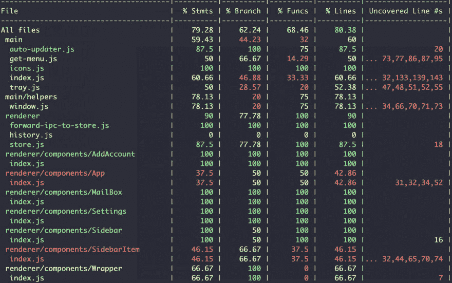

# 合并电子测试的覆盖报告

> 原文：<https://dev.to/kontrollanten/combine-coverage-reports-from-electron-tests-1if6>

我们使用[电子摩卡](https://github.com/jprichardson/electron-mocha)来测试主进程，使用 [jest](http://jestjs.io) 来测试 [ProtonMail 非官方桌面](https://github.com/protonmail-desktop/application)应用的渲染器进程。为了跟踪测试覆盖率，我们想要创建覆盖率报告并发送给 [codecov](https://codecov.io) ，但是这比我最初想的要麻烦。

在电子摩卡 GitHub 回购中有一条好线索帮助了我们。但是为了在一个地方收集所有信息，我将描述我们是如何解决它的。

# 用笑话报道

因为 jest 有现成的覆盖支持，所以唯一需要的就是`yarn jest --coverage`。简单。

# 报道用电子摩卡

这可不像开玩笑那么简单。首先，我添加了 [babel-plugin-istanbul](https://www.npmjs.com/package/babel-plugin-istanbul) 到[仪器](https://en.wikipedia.org/wiki/Instrumentation_(computer_programming))代码中，这使得追踪覆盖率成为可能。

.babelrc.js

```
 "env": {
      "test_main": {
        "plugins": ["istanbul"]
      }
    }, 
```

我没有让 babel-plugin-istanbul 与纽约的[一起工作，所以我从](https://www.npmjs.com/package/babel-plugin-istanbul#mocha-on-nodejs-through-nyc) [bennyn](https://github.com/bennyn) 那里取了[这个解决方案](https://github.com/jprichardson/electron-mocha/issues/135#issuecomment-464082312)，它只是将覆盖数据保存到`coverage/coverage-main.json`:

src/main/tests/coverage-after . spec . js

```
import path from 'path';
import fs from 'fs-extra';

const writeCoverageReport = coverage => {
  const outputFile = path.resolve(process.cwd(), 'coverage/coverage-main.json');
  fs.outputJsonSync(outputFile, coverage);
};

after(() => {
  if (process.env.NODE_ENV === 'test_main') {
    console.info('--- Writing coverage report');
    writeCoverageReport((global).__coverage__);
  }
}); 
```

为了创建覆盖率报告，我们运行`yarn cross-env NODE_ENV=test_main yarn electron-mocha --require @babel/register src/main/**/*.spec.js src/main/*.spec.js`。

这个解决方案有一个问题。它将只显示测试所包含的文件的覆盖率。如果你没有任何测试，你会得到 100%的覆盖率。万能的贝宁也有一个解决方案；在创建覆盖率报告之前需要所有的 JS 文件。在我们的例子中，结果是这样的:

src/main/tests/coverage-after . spec . js

```
import glob from 'glob';
import path from 'path';
import fs from 'fs-extra';

const writeCoverageReport = coverage => {
  const outputFile = path.resolve(process.cwd(), 'coverage/coverage-main.json');
  fs.outputJsonSync(outputFile, coverage);
};

// Load all source files to get accurate coverage data
const loadSourceCode = () => {
  const intrumentedCode = path.join(__dirname, '..');

  glob(`${intrumentedCode}/**/*.js`, {
    sync: true,
  }).forEach(file => require(path.resolve(file)));
};

after(() => {
  if (process.env.NODE_ENV === 'test_main') {
    console.info('--- Load all files to collect coverage');
    loadSourceCode();
    console.info('--- Writing coverage report');
    writeCoverageReport((global).__coverage__);
  }
}); 
```

# 把袋子绑在一起

现在我们必须分离脚本来创建两个独立的覆盖率报告。让我们把它结合成一个综合报告。

jest 将在`./coverage`中创建一个覆盖报告，我们将我们的主测试配置为也将报告放在`./coverage`中。通过安装 [nyc](https://www.npmjs.com/package/nyc) 我们可以合并`./coverage`内部的报告并输出到`./coverage.json`。如果您的测试文件没有被 nyc 的默认配置排除，您需要在`package.json`的配置中添加以下内容:

```
 "nyc": {
    "exclude": [
      "src/main/**/*.spec.js"
    ]
  }, 
```

现在你可以运行`yarn nyc merge coverage`合并报告。就是这样。要在终端中打印报告，我们可以运行`yarn nyc report -t ./coverage`，这将从 coverage 文件夹中创建一个报告，它应该如下所示:

[](https://res.cloudinary.com/practicaldev/image/fetch/s--QTKlGJUC--/c_limit%2Cf_auto%2Cfl_progressive%2Cq_auto%2Cw_880/https://thepracticaldev.s3.amazonaws.com/i/8gi6wi6zbm81494rwg2d.png)

[你可以在这里看到整个实施提交](https://github.com/protonmail-desktop/application/commit/1308bb5adf9c3b58d75c7600eb2e8137db3467f8)和[后续清理](https://github.com/protonmail-desktop/application/pull/236)。