# Prometheus:使用 ansi ble-Grafana、Loki 和 promtail 设置 RTFM 博客监控

> 原文：<https://dev.to/setevoy/prometheus-rtfm-blog-monitoring-set-up-with-ansible--grafana-loki-and-promtail-58i>

[](https://res.cloudinary.com/practicaldev/image/fetch/s--5EqCkUqa--/c_limit%2Cf_auto%2Cfl_progressive%2Cq_auto%2Cw_880/https://rtfm.co.ua/wp-content/uploads/2017/09/prometheus-logo.png) 在我的工作项目上实现了 Loki 系统之后，我决定为自己添加它，所以看看我的 RTFM 博客服务器的日志。

此外——想要添加`node_exporter`和`alertmanager`,以便在高磁盘使用率时得到通知。

在这篇文章中，我将描述 Prometheus、`node_exporter`、Grafana、Loki 和`promtail`用 Ansible 实现自动化的设置流程步骤，以及我在做这些时遇到的一些问题。

通常，我会在帖子的末尾添加链接，但这次在最开始添加是有意义的:

为了从总体上熟悉普罗米修斯系统(不幸的是，仍然只有俄语):

*   t0p rometheus:监控-介绍、安装、启动、示例
*   [承诺:联盟、联盟、码头工 Swarm、警示经理、](https://rtfm.co.ua/prometehus-obzor-federation-monitoring-docker-swarm-i-nastrojki-alertmanager)
*   普罗米修斯:запуск сервера с Alertmanager，cAdvisor и Grafana

关于洛基(英语):

*   [Grafana 实验室:Loki 日志收集和监控系统](https://rtfm.co.ua/en/grafana-labs-loki-logs-collector-and-monitoring-system/)
*   [Grafana 实验室:Loki——分布式系统、标签和过滤器](https://rtfm.co.ua/en/grafana-labs-loki-distributed-system-labels-and-filters/)

### 当前 RTFM 的监控

现在一般的监控是由两个服务部门执行的——[NGINX Amplify](https://rtfm.co.ua/nginx-amplify-saas-monitoring-ot-nginx/)和【uptrends.com】T2。

#### NGINX 放大器

服务不错，用了几年。

可以从机器上做任何事情，客户端的设置可以通过几次点击来完成，但有一个巨大的缺点(对我来说)——它的警报系统通过 [system.disk.in_use](https://amplify.nginx.com/docs/guide-metrics-and-metadata.html#system.disk.in_use) 度量只能为根分区添加。

RTFM 的服务器有一个附加的磁盘，安装在`/backups`目录下:

```
root@rtfm-do-production:/home/setevoy# lsblk

NAME   MAJ:MIN RM  SIZE RO TYPE MOUNTPOINT
sda      8:0    0   20G  0 disk
└─sda1   8:1    0   20G  0 part /backups
vda    254:0    0   50G  0 disk
└─vda1 254:1    0   50G  0 part /
vdb    254:16   0  440K  1 disk 
```

放大仪表板看起来像这样:

[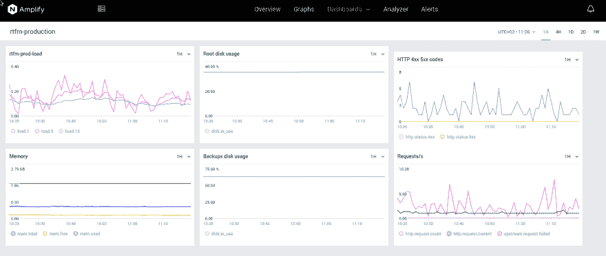](https://rtfm.co.ua/wp-content/uploads/2019/03/Screenshot_20190309_112035.png)

#### 备份

在`/backups`中存储了本地备份，由 [`simple-backup`](https://github.com/setevoy2/simple-backup) 工具创建。查看[Python:скриптбекапатакрловибазMySQLвAWS S3](https://rtfm.co.ua/python-skript-bekapa-fajlov-i-baz-mysql-v-aws-s3/)(*Rus*)帖子了解更多详情。

这个工具并不理想，我想改变其中的一些东西，或者只是从头开始重写它——但现在，它工作得很好。

对我来说，确切的问题是工具首先创建本地备份并存储在`/backups`中，只有在这之后才会执行到 AWS S3 存储桶的上传。

如果`/backups`分区将满，工具将无法在那里保存最新的备份，那么和 S3 上传将不会完成。

作为临时解决方案，我刚刚添加了备份过程失败时的电子邮件通知:

```
root@rtfm-do-production:/home/setevoy# crontab -l | grep back
# Ansible: simple-backup
0 1 * * * /opt/simple-backup/sitebackup.py -c /usr/local/etc/production-simple-backup.ini >> /var/log/simple-backup.log || cat /var/log/simple-backup.log  | mailx -s "RTFM production backup - Failed" notify@example.com 
```

#### uptrends.com

只是一个 ping 服务，如果一个网站的响应不是 200，就会有电子邮件通知。

在它的免费版本中——只有一个网站可供检查，并且只允许电子邮件通知，但对我来说，这已经足够好了:

[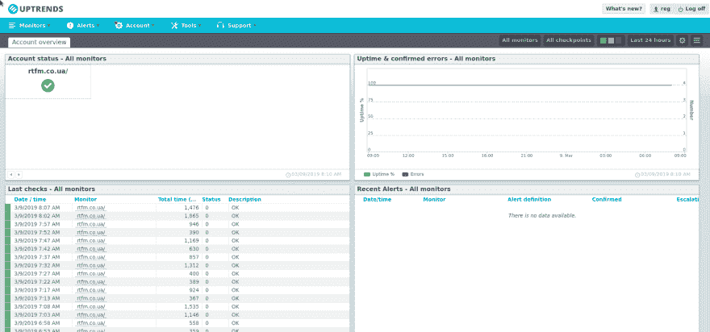](https://rtfm.co.ua/wp-content/uploads/2019/03/Screenshot_20190309_084203.png)

### 普罗米修斯、格拉夫纳和洛基

今天将设置额外的监控。

第一个计划只是添加 Loki 来查看日志，但正如我将要设置的那样——为什么不添加 Prometheus、`node_exporter`和 Alertmanager 来获得关于磁盘使用情况的警报，并通过电子邮件和我自己的 Slack 获得通知呢？

尤其是—当我已经有了工作中的所有配置时，我只需要复制它们，并为当前设置更新“一点”,因为不需要这么多指标和警报。

现在，我将在 RTFM 的主机上运行这个监控堆栈，稍后可能会将它移动到一个小型的专用服务器上——当所有的角色和模板都准备好了，这就简单多了。

像往常一样，所有的自动化都将使用 Ansible 来完成。

所以接下来的计划是:

*   向 Ansible 添加监视角色
*   添加 Docker 撰写模板以运行服务:
    *   普罗米修斯服务器
    *   节点 _ 导出器
    *   洛基
    *   Grafana 6.0
    *   日志收集提示
*   顺便说一下，将不得不更新这些已经存在的角色:
    *   nginx——添加一个新的虚拟主机来代理对 Grafana 和 Prometheus 的请求
    *   let sencrypt–获取新的 SSL 证书

当/如果我将这个堆栈移动到一个专用的主机-将有意义添加一个 [`blackbox_exporter`](https://rtfm.co.ua/prometehus-obzor-federation-monitoring-docker-swarm-i-nastrojki-alertmanager/#blackbox-exporter) 并检查我的所有域。

总的来说，RTFM 的自动化目前看起来或多或少像是在 [AWS: миграция RTFM 3.0(最终版)——cloud formationиansi bleроли](https://rtfm.co.ua/aws-migraciya-rtfm-3-0-final-cloudformation-i-ansible-roli/)(*RUS*)帖子中描述的那样——刚才服务器托管在 [DigitalOcean](https://rtfm.co.ua/digitalocean-znakomstvo-droplet-floating-ip-firewall/) 中，所有可翻译的文件都被转移到一个 Github 仓库中(微软允许拥有私有仓库，显然是担心在购买 Github 后用户大量流失，这对所有人都是一份厚礼)。

稍后，我将把 RTFM 使用的所有角色和模板转移到一个带有一些假数据的公共存储库中。

#### ansi ble–监控角色创建

创建新目录:

```
$ mkdir -p roles/monitoring/{tasks,templates} 
```

暂时够了。

将角色添加到剧本:

```
...
    - role: amplify
      tags: amplify, monitoring, app
    - role: monitoring
      tags: prometheus, monitoring, app 
... 
```

使用 *app* 标签替代 *all* 标签来运行除某些角色之外的所有内容，*monitoring*-运行所有关于监控的内容，使用 _ prometheus _ 标签-我们将运行今天要完成的所有内容。

为了运行 Ansible，我使用了简单的 bash 脚本——检查[скрииптзапукаansi ble](https://rtfm.co.ua/aws-migraciya-rtfm-3-0-final-cloudformation-i-ansible-roli/#_Ansible)post(*Rus*)。

现在创建`roles/monitoring/tasks/main.yml`文件，让我们开始在其中添加任务。

#### 用户和目录

首先–添加新变量到`group_vars/all.yml` :

```
...
# MONITORING
prometheus_home: "/opt/prometheus"
prometheus_data: "/data/prometheus"
prometheus_user: "prometheus" 
```

在`roles/monitoring/tasks/main.yml`中添加用户创建:

```
- name: "Add Prometheus user"
  user:
    name: "{{ prometheus_user }}"
    shell: "/usr/sbin/nologin" 
```

以及包含所有 Prometheus etc 配置和 Docker 合成文件的目录创建:

```
- name: "Create monitoring stack dir {{ prometheus_home }}"
  file:
    path: "{{ prometheus_home }}"
    state: directory
    owner: "{{ prometheus_user }}"
    group: "{{ prometheus_user }}"
    recurse: yes 
```

此外——普罗米修斯 TSDB 的目录——指标将保存一到两周——不需要保存更多:

```
- name: "Create Prometehus TSDB data dir {{ prometheus_data }}"
  file:
    path: "{{ prometheus_data }}"
    state: directory
    owner: "{{ prometheus_user }}"
    group: "{{ prometheus_user }}" 
```

在我的工作项目中，使用了更多的 dir:

*   `/etc/prometheus`–存储 Prometheus、Alertmanager、blackbox-exporter 配置
*   `/etc/grafana`–Grafana 配置和供应目录
*   `/opt/prometheus`–存储合成文件
*   普罗米修斯·TSDB
*   `/data/grafana`–Grafana 数据(`-rwxr-xr-x 1 grafana grafana 8.9G Mar 9 09:12 grafana.db`–OMG！)

现在可以运行并测试它了——当然，首先是在我的开发环境中:

```
$ ./ansible\_exec.sh -t prometheus

Tags: prometheus
Env: rtfm-dev

...

Dry-run check passed.

Are you sure to proceed? [y/n] y

Applying roles...

...

TASK [monitoring : Add Prometheus user] \*\*\*\*
changed: [ssh.dev.rtfm.co.ua]

TASK [monitoring : Create monitoring stack dir /opt/prometheus] \*\*\*\*
changed: [ssh.dev.rtfm.co.ua]

TASK [monitoring : Create Prometehus TSDB data dir /data/prometheus] \*\*\*\*
changed: [ssh.dev.rtfm.co.ua]

PLAY RECAP \*\*\*\*
ssh.dev.rtfm.co.ua      : ok=4    changed=3    unreachable=0    failed=0

Provisioning done. 
```

检查遥控器上的目录:

```
root@rtfm-do-dev:~# ll /data/prometheus/ /opt/prometheus/
/data/prometheus/:
total 0
/opt/prometheus/:
total 0 
```

用户:

```
root@rtfm-do-dev:~# id prometheus
uid=1003(prometheus) gid=1003(prometheus) groups=1003(prometheus) 
```

#### `systemd`与码头工人缀合

接下来——创建`systemd`单元文件和一个模板来运行堆栈——现在这里只有`prometehus-server`和`node_exporter`容器。

运行 Docker Compose as a service 的`systemd`文件示例可以在这里找到[Linux:systemdсервидляdocker compose](https://rtfm.co.ua/linux-systemd-servis-dlya-docker-compose/)(*RUS*)。

创建一个模板文件`roles/monitoring/templates/prometheus.service.j2` :

```
[Unit]
Description=Prometheus monitoring stack
Requires=docker.service
After=docker.service

[Service]
Restart=always
WorkingDirectory={{ prometheus_home }}

# Compose up
ExecStart=/usr/local/bin/docker-compose -f prometheus-compose.yml up
# Compose down, remove containers and volumes
ExecStop=/usr/local/bin/docker-compose -f prometheus-compose.yml down -v

[Install]
WantedBy=multi-user.target 
```

和合成文件的模板-`roles/monitoring/templates/prometheus-compose.yml.j2`:

```
version: '2.4'
networks:
  prometheus:
services:
  prometheus-server:
    image: prom/prometheus
    networks:
      - prometheus
    ports:
      - 9091:9090
    restart: unless-stopped
    mem_limit: 500m
  node-exporter:
    image: prom/node-exporter
    networks:
      - prometheus
    ports:
      - 9100:9100
    volumes:
      - /proc:/host/proc:ro
      - /sys:/host/sys:ro
      - /:/rootfs:ro
    command:
      - '--path.procfs=/host/proc'
      - '--path.sysfs=/host/sys'
      - --collector.filesystem.ignored-mount-points
      - "^/(sys|proc|dev|host|etc|rootfs/var/lib/docker/containers|rootfs/var/lib/docker/overlay2|rootfs/run/docker/netns|rootfs/var/lib/docker/aufs)($$|/)"
    restart: unless-stopped
    mem_limit: 500m 
```

将他们的应对和服务开始添加到`roles/monitoring/tasks/main.yml` :

```
...
- name: "Copy Compose file {{ prometheus_home }}/prometheus-compose.yml"
  template:
    src: templates/prometheus-compose.yml.j2
    dest: "{{ prometheus_home }}/prometheus-compose.yml"
    owner: "{{ prometheus_user }}"
    group:  "{{ prometheus_user }}"
    mode: 0644
- name: "Copy systemd service file /etc/systemd/system/prometheus.service"
  template:
    src: "templates/prometheus.service.j2"
    dest: "/etc/systemd/system/prometheus.service"
    owner: "root"
    group:  "root"
    mode: 0644
- name: "Start monitoring service"
  service:
    name: "prometheus"
    state: restarted
    enabled: yes 
```

运行预配脚本并检查服务:

```
root@rtfm-do-dev:~# systemctl status prometheus.service
● prometheus.service - Prometheus monitoring stack
Loaded: loaded (/etc/systemd/system/prometheus.service; enabled; vendor preset: enabled)
Active: active (running) since Sat 2019-03-09 09:52:20 EET; 5s ago
Main PID: 1347 (docker-compose)
Tasks: 5 (limit: 4915)
Memory: 54.1M
CPU: 552ms
CGroup: /system.slice/prometheus.service
├─1347 /usr/local/bin/docker-compose -f prometheus-compose.yml up
└─1409 /usr/local/bin/docker-compose -f prometheus-compose.yml up 
```

容器:

```
root@rtfm-do-dev:~# docker ps

CONTAINER ID        IMAGE                COMMAND                  CREATED             STATUS              PORTS                    NAMES

8decc7775ae9        jc5x/firefly-iii     ".deploy/docker/entr…"   7 seconds ago       Up 5 seconds        0.0.0.0:9090->80/tcp     firefly\_firefly\_1

3647286526c2        prom/node-exporter   "/bin/node\_exporter …"   7 seconds ago       Up 5 seconds        0.0.0.0:9100->9100/tcp   prometheus\_node-exporter\_1

dbe85724c7cf        prom/prometheus      "/bin/prometheus --c…"   7 seconds ago       Up 5 seconds        0.0.0.0:9091->9090/tcp   prometheus\_prometheus-server\_1 
```

*(firefly-iii–这是家庭核算，见[firefly iii:【T2(RUS)post】](https://rtfm.co.ua/firefly-iii-domashnyaya-buxgalteriya/)*

#### 让我们加密

要访问 Grafana——将使用*monitor.example.com*域(和*dev.monitor.example.com*用于开发环境),因此需要获得 NGINX 的 SSL 证书。

接下来是整个`letsencrypt`角色:

```
- name: "Install Let's Encrypt client"
  apt:
    name: letsencrypt
    state: latest
- name: "Check if NGINX is installed"
  package_facts:
    manager: "auto"
- name: "NGINX test result - True"
  debug:
    msg: "NGINX found"
  when: "'nginx' in ansible_facts.packages"
- name: "NGINX test result - False"
  debug:
    msg: "NGINX NOT found"
  when: "'nginx' not in ansible_facts.packages"
- name: "Stop NGINX"
  systemd:
    name: nginx
    state: stopped
  when: "'nginx' in ansible_facts.packages"
# on first install - no /etc/letsencrypt/live/ will be present
- name: "Check if /etc/letsencrypt/live/ already present"
  stat:
    path: "/etc/letsencrypt/live/"
  register: le_live_dir
- name: "/etc/letsencrypt/live/ check result"
  debug:
    msg: "{{ le_live_dir.stat.path }}"
- name: "Initialize live_certs with garbage if no /etc/letsencrypt/live/ found"
  command: "ls -1 /etc/letsencrypt/"
  register: live_certs
  when: le_live_dir.stat.exists == false
- name: "Check existing certificates"
  command: "ls -1 /etc/letsencrypt/live/"
  register: live_certs
  when: le_live_dir.stat.exists == true
- name: "Certs found"
  debug:
    msg: "{{ live_certs.stdout_lines }}"
- name: "Obtain certificates"
  command: "letsencrypt certonly --standalone --agree-tos -m {{ notify_email }} -d {{ item.1 }}"
  with_subelements:
    - "{{ web_projects }}"
    - domains 
  when: "item.1 not in live_certs.stdout_lines"
- name: "Start NGINX"
  systemd:
    name: nginx
    state: started
  when: "'nginx' in ansible_facts.packages"
- name: "Update renewal settings to web-root"
  lineinfile:
    dest: "/etc/letsencrypt/renewal/{{ item.1 }}.conf"
    regexp: '^authenticator '
    line: "authenticator = webroot"
    state: present
  with_subelements:
    - "{{ web_projects }}"
    - domains
- name: "Add Let's Encrypt cronjob for cert renewal"
  cron:
    name: letsencrypt_renewal
    special_time: weekly
    job: letsencrypt renew --webroot -w /var/www/html/ &> /var/log/letsencrypt/letsencrypt.log && service nginx reload 
```

要获取证书的域列表取自嵌套的`domains`列表:

```
...
- name: "Obtain certificates"
  command: "letsencrypt certonly --standalone --agree-tos -m {{ notify_email }} -d {{ item.1 }}"
  with_subelements:
    - "{{ web_projects }}"
    - domains 
  when: "item.1 not in live_certs.stdout_lines"
... 
```

这样做时——首先检查已经存在的证书(如果有的话),以避免再次请求它们:

```
...
- name: "Check existing certificates"
  command: "ls -1 /etc/letsencrypt/live/"
  register: live_certs
  when: le_live_dir.stat.exists == true
... 
```

`web_projects`和`domains`在变量文件
中定义

```
$ ll group\_vars/rtfm-\*
-rw-r--r-- 1 setevoy setevoy 4731 Mar  8 20:26 group\_vars/rtfm-dev.yml
-rw-r--r-- 1 setevoy setevoy 5218 Mar  8 20:26 group\_vars/rtfm-production.yml 
```

接下来的样子是:

```
...
#######################
### Roles variables ###
#######################
# used in letsencrypt, nginx, php-fpm
web_projects:
  - name: rtfm
    domains:
      - dev.rtfm.co.ua
  - name: setevoy
    domains:
      - dev.money.example.com
      - dev.use.example.com
... 
```

现在创建*monitor.example.com*和*dev.monitor.example.com*子域名，并等待 DNS 更新:

```
root@rtfm-do-dev:~# dig dev.monitor.example.com +short
174.\*\*\*.\*\*\*.179 
```

更新`domains`列表并获取新证书:

```
$ ./ansible\_exec.sh -t letsencrypt

Tags: letsencrypt
Env: rtfm-dev

...

TASK [letsencrypt : Check if NGINX is installed] \*\*\*\*
ok: [ssh.dev.rtfm.co.ua]

TASK [letsencrypt : NGINX test result - True] \*\*\*\*
ok: [ssh.dev.rtfm.co.ua] => {
  "msg": "NGINX found"
}

TASK [letsencrypt : NGINX test result - False] \*\*\*\*
skipping: [ssh.dev.rtfm.co.ua]

TASK [letsencrypt : Stop NGINX] \*\*\*\*
changed: [ssh.dev.rtfm.co.ua]

TASK [letsencrypt : Check if /etc/letsencrypt/live/ already present] \*\*\*\*
ok: [ssh.dev.rtfm.co.ua]

TASK [letsencrypt : /etc/letsencrypt/live/ check result] \*\*\*\*
ok: [ssh.dev.rtfm.co.ua] => {
  "msg": "/etc/letsencrypt/live/"
}

TASK [letsencrypt : Initialize live\_certs with garbage if no /etc/letsencrypt/live/ found] \*\*\*\*
skipping: [ssh.dev.rtfm.co.ua]

TASK [letsencrypt : Check existing certificates] \*\*\*\*
changed: [ssh.dev.rtfm.co.ua]

TASK [letsencrypt : Certs found] \*\*\*\*
ok: [ssh.dev.rtfm.co.ua] => {
  "msg": [
    "dev.use.example.com",
    "dev.money.example.com",
    "dev.rtfm.co.ua",
    "README"
  ]
}

TASK [letsencrypt : Obtain certificates] \*\*\*\*
skipping: [ssh.dev.rtfm.co.ua] => (item=[{'name': 'rtfm'}, 'dev.rtfm.co.ua'])

skipping: [ssh.dev.rtfm.co.ua] => (item=[{'name': 'setevoy'}, 'dev.money.example.com'])
skipping: [ssh.dev.rtfm.co.ua] => (item=[{'name': 'setevoy'}, 'dev.use.example.com'])
changed: [ssh.dev.rtfm.co.ua] => (item=[{'name': 'setevoy'}, 'dev.monitor.example.com'])

TASK [letsencrypt : Start NGINX] \*\*\*\*
changed: [ssh.dev.rtfm.co.ua]

TASK [letsencrypt : Update renewal settings to web-root] \*\*\*\*
ok: [ssh.dev.rtfm.co.ua] => (item=[{'name': 'rtfm'}, 'dev.rtfm.co.ua'])
ok: [ssh.dev.rtfm.co.ua] => (item=[{'name': 'setevoy'}, 'dev.money.example.com'])
ok: [ssh.dev.rtfm.co.ua] => (item=[{'name': 'setevoy'}, 'dev.use.example.com'])

changed: [ssh.dev.rtfm.co.ua] => (item=[{'name': 'setevoy'}, 'dev.monitor.example.com'])

PLAY RECAP \*\*\*\*

ssh.dev.rtfm.co.ua      : ok=13   changed=5    unreachable=0    failed=0

Provisioning done. 
```

#### NGINX

接下来——分别为 monitor.example.com 的*和 dev.monitor.example.com*的`roles/nginx/templates/dev/dev.monitor.example.com.conf.j2`和`roles/nginx/templates/production/monitor.example.com.conf.j2`添加虚拟主机配置:

```
upstream prometheus_server {
    server 127.0.0.1:9091;
}
upstream grafana {
    server 127.0.0.1:3000;
}
server {

    listen 80;
    server_name  {{ item.1 }};

    # Lets Encrypt Webroot
    location ~ /.well-known {
    root /var/www/html;
        allow all;
    }

    location / {
        allow {{ office_allow_location }};
        allow {{ home_allow_location }};
        deny all;
        return 301 https://{{ item.1 }}$request_uri;
    }
}
server {
    listen       443 ssl;
    server_name  {{ item.1 }};
    access_log  /var/log/nginx/{{ item.1 }}-access.log;
    error_log /var/log/nginx/{{ item.1 }}-error.log warn;
    auth_basic_user_file {{ web_data_root_prefix }}/{{ item.0.name }}/.htpasswd_{{ item.0.name }};
    auth_basic "Password-protected Area";
    allow {{ office_allow_location }};
    allow {{ home_allow_location }};
    deny all;
    ssl_certificate /etc/letsencrypt/live/{{ item.1 }}/fullchain.pem;
    ssl_certificate_key /etc/letsencrypt/live/{{ item.1 }}/privkey.pem;
    ssl_protocols TLSv1 TLSv1.1 TLSv1.2;
    ssl_prefer_server_ciphers on;
    ssl_dhparam /etc/nginx/dhparams.pem;
    ssl_ciphers "EECDH+AESGCM:EDH+AESGCM:ECDHE-RSA-AES128-GCM-SHA256:AES256+EECDH:DHE-RSA-AES128-GCM-SHA256:AES256+EDH:ECDHE-RSA-AES256-GCM-SHA384:DHE-RSA-AES256-GCM-SHA384:ECDHE-RSA-AES256-SHA384:ECDHE-RSA-AES128-SHA256:ECDHE-RSA-AES256-SHA:ECDHE-RSA-AES128-SHA:DHE-RSA-AES256-SHA256:DHE-RSA-AES128-SHA256:DHE-RSA-AES256-SHA:DHE-RSA-AES128-SHA:ECDHE-RSA-DES-CBC3-SHA:EDH-RSA-DES-CBC3-SHA:AES256-GCM-SHA384:AES128-GCM-SHA256:AES256-SHA256:AES128-SHA256:AES256-SHA:AES128-SHA:DES-CBC3-SHA:HIGH:!aNULL:!eNULL:!EXPORT:!DES:!MD5:!PSK:!RC4";
    ssl_session_timeout 1d;
    ssl_stapling on;
    ssl_stapling_verify on;
    location / {
        proxy_redirect          off;
        proxy_set_header        Host            $host;
        proxy_set_header        X-Real-IP       $remote_addr;
        proxy_set_header        X-Forwarded-For $proxy_add_x_forwarded_for;
        proxy_pass http://grafana$request_uri;
    }
    location /prometheus {
        proxy_redirect          off;
        proxy_set_header        Host            $host;
        proxy_set_header        X-Real-IP       $remote_addr;
        proxy_set_header        X-Forwarded-For $proxy_add_x_forwarded_for;
        proxy_pass http://prometheus_server$request_uri;
    }
} 
```

(t0openbsd:nginx 安装和 t1post 安全设置)

使用相同的`web_projects`和`domains`列表从`roles/nginx/tasks/main.yml`复制模板:

```
...
- name: "Add NGINX virtualhosts configs"
  template:
    src: "templates/{{ env }}/{{ item.1 }}.conf.j2"
    dest: "/etc/nginx/conf.d/{{ item.1 }}.conf"
    owner: "root"
    group: "root"
    mode: 0644
  with_subelements:
    - "{{ web_projects }}"
    - domains
... 
```

再次运行脚本:

```
$ ./ansible\_exec.sh -t nginx

Tags: nginx
Env: rtfm-dev

...

TASK [nginx : NGINX test return code] \*\*\*\*
ok: [ssh.dev.rtfm.co.ua] => {
  "msg": "0"
}

TASK [nginx : Service NGINX restart and enable on boot] \*\*\*\*
changed: [ssh.dev.rtfm.co.ua]

PLAY RECAP \*\*\*\*
ssh.dev.rtfm.co.ua      : ok=13   changed=3    unreachable=0    failed=0 
```

现在普罗米修斯一定在工作:

[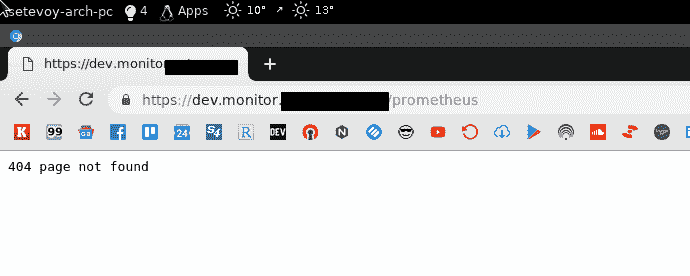](https://rtfm.co.ua/wp-content/uploads/2019/03/Screenshot_20190309_110731.png)

*“404 页未找到”*–它来自普罗米修斯本身，需要更新一下它的设置。

我们现在已经完成了 NGINX 和 SSL 是时候开始配置服务了。

#### `prometheus-server`配置

创建一个新的模板文件`roles/monitoring/templates/prometheus-server-conf.yml.j2` :

```
global:
  scrape_interval:     15s 
  external_labels:
    monitor: 'rtfm-monitoring-{{ env }}'
#alerting:
#  alertmanagers:
#  - static_configs:
#    - targets:
#      - alertmanager:9093
#rule_files:
#  - "alert.rules"
scrape_configs:
  - job_name: 'node-exporter'
    static_configs:
      - targets:
        - 'localhost:9100' 
```

`alerting`目前已被注释掉，稍后会添加。

将模板副本添加到主机:

```
...
- name: "Copy Prometheus server config {{ prometheus_home }}/prometheus-server-conf.yml"
  template:
    src: "templates/prometheus-server-conf.yml"
    dest: "{{ prometheus_home }}/prometheus-server-conf.yml"
    owner: "{{ prometheus_user }}"
    group:  "{{ prometheus_user }}"
    mode: 0644
... 
```

更新`roles/monitoring/templates/prometheus-compose.yml.j2`–在容器中添加文件映射:

```
...
  prometheus-server:
    image: prom/prometheus
    networks:
      - prometheus
    ports:
      - 9091:9090
    volumes:
      - {{ prometheus_home }}/prometheus-server-conf.yml:/etc/prometheus.yml
    restart: unless-stopped
... 
```

再次部署:

```
$ ./ansible\_exec.sh -t prometheus

Tags: prometheus
Env: rtfm-dev

...

TASK [monitoring : Start monitoring service] \*\*\*\*
changed: [ssh.dev.rtfm.co.ua]

PLAY RECAP \*\*\*\*
ssh.dev.rtfm.co.ua      : ok=7    changed=2    unreachable=0    failed=0

Provisioning done. 
```

再查一遍，还是 404…

啊，召回-需要添加`--web.external-url`选项。虽然必须从`web_projects`和`domains`中添加域选择器，就像在`nginx`和`letsencrypt`中所做的那样。

同样，需要添加`--config.file`参数。

更新合成文件并添加`/data/prometheus`映射:

```
...
  prometheus-server:
    image: prom/prometheus
    networks:
      - prometheus
    ports:
      - 9091:9090
    volumes:
      - {{ prometheus_home }}/prometheus-server-conf.yml:/etc/prometheus.yml
      - {{ prometheus_data }}:/prometheus/data/
    command:
      - '--config.file=/etc/prometheus.yml'
      - '--web.external-url=https://{{ item.1 }}/prometheus'
    restart: always
... 
```

在模板的复制任务中添加带有域选择器
的`when`条件

```
...
- name: "Copy Compose file {{ prometheus_home }}/prometheus-compose.yml"
  template:
    src: "templates/prometheus-compose.yml.j2"
    dest: "{{ prometheus_home }}/prometheus-compose.yml"
    owner: "{{ prometheus_user }}"
    group:  "{{ prometheus_user }}"
    mode: 0644
  with_subelements:
    - "{{ web_projects }}"
    - domains
  when: "'monitor' in item.1.name"
... 
```

再次运行并:

> Prometheus-server _ 1 | level = error ts = 2019-03-09t 09:53:28.427567744 z caller = main . go:688 err = "打开存储失败:锁定 DB 目录:open /prometheus/data/lock:权限被拒绝"

嗯嗯…

在主机上检查目录的所有者:

```
root@rtfm-do-dev:/opt/prometheus# ls -l /data/
total 8
drwxr-xr-x 2 prometheus prometheus 4096 Mar  9 09:19 prometheus 
```

用户，用于在容器内运行服务:

```
root@rtfm-do-dev:/opt/prometheus# docker exec -ti prometheus\_prometheus-server\_1 ps aux
PID   USER     TIME  COMMAND
1 nobody    0:00 /bin/prometheus --config.file=/etc/prometheus.yml --web.ex 
```

检查容器中的用户 ID:

```
root@rtfm-do-dev:/opt/prometheus# docker exec -ti prometheus\_prometheus-server\_1 id nobody
uid=65534(nobody) gid=65534(nogroup) groups=65534(nogroup) 
```

还有主机上:

```
root@rtfm-do-dev:/opt/prometheus# id nobody
uid=65534(nobody) gid=65534(nogroup) groups=65534(nogroup) 
```

他们是一样的——完美。更新`roles/monitoring/templates/prometheus-compose.yml.j2` :
中的`/data/prometheus`所有者

```
...
- name: "Create Prometehus TSDB data dir {{ prometheus_data }}"
  file:
    path: "{{ prometheus_data }}"
    state: directory
    owner: "nobody"
    group: "nogroup"
    recurse: yes
... 
```

再次重新部署–瞧！

[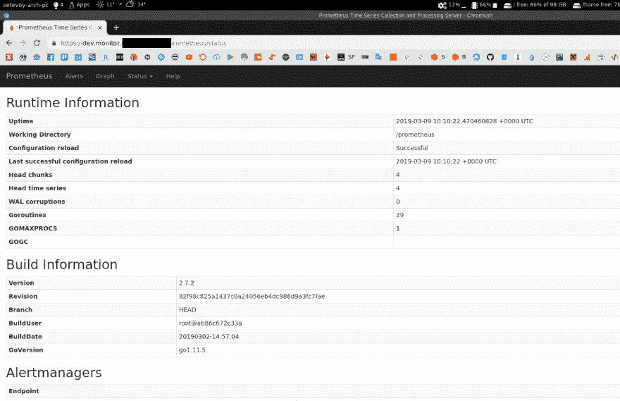](https://rtfm.co.ua/wp-content/uploads/2019/03/Screenshot_20190309_121059.png)

接下来，必须更新目标–现在`prometheus-server`无法连接到`node_exporter`:

[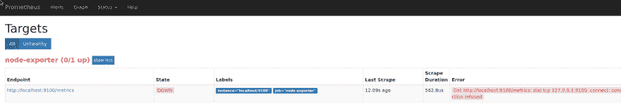](https://rtfm.co.ua/wp-content/uploads/2019/03/Screenshot_20190309_121203.png)

因为配置是从工作项目中复制粘贴的)

更新`roles/monitoring/templates/prometheus-server-conf.yml.j2`–更改*本地主机*值:

```
...
scrape_configs:

  - job_name: 'node-exporter'
    static_configs:
      - targets:
        - 'localhost:9100'
... 
```

在 Compose-file-*node-exporter*中设置的容器名称:

[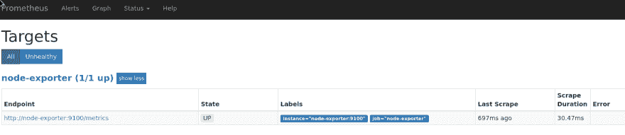](https://rtfm.co.ua/wp-content/uploads/2019/03/Screenshot_20190309_121441.png)

似乎就这些了..？

啊，不——需要检查`node_exporter`是否能够获得分区指标:

[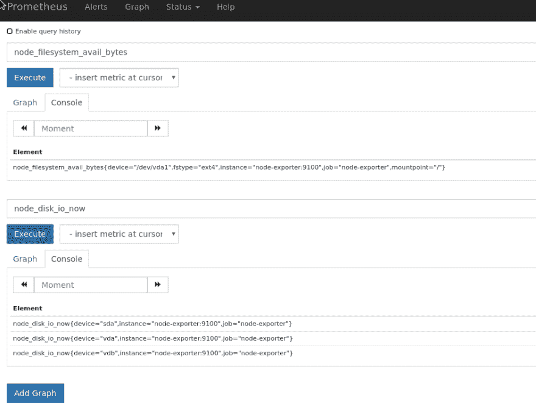](https://rtfm.co.ua/wp-content/uploads/2019/03/Screenshot_20190309_121912.png)

不…在`node_filesystem_avail_bytes`中只有根分区。

需要回忆一下为什么会发生这种情况——已经面对过几次了。

#### `node_exporter`配置

点击此处阅读文件–[https://github.com/prometheus/node_exporter#using-docker](https://github.com/prometheus/node_exporter#using-docker)。

更新 Compose 文件，添加 [`bind-mount`](https://docs.docker.com/storage/bind-mounts/) == [`rslave`](https://docs.docker.com/storage/bind-mounts/#configure-bind-propagation) 和带有 */rootfs* 值的`path.rootfs`(因为我们将来自主机的"`/`"映射为"`/rootfs`"到容器):

```
...
  node-exporter:
    image: prom/node-exporter
    networks:
      - prometheus
    ports:
      - 9100:9100
    volumes:
      - /proc:/host/proc:ro
      - /sys:/host/sys:ro
      - /:/rootfs:ro,rslave
    command:
      - '--path.rootfs=/rootfs'
      - '--path.procfs=/host/proc'
      - '--path.sysfs=/host/sys'
      - --collector.filesystem.ignored-mount-points
      - "^/(sys|proc|dev|host|etc|rootfs/var/lib/docker/containers|rootfs/var/lib/docker/overlay2|rootfs/run/docker/netns|rootfs/var/lib/docker/aufs)($$|/)"
    restart: unless-stopped
    mem_limit: 500m 
```

重新启动服务并立即检查挂载点:

```
root@rtfm-do-dev:/opt/prometheus# curl -s localhost:9100/metrics | grep sda
node\_disk\_io\_now{device="sda"} 0
node\_disk\_io\_time\_seconds\_total{device="sda"} 0.044
node\_disk\_io\_time\_weighted\_seconds\_total{device="sda"} 0.06
node\_disk\_read\_bytes\_total{device="sda"} 7.448576e+06
node\_disk\_read\_time\_seconds\_total{device="sda"} 0.056
node\_disk\_reads\_completed\_total{device="sda"} 232
node\_disk\_reads\_merged\_total{device="sda"} 0
node\_disk\_write\_time\_seconds\_total{device="sda"} 0.004
node\_disk\_writes\_completed\_total{device="sda"} 1
node\_disk\_writes\_merged\_total{device="sda"} 0
node\_disk\_written\_bytes\_total{device="sda"} 4096
node\_filesystem\_avail\_bytes{device="/dev/sda1",fstype="ext4",mountpoint="/backups"} 4.910125056e+09
node\_filesystem\_device\_error{device="/dev/sda1",fstype="ext4",mountpoint="/backups"} 0
node\_filesystem\_files{device="/dev/sda1",fstype="ext4",mountpoint="/backups"} 327680
node\_filesystem\_files\_free{device="/dev/sda1",fstype="ext4",mountpoint="/backups"} 327663
node\_filesystem\_free\_bytes{device="/dev/sda1",fstype="ext4",mountpoint="/backups"} 5.19528448e+09
node\_filesystem\_readonly{device="/dev/sda1",fstype="ext4",mountpoint="/backups"} 0
node\_filesystem\_size\_bytes{device="/dev/sda1",fstype="ext4",mountpoint="/backups"} 5.216272384e+09 
```

现在看起来可以了…

老实说，我有点不舒服…

*现在，当我从草稿中更新这篇文章时——一切看起来如此简单和容易……实际上，即使有了所有的配置、示例并知道做什么和如何做——也花了一段时间才使它全部工作起来…*

好吧，还剩下什么

啊…

Grafana，Loki，promtail 和 alertmanager。

OMG…

让我们喝点茶吧。

* * *

现在，让我们快速进行。

需要在`/data`–`/data/monitoring`中创建一个专用目录，并为普罗米修斯、格拉夫纳和洛基创建其他目录。

更新`prometheus_data`变量:

```
...
prometheus_data: "/data/monitoring/prometheus"
... 
```

为 Grafana 和 Loki 添加变量:

```
...
loki_data: "/data/monitoring/loki"
grafana_data: "/data/monitoring/grafana"
... 
```

将自己的创作添加到`roles/monitoring/tasks/main.yml` :

```
...
- name: "Create Loki's data dir {{ loki_data }}"
  file:
    path: "{{ loki_data }}"
    state: directory
    owner: "{{ prometheus_user }}"
    group: "{{ prometheus_user }}"
    recurse: yes
- name: "Create Grafana DB dir {{ grafana_data }}"
  file:
    path: "{{ grafana_data }}"
    state: directory
    owner: "{{ prometheus_user }}"
    group: "{{ prometheus_user }}"
    recurse: yes
... 
```

#### 洛基

将 Loki 添加到撰写模板:

```
...
  loki:
    image: grafana/loki:master
    networks:
      - prometheus
    ports:
      - "3100:3100"
    volumes:
      - {{ prometheus_home }}/loki-conf.yml:/etc/loki/local-config.yaml
      - {{ loki_data }}:/tmp/loki/
    command: -config.file=/etc/loki/local-config.yaml
    restart: unless-stopped
... 
```

创建一个新的模板`roles/monitoring/templates/loki-conf.yml.j2`——只是默认的，没有 [DynamoDB 和 S3](https://rtfm.co.ua/en/grafana-labs-loki-using-aws-s3-as-a-data-storage-and-aws-dynamodb-for-indexes/)——会把所有的东西保存在`/data/monitoring/loki` :

```
auth_enabled: false
server:
  http_listen_port: 3100
ingester:
  lifecycler:
    address: 0.0.0.0
    ring:
      store: inmemory
      replication_factor: 1
  chunk_idle_period: 15m
schema_config:
  configs:
  - from: 0
    store: boltdb
    object_store: filesystem
    schema: v9
    index:
      prefix: index_
      period: 168h
storage_config:
  boltdb:
    directory: /tmp/loki/index
  filesystem:
    directory: /tmp/loki/chunks
limits_config:
  enforce_metric_name: false 
```

将文件的副本添加到`roles/monitoring/tasks/main.yml` :

```
...
- name: "Copy Loki config {{ prometheus_home }}/loki-conf.yml"
  template:
    src: "templates/loki-conf.yml.j2"
    dest: "{{ prometheus_home }}/loki-conf.yml"
    owner: "{{ prometheus_user }}"
    group:  "{{ prometheus_user }}"
    mode: 0644
... 
```

#### 格拉法纳

还有 Grafana 现在:

```
...
  grafana:
    image: grafana/grafana:6.0.0
    ports:
      - "3000:3000"
    networks:
      - prometheus
    depends_on:
      - loki
    restart: unless-stopped
... 
```

稍后将添加目录和配置。

部署，检查:

[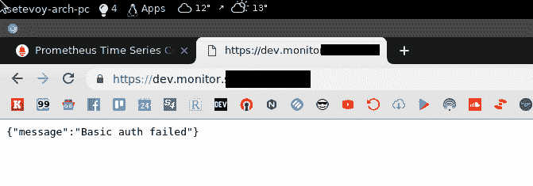](https://rtfm.co.ua/wp-content/uploads/2019/03/Screenshot_20190309_130940.png)

酷——Grafana 已经可以工作了，只需要更新它的配置

创建一个新模板，这里只需要下面的参数:

```
...
[auth.basic]
enabled = false
...
[security]
# default admin user, created on startup
admin_user = {{ grafana_ui_username }}
# default admin password, can be changed before first start of grafana,  or in profile settings
admin_password = {{ grafana_ui_dashboard_admin_pass }}
... 
```

据我所知，这里没有更新任何东西。

让我们检查一下我的工作生产服务器:

```
admin@monitoring-production:~$ cat /etc/grafana/grafana.ini | grep -v \# | grep -v ";" | grep -ve '^$'
[paths]
[server]
[database]
[session]
[dataproxy]
[analytics]
[security]
admin\_user = user
admin\_password = pass
[snapshots]
[users]
[auth]
[auth.anonymous]
[auth.github]
[auth.google]
[auth.generic\_oauth]
[auth.grafana\_com]
[auth.proxy]
[auth.basic]
enabled = false
[auth.ldap]
[smtp]
[emails]
[log]
...
[external\_image\_storage.gcs] 
```

是的，正确。

生成密码:

```
$ pwgen 12 1
Foh\*\*\*ae1 
```

使用 [`ansible-vault`](https://rtfm.co.ua/ansible-ispolzovanie-vault-zashifrovannogo-xranilishha/) :
进行加密

```
$ ansible-vault encrypt\_string
New Vault password:
Confirm New Vault password:
Reading plaintext input from stdin. (ctrl-d to end input)
Foh\*\*\*ae1!vault |
ANSIBLE\_VAULT;1.1;AES256
38306462643964633766373435613135386532373133333137653836663038653538393165353931
...
6636633634353131350a343461633265353461386561623233636266376266326337383765336430
3038

Encryption successful 
```

创建`grafana_ui_username`和`grafana_ui_dashboard_admin_pass`变量:

```
...
# MONITORING
prometheus_home: "/opt/prometheus"
prometheus_user: "prometheus"
# data dirs
prometheus_data: "/data/monitoring/prometheus"
loki_data: "/data/monitoring/loki"
grafana_data: "/data/monitoring/grafana"
grafana_ui_username: "setevoy"
grafana_ui_dashboard_admin_pass: !vault |
          $ANSIBLE_VAULT;1.1;AES256
          38306462643964633766373435613135386532373133333137653836663038653538393165353931
          ...
          6636633634353131350a343461633265353461386561623233636266376266326337383765336430
          3038 
```

创建 Grafana 的配置模板`roles/monitoring/templates/grafana-conf.yml.j2` :

```
[paths] 
[server]
[database]
[session]
[dataproxy]
[analytics]
[security]
admin_user = {{ grafana_ui_username }}
admin_password = {{ grafana_ui_dashboard_admin_pass }}
[snapshots]
[users]
[auth]
[auth.anonymous]
[auth.github]
[auth.google]
[auth.generic_oauth]
[auth.grafana_com]
[auth.proxy
[auth.basic]
enabled = false
[auth.ldap]
[smtp]
[emails]
[log]
[log.console]
[log.file]
[log.syslog]
[event_publisher]
[dashboards.json]
[alerting]
[metrics]
[metrics.graphite]
[tracing.jaeger]
[grafana_com]
[external_image_storage]
[external_image_storage.s3]
[external_image_storage.webdav]
[external_image_storage.gcs] 
```

添加其复制:

```
...
- name: "Copy systemd service file /etc/systemd/system/prometheus.service"
  template:
    src: "templates/prometheus.service.j2"
    dest: "/etc/systemd/system/prometheus.service"
    owner: "root"
    group:  "root"
    mode: 0644
... 
```

将它的映射添加到合成文件的容器中:

```
...
  grafana:
    image: grafana/grafana:6.0.0
    ports:
      - "3000:3000"
    volumes:
      - {{ prometheus_home }}/grafana-conf.yml:/etc/grafana/grafana.ini
      - {{ grafana_data }}:/var/lib/grafana
... 
```

此外，必须添加`{{ prometheus_home }}/provisioning`映射——Grafana 将在这里保留其配置配置，但这可以在以后完成。

部署，检查:

> GF _ PATHS _ DATA = '/var/lib/grafana '不可写。
> 
> 您可能有文件权限问题，更多信息请点击此处:[http://docs . grafana . org/installation/docker/# migration-from-a-previous-version-of-the-docker-container-to-5-1-or-latter](http://docs.grafana.org/installation/docker/#migration-from-a-previous-version-of-the-docker-container-to-5-1-or-later)
> T5】mkdir:无法创建目录'/var/lib/grafana/plugins ':权限被拒绝

**Hu%^%*@d( &！！！**

阅读[文档](http://docs.grafana.org/installation/docker/#migration-from-a-previous-version-of-the-docker-container-to-5-1-or-later):

> 默认用户 id 472 而不是 104

啊，是的，现在回忆起来了。

添加`grafana`用户的创建及其自己的 UID。

添加新变量:

```
...
grafana_user: "grafana"
grafana_uid: 472 
```

添加用户和组创建:

```
- name: "Add Prometheus user"
  user:
    name: "{{ prometheus_user }}"
    shell: "/usr/sbin/nologin"
- name: "Create Grafana group {{ grafana_user }}"
  group:
    name: "{{ grafana_user }}"
    gid: "{{ grafana_uid }}"
- name: "Create Grafana's user {{ grafana_user }} with UID {{ grafana_uid }}"
  user:
    name: "{{ grafana_user }}"
    uid: "{{ grafana_uid }}"
    group: "{{ grafana_user }}"
    shell: "/usr/sbin/nologin"  
... 
```

并更改`{{ grafana_data }}`所有者:

```
...
- name: "Create Grafana DB dir {{ grafana_data }}"
  file:
    path: "{{ grafana_data }}"
    state: directory
    owner: "{{ grafana_user }}"
    group: "{{ grafana_user }}"
    recurse: yes
... 
```

再次重新部署，检查:

[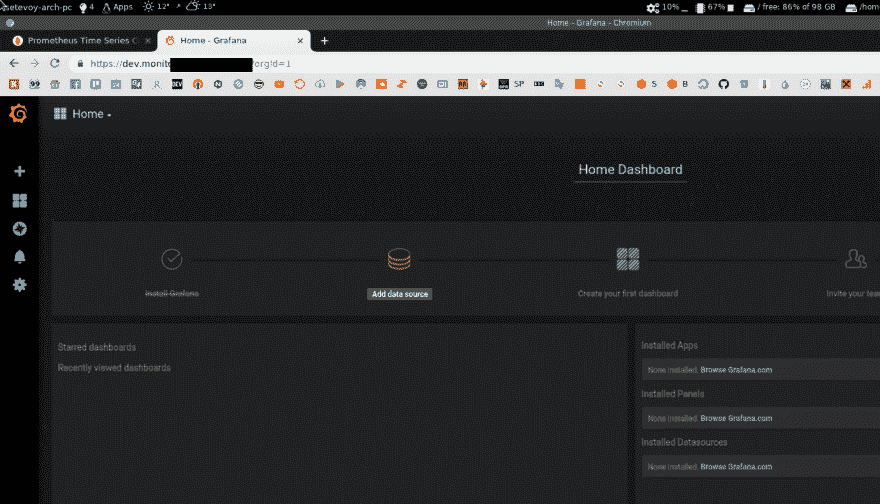](https://rtfm.co.ua/wp-content/uploads/2019/03/Screenshot_20190309_133958.png)

耶！)

但是我们还没有日志，因为没有添加`promtail`。

除此之外，需要为 Grafana 添加一个`datasource`配置。

添加`{{ prometheus_home }}/grafana-provisioning/datasources`创建:

```
...
- name: "Create {{ prometheus_home }}/grafana-provisioning/datasources directory"
  file:
    path: "{{ prometheus_home }}/grafana-provisioning/datasources"
    owner: "{{ grafana_user }}"
    group: "{{ grafana_user }}"
    mode: 0755
    state: directory
... 
```

添加其映射:

```
...
  grafana:
    image: grafana/grafana:6.0.0
    ports:
      - "3000:3000"
    volumes:
      - {{ prometheus_home }}/grafana-conf.yml:/etc/grafana/grafana.ini
      - {{ prometheus_home }}/grafana-provisioning:/etc/grafana/ 
      - {{ grafana_data }}:/var/lib/grafana
... 
```

部署并检查 Grafana 容器中的数据:

```
root@rtfm-do-dev:/opt/prometheus# docker exec -ti prometheus\_grafana\_1 sh
ls -l /etc/grafana
total 8
drwxr-xr-x 2 grafana grafana 4096 Mar  9 11:46 datasources
-rw-r--r-- 1    1003    1003  571 Mar  9 11:26 grafana.ini 
```

好吧。

接下来——我们来添加 Loki 的数据源——`roles/monitoring/templates/grafana-datasources.yml.j2`(查看[Grafana:добавлениеdata sourceизansi ble](https://rtfm.co.ua/grafana-dobavlenie-datasource-iz-ansible/)(*Rus*)帖子):

```
# config file version
apiVersion: 1
deleteDatasources:
  - name: Loki
datasources:
- name: Loki
  type: loki
  access: proxy
  url: http://loki:3100
  isDefault: true
  version: 1 
```

正在复制到服务器:

```
...
- name: "Copy Grafana datasources config {{ prometheus_home }}/grafana-provisioning/datasources/datasources.yml"
  template:
    src: "templates/grafana-datasources.yml.j2"
    dest: "{{ prometheus_home }}/grafana-provisioning/datasources/datasources.yml"
    owner: "{{ grafana_user }}"
    group: "{{ grafana_user }}"
... 
```

部署，检查:

> t = 2019-03-09t 11:52:35+0000 lvl = eror msg = "无法从目录中读取数据源预配文件" logger = provisioning . data sources path =/etc/grafana/provisioning/data sources error = " open/etc/grafana/provisioning/data sources:没有此类文件 o
> 
> r 目录"

啊，好吧。

修复合成中的路径-`{{ prometheus_home }}/grafana-provisioning`必须被映射为`/etc/grafana/provisioning`-而不仅仅是在`/etc/grafana` :
中

```
...
    volumes:
      - {{ prometheus_home }}/grafana-conf.yml:/etc/grafana/grafana.ini
      - {{ prometheus_home }}/grafana-provisioning:/etc/grafana/provisioning
      - {{ grafana_data }}:/var/lib/grafana
... 
```

再次重新部署，现在一切正常:

[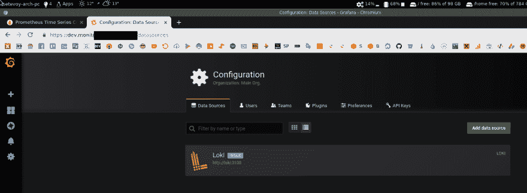](https://rtfm.co.ua/wp-content/uploads/2019/03/Screenshot_20190309_135811.png)

#### `promtail`。

添加一个带有`promtail`的新容器。

然后`alertmanager`并配置它的提醒…不要以为今天就能完成。

我不确定`promtail`的`positions.yaml`文件——是否需要从主机映射到持久化？

但由于我没有在乔布斯的作品中出现，所以这可能并不重要，因为我确定我在 Grafana 的 Slack 社区中问过这个问题，但现在找不到这个帖子了。

现在，让我们跳过它:

```
...
  promtail:
    image: grafana/promtail:master
    volumes:
      - {{ prometheus_home }}/promtail-conf.yml:/etc/promtail/docker-config.yaml
#      - {{ prometheus_home }}/promtail-positions.yml:/tmp/positions.yaml
      - /var/log:/var/log
    command: -config.file=/etc/promtail/docker-config.yaml 
```

创建`roles/monitoring/templates/promtail-conf.yml.j2`模板:

```
server:
  http_listen_port: 9080
  grpc_listen_port: 0
positions:
  filename: /tmp/positions.yaml
client:
  url: http://loki:3100/api/prom/push
scrape_configs:
  - job_name: system
    entry_parser: raw
    static_configs:
    - targets:
        - localhost
      labels:
        job: varlogs
        env: {{ env }}
        host: {{ set_hostname }}
        __path__: /var/log/*log
  - job_name: nginx
    entry_parser: raw
    static_configs:
    - targets:
        - localhost
      labels:
        job: nginx
        env: {{ env }}
        host: {{ set_hostname }}
        __path__: /var/log/nginx/*log 
```

这里:

*   `url: http://loki:3100/api/prom/push`–URL 又名带有 Loki 的容器名称，将由`promtail`用于`PUSH`其数据
*   `env: {{ env }}`и`host: {{ set_hostname }}`–附加标签，它们设置在`group_vars/rtfm-dev.yml`和`group_vars/rtfm-production.yml`:`env: dev`:`set_hostname: rtfm-do-dev`

添加文件的副本:

```
...
- name: "Copy Promtail config {{ prometheus_home }}/promtail-conf.yml"
  template:
    src: "templates/promtail-conf.yml.j2"
    dest: "{{ prometheus_home }}/promtail-conf.yml"
    owner: "{{ prometheus_user }}"
    group: "{{ prometheus_user }}"
... 
```

部署:

> level = info ts = 2019-03-09t 12:09:07.709299788 z caller = tailer . go:78 msg = "开始跟踪文件" path =/var/log/user . log
> 
> 2019/03/09 12:09:07 Seeked/var/log/bootstrap . log-&{ Offset:0 where:0 }
> 
> level = info ts = 2019-03-099

对…

现在可以跟踪日志，但看不到洛基…

为什么？

啊，因为需要加上`depends on`。

更新合成文件并为`promtail` :
添加

```
... depends\_on: - loki 
```

不，没有帮助…

还有什么？…

啊！网络！

同样，配置是从工作设置中复制的，有点不同。

将`networks`添加到撰写:

```
...
  promtail:
    image: grafana/promtail:master
    networks:
      - prometheus
    volumes:
      - /opt/prometheus/promtail-conf.yml:/etc/promtail/docker-config.yaml
#      - /opt/prometheus/promtail-positions.yml:/tmp/positions.yaml
      - /var/log:/var/log
    command: -config.file=/etc/promtail/docker-config.yaml
    depends_on:
      - loki 
```

Aaaaaaand:

[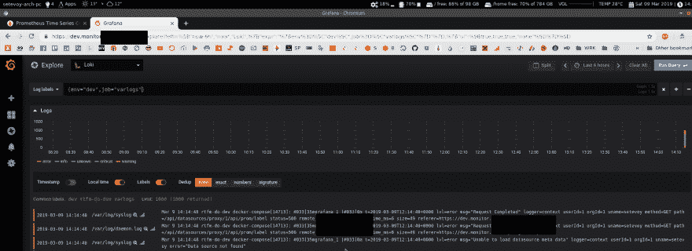](https://rtfm.co.ua/wp-content/uploads/2019/03/Screenshot_20190309_141540.png)

*“管用！”*

好吧。

这就够了

Alertmanager 和 Slack integration 可以在[promet HUS:обзор—Federation，мониторгDocker Swarmинастрокки-alert manager](https://rtfm.co.ua/prometehus-obzor-federation-monitoring-docker-swarm-i-nastrojki-alertmanager/#_Alertmanager_Slack)(*Rus*)帖子中找到。

现在我要去吃早餐了，因为我在上午 9 点左右开始做这个设置，现在是下午 2 点 [](https://res.cloudinary.com/practicaldev/image/fetch/s--i5n0Ut5W--/c_limit%2Cf_auto%2Cfl_progressive%2Cq_auto%2Cw_880/https://s.w.oimg/core/emoji/11.2.0/72x72/1f642.png)

### 类似的帖子

*   <small>02/13/2019</small>[Grafana Labs:Loki——使用 AWS S3 作为数据存储，使用 AWS DynamoDB 作为索引](https://rtfm.co.ua/en/grafana-labs-loki-using-aws-s3-as-a-data-storage-and-aws-dynamodb-for-indexes/) <small>(0)</small>
*   <small>02/07/2019</small>[Grafana Labs:Loki——分布式系统、标签和过滤器](https://rtfm.co.ua/en/grafana-labs-loki-distributed-system-labels-and-filters/) <small>(0)</small>
*   <small>2017 年 10 月 23 日</small> [普罗米修斯:Ansible，NGINX и Grafana 仪表盘](https://rtfm.co.ua/prometheus-ansible-nginx-i-grafana-dashboard/) <small>(0)</small>
*   <small>02/06/2019</small>[Grafana Labs:Loki–日志收集与监控系统](https://rtfm.co.ua/en/grafana-labs-loki-logs-collector-and-monitoring-system/) <small>(0)</small>