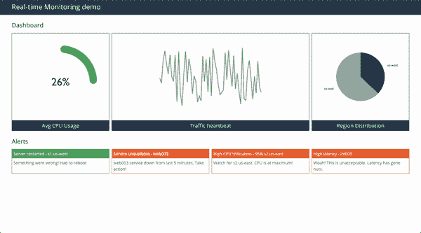
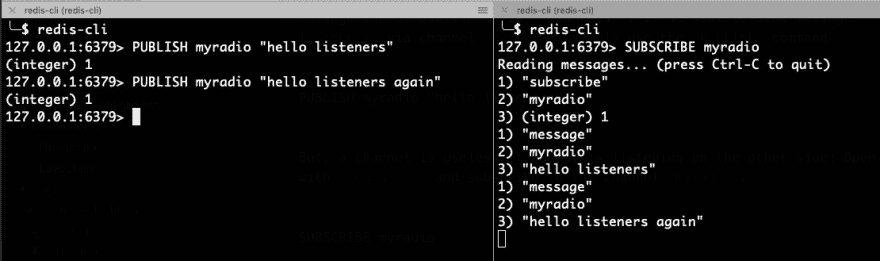
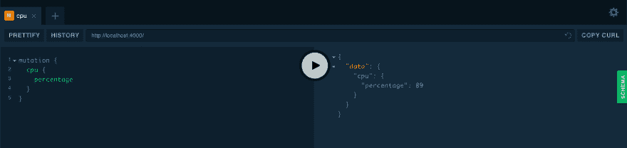
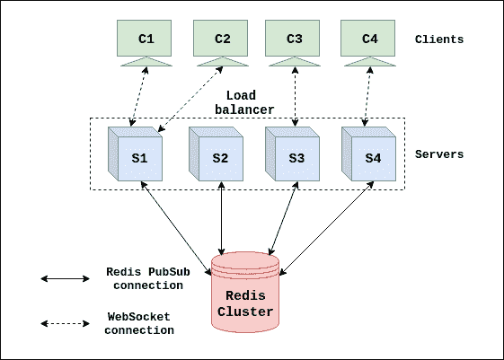
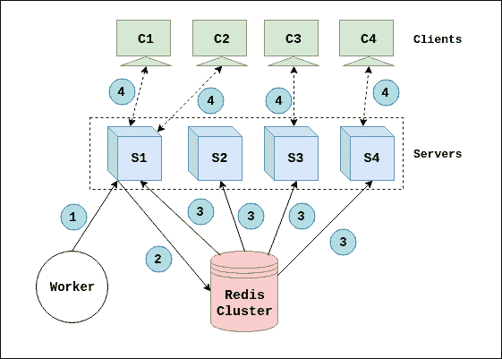

# 使用 React、GraphQL 订阅和 Redis PubSub 构建实时仪表板

> 原文：<https://dev.to/nowke/building-real-time-dashboard-using-react-graphql-subscriptions-and-redis-pubsub-2gip>

在本帖中，我们将创建一个简单的可伸缩仪表板，使用 [React](https://reactjs.org/) 、 [GraphQL 订阅](https://www.howtographql.com/react-apollo/8-subscriptions/)和[Redis publibsub](https://redis.io/topics/pubsub)进行实时更新。实时仪表板用于监控**基础设施**(服务器、网络、服务)**应用流量**(交易量、用户数量)**警报**(应用健康、关键问题通知、停机时间)等。在大多数情况下，仪表板由一个或多个数据源驱动。

开发人员利用一些开源应用程序来创建丰富而有用的仪表板。例如， **[基巴纳](https://www.elastic.co/products/kibana)** 用于可视化集成了[麋鹿栈](https://www.elastic.co/elk-stack)的应用日志。 **[Grafana](https://grafana.com/)** 提供了在时间序列数据库之上构建各种可视化的平台，如 [Prometheus](https://prometheus.io/) 、 [Graphite](https://graphiteapp.org/) 和 [OpenTSDB](http://opentsdb.net/) 。但是，到今天为止，他们只支持[基于拉的模型](https://en.wikipedia.org/wiki/Pull_technology)。也就是说，当用户打开浏览器时，应用程序查询数据源来呈现仪表板。与[推动模式](https://en.wikipedia.org/wiki/Push_technology)相比，这是使用最广泛的模式。

## 什么时候可以使用推模型？

假设您有一个由 ***20 个面板*** 组成的仪表板；实时查询来自多个数据源的数据。用户设置了刷新率 ***5 秒*** 。如果在任何给定时间平均有 100 个用户*打开仪表板，那么每 5 秒就会有 20 x 100 = 2000 个请求 ！如果您的底层时序数据库有良好的基础设施，这是可以管理的。否则，多个繁重的查询会堆积内存，导致检索结果延迟。这个问题可以通过引入智能缓存解决方案或者使用 [WebSockets](https://developer.mozilla.org/en-US/docs/Web/API/WebSockets_API) 的简单推送模型来解决。对于多个用户在相同或稍有不同的时间查询相同数据的情况，这很有用(也很简单)。*

 *下面是推模型工作原理的最小流程:

*   使用 WebSocket 在服务器和客户端之间建立连接。
*   服务器定期向客户端发送所需的数据
*   如果连接中断，客户端可以重试(甚至无限期地重试)。
*   在任何给定的时间点，所有客户端都显示相同的数据

### 我们在建造什么？

这是一个简单的实时仪表板的预览，我们将建立。它包含 4 个面板——CPU 利用率、流量信息、数据中心分布和警报。

[](https://res.cloudinary.com/practicaldev/image/fetch/s--2eHQ1_8y--/c_limit%2Cf_auto%2Cfl_progressive%2Cq_66%2Cw_880/https://thepracticaldev.s3.amazonaws.com/i/su46qleoth98kyr69nkx.gif)

## GraphQL 订阅

GraphQL 是一种用于 API 的查询语言，也是一个用现有数据完成这些查询的运行时。如果您不熟悉 GraphQL，请查看 graphql.org[了解更多信息。](https://graphql.org/)

随着[查询](https://graphql.org/learn/queries/)和[突变](https://graphql.org/graphql-js/mutations-and-input-types/)，GraphQL 引入了另一个规范——[订阅](https://www.howtographql.com/graphql-js/7-subscriptions/)。

> 正如服务器支持的变化列表描述了客户端可以采取的所有操作一样，服务器支持的订阅列表描述了它可以订阅的所有事件。正如客户端可以告诉服务器在使用 GraphQL 选择执行变异后要重新提取哪些数据一样，客户端也可以告诉服务器它希望使用 GraphQL 选择的订阅推送哪些数据。- [GraphQL 博客](https://graphql.org/blog/subscriptions-in-graphql-and-relay/)

例如，客户端可以使用下面的订阅语法
来订阅 CPU 数据

```
subscription  CPU  {  cpu  {  percentage  }  } 
```

服务器可以定期发布数据，

```
pubsub.publish(CPU, { cpu: { percentage: 65 } }); 
```

## 再编年史

从 2.0 版本开始， [Redis](https://redis.io/) 支持[发布-订阅模式](http://en.wikipedia.org/wiki/Publish/subscribe)，使用命令[发布](https://redis.io/commands/publish)、[订阅](https://redis.io/commands/subscribe)和[取消订阅](https://redis.io/commands/unsubscribe)。从 [Redis 文档](https://redis.io/topics/pubsub)中了解更多信息。

消息可以通过**渠道**发布。通过信道`myradio`发送信息`"hello listeners"`——使用`PUBLISH`命令

```
PUBLISH myradio "hello listeners" 
```

但是，没有人听，一个渠道是没有用的！用`redis-cli`打开另一个选项卡，订阅频道`myradio`。

```
SUBSCRIBE myradio 
```

现在，再次发送 publish 命令，观察另一个终端。

[](https://res.cloudinary.com/practicaldev/image/fetch/s--X3QsMRiX--/c_limit%2Cf_auto%2Cfl_progressive%2Cq_auto%2Cw_880/https://thepracticaldev.s3.amazonaws.com/i/piec25nh98ht7hk1yezn.png)

### 组合图 QL 订阅& Redis PubSub

GraphQL 订阅规范可以使用 [Apollo](https://www.apollographql.com/) 的 package-[graph QL-subscriptions](https://github.com/apollographql/graphql-subscriptions)来实现。

使用 Redis 作为从客户机向服务器发布事件的中介，可以实现水平伸缩。包[graph QL-redis-subscriptions](https://github.com/davidyaha/graphql-redis-subscriptions)可以作为发布引擎接口插入到`graphql-subscriptions`中。

## 示例实现

关于完整的实施-见[github.com/nowke/realtime-dashboard-demo/](https://github.com/nowke/realtime-dashboard-demo/)。

##  [诺科](https://github.com/nowke) / [实时-仪表盘-演示](https://github.com/nowke/realtime-dashboard-demo)

### 使用 React、GraphQL 订阅和 Redis PubSub 的轻量级可伸缩实时仪表板

<article class="markdown-body entry-content p-5" itemprop="text">

# 使用 React、GraphQL 订阅和 Redis PubSub 的轻量级实时仪表板

演练:[https://dev . to/nowke/building-real-time-dashboard-using-react-graph QL-subscriptions-and-redis-pubsub-2gip](https://dev.to/nowke/building-real-time-dashboard-using-react-graphql-subscriptions-and-redis-pubsub-2gip)

## 试映

[](https://raw.githubusercontent.com/nowke/realtime-dashboard-demo/master/demo.gif)

## 设置

**先决条件**

*   安装〔t0〕nodejs〔t1〕(lt)
*   安装 [Redis](https://redis.io/) (服务器和客户端)
    *   MacOS - `brew install redis`
*   安装[纱线](https://yarnpkg.com/)
    *   MacOS - `brew install yarn`

**克隆存储库**

```
git clone https://github.com/nowke/realtime-dashboard-demo.git 
```

### (a)设置服务器

**安装依赖关系**

```
cd server
yarn 
```

**启动服务器**

```
yarn start 
```

服务器将在 [http://localhost:4000/](http://localhost:4000/) 运行。将呈现下面的用户界面

[](https://raw.githubusercontent.com/nowke/realtime-dashboard-demo/master/server/graphql_ui.png)

### (b)安装工人

启动重定向服务器

```
redis-server 
```

**安装依赖关系**

```
cd worker
yarn 
```

**启动工人**

```
yarn start 
```

将打印以下日志，

```
Starting worker
Scheduled Jobs for CPU, Traffic, distribution, messages
Fetched new results for MESSAGES
Fetched new results for CPU
Fetched new results for DISTRIBUTION
Fetched new results for CPU
Fetched new results for MESSAGES
Fetched new results for TRAFFIC 
```

### (c)设置客户端

**安装依赖关系**

```
cd client
yarn 
```

**启动客户端**

```
yarn start 
```

客户端将运行在 [http://localhost:3000](http://localhost:3000) …

</article>

[View on GitHub](https://github.com/nowke/realtime-dashboard-demo)

示例代码由 3 部分组成，

*   计算机网络服务器
*   客户端-用户的浏览器，连接到服务器
*   Worker -通过向服务器发布事件来模仿真实事件

### 服务器

安装所需的软件包

```
yarn add graphql apollo-server graphql-redis-subscriptions graphql-subscriptions ioredis moment 
```

确保`redis-server`在`PORT 6379`的`localhost`中运行，并使用`graphql-redis-subscriptions`设置 PubSub。它用于发布消息。

**[`server/pubsub.js`](https://github.com/nowke/realtime-dashboard-demo/blob/master/server/pubsub.js)**T5】

```
const { RedisPubSub } = require("graphql-redis-subscriptions");

const pubsub = new RedisPubSub();
module.exports = pubsub; 
```

定义 GraphQL 模式。

*   **查询** -用于从 Redis 获取初始结果。
*   **突变** -用于发布新消息。
*   **订阅** -用于客户端和服务器之间的实时数据交换。

```
const { gql } = require("apollo-server");

const schema = gql`
  type Dps {
    timestamp: Int!
    value: Float!
  }

  type Traffic {
    total: Int!
    dps: [Dps]
  }

  type CPU {
    percentage: Float!
  }

  type Distribution {
    region: String!
    percentage: Float!
  }

  type Message {
    title: String!
    description: String!
    color: String!
  }

  type Query {
    cpu: CPU
    traffic: Traffic
    distribution: [Distribution]
    messages: [Message]
  }

  type Mutation {
    cpu: CPU
    traffic: Traffic
    distribution: [Distribution]
    messages: [Message]
  }

  type Subscription {
    cpu: CPU
    traffic: Traffic
    distribution: [Distribution]
    messages: [Message]
  }
`;

module.exports = schema; 
```

辅助功能用于为所有 4 个面板生成虚拟数据-参见 [`server/utils/generator.js`](https://github.com/nowke/realtime-dashboard-demo/blob/master/server/utils/generator.js) 。使用这些数据生成器，编写一个包装函数`publishRandomData`。

```
const pubsub = require("./pubsub");
const { set } = require("./utils/redis");

const COMPONENTS = {
  CPU: "cpu",
  TRAFFIC: "traffic",
  DISTRIBUTION: "distribution",
  MESSAGES: "messages"
};

const publishRandomData = async (generator, component) => {
  const data = generator();
  pubsub.publish(component, { [component]: data });
  await set(component, data);
  return data;
}; 
```

可以调用函数`publishRandomData`来使用 CPU，如下所示。

```
const getCPU = () => 50;
await publishRandomData(getCPU, "CPU") 
```

为先前定义的模式定义解析器函数(下面给出了 CPU 的示例)

**[`server/resolvers.js`](https://github.com/nowke/realtime-dashboard-demo/blob/master/server/resolvers.js)**T5】

```
const { get } = require("./utils/redis");

module.exports = {
  Query: {
    cpu: () => get(COMPONENTS.CPU)
  },
  Mutation: {
    cpu: () => publishRandomData(cpuData, COMPONENTS.CPU),
  },
  Subscription: {
    cpu: {
      subscribe: () => pubsub.asyncIterator(COMPONENTS.CPU)
    },
  }
} 
```

启动服务器

**[`server/index.js`](https://github.com/nowke/realtime-dashboard-demo/blob/master/server/index.js)**T5】

```
const { ApolloServer } = require("apollo-server");

const typeDefs = require("./schema");
const resolvers = require("./resolvers");

// Server
const server = new ApolloServer({ typeDefs, resolvers });

server.listen().then(({ url }) => {
  console.log(`🚀  Server ready at ${url}`);
}); 
```

```
$ yarn start
yarn run v1.13.0
$ nodemon index.js
...
🚀  Server ready at http://localhost:4000/ 
```

去 [localhost:4000](http://localhost:4000/) 打开 GraphQL 游乐场。

在 **`Tab 1`** 中订阅 CPU 百分比，点击播放按钮

```
subscription  {  cpu  {  percentage  }  } 
```

在 **`Tab 2`** 中运行 CPU 突变，发布一个随机的百分比值。同样会在 **`Tab 1`** 中作为事件接收。多次尝试变异以获得不同的值。

```
mutation  {  cpu  {  percentage  }  } 
```

在 **`Tab 3`** 中运行 CPU 查询。返回最后发布的值——这是因为最近的值缓存在 Redis 中。

```
query  {  cpu  {  percentage  }  } 
```

```
{  "data":  {  "cpu":  {  "percentage":  25  }  }  } 
```

### 客户端

使用客户端
的`create-react-app`创建一个新的 React 应用程序

```
yarn create react-app client 
```

安装所需的依赖项。

```
yarn add apollo-boost apollo-client apollo-link-ws graphql react-apollo subscriptions-transport-ws 
```

设置 Apollo HTTP 客户端和 websocket 客户端，因为这两种类型的连接都是必需的。HTTP 服务器将在`http://localhost:4000`运行，websocket 订阅服务器将在`ws://localhost:4000/graphql`运行。

**[`client/src/App.js`](https://github.com/nowke/realtime-dashboard-demo/blob/master/client/src/App.js)**T5】

```
import React, { Component } from "react";
import { ApolloClient } from "apollo-client";
import { InMemoryCache } from "apollo-cache-inmemory";
import { ApolloProvider } from "react-apollo";
import { split } from "apollo-link";
import { HttpLink } from "apollo-link-http";
import { WebSocketLink } from "apollo-link-ws";
import { getMainDefinition } from "apollo-utilities";

import './App.css'
import Home from "./Pages/Home";

// Create an http link:
const httpLink = new HttpLink({
  uri: "http://localhost:4000"
});

// Create a WebSocket link:
const wsLink = new WebSocketLink({
  uri: `ws://localhost:4000/graphql`,
  options: {
    reconnect: true
  }
});

// using the ability to split links, you can send data to each link
// depending on what kind of operation is being sent
const link = split(
  // split based on operation type
  ({ query }) => {
    const { kind, operation } = getMainDefinition(query);
    return kind === "OperationDefinition" && operation === "subscription";
  },
  wsLink,
  httpLink
);

const client = new ApolloClient({
  link,
  cache: new InMemoryCache()
});

class App extends Component {
  render() {
    return (
      <ApolloProvider client={client}>
        <Home />
      </ApolloProvider>
    );
  }
}

export default App; 
```

`Home`组件用`ApolloProvider`包装，它支持运行查询和订阅。

让我们来设计 CPU 使用组件- [CpuUsage.js](https://github.com/nowke/realtime-dashboard-demo/blob/master/client/src/components/CpuUsage.js) 。

定义查询和订阅

```
import gql from "graphql-tag";

const QUERY = gql`
  query CPU {
    cpu {
      percentage
    }
  }
`;

const SUBSCRIPTION = gql`
  subscription CPU {
    cpu {
      percentage
    }
  }
`; 
```

要求如下。

*   在初始加载时，数据应该通过`query`(来自 Redis 键值存储)呈现
*   加载后，组件应呈现来自订阅的值(来自 Redis 发布订阅通道)

这可以通过使用`react-apollo`-[https://www . apollographql . com/docs/react/advanced/subscriptions . html # subscribe-to-more](https://www.apollographql.com/docs/react/advanced/subscriptions.html#subscribe-to-more)-
中的`Query`组件给出的`subscribeToMore` prop 来实现

```
import React, { Component } from "react";
import { Query } from "react-apollo";

const CpuUsageContainer = () => (
  <Query query={QUERY}>
    {({ subscribeToMore, ...result }) => (
      <CpuUsage
        {...result}
        subscribeToNewData={() =>
          subscribeToMore({
            document: SUBSCRIPTION,
            updateQuery: (prev, { subscriptionData }) => {
              if (!subscriptionData.data) return prev;
              return subscriptionData.data;
            }
          })
        }
      />
    )}
  </Query>
) 
```

在`CpuUsage`组件中显示 CPU 百分比。

```
class CpuUsage extends Component {
  componentDidMount() {
    this.props.subscribeToNewData();
  }

  render() {
    const { data, error, loading } = this.props;
    if (loading) return <p> Loading ... </p>;
    if (error) return <p>Error!</p>;
    return (
      <p> CPU Usage: {data.cpu.percentage}% </p>
    )
  }
} 
```

请参考文件 [CpuUsage.js](https://github.com/nowke/realtime-dashboard-demo/blob/master/client/src/components/CpuUsage.js) 以获得饼图的完整类别定义

[](https://res.cloudinary.com/practicaldev/image/fetch/s--HhLenQyy--/c_limit%2Cf_auto%2Cfl_progressive%2Cq_auto%2Cw_880/https://thepracticaldev.s3.amazonaws.com/i/0jg73q4x9151ta0ya3ef.png)

### 工人

可以使用一个简单的调度程序脚本，通过定期调用 4 个面板的突变来模拟真实事件。包 [node-schedule](https://www.npmjs.com/package/node-schedule) 可以用来创建异步调度器。

安装依赖项

```
yarn add node-schedule request request-promise 
```

为每个面板定义突变

```
const queries = {
  CPU: `
    mutation {
      cpu {
        percentage
      }
    }
    `,
  TRAFFIC: `
    mutation {
      traffic {
        total
        dps {
          timestamp
          value
        }
      }
    }
    `,
  DISTRIBUTION: `
    mutation {
      distribution {
        region
        percentage
      }
    }
    `,
  MESSAGES: `
    mutation {
      messages {
        title
        description
        color
      }
    }
    `
}; 
```

例如，每 3 秒钟使用`schedule.scheduleJob`为 CPU 添加一个调度程序

```
const schedule = require("node-schedule");

schedule.scheduleJob("*/3 * * * * *", async () => {
  await makeHttpRequest("CPU"); // Call mutation for CPU panel
  console.log("Fetched new results for CPU");
}); 
```

参考 [worker/worker.js](https://github.com/nowke/realtime-dashboard-demo/blob/master/worker/worker.js) 获取完整的脚本

运行工人

```
$ yarn start
yarn run v1.13.0
$ node worker.js
Starting worker
Scheduled Jobs for CPU, Traffic, distribution, messages
Fetched new results for TRAFFIC
Fetched new results for MESSAGES
Fetched new results for CPU
Fetched new results for DISTRIBUTION
Fetched new results for CPU
Fetched new results for MESSAGES
Fetched new results for TRAFFIC
...
... 
```

[](https://res.cloudinary.com/practicaldev/image/fetch/s--2eHQ1_8y--/c_limit%2Cf_auto%2Cfl_progressive%2Cq_66%2Cw_880/https://thepracticaldev.s3.amazonaws.com/i/su46qleoth98kyr69nkx.gif)

## 缩放

为了实现高可用性，服务器程序将部署在使用负载平衡器连接的多个实例中。

考虑 4 台服务器`S1`、`S2`、`S3`和`S4`。当用户打开浏览器(客户端)时，它可以通过负载平衡器连接到任何服务器。所有这些服务器都连接到一个 redis 集群`R`。

如果使用 nginx，可以通过更改配置来路由 websocket 请求。详见[www.nginx.com/blog/websocket-nginx/](https://www.nginx.com/blog/websocket-nginx/)。

### 架构图

下图显示了一种配置，其中 4 台客户机通过负载平衡器连接到 4 台服务器

[](https://res.cloudinary.com/practicaldev/image/fetch/s--mhK8fa0C--/c_limit%2Cf_auto%2Cfl_progressive%2Cq_auto%2Cw_880/https://raw.githubusercontent.com/nowke/nowke.github.io/gh-pages/src/pages/realtime-dashboard/arch-diagram.svg)

分析来自**工作者**的请求流，

[](https://res.cloudinary.com/practicaldev/image/fetch/s--UkRuMj_X--/c_limit%2Cf_auto%2Cfl_progressive%2Cq_auto%2Cw_880/https://raw.githubusercontent.com/nowke/nowke.github.io/gh-pages/src/pages/realtime-dashboard/request-analysis.svg)

1.  工人(通过**负载均衡器**)向其中一个服务器发出 **`POST`** 请求(即**突变**)，比如说`S1`。
2.  **`S1`** 发送 **`PUBLISH`** 命令给 redis 集群，数据给`cpu`。
3.  由于所有的服务器都订阅了 redis 中的同一个频道，所以所有的服务器(`S1`、`S2`、`S3`、`S4`)都接收`cpu`的数据。
4.  服务器通过 websocket 向所有客户端发布数据(`C1`、`C2`、`C3`、`C4`)。*