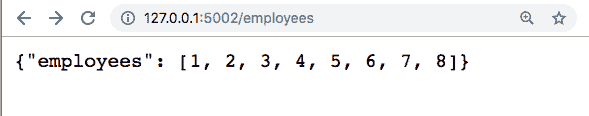

# 使用 Python 进行简单的 API 调用

> 原文：<https://dev.to/hiro/learning-api-for-newbies-day-1-294>

# 从零开始学习 API

我正在思考 API 的“概念”。在 API 学习的第一天，我学习了 *venv* 、 *SQLite* 、 *Flask* ，以及如何在一位 Twitter 朋友的帮助下发出基本的 API `GET`请求。

在这个练习中，我使用的是带终端的 Mac。

# 安装虚拟环境(venv)

VENV 是一个轻量级的 Python 虚拟环境，可以安装到你电脑上的一个目录(文件夹)中，在那里你可以“运行一个服务器”来运行 Python，而不会影响到你电脑的其他部分。(有点像“生活”在您创建的特定文件夹中的小服务器？)

```
$ pip install virtualenv // installs the Virtual Environment 
```

Enter fullscreen mode Exit fullscreen mode

# 创建虚拟环境

我在桌面上创建了一个新文件夹，并使用 venv 将 *Python* 和 *Pip* 安装到该文件夹中。

*Pip* 是 Python 的一个包安装程序，如果从他们的官网安装的话应该会附带 Python。

```
$ cd Desktop // go to Desktop
$ mkdir new_folder // create a new folder on Desktop called new_folder
$ cd new_folder // change directory ("go into") the folder new_folder
$ virtualenv venv // installs Python and Pip into new_folder
$ source venv/bin/activate // activates Virtual Environment 
```

Enter fullscreen mode Exit fullscreen mode

# 安装烧瓶& JSONify

我安装了 *Flask* 、 *Flask-SQLAlchemy* 、 *Flask-RESTful* 和 *JSONify* ，这是本教程[指定的。](https://www.codementor.io/sagaragarwal94/building-a-basic-restful-api-in-python-58k02xsiq)

*Flask* 是一个 [Python Web 框架](http://flask.pocoo.org/)， *JSONify* 是一个[jQuery 的最小 HTML-form 到 JSON 到 HTML-form 转换插件](https://github.com/kushalpandya/JSONify)。

```
$ pip install flask flask-jsonpify flask-sqlalchemy flask-restful 
```

Enter fullscreen mode Exit fullscreen mode

# 下载样本数据库

我从 SQLite 教程[这里](http://www.sqlitetutorial.net/sqlite-sample-database/)下载了一个示例 SQLite 数据库，并将其保存在我之前创建的桌面文件夹(`new_folder`)中。

解压文件夹，你应该得到一个`.db`文件。在本例中，该文件被命名为`chinook.db`。

# 创建 Python 脚本

您可以在终端中创建新文件:

```
$ touch server.py // creates file server.py in current folder 
```

Enter fullscreen mode Exit fullscreen mode

可以使用 IDE 编辑 Python 文件，也可以直接在终端中打开文件进行编辑:

```
$ nano server.py // opens server.py in Terminal 
```

Enter fullscreen mode Exit fullscreen mode

首先，您可以复制并粘贴上面提到的教程提供的脚本。

```
from flask import Flask, request
from flask_restful import Resource, Api
from sqlalchemy import create_engine
from json import dumps
from flask_jsonpify import jsonify

db_connect = create_engine('sqlite:///chinook.db')
app = Flask(__name__)
api = Api(app)

class Employees(Resource):
    def get(self):
        conn = db_connect.connect() # connect to database
        query = conn.execute("select * from employees") # This line performs query and returns json result
        return {'employees': [i[0] for i in query.cursor.fetchall()]} # Fetches first column that is Employee ID 
class Tracks(Resource):
    def get(self):
        conn = db_connect.connect()
        query = conn.execute("select trackid, name, composer, unitprice from tracks;")
        result = {'data': [dict(zip(tuple (query.keys()) ,i)) for i in query.cursor]}
        return jsonify(result)

class Employees_Name(Resource):
    def get(self, employee_id):
        conn = db_connect.connect()
        query = conn.execute("select * from employees where EmployeeId =%d "  %int(employee_id))
        result = {'data': [dict(zip(tuple (query.keys()) ,i)) for i in query.cursor]}
        return jsonify(result)

api.add_resource(Employees, '/employees') # Route_1 api.add_resource(Tracks, '/tracks') # Route_2 api.add_resource(Employees_Name, '/employees/<employee_id>') # Route_3 

if __name__ == '__main__':
     app.run(port='5002') 
```

Enter fullscreen mode Exit fullscreen mode

(当我使用它时，我们无法让它正常运行，除非我将`from flask.ext.jsonpify import jsonify`更改为`from flask_jsonpify import jsonify`，所以我在上面的脚本中更改了它，但是如果其中一个不起作用，请尝试两个。)

退出并保存文件。您可以用`nano server.py`重新打开`server.py`来确认您的更改生效。

# 运行 Python

我发现我可以使用 venv 在我的电脑上“运行”一个微型 Flask 服务器，并进行 API 调用和运行查询！我将运行我们之前刚刚创建的`server.py`。

```
$ python server.py // runs server.py 
```

Enter fullscreen mode Exit fullscreen mode

该命令返回以下内容:

```
 * Serving Flask app "server" (lazy loading)
 * Environment: production
   WARNING: Do not use the development server in a production environment.
   Use a production WSGI server instead.
 * Debug mode: off
 * Running on http://127.0.0.1:5002/ (Press CTRL+C to quit) 
```

Enter fullscreen mode Exit fullscreen mode

所以现在，这个小服务器在`http://127.0.0.1`里游手好闲。而数据库(`chinook.db`)也在`server.py`中指定的`5002`港闲逛。

# 进行 API 调用

我们用`server.py`中的脚本创建了 3 个资源。他们是`Employees,` `Tracks`，和`Employees_Name`。

```
class Employees_Name(Resource): 
```

Enter fullscreen mode Exit fullscreen mode

对于每一条，我们还指定了如何访问每条路线:

```
api.add_resource(Employees, '/employees') # Route_1 api.add_resource(Tracks, '/tracks') # Route_2 api.add_resource(Employees_Name, '/employees/<employee_id>') # Route_3 
```

Enter fullscreen mode Exit fullscreen mode

因此，为了进行 API 调用，我们可以打开一个浏览器，键入服务器 IP 地址和在`server.py` : `http://127.0.0.1:5002/employees`中指定的路径

当我访问那个“URL”时，JSON 化的`GET`请求被加载:
[](https://res.cloudinary.com/practicaldev/image/fetch/s--Dhhon79d--/c_limit%2Cf_auto%2Cfl_progressive%2Cq_auto%2Cw_880/https://thepracticaldev.s3.amazonaws.com/i/6zh4fu0r5iw7p9ia92t1.png)

在服务器端，我有一个相同信息的`GET`请求日志:

```
127.0.0.1 - - [09/Mar/2019 21:42:29] "GET /employees HTTP/1.1" 200 -
127.0.0.1 - - [09/Mar/2019 21:42:29] "GET /robots.txt?1552185749512 HTTP/1.1" 404 - 
```

Enter fullscreen mode Exit fullscreen mode

我已经在`server.py` :
中对这个资源进行了`GET`调用

```
class Employees(Resource):
    def get(self):
        conn = db_connect.connect() # connect to database
        query = conn.execute("select * from employees") # This line performs query and returns json result
        return {'employees': [i[0] for i in query.cursor.fetchall()]} # Fetches first column that is Employee ID 
```

Enter fullscreen mode Exit fullscreen mode

当您尝试创建的另外两个资源时，也会发生类似的事情:`Tracks`和`Employees_Name`。

对于`Employees_Name`，我们指定的 URL 是`/employees/<employee_id>`。这意味着要对这个特定的资源发出`GET`请求，您需要选择想要请求信息的员工 ID(我选择了 5)，然后您将转到`http://127.0.0.1:5002/employees/5`。

所请求的关于员工 ID #5 的信息将加载到您的浏览器中。

## 积垢

*CRUD* 代表*创建、读取、更新、删除*。使用 API，您可以进行四种不同类型的调用:`GET`、`PUT`、`POST`和`DELETE`，它们与 CRUD 函数相对应。您应该能够通过`GET`或*创建*、`PUT`或*读取*、`POST`或*更新*和`Delete`(不言自明！)资源。

# 第 1 天

经过几个小时的学习，我想我已经掌握了相当多的内容。非常感谢一个 Twitter 上的朋友带领我完成了整个过程！否则我会在第一步停滞不前，完全不知所措。

# 文章/教程

*   [用 Python 构建一个基本的 RestFul API](https://www.codementor.io/sagaragarwal94/building-a-basic-restful-api-in-python-58k02xsiq)
*   [这就是创建 REST API 的简单程度](https://codeburst.io/this-is-how-easy-it-is-to-create-a-rest-api-8a25122ab1f3)
*   [Pipenv &虚拟环境](https://docs.python-guide.org/dev/virtualenvs/)
*   为什么 Flask 是一个不错的 web 框架选择？
*   [什么是 CRUD？](https://www.codecademy.com/articles/what-is-crud)

# 资源

*   [烧瓶](http://flask.pocoo.org/)
*   [烧瓶-SQLAlchemy](http://flask-sqlalchemy.pocoo.org/)
*   [SQLite](https://sqlite.org)
*   [Python 包索引](https://pypi.org/)
*   [ven](https://docs.python.org/3/library/venv.html)