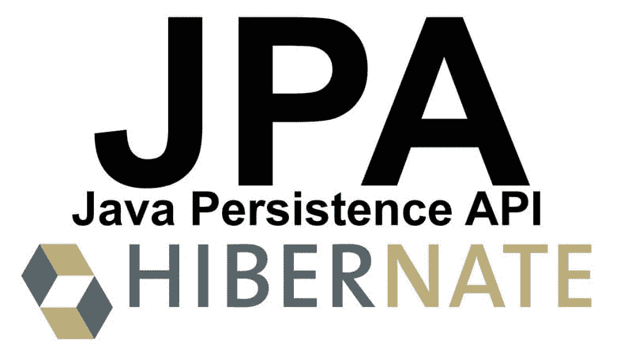

# @ transient with JPA:3 件你不该做的事！

> [https://dev . to/renaldodev/transient-com-JPA-3-事情-你必须做-32k4](https://dev.to/rinaldodev/transient-com-jpa-3-coisas-que-voc-no-deve-fazer-32k4)

将@Transient 与 JPA 一起使用可能很容易，但有三件事如果您这样做，可能会使代码混乱。现在了解如何更好地使用、编写高质量代码，以及按时交付您的项目！

### Por que JPA？

就像所有我们要在节目中使用的东西一样，我们必须理解这个概念，这样我们以后就不会头痛了。我们基本上利用 JPA 做对象-关系映射。一般来说，我们想在我们的对象和关系数据库之间建立关系。我们所做的基本上就是: