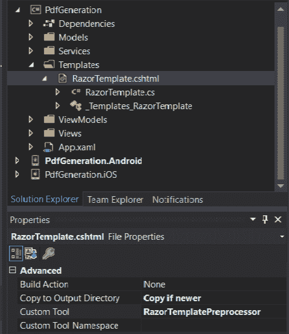

# Xamarin 中的 HTML 模板

> 原文：<https://dev.to/techwatching/html-templating-in-xamarin-394o>

经常有这样的情况，你需要做一些 HTML 模板，拥有一个像 Razor 这样强大的 HTML 模板引擎会非常有帮助。令人高兴的是，你不需要在 ASP.NET 环境中使用 Razor 模板，事实上你甚至可以在 Xamarin 应用程序中使用它们。

## 剃须刀模板

在[微软文档](https://docs.microsoft.com/en-us/xamarin/cross-platform/platform/razor-html-templates/)中已经有一篇关于 Xamarin 中的 Razor HTML 模板的完整文章，所以如果你想要一个深入的解释，我建议你去读一读。在本文中，解释了如何通过使用*新文件*对话框的*文本模板*部分向 Xamarin 项目添加 Razor 模板文件(`.cshtml`文件)。然而，如果你试图在一个 Xamarin 项目中添加一个新项，你不会看到一个*文本模板*部分。

[](https://res.cloudinary.com/practicaldev/image/fetch/s--Wqb2qb93--/c_limit%2Cf_auto%2Cfl_progressive%2Cq_auto%2Cw_880/https://techwatching.dev/posimg/htmltemplating_vs_1.png)

那是因为在写这篇文章的时候，它只存在于 Visual Studio for Mac 中(可能是因为它来自 Xamarin Studio)。那么如何在 Visual Studio (Windows)中添加 Razor 模板文件呢？有一个小技巧可以做到这一点(我是在 [StackOverflow](https://stackoverflow.com/questions/39048900/is-there-a-preprocessed-razor-template-for-visual-studio-2015) 上的一个旧帖子中找到的):你必须手动将一个`.cshtml`文件添加到你的项目中，并在文件的属性中将定制工具设置为`RazorTemplatePreprocessor`(这将生成代码隐藏文件)。

[](https://res.cloudinary.com/practicaldev/image/fetch/s--jdM8d_6J--/c_limit%2Cf_auto%2Cfl_progressive%2Cq_auto%2Cw_880/https://techwatching.dev/posimg/htmltemplating_vs_2.png)

然后，您可以从 Razor 模板和 Xamarin 项目中的数据生成一个 html 字符串。

生成 html 字符串的代码:

```
var people = new Character[]
{
    new Character() { FirstName = "Ellana", LastName = "Caldin", Job = "Marchombre"},
    new Character() { FirstName = "Edwin", LastName = "Til'Illan", Job = "General"}
};
var template = new RazorTemplate() { Model = people};
var page = template.GenerateString(); 
```

Enter fullscreen mode Exit fullscreen mode

剃须刀模板:

```
@model IEnumerable<PdfGeneration.Models.Character>
<html>
<body>
    <ul class="people">
    @foreach (var person in @Model)
    {
        <li>@person.FirstName @person.LastName - @person.Job</li>
    }
    </ul>
</body>
</html> 
```

Enter fullscreen mode Exit fullscreen mode

这段代码产生了下面的 html:

```
<html>
<body>
    <ul class="people">
        <li>Ellana Caldin - Marchombre</li>
        <li>Edwin Til&#39;Illan - General</li>
    </ul>
</body>
</html> 
```

Enter fullscreen mode Exit fullscreen mode

## Handlebars.Net，剃刀模板的替代品

你也可以通过使用一个. NET 手柄引擎[Handlebars.Net](https://github.com/rexm/Handlebars.Net)来制作 HTML 模板。它允许在. NET 应用程序中构建语义模板。它对模板使用了与 [handlebars.js](http://handlebarsjs.com/) 相同的语法，并试图模仿 JS API。没有什么比一段代码更能说明这一点了: