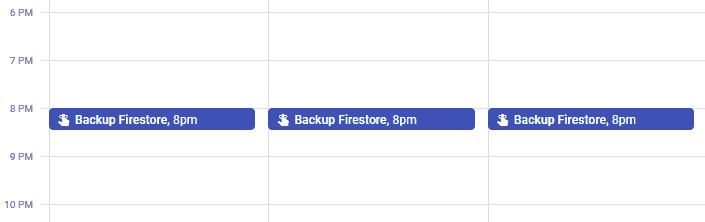
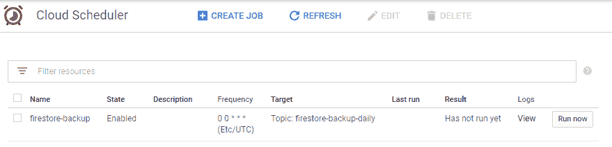
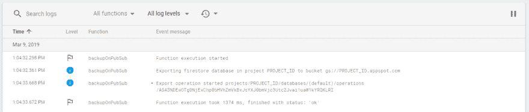
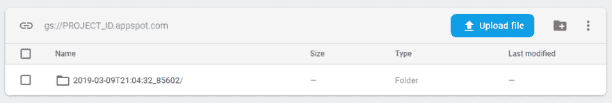

# 自动 Firestore 备份

> 原文：<https://dev.to/dbanisimov/automatic-firestore-backups-16bh>

Cloud Firestore 具有使用 CLI 和 REST APIs 的[导出/导入](https://firebase.google.com/docs/firestore/manage-data/export-import)功能，允许您对云存储桶进行简单备份。基本上是这样的:

```
gcloud beta firestore export gs://BUCKET_NAME --project PROJECT_ID 
```

如果你和我一样笨拙，喜欢搞乱数据库，你可能会希望经常备份它。但不幸的是，即使 Firestore 正式上市，也没有托管自动备份选项。下面是我的解决方案在一段时间内的样子:

[](https://res.cloudinary.com/practicaldev/image/fetch/s--PgWFKPr1--/c_limit%2Cf_auto%2Cfl_progressive%2Cq_auto%2Cw_880/https://thepracticaldev.s3.amazonaws.com/i/0a8tzlxd6gg3rzy300zs.PNG)

不是很[干](https://en.wikipedia.org/wiki/Don%27t_repeat_yourself)吧？这里有一个更好的方法，只使用谷歌云平台服务和一点点编码。

# 整体构思

1.  Cloud Scheduler 基于 cron 计划定期向 Cloud PubSub 主题发布消息。
2.  云函数由消息触发，并执行对 Firestore REST API 的调用
3.  Firestore 导出 API 启动一个长期运行的操作，将备份保存到指定的存储桶
4.  云存储存储按时间戳组织的备份

# 先决条件

这篇文章假设你已经建立了 Firebase 项目，安装了`gcloud`命令行工具，并且熟悉云控制台。

# 云调度器

云调度器是 GCP 提供的一个非常简单的服务，但仍然非常有用，受到无服务器人群的期待。有了它，最终可以定义简单的类似 cron 的作业，这些作业可以触发 HTTP 函数或发出 PubSub 消息。对于云函数的使用，PubSub 方式是首选，因为 HTTP 作业没有任何认证。

以下命令创建一个计划在每天午夜执行的 PubSub 作业。在我们的例子中没有使用消息体，所以可以是任意的。

```
gcloud scheduler jobs create         \
    pubsub firestore-backup          \
    --schedule "0 0 * * *"           \
    --topic "firestore-backup-daily" \
    --message-body "scheduled" 
```

执行此命令后，作业将在指定的时间运行。

# 云功能

云函数[在 PubSub](https://firebase.google.com/docs/functions/pubsub-events) 消息上触发，并向 Firestore REST API 发出请求。要使用正确的身份验证发出请求，我们需要一个 OAuth 访问令牌。幸运的是，云函数有一个默认的服务帐户，可以很容易地用来生成令牌。

```
import * as functions from 'firebase-functions';
import * as firebase from 'firebase-admin';
import * as request from 'request-promise';

firebase.initializeApp();

export const backupOnPubSub = functions.pubsub.topic('firestore-backup-daily').onPublish(async () => {
  // Get bucket name from cloud functions config
  // Should be in the format 'gs://BUCKET_NAME'
  //
  // Can be set with the following command:
  //   firebase functions:config:set backup.bucket="gs://BUCKET_NAME" 
  const bucket = functions.config().backup.bucket;

  // Firebase/GCP project ID is available as an env variable
  const projectId = process.env.GCLOUD_PROJECT;

  console.info(`Exporting firestore database in project ${projectId} to bucket ${bucket}`);

  // Use default service account to request OAuth access token to authenticate with REST API
  // Default service account must have an appropriate role assigned or
  // the request authentication will fail
  const { access_token: accessToken } = await firebase.credential.applicationDefault().getAccessToken();

  const uri = `https://firestore.googleapis.com/v1/projects/${projectId}/databases/(default):exportDocuments`;
  const result = await request({
    method: 'POST',
    uri,
    auth: { bearer: accessToken },
    body: {
      outputUriPrefix: bucket,
    },
    json: true,
  });

  // The returned operation name can be used to track the result of the long-running operation
  //   gcloud beta firestore operations describe "OPERATION_NAME"
  const { name } = result;
  console.info(`Export operation started ${name}`);
}); 
```

不要忘记设置配置和部署

```
firebase functions:config:set backup.bucket="gs://BUCKET_NAME"
firebase deploy --only functions:backupOnPubSub 
```

# Firestore REST API 权限

导入/导出 Rest API 需要启用适当的 OAuth 范围。您可以通过向项目中的默认服务帐户添加`Cloud Datastore Import Export Admin`角色来实现这一点。

```
gcloud projects add-iam-policy-binding PROJECT_ID \
    --member serviceAccount:PROJECT_ID@appspot.gserviceaccount.com \
    --role roles/datastore.importExportAdmin 
```

# 云存储

万一你还没有一个桶，你应该创建一个。我发现 Firestore 导入/导出至少需要区域存储类，coldline 或 nearline 都不行。

```
gsutil mb gs://BUCKET_NAME/ 
```

# 一起测试一切

一旦一切都设置好了，你可以通过点击“立即运行”按钮从[云调度控制台](https://console.cloud.google.com/cloudscheduler)触发整个过程

[](https://res.cloudinary.com/practicaldev/image/fetch/s--pTRLYxbj--/c_limit%2Cf_auto%2Cfl_progressive%2Cq_auto%2Cw_880/https://thepracticaldev.s3.amazonaws.com/i/m4hv55j0jk8c0d1zqalf.PNG)

检查 Firebase 控制台或堆栈中的日志驱动程序
[](https://res.cloudinary.com/practicaldev/image/fetch/s--BX-X0Ezg--/c_limit%2Cf_auto%2Cfl_progressive%2Cq_auto%2Cw_880/https://thepracticaldev.s3.amazonaws.com/i/d1v9vozkp5cj3cy8ji7m.PNG)

检查导出操作状态

```
gcloud beta firestore operations describe "projects/PROJECT_ID/databases/(default)/operations/ASA3NDEwOTg0NjExChp0bHVhZmVkBxJsYXJ0bmVjc3Utc2Jvai1uaW1kYRQKLRI"
done: true metadata:
  '@type': type.googleapis.com/google.firestore.admin.v1.ExportDocumentsMetadata
  endTime: '2019-03-09T21:04:39.263534Z'
  operationState: SUCCESSFUL
  outputUriPrefix: gs://PROJECT_ID.appspot.com/2019-03-09T21:04:32_85602
  progressBytes:
    completedWork: '5360'
    estimatedWork: '4160'
  progressDocuments:
    completedWork: '40'
    estimatedWork: '40'
  startTime: '2019-03-09T21:04:32.862729Z' 
```

最后检查备份桶中的
[](https://res.cloudinary.com/practicaldev/image/fetch/s--JpDpo_ws--/c_limit%2Cf_auto%2Cfl_progressive%2Cq_auto%2Cw_880/https://thepracticaldev.s3.amazonaws.com/i/nch8xx21dxchp0dti8pp.PNG)

# 下一步

自动备份只有在可靠的情况下才有用。为您的备份操作提供监控和警报是一个好主意。

一种方法是将最后一次导出操作保存到 Firestore，并在一段时间后安排一个作业来检查长时间运行操作的结果。如果结果不成功，它可以发送电子邮件或记录错误，这将通过[堆栈驱动程序错误报告](https://cloud.google.com/error-reporting/)触发警报。

另一项改进是允许在特定时间后自动删除旧备份。这可以通过[生命周期管理](https://cloud.google.com/storage/docs/lifecycle)来实现。

# 结束语

我很想听听您对这种方法的看法以及如何改进。

编码快乐！制作备份:)