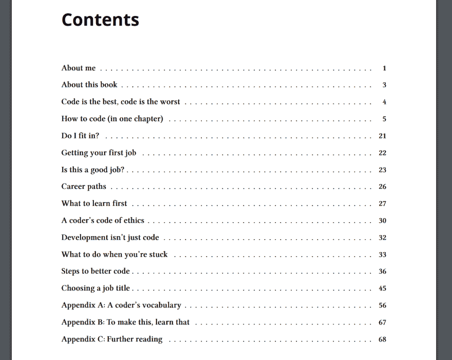

# 我在给初级开发者写书！

> 原文：<https://dev.to/isaacdlyman/im-writing-a-book-for-junior-developers-3ph0>

超过 80 人已经为这个项目提供了帮助。非常感谢大家！作为 dev.to 社区的一员，我感到非常自豪。这本书计划于 2019 年 7 月在**出版**，所以请前往 [LeanPub 页面](https://leanpub.com/firstyearincode)进行预购吧！

* * *

我正在写一本书:作为开发者的第一年的完整指南。我正在寻找合著者。

不是关于 Python 或者 Kubernetes 或者 Angular 的技术手册。这不是对重构或工艺的深入探讨。这是其他事情的指南:写简历、获得第一份工作、伦理、职业发展、当你陷入困境时该怎么做。

这本书将是你想付多少就付多少(免费的最低价格)。

以下是目前为止的目录:

如果你关注我的帖子，你可能会从我写的关于 dev.to 和 Medium 的帖子中认出其中的一些章节。

这本书的目标是帮助所有初级开发人员，不管他们是如何进入这个领域的，比我开始时提前一年开始他们的职业生涯。这是个艰巨的任务，所以我需要你的帮助。

## 你能帮上什么忙？

如果你想以下面的任何方式成为这本书的一部分，请[给我发电子邮件](//mailto:book@isaaclyman.com)。

**成为合著者！**你可以针对任何回答“我希望在成为开发人员的第一年之前就知道什么？”这个问题的主题撰写客座章节如果我把它写进书里，你会在封面上看到*你的名字*以及*从书中获得一定比例的利润*。您的内容将受到非独家许可，这意味着它仍然属于您，您可以在其他地方发布它。

**说出你的故事！**标题为“我适合吗？”仍未成文，而我不是写它的合适人选。相反，我想知道你关于冒名顶替综合症的故事，想知道你是否适合，处理守门和骚扰，并找到你作为一名程序员的价值。我会在这一章里把这些故事汇总起来，并在致谢里留出空间，让你宣传自己、你当前的项目或你最喜欢的慈善机构。

做一个测试版读者！如果你愿意在这本书出版前至少读一部分，并给出一些诚实的、具体的反馈，我欢迎你的帮助。作为回报，我会把你的名字放在致谢栏里，并附上一条你自己选择的短信——随时推广你目前正在做的任何事情。

**在预发布页面报名！Leanpub 上这本书的登陆页面[有一个表格，上面有你的名字、电子邮件地址，以及你愿意为这本书支付的价格。如果你填好了，书出版时会通知你。](https://leanpub.com/firstyearincode)**

**造势炒作！**在社交媒体上分享 [Leanpub 页面](https://leanpub.com/firstyearincode)，发送给你的朋友，在工作中提及。当这本书出版时，把它送给可能会用到它的人。用它来为你生活中的初级开发者带来改变。

## 接下来会发生什么？

一旦完成，我将出版这本书的第一版，并在 dev.to 上庆祝。在你的帮助下，成千上万的人将了解它。对于我们的初级开发人员朋友来说，生活会变得稍微轻松一些。

你加入吗？我希望有尽可能多的人参与这个项目。只要给我发一封电子邮件，我们就会让它发生。