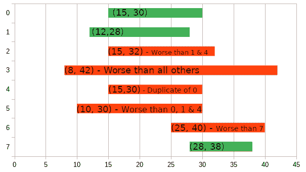

# 去掉糟糕的公交路线(找算法)

> 原文：<https://dev.to/hkrogstie/remove-terrible-bus-routes-find-an-algorithm-5782>

对于那些想做一些算法编程的人来说，这是一个挑战，类似于你会在算法竞赛中发现的，例如 IOI。这并不十分困难，但却是将纸笔解决和编程结合起来的好方法。这个任务使用 2D 排序，我的 python 解决方案大约 20 行，运行时间为 O(n * log n)

# 问题陈述

今天的某个时候，你乘公共汽车从 A 地到 B 地。您有一个所有可能的旅行的列表，其中一次旅行被表示为元组`(leave_time, arrive_time)`。分别是离开 A 的时间和到达 B 的时间。两个时间都用整数表示。

你不关心路线看起来怎么样，所以即使是非常糟糕的选择也包括在内。从一个地方到另一个地方可能有任意多种方式，有些方式比其他方式更糟。

事实证明，许多旅行太糟糕了，以至于你永远都不想去。因此，你会想整理列表。应该删除重复的，并且应该删除任何客观上比另一个行程更差的**行程。**

一次旅行`X`在客观上比另一次旅行`Y`更糟糕*如果`X.leave_time <= Y.leave_time && X.arrive_time >= Y.arrive_time`。基本上，如果你能晚一点从 A 出发，但仍然能早一点到达 B，那就没有必要去 x 旅行。*

 *给定列表，编写一个函数，返回一个经过排序和整理的列表。

## 输入

从文件或控制台读取输入。
第一行包含一个整数`N` ( `1 < N <= 1e5`)，即给定的行程数。
下面的`N`行包含两个整数`leave_time`和`arrive_time` ( `1 <= leave_time <= arrive_time <= 1e6`)，表示列表中的一次行程。

## 输出

输出在控制台中打印出来或打印到文件中。
在第一行，打印整理清单中的车次`M`。
后接`M`行，每次行程的整数`arrive_time`和`leave_time`按顺序排列。

## 样本输入 1

```
8
15 30
12 28
15 32
8 42
15 30
10 30
25 40
28 38 
```

预期产出:

```
3
12 28
15 30
28 38 
```

### 解释

[](https://res.cloudinary.com/practicaldev/image/fetch/s--prn-vh99--/c_limit%2Cf_auto%2Cfl_progressive%2Cq_auto%2Cw_880/https://thepracticaldev.s3.amazonaws.com/i/sit5omybhcj777a7dzpb.png)

每个间隔代表一次可能的旅行。盒子上写着`(leave_time, arrival_time)`元组。如果这次旅行客观上比另一次更糟糕，盒子是红色的，上面写着解释。

剩下的(绿色)路线将被排序。

## 样本输入 2

```
30
23 59
17 82
85 90
76 95
44 87
78 78
51 88
73 80
10 31
84 95
38 56
92 96
66 71
77 98
94 98
94 98
91 99
83 98
91 94
63 77
33 69
3 63
13 54
37 80
27 40
52 92
90 98
41 91
11 96
16 65 
```

预期产出:

```
9
10 31
27 40
38 56
66 71
78 78
85 90
91 94
92 96
94 98 
```

如果你想要一个解决方案，我会在评论中发布一个用 python 写的评论。然而，如果你自己去做，这个解决方案可能更容易理解。*