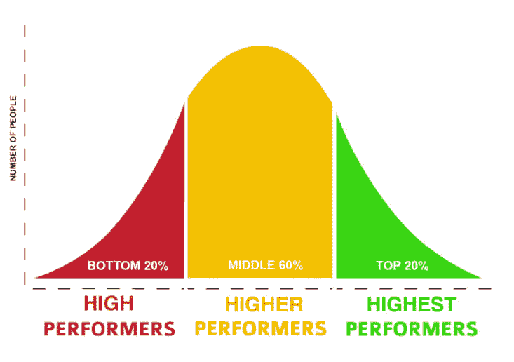

# 看着编码的未来加速进入模拟黑洞

> 原文：<https://dev.to/jenc/watching-the-future-of-coding-accelerate-into-a-simulated-black-hole-2iib>

十年后，每个人都会懂一点代码。编码就像是蒂姆·霍顿或星巴克的第一份工作。电子邮件、Wordpress 和 Drupal 管理的蓝领编码工作多如牛毛。人们在 Fiverr 上输出模板化的 Wix 和 Wordpress 页面。如果你想要一个自定义的 Wordpress 主题，你可以花 500 美元得到它。不管他们怎么说——那些认为这种工作是为不合格的程序员准备的开发人员——关键时刻已经来临，而且不会回头了！

根据安德鲁·汉密尔顿教授的说法，黑洞不仅是一个引力强大到光无法逃脱的物体；这是一个空间的[瀑布。](https://jila.colorado.edu/~ajsh/insidebh/waterfall.html)

> 上游的(快乐的)鱼可以逆流让路，下游的(悲伤的)鱼却被卷到了瀑布的底部。

我们中最优秀的人不相信我们的行业不会缩小、贬值、自动化、变得多余。他们正在为此做准备。对停滞的恐惧驱使开发人员学习、实践、花数小时阅读博客，找出为退休分配储蓄的最佳方式。如果你一直在关注，你可能听说过去年微软想出了如何使用人工智能从草图生成标记[。很快，只有最精英、发明新轮子最成功、学习最快的人才会留在顶端。如今，最受欢迎的是 40 万美元的 Cobalt 工作，即脚踏实地、通晓多种语言的软件工程师成为技术总监。](https://sketch2code.azurewebsites.net/)

我想超越它，相信训练营的白手起家，相信摇滚明星开发者和首席技术官...但流失和流失都是不可避免的。自学成才的开发者的神话并不适用于我。

液体错误:内部

如果你有管理才能，你可以为自己设立一个向高管汇报的职位，并说服利益相关者投资人才，提出一体化的人事解决方案，以配合部门紧缩的员工预算。我有模糊的想法去做这件事，看到同龄人因为视力不好，腕管，失眠而没落。但首先，我需要另一份持久的工作，在简历中加入真正的职业发展笑点。然后另一个。另一个。

纵观历史，各种机构都采用严格的标准来招聘最优秀的员工。一个臭名昭著的例子是纳粹。要加入党卫军最精英的派别警卫旗队，男性候选人必须至少有 5 英尺 11 英寸高，证明他们在过去 150 年里是“纯雅利安血统”，并且身体健康。同样，只有那些展示出他们有潜力取得更高水平成绩的运动员才能进入奥运代表队。开发者不是角斗士或天体物理学家。我看不出如何解决一个魔方或二叉树搜索显示我将如何建立一个网站。我想知道就业、约会和生活的每个方面是否都在朝着控制反馈优化的反乌托邦发展。人们在约会应用程序上列出他们的身高。我们有 Github 贡献图表和生产力得分；中国人有芝麻信用。我想起了电影 [Gattaca](https://www.youtube.com/watch?v=1Q67bMYOm7E) ，在那里，每个天生的人的浪漫和职业能力都被社会对基因完美的“纯种”人的偏好所掩盖。

雇佣开发人员的过程取决于一个人在各个方面的智力适合度:社交、分析、情感。电话筛选、黑客排名测试、非互联网漏洞修复、行为问题和白板，也许还有几周的付费试用。我不禁想知道，公司这样做是不是作为一种恐吓手段，或者是一种旨在让大多数申请人不及格的过滤器，以便精英可以顺利通过。当然，也有可能他们只是没那么喜欢你。

我兼职教了几年大学课程。大约 2%的时候，我会看到一个学生超越了我预测的他们会成为专家。贝尔曲线，不管他们的分数有多高，班上只有 2-20%的学生应该得到 A。我就是在这样的经济环境中长大的。我很认真地对待学校，这个系统在衡量自己和一个已经很优秀的班级时非常有效。...平庸的可能性很少被接受。

在以前的想法中，我没有成为一个有抱负的女性或少数民族。还有什么没说的，什么都没说。

无论你是独角兽还是不擅长独角兽，你都赢得了无尽的大奖。我这么说不仅仅是因为冒名顶替综合症——完全有可能是边缘粗糙，没有成功。我去过那里。女性应该被允许变坏或变平庸，但经验告诉我，我们犯错的余地更小了，尽管平权法案给了我更多面试的机会。

无论如何，如果你真的缺乏，你知道这一点，但你有韧性继续作为一个孤独的女巫在洞穴中承担西西弗任务，练习和应用自己，从网上陌生人那里获得(欢迎和主动提供的)反馈，并重新开始。你做到了。对于艺术家来说，逻辑是一样的。那一次，有人告诉你你的画很烂，不会把它挂在冰箱上，但你还是坚持了下来。你做到了。

当我意识到这正是我想做的事情时，困境就不是困境了。

当我意识到我把鸡蛋放在这个篮子里，有几个已经裂开时，这种困境是一种严重的风险——哦，等等，篮子是玻璃做的！

乔丹·彼得森会说我说话像只无能的小龙虾。根据他的说法，如果我挺直腰板说话，我会收获自信的回报。但他的建议并不适用于一个以结果说话的行业。只有当你相信欺凌弱小者和我们其他人之间的等级秩序时，它才会起作用(通过一些过时的流行心理学和进化心理学之间疯狂的混合推理)。我更愿意诚实地面对我尝试过的失败的文化适应饮食。我已经做好了 5 步抗衰老皮肤计划，以备雪莉·桑德伯格说我的工资将达到顶峰，显然是在 34 岁。

在过去，对认可的绝望占据了主导地位。我拿了能拿的，获得了可支配的经验，停滞不前，重新开始。每份工作之后，我意识到这个行业呈指数级增长，而我没有花时间彻底提高技能。我本末倒置了。仅仅因为我想要一份开发工作，并不意味着我能做好。假装一个年轻人的过度自信，我申请了符合 60-80%标准的工作。没有经验你不能获得任何经验，所以我去了，为了经验。我活着就是为了告诉大家，在这个行业中，期望和标准无处不在。

人们开始质疑我到底怎么了。为什么我要离开一个声望很高的新兴行业，去开创一个已经被我取消了两次的行业？可能我觉得两边的草都是棕色的？也许我想要一份我不胜任的工作？我曾经在一个不同的领域里，用蛮力让自己精疲力尽；为什么我不能在另一个领域这样做呢？我的直觉告诉我，如果我没有尽我的全力去尝试每一个选择，事情就不会结束。

我必须继续；这是我现在唯一隐约喜欢的事情。我可能会学到一些东西；我可能什么也赚不到。我有 funfunfunction 和编码彩虹视频，一堆书，还有几天吃的白菜。

9/11，冰山崩裂，讽刺的种族主义笑话，过境抢劫...没有什么能让我惊讶。

明年的这个时候，我将在这里对 codewars.com 大动干戈，强调过时教科书中的引语，用我的小钳子和更小的下巴咀嚼它们，墙上挂着收据，观看关于独裁者如何成功的历史纪录片，分摊我的沉没成本。就像一只屎壳郎，以老屎为食。