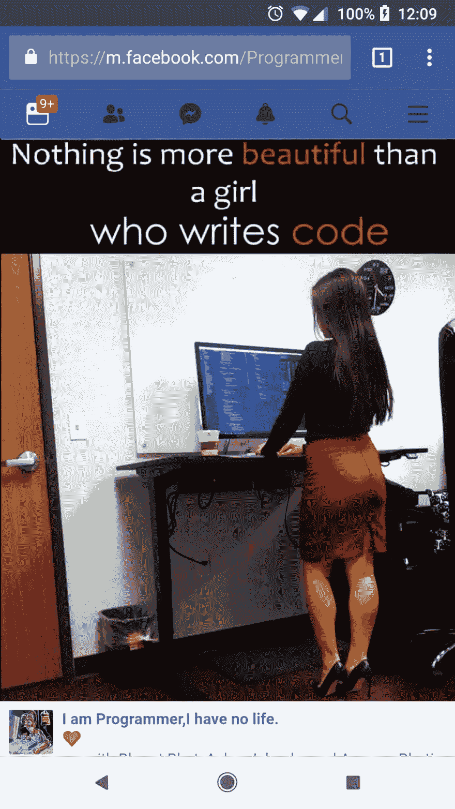
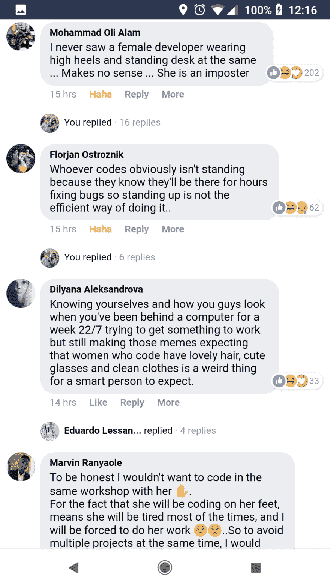

# 然而，阿德里安娜编码

> 原文 https://dev.to/adriennetacke/nevertheless-adrienne-coded-27ik

# 在我的整个职业生涯中，我总感觉有冒名顶替综合症。

这对我来说有点强烈，因为出于某种原因，穿着高跟鞋和铅笔裙/连衣裙意味着我必须证明自己多一点，以确保我被认真对待。

当我开始现在的工作时，我也开了一个 Instagram 账号来分享我的旅程。分享我的存在对我来说很重要。我是一个女性，同时也是一名软件工程师。我想谈谈干净的代码，[如何不害怕终端](https://www.instagram.com/p/BpYEeeBhPmj/)，促进 CI/CD 和一堆其他我在日常生活中遇到的很酷的话题。我也想在穿我平时穿的衣服的时候做这件事。

一个晴朗的日子，我的一篇帖子被迷化成了一个“东西”:

我想这很酷。直到你看了评论。千万不要看评论。呃:

我是说，这些人从来没见过我。他们认为某个乔·布洛随便拍了一张女孩的照片，并在上面贴上了这句话。我不存在。我不可能存在。我不是真实的。我是个冒名顶替者。

# 尽管如此，我还是编码了。

当然，这些评论是令人沮丧的，很难不对每一条评论做出回应，并把它们放回原处。但最终，我找到了更好的应对方式。通过继续教导和指导他人，通过写下像这样的经历以及如何克服它们，并与其他妇女和女孩分享，并继续成为一个成功的坏蛋！

# 如果有一件事每个人都应该知道，那就是没有开发者的统一标准；)

为了庆祝国际妇女节，我还想分享一下，我现在也是一名出版作家了！🤯我写了一本书叫做[为孩子编程 Python](https://bit.ly/Code4kids) ，我为此感到非常自豪。工作量很大，但很值得。我迫不及待地想看到它出现在家长、教育者和小编码们的手中！

# 继续编码！当你这样做时，伟大的事情就会发生。

喜欢你读的吗？也跟我来！

推特:[https://twitter.com/AdrienneTacke](https://twitter.com/AdrienneTacke)insta gram:[https://www.instagram.com/adriennetacke/](https://www.instagram.com/adriennetacke/)

网址: [https://www.adrienne.io](https://www.adrienne.io)