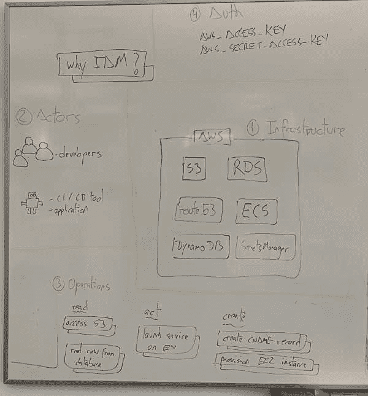
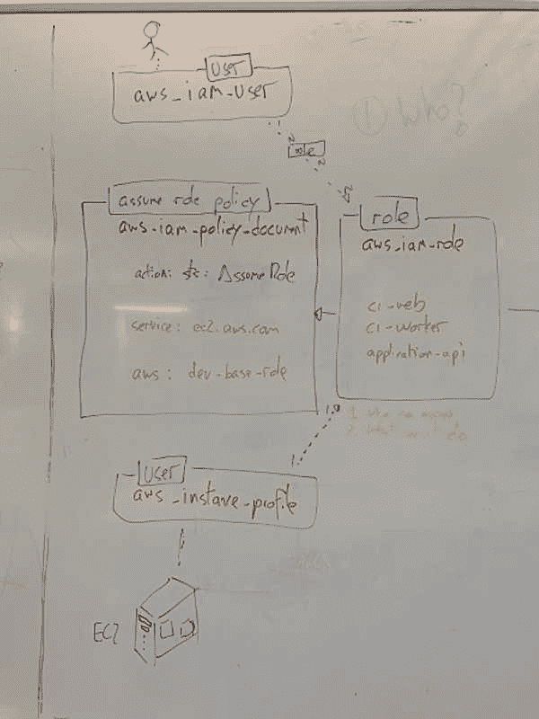
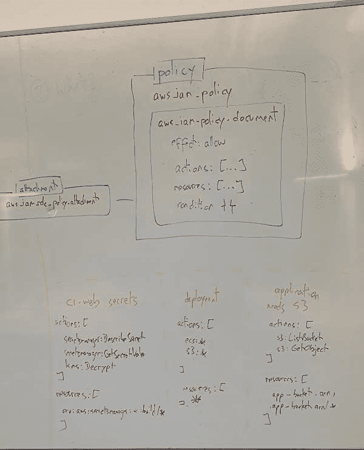

# AWS 中的 IAM 概述

> 原文：<https://dev.to/sirech/an-overview-of-iam-in-aws-3b9k>

如果你使用 [AWS](https://aws.amazon.com/) ，你应该确保[有正确的账户结构](https://www.thoughtworks.com/insights/blog/using-aws-security-first-class-citizen)。如果你只是继续使用根帐户，你可能会失去你的[整个业务](https://threatpost.com/hacker-puts-hosting-service-code-spaces-out-of-business/106761/)。

现在我已经引起了你的注意(而且你有理由害怕外面的坏人)，我想谈谈 *AWS* 提供的管理其资源权限的工具，也称为 [IAM](https://docs.aws.amazon.com/IAM/latest/UserGuide/introduction.html) 。

我非常强大，但是他们扔给你的东西的数量一开始会让你害怕。看看他们的 [FAQ](https://aws.amazon.com/iam/faqs/) 有多大就知道了。我一直在我的项目中广泛使用它来管理对我们资源的访问，但我最近意识到我们对基本部分没有很好的理解，所以我把所有这些都画在白板上，以便更容易理解。

## 核心原则

我们所有的策略都用代码表示[。为此我们使用了](https://en.wikipedia.org/wiki/Infrastructure_as_code)[地形](https://www.terraform.io/)。如果您想随着时间的推移正确地维护策略，用代码表示策略是至关重要的。

我们提供的角色应该拥有尽可能少的权利。授予的权限越少越好。这不仅可以保护你免受攻击，还可以抵御 bug。

## 我们的起点

这张照片会让你知道我们在哪里:

[](///static/a7810e2c061e0ea8256d1c97efed87a4/b4294/iam-basic-components.jpg)

*   我们有我们想要运营的基础设施。从 *AWS* ，从`S3`或`RDS`等存放数据的地方，到`ECS`等运行你的容器化应用程序的地方，你可能会使用大量的服务，还有围绕它的一切，比如网络、安全组、DNS 等等。
*   然后是与基础设施交互的参与者。他们可以是人类参与者，比如构建和操作平台的开发人员。它们也可以是机器参与者，比如您可能用来配置基础设施的 CI/CD 工具，或者您自己运行的应用程序。
*   这些参与者将想要执行某些操作。我们可能希望从我们的商店中获取数据，推出服务或创建新的资源。
*   并且您需要授权来执行这些操作。最后，您将需要登录到 *AWS* 并以某种方式使用凭证。

在这一点上，你可以说去他妈的，我只是要传递这些凭证。但是有很多事情可能会出错。例如，如果这些凭证被泄露会发生什么？谢天谢地， *AWS* 提供了一种处理这种情况的方法。我们将使用[角色](https://docs.aws.amazon.com/IAM/latest/UserGuide/id_roles.html)对我们想要创建的权限进行分组。

## 角色

什么是角色？引用官方文件:

> IAM 角色是您可以在拥有特定权限的帐户中创建的 IAM 身份。

[](///static/5cfe232cea145a5e6d00c8638100e81f/b4294/iam-role.jpg)

这意味着我们将创建不同的角色，这些角色将由我们的一些参与者承担(例如，`ci-web`或者我们想要部署的每个应用程序的特定角色)。它们是使用 [aws_iam_role](https://www.terraform.io/docs/providers/aws/r/iam_role.html) 定义的。看起来是这样的:

```
resource "aws_iam_role" "ci-web" {
  name = "ci-web"
  assume_role_policy = "${data.aws_iam_policy_document.assume_role_policy_ec2.json}"
} 
```

Enter fullscreen mode Exit fullscreen mode

如果这个*角色*将被承担，我们也需要授予它权限。在这种情况下，我们希望一个 [EC2](https://aws.amazon.com/ec2/) 实例能够承担它，因为我们的 *CI* 将在那里运行。我们可以用一个 [aws_iam_policy_document](https://www.terraform.io/docs/providers/aws/d/iam_policy_document.html) 来实现。

```
data "aws_iam_policy_document" "assume_role_policy_ec2" {
  statement {
    effect = "Allow"
    actions = ["sts:AssumeRole"]

    principals {
      type = "Service"
      identifiers = ["ec2.amazonaws.com"]
    }
  }
} 
```

Enter fullscreen mode Exit fullscreen mode

拼图的最后一部分是定义一个 [aws_iam_instance_profile](https://www.terraform.io/docs/providers/aws/r/iam_instance_profile.html) ，并在所述实例的 [aws_launch_configuration](https://www.terraform.io/docs/providers/aws/r/launch_configuration.html) 中使用它。

```
resource "aws_iam_instance_profile" "ci-web" {
  name = "${aws_iam_role.ci-web.name}"
  role = "${aws_iam_role.ci-web.name}"
}

resource "aws_launch_configuration" "web" {
  iam_instance_profile = "ci-web"
} 
```

Enter fullscreen mode Exit fullscreen mode

## 定义策略

到目前为止，我们已经设置了我们的角色，但是这些角色实际上还不允许做任何事情。我们需要创建一些策略，允许通过 [aws_iam_policy](https://www.terraform.io/docs/providers/aws/r/iam_policy.html) 访问我们想要使用的资源:

[](///static/5503210dd0c47debfcc6e148e0b281c6/b4294/iam-policy.jpg)

我已经写了如何使用这些策略授予[从大厅](//../using-asm-in-concourse/)访问 *AWS 秘密管理器*的权限。最后，我们总是遵循相似的结构。每个*策略*包含一系列*语句*，这些语句定义了我们想要给予的访问权限。不要忘记使用一个[AWS _ iam _ role _ policy _ attachment](https://www.terraform.io/docs/providers/aws/r/iam_role_policy_attachment.html)来将策略绑定到角色。

### 发表声明

语句非常灵活，有许多配置选项。我将集中讨论他们的三个论点，`effect`、`actions`和`resources`。

`effect`可以是*允许*也可以是*拒绝*。我们实际上总是将它们设置为`Allow`。为什么？如前所述，我们希望给予尽可能少的特权，所以我们的策略应该只授予角色绝对需要的权限。这意味着永远没有必要在代码的不同部分撤销特定的权限。

`actions`是我们希望在 *AWS* 中能够做到的。它们基本上映射到单个 API 调用，并且它们是真正细粒度的。您真正应该避免的是授予一揽子权限，例如:

```
 statement {
    effect = "Allow"

    actions = [
      "ec2:*",
    ]
  } 
```

Enter fullscreen mode Exit fullscreen mode

这不仅违背了最小特权的原则，而且还会造成可维护性的混乱，因为你将很难在不破坏的情况下减少权限。在这一点上相信我，预先投入时间，并确保您只给出需要的权限。有一个很好的[参考指南](https://iam.cloudonaut.io/)，我发现它在增量授予权限时非常有用。

最后，`resources`是这句话适用的 [ARN 的](https://docs.aws.amazon.com/general/latest/gr/aws-arns-and-namespaces.html)。与`actions`一样，避免使用通配符是一个非常好的主意。

您还可以做更多的事情，比如使用`principals`或`conditions`，这超出了本文的范围。然而，你可以从`actions`和`resources`中获得很多里程。

## 包装完毕

这就是它，你真的不需要任何东西来构建一个运行你的应用程序的坚实而安全的基础。实际上，使用不同的角色并通过策略一步一步地给予他们所需的访问权限就是全部。

测试这一点仍然是一个挑战，因为只有当你真正尝试在你的环境中运行所有的东西时，失败才会出现。但是，不要屈服于走捷径的诱惑。修复一个错误的权限设置是很难的，你会后悔的。